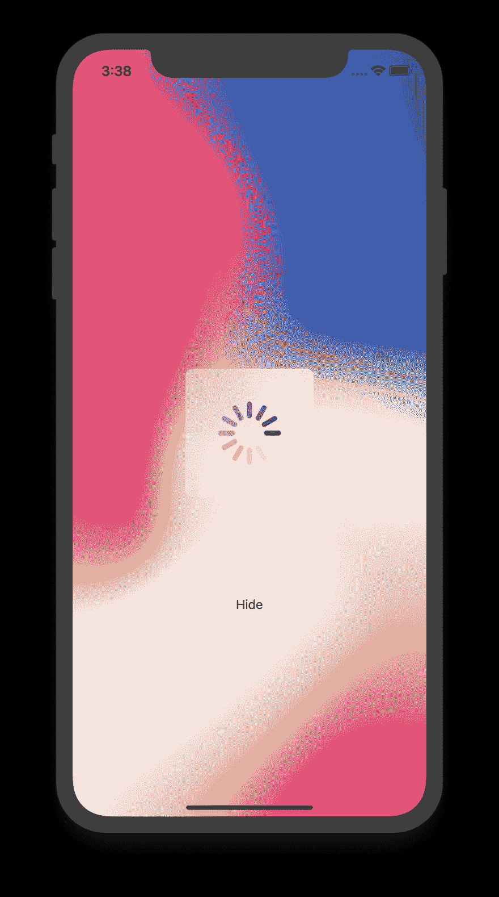

# 如何在 iOS 中使用 CAReplicatorLayer 制作活动指示器

> 原文：<https://dev.to/onmyway133/how-to-use-careplicatorlayer-to-make-activity-indicator-in-ios-22o5>

[CAReplicatorLayer](https://developer.apple.com/documentation/quartzcore/careplicatorlayer) 是一个创建指定数量的子层副本的层，具有不同的几何、时间和颜色变换

这里我们使用`instanceTransform`，它在复制器层的中心应用变换矩阵

下面是我们如何使用`replicatorLayer`来复制大量的`line`并围绕中心旋转它们。

```
let replicatorLayer = CAReplicatorLayer()
let animation = CABasicAnimation(keyPath: #keyPath(CALayer.opacity))

let line = CALayer()
let lineCount: Int = 12
let duration: TimeInterval = 1.0
let lineSize: CGSize = CGSize(width: 20, height: 6)
let lineColor: UIColor = UIColor.darkGray

let angle = CGFloat.pi * 2 / CGFloat(lineCount)
let rotation = CATransform3DMakeRotation(angle, 0, 0, 1.0)

replicatorLayer.instanceTransform = rotation
replicatorLayer.instanceCount = lineCount
replicatorLayer.instanceDelay = duration / TimeInterval(lineCount)

line.backgroundColor = lineColor.cgColor
line.frame.size = lineSize
line.cornerRadius = lineSize.height / 2

animation.fromValue = 1.0
animation.toValue = 0.0
animation.repeatCount = Float.greatestFiniteMagnitude
animation.timingFunction = CAMediaTimingFunction(name: .linear)
animation.duration = duration

replicatorLayer.addSublayer(line)
layer.addSublayer(replicatorLayer)

// x: 
// y: half the height, changing affects rotation of lines
line.position = CGPoint(x: 48, y: 75)

line.add(animation, forKey: nil) 
```

注意`line`的`position`。`x`越大，越接近中心。`y`应该是复制器层高度的一半大小，改变它会影响`line`的偏斜度。

[](https://res.cloudinary.com/practicaldev/image/fetch/s--E4iVloZX--/c_limit%2Cf_auto%2Cfl_progressive%2Cq_auto%2Cw_880/https://user-images.githubusercontent.com/2284279/57626103-809f2100-7595-11e9-9851-2df8b6013757.png)

原帖[https://github.com/onmyway133/blog/issues/230](https://github.com/onmyway133/blog/issues/230)