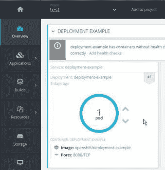
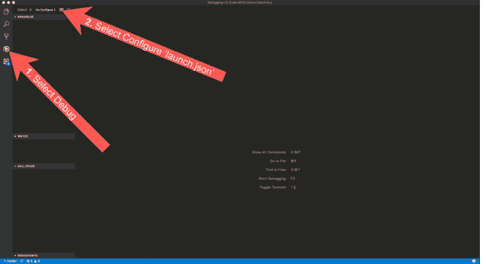

# 使用 Visual Studio 代码(VS 代码)在本地调试 Openshift Node.js 应用程序

> 原文：<https://dev.to/austincunningham/debug-your-openshift-node-js-apps-locally-with-visual-studio-code-vs-code-3b8e>

VS 代码内置了对 Node.js 运行时的调试支持。但是如何远程调试运行在 Openshift 上的 Node.js 应用程序呢？

## 在 Openshift 上设置节点调试器

> 在浏览器中的 Openshift 上，打开您的应用程序正在运行的项目
> 
> 选择 Pod

[](https://res.cloudinary.com/practicaldev/image/fetch/s--C3R-uJMc--/c_limit%2Cf_auto%2Cfl_progressive%2Cq_auto%2Cw_880/https://cdn-images-1.medium.com/max/800/1%2AmNcfs09gLxDWyu0usgw9pA.jpeg%3Fstyle%3Dcenterme)

> 为 pod 选择端子

[](https://res.cloudinary.com/practicaldev/image/fetch/s--1B2o1DMw--/c_limit%2Cf_auto%2Cfl_progressive%2Cq_auto%2Cw_880/https://cdn-images-1.medium.com/max/800/1%2ArrTjLh0qVh9DllyNXds67Q.jpeg%3Fstyle%3Dcenterme)

> 节点 v6 LTS 有一个内置的调试器，可以在终端运行进入

```
node debug app.js 
```

Enter fullscreen mode Exit fullscreen mode

> 其中 app.js 将是运行应用程序的起点(通常是 app.js 或 index.js)。默认情况下，这将使您的应用程序在端口 5858 上处于调试模式。

**注意**:节点 v8 LTS 使用 inspect，所以命令会是**节点 inspect app.js**

从命令行登录到 Openshift 并切换到您的项目

```
oc login https://your-openshift-instance:8443

oc project your-project-name

oc set probe dc your-app-name --liveness --readiness --remove=true 
```

Enter fullscreen mode Exit fullscreen mode

这将禁用活性和就绪检查，因此您的 pod 不会在远程调试期间重新启动。返回类似于下面的

```
deploymentconfig "your-app-name" updated
oc port-forward $(oc get po | grep your-app-name | grep Running | awk '{print $1}') 8888:5858 
```

Enter fullscreen mode Exit fullscreen mode

这将把端口 5858 从正在运行的 Pod 转发到本地端口 8888 (8888 是一个示例，您可以使用任何空闲端口)。返回以下内容

```
Forwarding from 127.0.0.1:8888 -> 5858
Forwarding from [::1]:8888 -> 5858 
```

Enter fullscreen mode Exit fullscreen mode

所以现在您已经在 Openshift 中开始调试，并转发到 localhost:8888

## 连接 Vs 码到遥控器

> 打开 Visual Studio 代码
> 
> 打开要调试的应用程序。
> 
> 选择调试选项并选择配置' launch.json。

[](https://res.cloudinary.com/practicaldev/image/fetch/s--nVlK2KRo--/c_limit%2Cf_auto%2Cfl_progressive%2Cq_auto%2Cw_880/https://cdn-images-1.medium.com/max/800/1%2AzuN0dqopEdgX8sxvrisvJw.png%3Fstyle%3Dcenterme)

使用 port forward 命令中的端口 8888 设置 launch.json 文件，如下所示，变量**" program ":" $ { workspace root }/app . js "**应该与 node.js 的起始点匹配。

```
{  "version":  "0.2.0",  "configurations":  [  {  "type":  "node",  "request":  "attach",  "name":  "Attach to Remote",  "address":  "localhost",  "protocol":  "legacy",  "port":  8888,  "localRoot":  "${workspaceRoot}",  "remoteRoot":  "/opt/app-root/src/"  },  {  "type":  "node",  "request":  "launch",  "protocol":  "legacy",  "name":  "Launch Program",  "program":  "${workspaceRoot}/app.js"  }  ]  } 
```

Enter fullscreen mode Exit fullscreen mode

> 单击播放按钮旁边的下拉菜单，并选择连接到遥控器
> 
> 单击播放按钮或从下拉列表中选择开始调试

你现在可以正常使用调试器了

[我的博客](https://austincunningham.ddns.net)