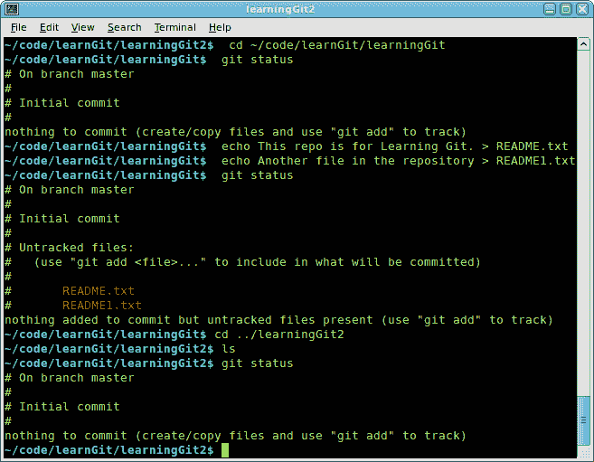
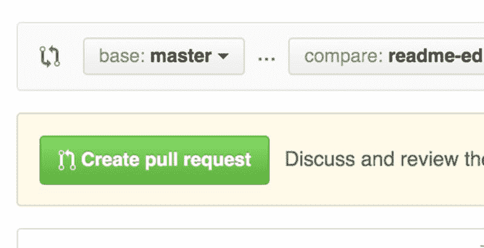
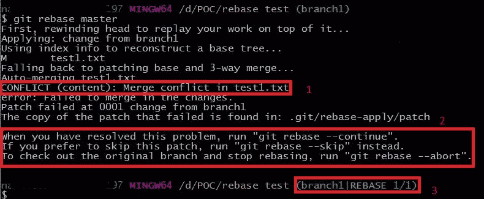
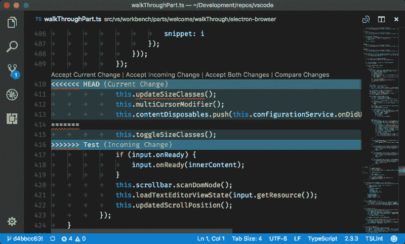
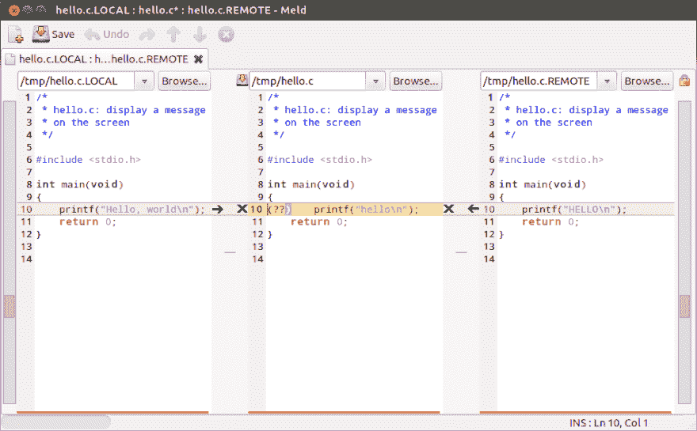

# GIT 冲突什么问题？

> 原文：<https://dev.to/austincunningham/git-conflicts-what-s-the-problem-5090>

当我在大学开始使用 Git 时，我基本上是独立工作的，致力于精通是一种常态。在那之后我开始作为一名开发人员工作，在团队中工作成为了现实，git 的冲突在那里升起了丑陋的 **< < < < <头**

## 什么是冲突？

您 PC 上的本地代码库与您希望合并到的 Github 上的远程代码库不同步。

## 工作流程

从哪里开始？我想一开始， **Fork** 你想处理的 repo，把你的 Fork 克隆到你的本地 PC 上，我使用 ssh url，因为从长远来看更容易。关于添加 ssh 密钥的设置信息，参见 [github 文档的](https://help.github.com/en/articles/connecting-to-github-with-ssh)。

```
git clone git@github.com:yourUsername/RepoName.git 
```

Enter fullscreen mode Exit fullscreen mode

这个动作自动将一个名为 **origin** 的远程位置添加到您的本地 git 配置中。为了与原始报告保持同步，您需要添加一个指向它的远程位置。

```
git add remote upstream git@github.com:upstreamUsername/RepoName.git 
```

Enter fullscreen mode Exit fullscreen mode

添加遥控器后，您可以检查您的遥控器

```
git remote --v
>origin  git@github.com:yourUsername/RepoName.git (fetch)   
>origin  git@github.com:yourUsername/RepoName.git (push)              
>upstream git@github.com:upstreamUsername/RepoName.git (fetch)   
>upstream git@github.com:upstreamUsername/RepoName.git (push) 
```

Enter fullscreen mode Exit fullscreen mode

所以你准备好开始做一些代码库了，首先要检查的是你是否和 upstream 同步，然后你可以创建一个分支来工作。值得投资一个命令行工具，在提示符下显示你的分行名称，例如 [ohmyzsh](https://github.com/robbyrussell/oh-my-zsh)

```
git pull upstream master
git checkout -b branchname 
```

Enter fullscreen mode Exit fullscreen mode

所以你已经做好了一切，你开始编码，然后是时候创建一个针对上游回购的拉请求了。

首先让我们谈谈 git 中的 staging。使用 **git status** 将向您显示本地回购中所做的更改，例如

[](https://res.cloudinary.com/practicaldev/image/fetch/s--wmAM3cni--/c_limit%2Cf_auto%2Cfl_progressive%2Cq_auto%2Cw_880/https://cdn-images-1.medium.com/max/800/1%2Angu9OPHFNV1cx36n9FN2hg.png%3Fstyle%3Dcenterme)

简而言之，暂存的文件将被提交， **git add filename** 将向暂存区添加文件， **git rm filename** 将从暂存区删除文件。如果有类似 IDE 生成的文件，您可能想要添加和配置一个**。gitignore** 文件到你的 repo。我不会深入讨论它，但是有一些关于[的好文档。gitignore 此处](https://www.atlassian.com/git/tutorials/saving-changes/gitignore)。

因此，您提交您的更改，并将更改推送到您的分支。以下代码行将所有文件添加到临时区域，提交它们，然后将 branchname 推送到 fork。

```
git add --all
git commit -m 'this is where your commit messeage would go'
git push origin branchname 
```

Enter fullscreen mode Exit fullscreen mode

当你在浏览器中打开 Github 时，你会看到一个创建拉取请求的按钮

[](https://res.cloudinary.com/practicaldev/image/fetch/s--RJwOyjkZ--/c_limit%2Cf_auto%2Cfl_progressive%2Cq_auto%2Cw_880/https://cdn-images-1.medium.com/max/800/1%2A5mWR6EaQcVf4nbvmvmtjTQ.png%3Fstyle%3Dcenterme)

因此，拉请求被创建，如果一切顺利，您应该能够将您的分支合并到上游的主节点中。

## 当事情不顺利的时候

这就是事情可能出错的地方。当你编码时，另一个开发者提交了一个拉请求，它被批准并与 master 合并。所以现在**上游主机**已经改变，您的**本地主机**现在不同步，您将看到如下错误

[](https://res.cloudinary.com/practicaldev/image/fetch/s--5emB5SDn--/c_limit%2Cf_auto%2Cfl_progressive%2Cq_auto%2Cw_880/https://cdn-images-1.medium.com/max/800/1%2A6bczdL6znl8lvVEagk82IQ.png%3Fstyle%3Dcenterme)

那么如何修复你的分支，你首先必须修复本地主分支

```
git checkout master
git pull upsteam master 
```

Enter fullscreen mode Exit fullscreen mode

既然 master 已经修复，那么是时候修复 branchname branch

```
git checkout branchname 
git rebase master 
```

Enter fullscreen mode Exit fullscreen mode

在这一点上，您可能很幸运，您会发现对 upsteam master 的任何更改都不在与您自己相同的文件上，并且 rebase 完成时没有出现任何问题。或者你可能会看到这样的东西

[](https://res.cloudinary.com/practicaldev/image/fetch/s--iupdtgEc--/c_limit%2Cf_auto%2Cfl_progressive%2Cq_auto%2Cw_880/https://cdn-images-1.medium.com/max/800/1%2Asz-e8xhCtUIwlP-SeKScDg.jpeg%3Fstyle%3Dcenterme)

不要担心，这只是意味着您正在处理的文件的**上游主**版本已经改变，您将需要协调差异。

您可以通过编辑文件来解决冲突，您可以接受传入的更改或当前的更改或两者的组合。一旦你决定删除未使用的代码和<<<<<<< HEAD , ======= and >> > > > > > branch name。

我推荐使用工具来解决这些冲突。Vs Code IDE 有一些不错的内置冲突解决特性。点击链接自动编辑文件。

[](https://res.cloudinary.com/practicaldev/image/fetch/s--NcGiLRSs--/c_limit%2Cf_auto%2Cfl_progressive%2Cq_auto%2Cw_880/https://cdn-images-1.medium.com/max/800/1%2AhVqanWLjYJxJrTZ6ROUNdQ.png%3Fstyle%3Dcenterme)

如果你正在寻找一个独立的工具，你可能会尝试 [Meld](http://meldmerge.org/help/resolving-conflicts.html) ，点击左或右窗格的变化，以适用于中心和保存。

[](https://res.cloudinary.com/practicaldev/image/fetch/s--p1alRPuu--/c_limit%2Cf_auto%2Cfl_progressive%2Cq_auto%2Cw_880/https://thepracticaldev.s3.amazonaws.com/i/c0rpg5unq0utm3kbo4hj.png)

因此，一旦您解决了冲突，您需要将您的更改添加到暂存区域，然后您需要完成重置基础

```
git add --all
git rebase --continue 
```

Enter fullscreen mode Exit fullscreen mode

现在分支已经修复了，您需要将更改推送到 fork 上的分支名称。如果您试图将重定基础的分支推回到远程存储库，Git 会阻止您这样做。在推送时使用强制标志-f。

```
git push -f origin branchname 
```

Enter fullscreen mode Exit fullscreen mode

只有在使用自己的分支时才使用-f 标志，因为如果您不确定自己在做什么，这可能是一个破坏性的命令。

[我的博客](https://austincunningham.ddns.net)