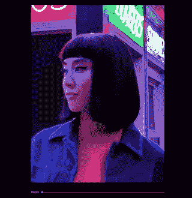
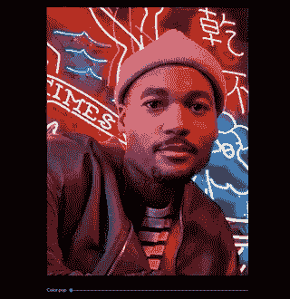
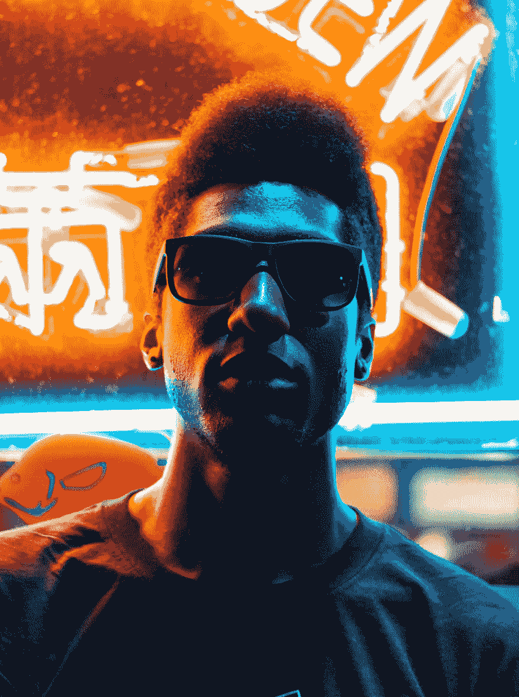
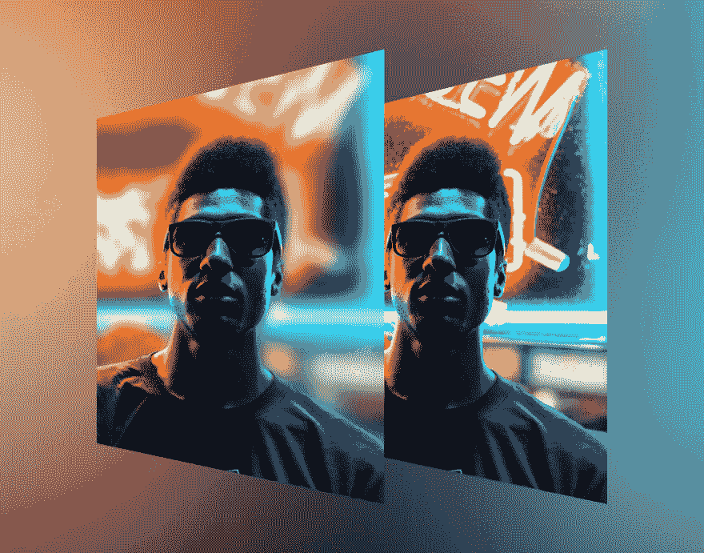

# 重新创建“谷歌像素 3a”网站的相机功能演示

> 原文：<https://dev.to/kedar9/re-creating-google-pixel-3a-website-s-camera-features-demo-3pk0>

谷歌上周推出了 Pixel 3a。在其[网站](https://store.google.com/product/pixel_3a)上，它出色地展示了其相机的功能:深度编辑器和彩色 Pop。

###### 深度编辑器(改变背景模糊/散景):

###### 彩色流行演示(将背景色改为黑色&白色)

像素相机无疑是很神奇的。它在网站上的演示很有趣。你可以玩图片下面的滑块。增加或减少效果。挺酷的。

#### (重新)创建演示:

让我们做背景模糊或散景效果。我从 Unsplash 得到了这张惊人的图片。
T3T5】

注意:这不是一篇关于如何实际模糊背景或动态改变背景饱和度的编码文章。这也不是谷歌在网站上做的事情。

#### 下面是如何做到的(以及谷歌是如何做到的):

**两幅**图像:**一幅**未应用效果，**另一幅**应用了最大效果。**一个图像在另一个图像之上**。滑块增加/减少顶部图像的`opacity`。
高明的手法！
[](https://res.cloudinary.com/practicaldev/image/fetch/s--6WhD8RNb--/c_limit%2Cf_auto%2Cfl_progressive%2Cq_auto%2Cw_880/https://thepracticaldev.s3.amazonaws.com/i/pxk4qfp4mm8mj31870lt.jpg)

### 下面是怎么做的:

#### 重叠

来自 Unsplash 的图像将是我们的图像(版本 1)的**无效果应用**版本。我在 Photoshop 中模糊了那张图片的背景。(提示:你也可以在像 *Snapseed* 这样的基本图像编辑应用中做到这一点)。
背景模糊的编辑图像将是**应用的最大效果**版本(版本-2)。
要堆叠图像，我们只需指定`position: absolute`和相同的位置属性(`top`、`left`...)用于两个图像。

所以，在 HTML:

```
 <div class="images">
    
    
  </div> 
```

Enter fullscreen mode Exit fullscreen mode

而在 CSS:

```
 img {
    width: 300px;
    height: auto;
    position: absolute;
    left: 0;
    right: 0;
    top: 0;
  }
  .blur-img {
    opacity: 0;
  } 
```

Enter fullscreen mode Exit fullscreen mode

现在，带有`id="blur-img"`(在 HTML 中指定)的图像将被精确地放置在版本 1 图像的顶部。我们将版本 2 图像(模糊的那张)的`opacity`设置为`0`。
因此，唯一可见的图像是版本 1(原始图像)。

#### 滑过

带有`type="range"`的`input` HTML 元素充当滑块。它接受`min`和`max`值。为了方便起见，我们将最小值设为`0`，将最大值设为`100`。
用 JS，我们需要**得到**范围输入的值。
根据输入的范围值，顶部图像的不透明度(`id="blur-img"`)将从`0`(隐藏)变为`1`(可见)。

因此，在 JS 中，添加一个方法来处理这个问题:

```
const changeBlur = (value) => {
  document.getElementById("blur-img").style.opacity = value/100;
} 
```

Enter fullscreen mode Exit fullscreen mode

*我们将`value`除以`100`，因为范围输入将返回在`0`和`100`之间的值，并且图像的不透明度需要在`0`到`1`之间。*

并在 HTML 中添加范围输入:

```
<input class="slider" type="range" min="0" max="100" value="0"
oninput="changeBlur(this.value)"> 
```

Enter fullscreen mode Exit fullscreen mode

🎉差不多就是这样。它只有很少的几行代码，但是效果非常好。

下面是背景模糊效果的 CodePen 演示:
[https://codepen.io/kedar/embed/WBrgdQ?height=600&default-tab=result&embed-version=2](https://codepen.io/kedar/embed/WBrgdQ?height=600&default-tab=result&embed-version=2)

下面是颜色流行效果的 CodePen 演示:
[https://codepen.io/kedar/embed/RmKbyY?height=600&default-tab=result&embed-version=2](https://codepen.io/kedar/embed/RmKbyY?height=600&default-tab=result&embed-version=2)