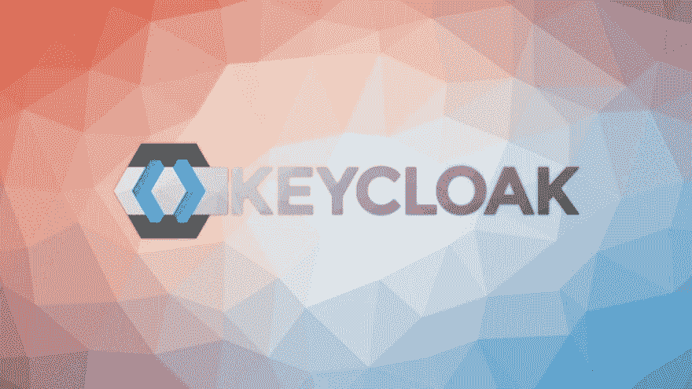

# 认证很难:Keycloak 来拯救

> 原文：<https://dev.to/agusnavce/authentication-is-hard-keycloak-to-the-rescue-2ng6>

很多时候，当我们开始开发一个软件解决方案时，安全性的需求就会出现。我们希望保持我们的应用程序的每个部分的安全和隐私。

作为开发人员，大多数时候我们必须自己单独实现每个系统。不断创建身份验证模式变得很乏味。这需要大量的工作…

这是奇克洛进入场景的地方。Keycloak 是一个开源的身份和访问管理工具，可以轻松地为应用程序和安全服务添加身份验证。不需要处理存储用户或验证用户。这一切都是现成的。

本文的重点是展示如何在一个简单的应用程序中使用 Keycloak 进行身份验证。我将通过创建一个新的后端演示应用程序来做到这一点，并通过一些代码示例展示如何将 Keycloak 添加到组合中。

您可以在这个 [GitHub repo](https://github.com/agusnavce/keycloak_example) 上查看本文中的示例代码，了解我们正在跟进的示例。

### Docker 容器上的 Keycloak 服务器

对于这个例子，我将使用 docker compose 来创建必要的资源，以便在我们的后端应用程序中进行身份验证。

因为我们使用容器，所以我们需要不同的服务图像。我们使用的第一张图片是来自 dockerHub 的 jboss/keycloak。

对于这张图片，您需要知道一些事情:

*   如果想要 SSL，需要公开的端口是 8080 或 8443。
*   默认情况下，Keycloak 没有初始管理员帐户；为了能够登录，您需要提供 KEYCLOAK_USER 和 KEYCLOAK_PASSWORDenvironment 变量。
*   您需要指定一个供 Keycloak 使用的数据库。为了方便起见，我们将使用 postgres。