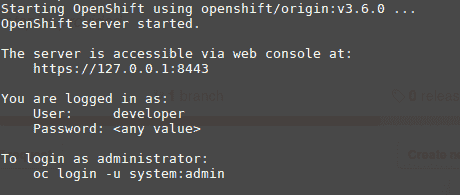
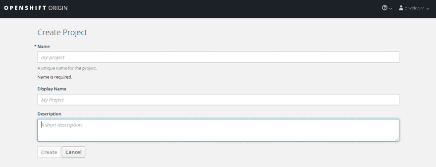
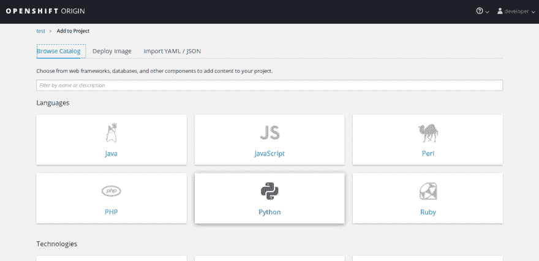
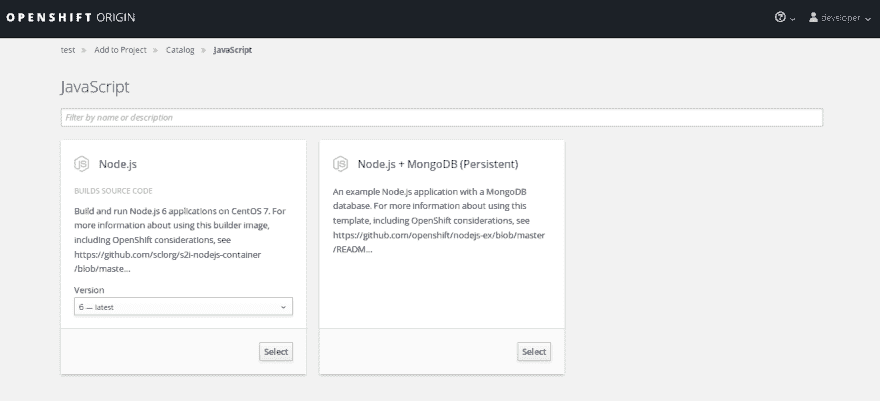
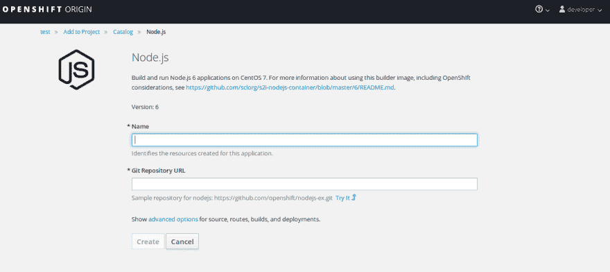
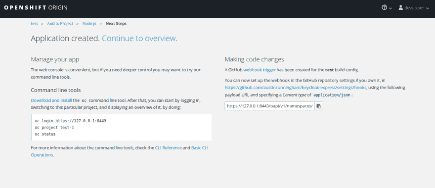
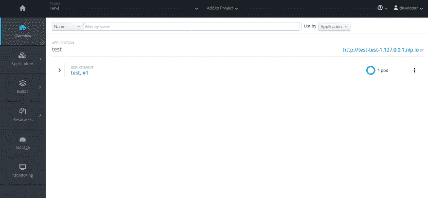

# Openshift 和节点

> 原文：<https://dev.to/austincunningham/openshift-and-node-35nc>

这是在 Openshift 3.6 上设置节点应用程序的指南。背景信息 Openshift 是一个部署和托管应用程序的平台。这对我来说主要是一次学习经历，所以我会指出我的痛点。

## 设置 Openshift

我用 Linux Mint 做 OS。首先我安装了 docker，因为它是一个依赖项

[](https://res.cloudinary.com/practicaldev/image/fetch/s--v_EMI0AU--/c_limit%2Cf_auto%2Cfl_progressive%2Cq_auto%2Cw_880/https://cdn-images-1.medium.com/max/1600/0%2AOFD22NxBNgDoqMET.png%3Fstyle%3Dcenterme)T3】

```
sudo apt install docker.io 
```

Enter fullscreen mode Exit fullscreen mode

> **注意**:要配置 docker 在没有 sudo 的情况下运行，请看这个[博客](https://docs.docker.com/engine/installation/linux/linux-postinstall/)。

使用不安全的注册表参数 172.30.0.0/16 设置 Docker 守护程序添加或编辑/etc/docker/daemon.json 文件，并添加以下内容:

```
{  "insecure-registries":  [  "172.30.0.0/16"  ]  } 
```

Enter fullscreen mode Exit fullscreen mode

> **注意** : daemon.json 文件不存在，所以创建了它，我们添加它是因为 Openshift 的注册表使用自签名证书，我们允许本地 docker 配置信任它。

重启 Docker 服务

```
sudo service docker restart 
```

Enter fullscreen mode Exit fullscreen mode

在[这里](https://www.openshift.org/download.html#oc-platforms)下载 oc 二进制文件。运行 oc cluster up 以启动 Openshift。

```
oc cluster up 
```

Enter fullscreen mode Exit fullscreen mode

[](https://res.cloudinary.com/practicaldev/image/fetch/s--w06lo56Z--/c_limit%2Cf_auto%2Cfl_progressive%2Cq_auto%2Cw_880/https://cdn-images-1.medium.com/max/1600/1%2AuOGNt8GV5ffwSKG4D7RvCA.png%3Fstyle%3Dcenterme)

> **注意**:如果 docker 没有配置为在没有 sudo 的情况下运行，那么 oc 也需要 sudo 来运行，没有记录导出路径

您现在可以登录门户网站了

[](https://res.cloudinary.com/practicaldev/image/fetch/s--bTeuEYVd--/c_limit%2Cf_auto%2Cfl_progressive%2Cq_auto%2Cw_880/https://cdn-images-1.medium.com/max/1600/1%2A23OW749xYm0rorSmC2sD-g.png%3Fstyle%3Dcenterme)

登录后，您将看到控制台

[](https://res.cloudinary.com/practicaldev/image/fetch/s--V7MrntNj--/c_limit%2Cf_auto%2Cfl_progressive%2Cq_auto%2Cw_880/https://cdn-images-1.medium.com/max/1600/1%2AU9Fg2cXMXnSA0Nk7Y2vaMQ.png%3Fstyle%3Dcenterme)

## 部署节点应用

点击创建项目

[](https://res.cloudinary.com/practicaldev/image/fetch/s--5M_XCBCj--/c_limit%2Cf_auto%2Cfl_progressive%2Cq_auto%2Cw_880/https://cdn-images-1.medium.com/max/1600/1%2A7vTEn8NMPY2XFAYbNwarZQ.png%3Fstyle%3Dcenterme)

添加一个名称，然后单击创建

[](https://res.cloudinary.com/practicaldev/image/fetch/s--7XlZrgdd--/c_limit%2Cf_auto%2Cfl_progressive%2Cq_auto%2Cw_880/https://cdn-images-1.medium.com/max/1600/1%2ACG9zyYOh9tn5nglcJKxCbQ.png%3Fstyle%3Dcenterme)

选择 JavaScript

[](https://res.cloudinary.com/practicaldev/image/fetch/s--cMJANcHA--/c_limit%2Cf_auto%2Cfl_progressive%2Cq_auto%2Cw_880/https://cdn-images-1.medium.com/max/1600/1%2AsU5kBtmhjt_tsfS6el-PbA.png%3Fstyle%3Dcenterme)

我选择了 Node.js 6。

[](https://res.cloudinary.com/practicaldev/image/fetch/s--rna7sJTz--/c_limit%2Cf_auto%2Cfl_progressive%2Cq_auto%2Cw_880/https://cdn-images-1.medium.com/max/1600/1%2Aa1JFLrcckEPOxGsz99tn5g.png%3Fstyle%3Dcenterme)

添加一个**名称**并添加 Node.js 应用程序的 **Git 存储库 URL**

> **注意**:git URL 的 https 版本

[](https://res.cloudinary.com/practicaldev/image/fetch/s--uxjdm54b--/c_limit%2Cf_auto%2Cfl_progressive%2Cq_auto%2Cw_880/https://cdn-images-1.medium.com/max/1600/1%2AL9kDx_vzp2d42Il9GZ0z8w.png%3Fstyle%3Dcenterme)

您的应用程序现已部署，选择**继续概述**进入 Openshift 控制台，您可以在右侧看到访问您的应用程序的 URL。如果有任何问题，请单击窗格图标，您可以从选项卡中访问日志。

[](https://res.cloudinary.com/practicaldev/image/fetch/s--GPFDs9Ax--/c_limit%2Cf_auto%2Cfl_progressive%2Cq_auto%2Cw_880/https://cdn-images-1.medium.com/max/1600/1%2A1HOen2lI9U5WkV5kjQ6Akg.png%3Fstyle%3Dcenterme)

棘手问题如果您的应用程序没有 npm 启动脚本，您的应用程序将无法构建。您需要在 package.json 中添加一个启动脚本，如

```
“scripts”:  {  “start”:  “node  app.js”  } 
```

Enter fullscreen mode Exit fullscreen mode

难点 Node.js 应用程序需要使用与 Openshift 相同的端口，否则应用程序将无法呈现。

```
app.listen(8080, function () { 
    console.log(‘Listening at http://localhost:8080’); 
    }); 
```

Enter fullscreen mode Exit fullscreen mode

> **注意**:如果你不想改变你的应用端口，你可以通过在 gui 中编辑这些 yml 文件或者使用 oc 编辑命令如
> 来改变 Openshift 中的**路由**和**服务**

```
oc edit route <route-name> 
oc edit service <service-name> 
```

Enter fullscreen mode Exit fullscreen mode

你应该开始跑步了。

[我的博客](https://austincunningham.ddns.net)