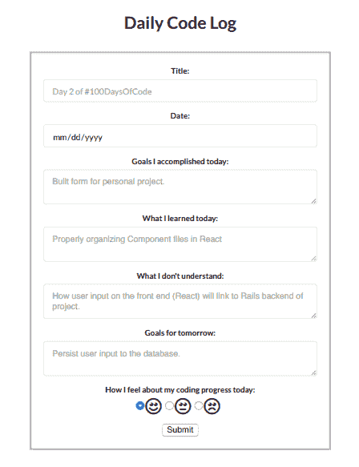
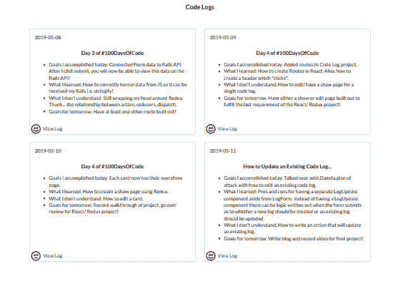
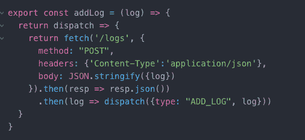

# 我的第一个 React 项目

> 原文：<https://dev.to/mccarronmollye/my-first-react-project-1ijk>

Flatiron 在线 Web 开发训练营的最终项目是一个带有 Rails 后端的 React Redux 项目。这个项目积累了我们在课程中学到的所有东西——Ruby、JS、HTML、CSS、AJAX、React、Rails 和 Redux。React 和 Redux 对我来说很难理解。除了 Flatiron 的课程，我还使用了 Stephen Grider 关于 React 和 Redux 的课程:[https://www.udemy.com/react-redux/](https://www.udemy.com/react-redux/)。Stephen 使用图表和类比来帮助解释概念，我强烈推荐这门课程，因为他从头开始构建了几个项目。

我开发的应用程序叫做每日代码日志，你可以在里面记录你的每日编码进度。作为一个自称的代码新手，我意识到记录学习是多么重要，尤其是意识到你所不知道的。随着时间的推移，当你为自己的问题寻找答案时，你会回头看那些已回答的问题，并意识到你已经积累了多少知识。

现在我站在了另一边，如果你正在考虑处理一个类似的项目，这里有一些快速提示和指示。

## 制定要求和时间表

手头的任务似乎令人生畏，所以我决定把这个项目分成几个小部分。以下是我的 9 天计划:

周六:映射项目-定义对象之间的关系，并能够回答“我的应用程序的意义是什么？”

周日:创建种子数据，安装项目的 Rails 后端。

星期一:创建项目的整个(样机)用户界面。

星期二:连接获取获取内部 API 数据的 get 请求。

星期三:连接获取 post 请求，以便更新 API 端点。

周四:建立反应路线。

星期五:最后的润色/消灭虫子。

周六:录制应用程序的视频演示，并写关于学习的博文。

周日:…提交项目！！！！

每天给自己设定一个目标非常有帮助，因为每天早上我都清楚地知道自己想要完成什么。如果我在一天的早些时候实现了我的目标，我会继续我的下一个目标。

## 使用语义用户界面

我在应用程序的网页设计中使用了语义用户界面。语义用户界面有许多不同的元素——比如按钮、卡片、图标——可以在你的应用中使用，而不是模板。语义为您提供不同的构建模块，但最终产品看起来可能是原创和定制的。为了在您的应用程序中引用语义 UI，您只需将以下链接导入到 client/public/index.html 的`<head>`标记中:

然后我使用了一些 CSS 来进一步调整元素的位置和样式。

以下是该应用程序简单设计的一些截图:

表单创建代码日志

显示所有代码日志

## 做同一件事的方法不止一种…

对我来说，这个项目最棘手的部分是提交表单来更新我的内部 API 端点。做一个快速的谷歌搜索，大多数人建议我使用 Redux 表单，[https://redux-form.com/](https://redux-form.com/)，但是我的导师帮助我在没有 Redux 表单的情况下将数据发布到我的 API。相反，我们使用普通的 javascript。在表单的 handleOnSubmit 函数中，我们调用了一个动作调用 addLog，它向 API 端点发出 post 请求:

缩减器“ADD_LOG”然后将表单的数据添加到 Redux 存储中。

我期待着潜入 Redux 形式，但学习 vanillas JS 的方式是值得的。现在，当我学习 Redux Form 时，我会对 Redux Form 在幕后做什么有一个坚实的想法。

## 我做到了！

我对这个项目的结果感到非常自豪。我每天都使用这个应用程序来跟踪我的编码进度，一旦我添加了身份验证，我希望其他人也能使用这个应用程序来学习。

附:这里有一个应用程序演练的链接！https://www.youtube.com/watch?time_continue=1&v = 8 iqjepkmck 8