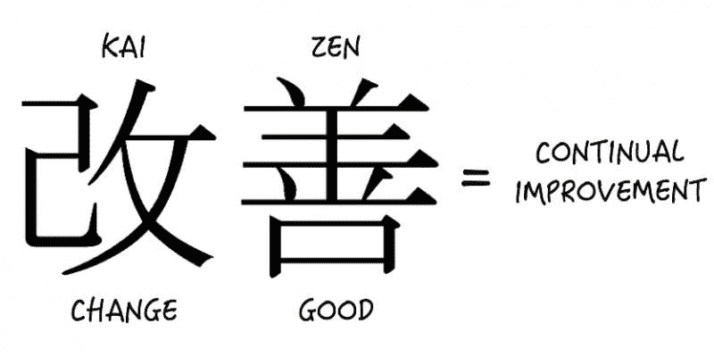

# 用这 13 个技巧开始你的开发者生涯

> 原文：<https://dev.to/timdeschryver/jump-start-your-developer-career-with-these-13-tips-4oaa>

我相信要成为一名更好的工程师，一切都归结于实践，实践和更多的实践。尤其是你刚开始职业生涯的时候。问题是，当你刚刚开始的时候，有比仅仅写几行代码更多的事情要做。

开始时，你会努力把每件事都做好，同时努力集中精力写代码会让你吃不消。这就是为什么我鼓励花时间和精力去习惯写代码所带来的一切。在这之后，当你写代码的时候，你会注意到它会变得更流畅，你不会在执行其他任务时被拉出来，例如，浏览文件和在互联网上搜索答案。

你将有更多的时间来编写代码，并且你也将更专注于编写代码部分，因为其他任务将更自动地执行，而无需考虑它。

以下建议没有特定的顺序，我建议一次只选择一两个，这里重点是关键。

### 学习你的 IDE

要快速提高工作效率，请了解您的 IDE 是如何工作的。花些时间学习你经常做的任务的快捷方式，或者花些时间去执行。一个立即浮现在脑海中的任务是在文件浏览器中找到一个文件，这个任务通常需要几秒钟，但更重要的是，它**会让你脱离流程**。通过学习导航到文件的捷径，你不需要思考。

使用 IDE 的另一个有用的技巧是看看它提供的扩展(或插件)。即使是最小的扩展，例如一个主题，通常也能带来更好的开发环境和体验。当您每天在 IDE 中工作几个小时时，这些小事情会有所帮助。

大多数 IDE 都有“每日提示”，不要关闭它。你可以学到一些有用的技巧，否则你不会遇到。

为了让您开始，下面是带有快捷方式列表的备忘单的链接:

*   【Windows 的 VSCode 快捷键|[MAC OS 的 VSCode 快捷键](https://code.visualstudio.com/shortcuts/keyboard-shortcuts-macos.pdf)
*   [原子快捷方式](https://github.com/zyzo/atom-cheatsheet)
*   [网络风暴快捷方式](https://resources.jetbrains.com/storage/products/webstorm/docs/WebStorm_ReferenceCard.pdf)

### 提升你的谷歌地图

作为开发人员，我们不可能知道(并记住)所有的事情。好的一面是，只需敲几下键盘就能得到答案。知道如何使用搜索引擎，你会更快找到正确答案。例如，当 Angular 出版时，你很有可能会遇到 AngularJS 的答案，但如果你知道如何正确使用谷歌，你可以通过使用减号来过滤掉这些答案，以消除包含 AngularJS 单词的文章，例如*Angular change detection-Angular js*。这再次要求你的大脑少思考，你的大脑不需要去想那些不会对你有进一步帮助的旧文章。

为了让你开始，这里有一些有用的提示链接:

*   [更有效使用谷歌的 20 个谷歌搜索技巧](https://www.lifehack.org/articles/technology/20-tips-use-google-search-efficiently.html)

### 阅读文档

继续上述技巧的一个技巧是如何阅读文档文件。您不需要阅读整个文档来解决您的问题。快速浏览文档，知道你必须阅读哪一部分来解决你的问题。通过尽早练习，你也会注意到解决问题的多种方法，每种方法都有其优点和缺点。它还会让你了解好的文档是怎样的，以及好的文档的重要性。

### 提问

当你遇到一个问题，并且在 10 分钟内找不到答案时，不要犹豫去寻求帮助。当你寻求帮助时，不要只是问问题。展示并描述你遇到的问题，解释为什么你认为这个问题会发生，展示你为了解决这个问题已经尝试过的方法，以及你在网上找到的东西。这给试图提供帮助的人一个良好的基础和一些思考时间。

一个好的问题措辞正确，并归结为实际问题，而不是代码和其他随机因素。为了查明根本原因，**创建一个新的最小应用程序，并尝试重现问题**。大多数时候，你会注意到这一步通常可以解决问题。如果没有，它会帮助你更好地理解它的行为。这个最小的应用程序为你和其他试图回答这个问题的开发者提供了一个平台。这有助于她过滤掉所有其他的杂音，而且这个平台可以比实际应用程序更快地被测试。

即使你解决了问题，但不确定如何实施，**休息一下**或寻求第二双眼睛。解决一个问题总有多种方法。通常实施取决于你如何看待它，取决于你如何着手解决你面前的问题。你会注意到，当你休息一会儿再回来时，你会从另一个角度看问题，这将导致另一个实现。同样的道理也适用于第二双眼睛，有了新鲜的头脑，真正的问题通常会浮出水面，解决方案也会变得清晰。

额外提示:

*   [写完美的问题](https://codeblog.jonskeet.uk/2010/08/29/writing-the-perfect-question/)作者[乔恩·斯基特](https://twitter.com/jonskeet)
*   如果你被一个普通的问题困住，在 StackOverflow 上提出你的问题。它会帮助你思考问题，并正确表达。作为一个额外的好处，你也可以帮助其他开发者解决同样的问题。
*   买一只[橡皮鸭](https://en.wikipedia.org/wiki/Rubber_duck_debugging)给你随时提供帮助。

### 频繁提交，写好提交消息

这个建议经常被忽视。通过写好提交信息，你将**在**后面留下一串想法。当你或者一个评论者查看提交历史时，思路会立刻清晰。这使得审查代码更加容易。在你的公司里要求提交规则以显示你的关心，如果没有规则，一个好的开始将是遵循常规提交消息的实践。提交消息描述了你做了什么，例如`update check out`与`fix(check out): resolve delivery address to a foreign country`相比没有显示你做了什么。后者显示了提交是结帐过程中的一个 bug 修复，以及它解决了什么，添加了一个外国作为交付地址。

与这个技巧类似的是，经常提交小的更改。这使得**更容易恢复更改**,如果你进入了错误的兔子洞。一种流行的做法是首先编写(失败的)测试，提交测试，解决问题并确保测试通过，最后一步是重构代码。这被称为[测试驱动开发(TDD)](https://medium.com/javascript-scene/tdd-changed-my-life-5af0ce099f80) ，也被称为*红绿重构*周期。更进一步，您甚至可以尝试[测试& &提交||恢复](https://medium.com/@kentbeck_7670/test-commit-revert-870bbd756864)周期，如果测试用例失败，更改将被恢复。

对`git`有一个很好的理解，并且知道你可以用它做什么，对这个技巧肯定是有帮助的，总的来说。

资源:

*   [常规提交](https://www.conventionalcommits.org/en/v1.0.0-beta.4/)
*   [通过在 15 分钟内学习 GIT 架构成为一名 GIT 专家](https://blog.angularindepth.com/become-a-git-pro-by-learning-git-architecture-in-15-minutes-9c995db6faeb)作者[马克斯·科瑞茨基](https://twitter.com/maxkoretskyi)

### 懂得调试很重要

您经常需要调试代码。如果你掌握了你的调试技巧，你会更快地找到问题的原因。在这里，再次学习你正在工作的环境，例如 chrome devtools 或者你的 ide，以及快速跳转代码的快捷方式。阅读，真正地阅读(和理解)一个错误信息也是朝着正确方向迈出的一步。根据我的经验，错误信息经常被忽略。通常情况下，**仔细阅读错误信息会导致更快的修复**，你会知道哪里出错了，错误发生在哪里。这是启动调试过程的有用信息。

如果看起来无法解决，像科学家一样思考，把科学方法记在心里。遵循科学的方法，进行观察并形成假设，根据假设进行预测，检验预测，重复直到你得到正确的假设。更多信息请见[提升你的逆向工程技能](https://blog.angularindepth.com/level-up-your-reverse-engineering-skills-8f910ae10630)作者[马克斯·科瑞茨基](https://twitter.com/maxkoretskyi)。

### 读取代码

你读的代码会比你写的多，阅读和理解代码是你职业生涯的重要部分。通过阅读其他人的代码，我学到了很多。阅读与工作相关的代码是一个很好的开始，但不要止步于此。尝试阅读流行的库或您日常使用的库中的代码。起初，这将是困难的，但不要在一次尝试后放弃。当你定期阅读代码时，你会注意到熟悉的部分，所有的部分会很好地结合在一起。

如果你想更进一步，你甚至可以贡献给这些库。首先，你可以提供帮助来分类问题和编写文档，每个人都喜欢好的最新文档。当你熟悉代码库的时候，你可以挑选一些小的修改和 bug 修复，之后你可以写出越来越大的特性。

与这个提示相关的，是相反的。让你的代码被审查，并保持开放的反馈。

要开始开源，寻找入门级的问题来掌握它，寻找标有“好的第一个问题”、“待价而沽”或“需要帮助”的问题。

你可以在[找到如何有效阅读代码的技巧，成为一名伟大的软件工程师的一个秘密是:阅读](https://hackernoon.com/one-secret-to-becoming-a-great-software-engineer-read-code-467e31f243b0)[奈米尔·达拉](https://twitter.com/nemild)写的代码。

### 把大任务分割成多个小任务

如果一个任务太大，你不知道从哪里开始，把它分成小块。这将使**更容易把你的头缠在**上。这样做的一个额外好处是你会感觉更有效率。你能完成的每一项任务都是成功的。这会给你带来积极的心态和继续连胜的动力。

### 卷入其中

变得更好的一个好方法是让你周围都是积极上进的人，这些人会把你带到一个更高的水平。找一个导师，开始为开源做贡献，写和读文章，关注他人，或者加入一个本地团体。看到人们积极投入工作，看到他们对工作充满热情，看到他们获得应得的结果，这种效果是有感染力的。

### 投入额外时间

如果你想以比其他开发者更快的速度变得更好，投入额外的时间。每天只需要多花 30 分钟。也就是说，每周要多花 2 到 3 个小时，一年下来，累计起来就是 156 个小时。比利时每周的平均工作时间约为 37.5 小时，每天多工作一段时间意味着你多工作了整整一个月。在你职业生涯的头几年，这是很多的，相信我，这将是显而易见的。

如果你需要一些动力来投入额外的时间，我建议你读一下[把点点滴滴连接起来:努力和梦想可以带你去哪里](https://blog.angularindepth.com/connecting-the-dots-where-hard-work-and-dreams-can-lead-you-2e8ef44096b)，还是由[马克斯·科瑞茨基](https://twitter.com/maxkoretskyi)写的。

### 获得领域知识

> 这条建议来自迈克尔·卡伦

了解你工作的领域会有所帮助。你不只是写一些代码，你是在为一个特定的领域和在这个领域工作的有经验的人写代码，来创造商业价值。优秀的开发人员能够交流领域话题，能够将业务语言翻译成代码行。从我的经验来看，和你的用户讨论一个问题真的很有帮助。并不是所有的事情都很重要，它们会帮助你区分重要的部分和不重要的部分。这一点很重要，因为作为开发人员，我们无法了解一个应用程序的本质，不与用户交流，我们就会把时间投入到应用程序的错误部分。了解您所从事的领域通常也会产生更清晰、更易读的代码。如果你对你选择的公司的商业方面感兴趣，这就有帮助了。

要更深入地了解这个技巧，请阅读[学习商业并成为更好的软件开发人员](https://hackernoon.com/learn-business-and-become-a-better-software-developer-6db96ef852b1)。

### 配对程序

> 这条建议来自 [Oleksandr Poshtaruk](https://twitter.com/El_Extremal)

[极限编程的支柱之一](https://en.wikipedia.org/wiki/Extreme_programming)，成对编程。一个刚起步的开发人员可以**从独自工作中学习，但是可以从一个更有经验的开发人员那里学习商业诀窍**。这里的关键是找到适合你的方法，找到一个平衡的工作时间表。结对可以是紧张的，就需要休息的时间表达成一致。

这个技巧值得一提的是，不是每个级别的开发人员都能有效地将程序与初级开发人员配对，Dreyfus 模型是找到配对的好资源。

### 集中调试会话

> 这条建议来自[马克斯·科瑞茨基](https://twitter.com/maxkoretskyi)

要深入理解和记忆某件事，脑子里要有一个场景和你想要理解的流程。使用调试器完成这个流程，并在 IDE 中阅读实现。在这个过程中，让你自己去思考和处理你刚刚读到的代码。创建一个假设(像科学家一样思考)，并找出你的假设是成立还是失败，如果失败了(大多数情况下)不要气馁。为了帮助您理解流程，您可以查看一下调用堆栈，以了解您所处的位置。

### 结论

以上提示不会让你一夜之间成为更好的工程师。他们所做的，是让你在写代码的时候专注于编码部分。学习的最好方法是一次专注于一项任务。如果你花时间练习并掌握了上面的技巧，你将会不假思索地执行所有关于编码的任务。这将导致小的胜利和更多的编码时间。我相信更好地编写代码的最好方法是练习，练习，练习，随着时间的推移，编写代码的技能会自动出现，我们只是想在更短的时间内变得更好。知道自己的路，不浪费时间，让你和其他工程师一起编程变得更加有趣和实用，而且你会看起来更加熟练。

最近我学了日语单词 **kaizen** ，我发现这是这篇文章的合适结尾。单词 **kaizen** 翻译过来就是改善。这是**的理念:不断改进工作实践，通过微小的进步提高个人效率**。

