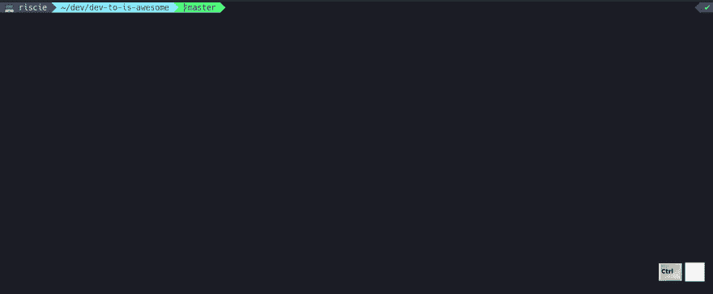
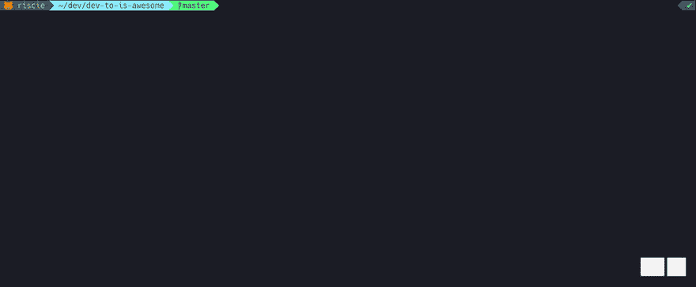

# 在 zsh 中使用键盘快捷键

> 原文：<https://dev.to/ecologic/using-keyboard-shortcuts-with-zsh-16b>

你是 zsh 用户吗？你喜欢把你的壳拧到最大限度，以便在这里或那里赢得一点时间吗？你可能来对地方了。

这篇文章将向您展示如何在 zsh 中使用键盘快捷键来运行常用命令。

[](https://res.cloudinary.com/practicaldev/image/fetch/s--HDPlmZLd--/c_limit%2Cf_auto%2Cfl_progressive%2Cq_66%2Cw_880/https://thepracticaldev.s3.amazonaws.com/i/i1hpfsuya5k7i907bdxa.gif)

## 使用键盘快捷键 git pull

在这个例子中，我们想要运行快捷键为`ctrl-g+p`(意为`ctrl-g` -释放`g` -按下`p`)的`git pull`，如上面的 gif 所示。

我们在 zsh 资源文件中定义快捷方式。它通常被称为`.zshrc`，我们在我们的主目录中找到它。我使用 visual studio 代码编辑该文件:

`code ~/.zshrc`

将以下内容添加到文件中:

```
# git pull (ctrl-g+p)
function gitpull() { echo "git pull"; git pull; zle reset-prompt; zle redisplay}
zle -N gitpull
bindkey '^gp' gitpull 
```

**让我们逐行分解**

1.  很好的评论
2.  我们定义了函数 gitpull，稍后我们将使用它进行键绑定。该功能可以:
    1.  写出我们发送的命令。(比起让一个空屏幕做点什么，我更喜欢这个)
    2.  运行`git pull`
    3.  重置我们的提示。(如果我们的提示中有 git 信息，这是很有用的，因为如果我们不使用`reset-prompt`，它们就不会更新)
    4.  重新显示我们的提示
3.  我们定义一个指向该函数的小部件
4.  我们将组合键绑定到小部件

就是这样。如果对你有用，请告诉我。如果对这类东西感兴趣，我可以继续举例说明如何将参数传递给键盘快捷键。例如，我使用此选项通过执行以下操作来创建特征分支:

`typing the name of the feature branch --> ctrl-g+f`

[](https://res.cloudinary.com/practicaldev/image/fetch/s--fVK_KaL0--/c_limit%2Cf_auto%2Cfl_progressive%2Cq_66%2Cw_880/https://thepracticaldev.s3.amazonaws.com/i/hreonc5xmyqo3b15t5xd.gif)

## 奖金

更多的快捷方式定义示例也使用`alt`作为修饰符来帮助您开始:

```
'^g'   # ctrl-g
'^gp'  # ctrl-g and then p (as shown in the example)
'^[x'  # alt-x
'^[xc' # alt-x and then c 
```

## 让我们连接！

我希望与其他技术爱好者一起拓展我的网络。让我们在这里或在 twitter 上联系吧！[👋@langhard](https://twitter.com/langhard)

## 资源

[Z-Shell 用户指南](http://zsh.sourceforge.net/Guide/zshguide04.html)

## 更新

第 2 部分- [向 zsh 键盘传递参数-快捷键](https://dev.to/ecologic/passing-a-parameter-to-a-zsh-keyboard-shortcut-1877) -现在已经上线。