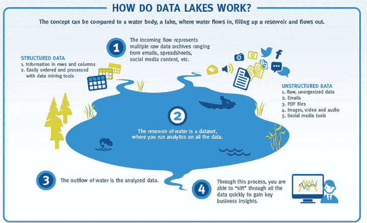
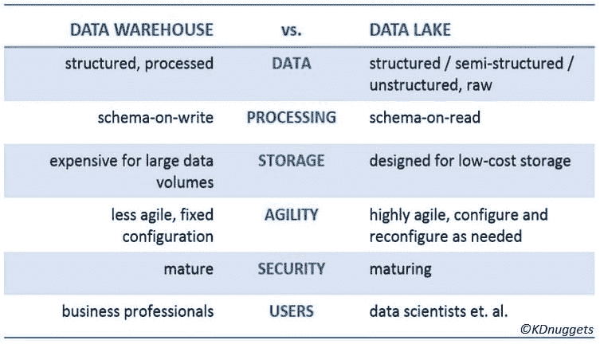
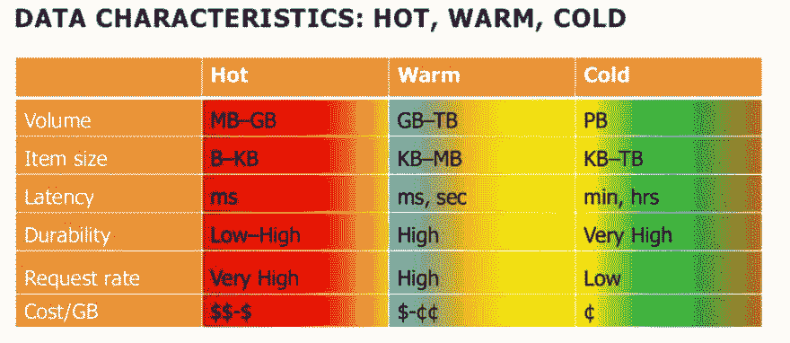

# 数据湖很难

> 原文：<https://dev.to/rehanvdm/data-lakes-are-hard-228c>

# 数据湖很难

这篇文章最初发表在我的个人博客上。

在本帖中，我们将探讨实现的困难以及数据湖如何适应组织，这些主题可能是其他文章所关注的。

数据湖，都在名字里。不是水滴而是湖，数据湖通常包含数百万到数十亿不同的结构化和非结构化数据(图像、电子邮件、JSON 文档)。数据湖被视为事实的来源或“主数据集”,有许多好处。

其中一个好处是读取模式，这可以归结为只存储数据，然后在进行分析时构建模式并从中读取。你不需要知道模式，在写作时也不会被模式所束缚。这为您以后提问提供了很大的灵活性，并从收集的大量数据中提取有意义的商业价值。AWS 在[这篇文章](https://aws.amazon.com/big-data/datalakes-and-analytics/what-is-a-data-lake/)中描述了大部分好处

> 警告:这篇文章偏向于在 AWS 上构建数据湖，并尽可能使用无服务器。

从头设计一个数据湖可能是一项艰巨的任务，理论上看起来很容易，只需将所有数据转储到不同关键字下的 S3 桶中，然后使用 Athena 对您的数据运行类似 SQL 的查询。Athena 将 Presto 用于类似 SQL 的查询，将 Appache Hive 用于模式。

等等，现在我们正在讨论模式，这是数据湖和数据仓库之间的界限变得模糊的地方。数据仓库更加结构化，因为它们是写模式，它们要求您了解数据、索引和查询模式之间的关系，以便优化使用。

因此，为了在数据上运行 SQL 查询，数据必须以某种模式/结构化模式存储，您不能只转储一个点击流记录，例如一行有 10 列，下一行有 3 列。对于湖的那部分，数据需要是半一致的，否则你会以一个**数据沼泽**结束。

你不会希望自己处于拥有数百万条记录的境地。然后，当运行一个选择了 10 列的 SQL 查询时，只有一行 3 列阻止了查询的运行，祝您好运找到那根针。

这也是数据湖和数据仓库的区别所在。在数据湖中，您可以只存储与模式无关的原始数据，然后通过处理它并将其加载(ETL)到数据仓库中以供进一步分析来规范化模式。

然后是**租用**，在湖中分组数据可能有几个原因。其中之一是数据保留，尝试在法庭上解释你不能删除一个租户/客户的数据，因为你被发现违反了 GDPR。

还要考虑到**您正在为您存储的内容**付费，如果客户离开，保留他们的数据一段时间可能是有益的，但之后数据就失去了价值。对于某些公司来说，数据几乎成指数级地失去了价值。

考虑流数据，例如当你买东西时，你的银行记录并分析交易。这些数据在最初的几秒钟(也许是几分钟)内对欺诈检测等工作非常有用。如果第二天你收到一条短信，警告你可能存在欺诈，那么它就失去了价值，你的银行账户可能已经被清空了。

因此，关键是，并非所有数据都生来同等重要，有些数据可能保留其价值，而其他数据可能不保留。在数据湖中，您通常会存储几乎所有内容以供将来分析，但这会变得非常昂贵，并且您可能会存储没有价值的数据。因此，拥有删除部分数据湖的方法是非常重要的，并且在设计过程中必须牢记在心。

您的数据湖还需要能够**区分热数据和冷数据**。这样，您就能够识别已经失去重要性并且需要存档以优化存储成本的数据。没有理由将多年的用户点击保存在热存储中。一旦符合您的数据保留策略，这些数据就可以在最终被删除之前再存档和存储 X 段时间。

办理**个人身份信息**(姓名、手机号码、地址等。)就更难了。存储的数据需要完全符合大量的法规和合规性。如果任何人都可以查看静态数据，那么加密数据是不够的(S3 桶泄漏)。将用于长期存储的个人身份信息需要匿名化，或者至少是完全匿名化(部分匿名化)才能成为投诉人。因此，在存储数据之前，您需要适当的流程来做到这一点。

## 结论(TL；博士)

许多帖子谈到了数据湖及其好处，但没有多少谈到实现的困难以及它如何适应组织。以下是一些使设计数据湖变得困难的关键因素:

*   租赁。许多组织是多租户的，也就是说，一个应用程序、一个数据库、一个数据湖和许多客户端。大规模隔离单个租户/客户端数据以进行更新或删除变得非常困难。
*   必须编写半一致/结构化的数据，并且必须记住检索模式，否则您将陷入数据沼泽。
*   归档还会遇到租用问题，即存储数据时要在热存储和冷存储之间移动数据。
*   隐私、法规和合规。根据您存储的数据，湖的一部分可能需要匿名化。