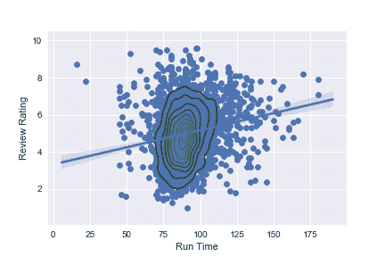
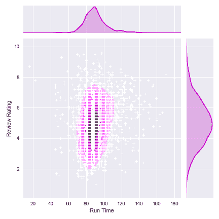
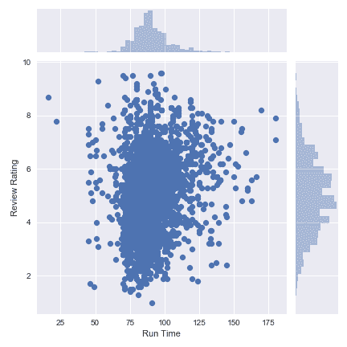
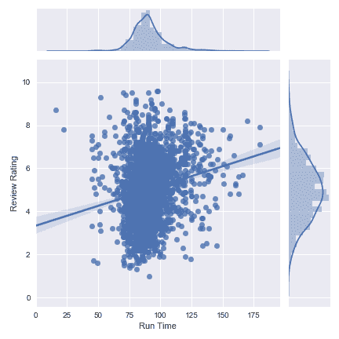
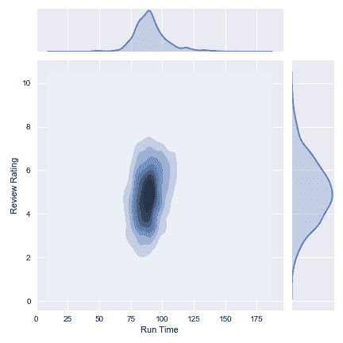

# 保持优雅:看看类抽象

> 原文：<https://dev.to/zmbailey/stay-classy-a-look-at-class-abstraction-2lgi>

类是面向对象编程的重要组成部分，如果你理解如何正确使用它们，它们会非常强大。几乎任何变量都可以被认为是一个对象。在 Java 这样的语言中很容易看到这一点，在 Java 中一切都是用类来编写的，但是今天我们将讨论 Python 中的对象。在某种程度上，Python 似乎轻而易举地跳过了让抽象在 Java 中如此重要的许多复杂的类型，但这并不意味着它没有用。抽象和继承在很多方面都有帮助，通常用于为多个类提供相同的方法或行为，或者在几个相似的类中使用相同的基本结构。但是在我们深入抽象之前，让我们先花点时间了解一下一般的类。

类就像一个对象的模板，它定义了对象的行为和属性，并且可能包含可以单独使用的类方法或属性。一旦定义了它，就可以用它来创建实例，这些实例可以被单独转换以保存特定的数据。类方法也称为静态方法，可以通过引用该类来调用，但不适用于该类的任何特定实例。类方法在像 Java 这样的语言中出现得更频繁，但在 Python 中却不时出现。

### 抽象层次:基本、抽象、接口

类抽象有三个基本层次:类、抽象类和接口。类或具体类是最常见的，也是你最常遇到的类型。具体类是具有完全实现的方法的类，并且可以被实例化。抽象类可以有抽象方法和普通的实现方法，但不能实例化。抽象类的存在是为了从其他类继承，而不是为了自己被实例化。像抽象类一样，接口不能被实例化，但默认情况下也具有所有抽象方法，并且通常不打算具有实现的方法。尽管在 python 中接口是可能的，但它们是如此罕见，以至于不值得在这里讨论它们。相反，我们将关注抽象类。抽象类在 python 中还是有点少见，甚至需要一个外部包来实现。

## 举例:

下面是一个抽象类层次结构的例子:

```
from abc import ABC, abstractmethod

class Animal(ABC):

    @abstractmethod
    def make_noise(self):
        pass

    @abstractmethod
    def move(self):
        pass 
```

这里我们有一个抽象类。`Animal`是一个基本定义，有几种方法可以适用于任何动物。请注意这些方法是如何使用`@abstractmethod`关键字的，并且只使用`pass`作为主体。这些方法是抽象的，因为尽管任何动物都可以使用它们，但每种动物执行它们的方式可能不同。`Animal`可以是抽象的，因为它包含抽象方法，并且从不打算自己实例化。你可以想象没有一种动物仅仅被称为`Animal`。

`Bird`和`Feline`都是动物的类型，但还是有点笼统的说法。在这一点上，我们可以开始定义这些动物群体共有的一些行为，比如说鸟类飞行(除了企鹅、鸸鹋和鸵鸟的边缘情况)，猫科动物倾向于跟踪。

```
class Bird(Animal):
    def move(self):
        print("*Flying!*")

class Feline(Animal):
    def move(self):
        print("*Silently stalk*") 
```

但是我们仍然可以说得更具体一些，比如说用“T0”代替“T1”，或者用“T2”代替“T3”。在这一点上，我们可以定义另一种方法，因为特定的动物可能有不同的行为，就像`Lion`咆哮而`Calico`可能喵喵叫。

```
class BarredOwl(Bird):
    def make_noise(self):
        print("Hoo!")

class Mallard(Bird):
    def make_noise(self):
        print("Quack!")

class Lion(Feline):
    def make_noise(self):
        print("Roar!")

class Calico(Feline):
    def make_noise(self):
        print("Meow!") 
```

现在我们可以创建一个特定的动物，它将继承我们告诉它的所有行为:

```
Lucky = Calico()

Lucky.make_noise()
Lucky.move()

Output:
Meow!
*Silently stalk* 
```

我们可以用抽象类做的另一件事是创建工厂方法。工厂方法是用于创建具有不同特性级别的其他对象的方法。首先，我们从通用的抽象级别类开始，比如说一个 Show:

```
class Show(ABC):

    def __init__(self):
        self.cast = []
        self.add_performers()

    def add_performers(self):
        for _ in range(4):
            self.cast.append(self.get_performer())

    @abstractmethod
    def get_performer(self):
        pass 
```

通过这种设置，我们可以定义两种类型的表演，每种表演使用不同类型的表演者:

```
class Play(Show):

    def get_performer(self):
        return Actor()

class Concert(Show):

    def get_performer(self):
        return Musician() 
```

我们有两种特定类型的表演，戏剧和音乐会。每一个都可以用`get_performer()`创建表演者，但是根据表演的类型，它会创建不同类型的表演者。为了清楚起见，下面是`Performer`类及其子类:

```
class Performer(ABC):

    def perform(self):
           pass

class Actor(Performer):

    def perform(self):
        print("The play's the thing!")

class Musician(Performer):

    def perform(self):
        print("Music!") 
```

`Actor`和`Musician`都是`Performer`的子类型，所以在这种情况下，工厂方法是`get_performer()`，它总是可以返回一个执行者，它有一组一致的方法和属性，无论它具体是一个`Actor`还是一个`Musician`。

一旦你理解了抽象的类和方法，它们会很有趣，并且会让你受益匪浅。抽象在许多面向对象语言中非常常见，但是 Python 的非正式类型化方法消除了其他语言中需要抽象的一些复杂性。

### 实际实施

现在我们已经看到了抽象是如何工作的，并且我们已经了解了工厂方法，让我们来看一个更实际的例子。就拿制作剧情来说吧。为了制作一个绘图，我们可能会使用许多调整或不同的绘图样式，但假设我们有一些样式，我们希望能够在许多场合下复制，但每次设置都很复杂。我们可以从一个泛型类开始，这里写为`CustomPlot`。

```
class CustomPlot():

    def __init__(self,X,y):
        self.X = X
        self.y = y
        self.run_plots()

    def run_plots(self):
        pass

    def scatter(self):
        pass

    def reg(self):
        pass

    def kde(self):
        pass 
```

请注意，`__init__`函数设置了将用于绘图的 x 和 y，然后运行该函数来创建绘图，但是该函数的行为还不存在。接下来，我们将创建这个类的特定版本来实现这些，以创建我们决定的任何类型的情节。

```
class NormalPlots(CustomPlot):

    def run_plots(self):
        self.scatter()
        self.reg()
        self.kde()

    def scatter(self):
        sns.scatterplot(x=self.X,y=self.y)

    def reg(self):
        sns.regplot(x=self.X,y=self.y)

    def kde(self):
        sns.kdeplot(self.X,self.y)

class SpecialPlot(CustomPlot):

    def run_plots(self):
        g = sns.jointplot(x=self.X,y=self.y, kind="kde", color="m")
        g.plot_joint(plt.scatter, c="w", s=30, linewidth=1, marker="+")
        g.ax_joint.collections[0].set_alpha(0)   

class JointPlots(CustomPlot):

    def run_plots(self):
        self.scatter()
        self.reg()
        self.kde()

    def scatter(self):
        sns.jointplot(x=self.X, y=self.y, kind="scatter")

    def reg(self):
        sns.jointplot(x=self.X,y=self.y,kind='reg')

    def kde(self):
        sns.jointplot(x=self.X,y=self.y,kind="kde") 
```

这给了我们三种不同类型的绘图对象，每一种打印不同样式的绘图。`NormalPlots`打印散点图、回归图和 KDE 图，都在同一坐标轴上:

[](https://res.cloudinary.com/practicaldev/image/fetch/s--2fCbWPDb--/c_limit%2Cf_auto%2Cfl_progressive%2Cq_auto%2Cw_880/https://thepracticaldev.s3.amazonaws.com/i/xr5v1dfl5dp74u02kz7c.png)

`SpecialPlot`展示了一个不同的创建图形的逻辑，以及这个类在没有定义所有函数的情况下如何运行。它创建了一个带有白色覆盖散点图的 KDE，以有趣的效果显示分布情况:

[](https://res.cloudinary.com/practicaldev/image/fetch/s--Xn6aM0uI--/c_limit%2Cf_auto%2Cfl_progressive%2Cq_auto%2Cw_880/https://thepracticaldev.s3.amazonaws.com/i/syco3isxdfikq4vnw05b.png)

JointPlots 使用 Seaborn 的 jointplots 绘制 3 个单独的地块:

[](https://res.cloudinary.com/practicaldev/image/fetch/s--IwydtAaA--/c_limit%2Cf_auto%2Cfl_progressive%2Cq_auto%2Cw_880/https://thepracticaldev.s3.amazonaws.com/i/xg1s2r6q7jkcqhdn08ny.png)
[](https://res.cloudinary.com/practicaldev/image/fetch/s--h4RDZ7SY--/c_limit%2Cf_auto%2Cfl_progressive%2Cq_auto%2Cw_880/https://thepracticaldev.s3.amazonaws.com/i/zcfyfyf0l9rcnyzujyin.png)
[](https://res.cloudinary.com/practicaldev/image/fetch/s--NmaOLgJj--/c_limit%2Cf_auto%2Cfl_progressive%2Cq_auto%2Cw_880/https://thepracticaldev.s3.amazonaws.com/i/pzavk3n99hmhs17achng.png)

为了便于演示，这是简单的，但是您可以更进一步，添加颜色、图形大小或其他属性的参数，这些参数将应用于适当的位置，而不必直接接触绘图方法。

总的来说，python 在类和类型方面非常灵活，所以可能有办法绕过抽象想要解决的许多障碍。即便如此，理解这些结构是如何工作的仍然很重要，这将使你成为一个更加多才多艺的程序员。

包含本教程中使用的所有代码的文件可以在[这里](https://github.com/ZMBailey/abstract_oo_example)找到。