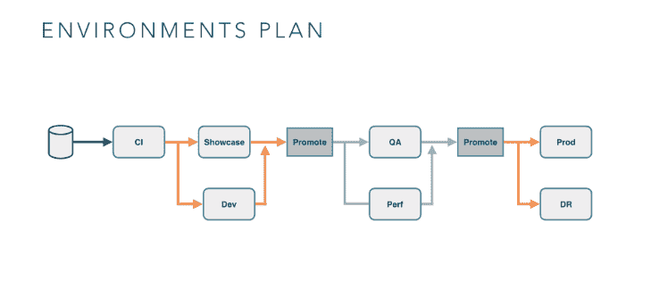
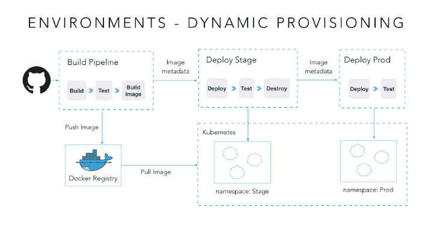

# 持续交付微服务的环境策略

> 原文：<https://dev.to/gocd/environment-strategy-for-continuous-delivery-of-microservices-5bki>

这是微服务系列- [CD 的第四篇帖子。在](https://www.gocd.org/tags/cd-for-microservices.html)[的上一篇文章](https://www.gocd.org/2018/05/08/continuous-delivery-microservices-test-strategy/)中，我们深入讨论了 CI 实践，尤其是基于主干的部署和特性切换。在本帖中，我们将讨论环境战略。

## 环境计划

在一些组织中，人们没有意识到环境计划的重要性，直到他们有太多的环境，并且维护它们变得势不可挡。

环境规划传达了生产过程中涉及的各种环境及其预期用途。它还传达了您的工件是如何被提升的，以及在这些环境中的切换状态。

您可以首先考虑需要预先创建什么样的环境，并讨论这些环境的预期用例。您组织中的不同群体将有不同的竞争需求。你的环境计划应该适应不同方面的需要。

## 神器提升

工件是软件开发过程中产生的许多有形副产品中的一种。其中一些工件是文本文件，比如测试和覆盖报告。其中一些工件是二进制工件，如 npm 包、jar 文件和 AMI 机器映像，它们只构建一次，然后沿着 CD 管道传播，以便部署到下游环境中。

CD 管道会产生很多伪像。在你意识到之前，你已经进入了万亿字节，或者几十万亿字节的生成的工件。考虑一个工件提升策略是很重要的，它处理这些工件存储在哪里，保留多少，以及你如何进行清理。

上图向您展示了一个环境计划，它包含了一个工件提升策略。从平面图中你可以看到存在于 CD 管道中的环境，不同颜色的箭头描述了不同的工件提升策略。在这个管道的早期，我们生成工件，这些工件被送到具有更积极的清理策略的工件仓库，所以我们实际上并没有保留太多这样的环境。随着您在这个管道中走得更远，工件被验证并且更加健壮，并且您可能想要将它们保存更长一点时间，因此您可以将它们保存在具有不同保留策略的存储中。

## 动态环境

维护环境既昂贵又麻烦。让这个过程更简单、成本更低的一个方法是动态创建环境。例如，当运行功能测试时，您可以按需提供功能测试环境，然后在测试完成后立即清理它。

为此，您需要使用 [IaaC](http://infrastructure-as-code.com) 技术来编写环境供应的所有方面。这样做的好处如下:

**与生产对等**如果您基于自动化动态创建所有环境，您将使用完全相同的方式来创建测试和试运行环境。基础架构的规模和性质可能不同，但环境的足迹是相同的。

**防止漂移**如果你有手动流程和手动安装，你无法真正保证两个环境是一样的。但是使用脚本来创建短暂的动态环境可以防止漂移。

**高效利用硬件和基础设施**仅在您需要时创建环境，并进行动态清理，从而优化利用率并节省基础设施成本。

诸如容器调度器之类的技术如今在部署和运行应用程序方面非常流行。下图是一个基于 Dock 的构建工作流的例子。

这个管道的 CI 方面，即左边的构建管道，生成 Docker 映像。来自这个管道的工件是 Docker 映像，存储在 Docker 注册表中。在下游，部署环境直接部署到 Kubernetes。您可以利用 Kubernetes 的特性，比如标签的概念，动态地提供环境。

## 总结

这是我们微服务博客系列的 [CD 的第 4 部分。我们已经讨论了环境策略，包括工件提升和利用现代基础设施实现动态环境。在下一篇帖子里，我们将讨论第四个考虑因素:配置策略。](https://www.gocd.org/tags/cd-for-microservices.html)