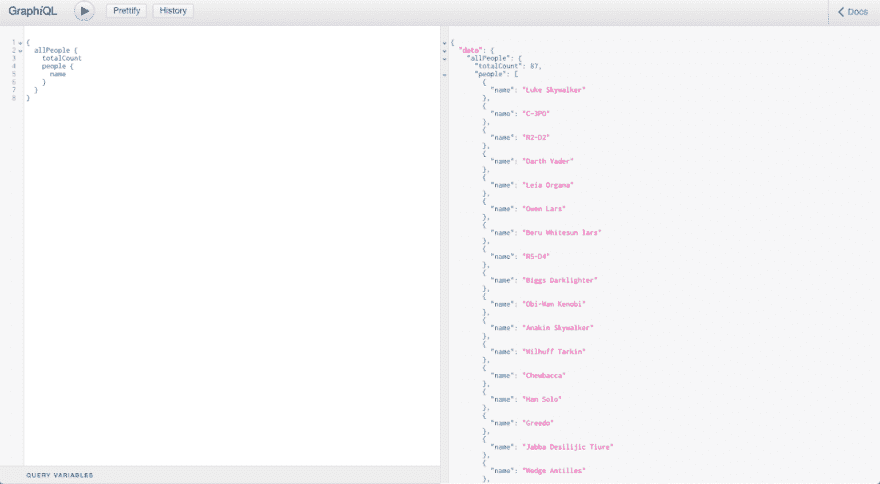
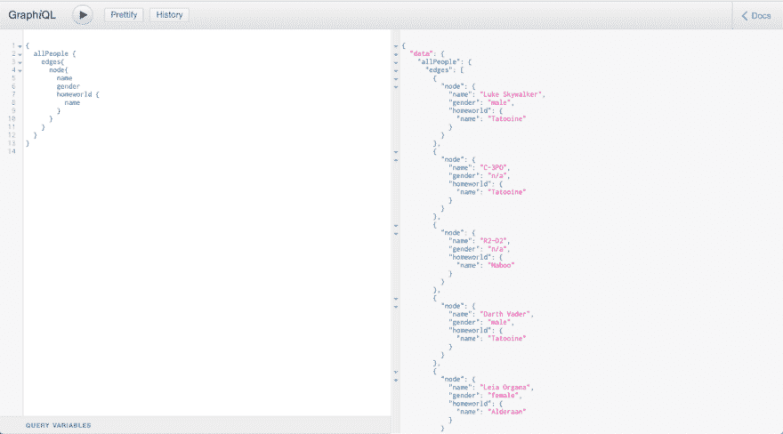
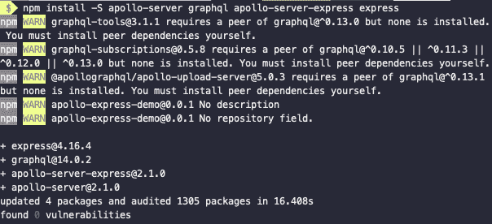
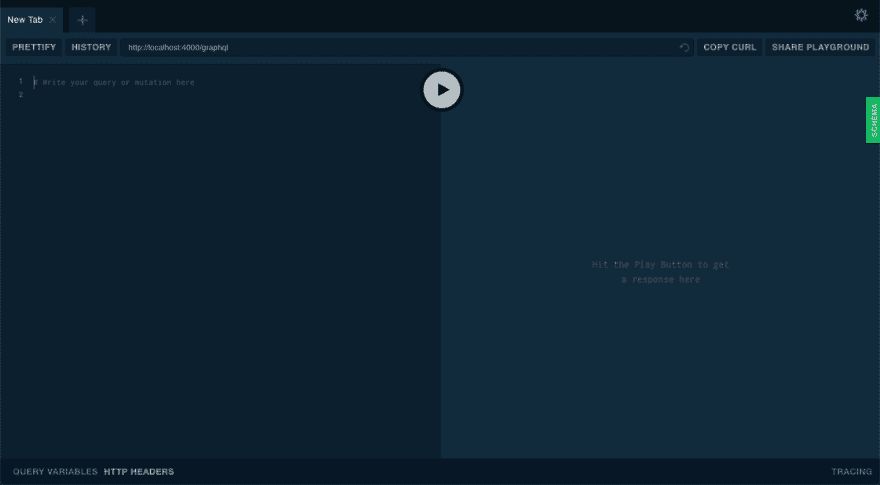
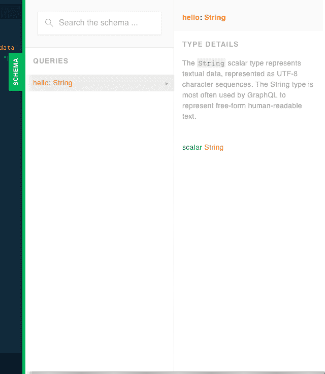

# 使用 NodeJS 创建 GraphQL 服务器

> 原文：<https://dev.to/amanhimself/creating-a-graphql-server-with-nodejs-17a3>

[](https://res.cloudinary.com/practicaldev/image/fetch/s--g0xsI323--/c_limit%2Cf_auto%2Cfl_progressive%2Cq_auto%2Cw_880/https://cdn-images-1.medium.com/max/2560/1%2AmbwU_n49CU8SEJyLPaTAUw.png)

当涉及到客户端和服务器应用程序之间的网络请求时，REST(代表*代表性状态转移*)是连接两者的最流行的选择之一。在[REST API](https://medium.com/crowdbotics/building-a-rest-api-with-koajs-417c276929e2)的世界里，一切都围绕着将资源作为可访问 URL 的想法。然后我们使用 CRUD 操作(创建、读取、更新、删除)，这些操作基本上是 HTTP 方法，比如 GET、POST、PUT & DELETE，来与数据进行交互。

下面是一个典型的 REST 请求的例子:

```
//  example  of  a  request  https://swapi.co/api/people/  //  response  of  the  above  request  in  JSON  {  "results":  [  {  "name":  "Luke Skywalker",  "gender":  "male",  "homeworld":  "https://swapi.co/api/planets/1/",  "films":  [  "https://swapi.co/api/films/2/",  "https://swapi.co/api/films/6/",  "https://swapi.co/api/films/3/",  "https://swapi.co/api/films/1/",  "https://swapi.co/api/films/7/"  ],  }  {  "name":  "C-3PO",  "gender":  "n/a",  "homeworld":  "https://swapi.co/api/planets/1/",  "films":  [  "https://swapi.co/api/films/2/",  "https://swapi.co/api/films/5/",  "https://swapi.co/api/films/4/",  "https://swapi.co/api/films/6/",  "https://swapi.co/api/films/3/",  "https://swapi.co/api/films/1/"  ],  }  ]  } 
```

Enter fullscreen mode Exit fullscreen mode

REST API 的响应格式不一定是 JSON，但这是目前大多数 API 的首选方法。除了 REST，另一种处理网络请求的方法出现了:GraphQL。2015 年开源，GraphQL 正在改变开发者在服务器端编写 API，在客户端处理的方式。 GraphQL 由脸书开发并积极维护。

## 休息的缺点

GraphQL 是一种开发 API 的查询语言。与 REST 不同，REST 是一种架构或“做事的方式”，graphQL 的开发理念是客户机在一个请求中只向服务器请求所需的一组项目。

在 REST 架构中，或者类似于上面的例子，当获取 Luke Skywalker 出现在《星球大战》电影中的电影时，我们得到一个数组`films`或者是`homeworld`的名字，它进一步包含不同的 API URLs，这些 URL 引导我们到不同的 JSON 数据集的细节。这当然是一个过度抓取的例子。客户端为了获得卢克·天行者出现的电影的细节，以及他的母星的名字，必须向服务器发送多个请求。

使用 GraphQL，这可以被分解成一个网络请求。跳到 API url: `https://graphql.github.io/swapi-graphql/`并查看运行下面的查询。

*注意*:在下面的例子中，你可以忽略 GraphQL API 是如何在幕后工作的。在本教程的后面，我将一步一步地指导您构建自己的(可能是第一个)GraphQL API。

```
{  allPeople  {  edges  {  node  {  name  gender  homeworld  {  name  }  filmConnection  {  edges  {  node  {  title  }  }  }  }  }  }  } 
```

Enter fullscreen mode Exit fullscreen mode

我们将获取我们需要的数据，比如角色的名字，他们的`gender`，`homeworld`，以及他们出现的`films`的标题。运行上述查询后，您将得到以下结果:

```
{  "data":  {  "allPeople":  {  "edges":  [  {  "node":  {  "name":  "Luke Skywalker",  "gender":  "male",  "homeworld":  {  "name":  "Tatooine"  },  "filmConnection":  {  "edges":  [  {  "node":  {  "title":  "A New Hope"  }  },  {  "node":  {  "title":  "The Empire Strikes Back"  }  },  {  "node":  {  "title":  "Return of the Jedi"  }  },  {  "node":  {  "title":  "Revenge of the Sith"  }  },  {  "node":  {  "title":  "The Force Awakens"  }  }  ]  }  }  },  {  "node":  {  "name":  "C-3PO",  "gender":  "n/a",  "homeworld":  {  "name":  "Tatooine"  },  "filmConnection":  {  "edges":  [  {  "node":  {  "title":  "A New Hope"  }  },  {  "node":  {  "title":  "The Empire Strikes Back"  }  },  {  "node":  {  "title":  "Return of the Jedi"  }  },  {  "node":  {  "title":  "The Phantom Menace"  }  },  {  "node":  {  "title":  "Attack of the Clones"  }  },  {  "node":  {  "title":  "Revenge of the Sith"  }  }  ]  }  }  }  ]  }  }  } 
```

Enter fullscreen mode Exit fullscreen mode

如果应用程序的客户端正在触发上述 GraphQL URL，它将只在网络上发送一个请求来获得所需的结果，从而消除了过量获取或发送多个请求的任何可能性。

## 先决条件

按照这个教程，你所需要的是安装在你的本地机器上的`Nodejs`和`npm`。

*   [Nodejs](http://nodejs.org/)T0】
*   npm `^6.x.x`

## 简单地说 GraphQL

简而言之， **GraphQL** 是一种解释如何请求*数据*的语法，通常用于从服务器到客户端检索数据(又名*查询*)或对其进行更改(又名*变异*)。

GraphQL 几乎没有定义特征:

*   它让客户端确切地指定它需要什么数据。这也称为声明性数据提取。
*   它对网络层并不固执己见
*   将来自多个来源的几组数据组合起来更容易
*   当以模式和查询的形式声明数据结构时，它使用强类型系统。这有助于在发送网络请求之前验证查询。

## graph QL API 的构建模块

GraphQL API 有四个构件:

*   (计划或理论的)纲要
*   询问
*   突变
*   下决心者

**Schema** 在服务器端以对象的形式定义。每个对象对应于不同的数据类型，这样就可以对它们进行查询。比如:

```
type  User  {  id:  ID!  name:  String  age:  Int  } 
```

Enter fullscreen mode Exit fullscreen mode

上面的模式定义了一个用户对象的形状，带有一个由符号`!`表示的必填字段`id`。还包括其他字段，如类型为*字符串*的`name`和类型为*整数*的年龄。这还会在查询数据时验证模式。

**查询**是用来向 GraphQL API 发出请求的。例如，在上面的例子中，当我们获取与《星球大战》角色相关的数据时。让我们简化一下。在 GraphQL 中进行查询，就是询问对象上的特定字段。例如，使用与上面相同的 API，我们获取《星球大战》中所有角色的名字。下面你可以看到不同之处。图像的左侧是查询，右侧是图像。

[](https://res.cloudinary.com/practicaldev/image/fetch/s--GrzZsfZ---/c_limit%2Cf_auto%2Cfl_progressive%2Cq_auto%2Cw_880/https://cdn-images-1.medium.com/max/1200/1%2AL-Z_EF1tNkq4jUhsopHasw.png)

GraphQL 查询的好处是它们可以嵌套到您想要的深度。这在 REST API 中很难做到。操作变得更加复杂。

下面是嵌套查询的另一个例子，更复杂。

[](https://res.cloudinary.com/practicaldev/image/fetch/s--qTXrHtwE--/c_limit%2Cf_auto%2Cfl_progressive%2Cq_auto%2Cw_880/https://cdn-images-1.medium.com/max/1200/1%2Aug3h4hZmAeuNHyy93Ygy2Q.png)

**突变**:在 REST 架构中，要修改数据，我们要么使用`POST`添加数据，要么使用`PUT`用数据更新现有字段。在 GraphQL 中，整体概念是类似的。您将发送一个查询来导致服务器端的写操作。然而，这种形式的查询被称为
变异。

**解析器**是模式和数据之间的链接。它们提供的功能可用于通过不同的操作与数据库进行交互。

在本教程中，您将学习如何使用我们刚刚学习的相同构建块来设置带有 [Nodejs](https://www.crowdbotics.com/build/node-js?utm_source=medium&utm_campaign=nodeh&utm_medium=node&utm_content=koa-rest-api) 的 GraphQL 服务器。

## 你好世界！使用 GraphQL

现在让我们编写我们的第一个 GraphQL 服务器。对于本教程，我们将使用[阿波罗服务器。](https://www.apollographql.com/docs/apollo-server/)我们总共需要安装三个包，以便 Apollo 服务器作为中间件与我们现有的 Express 应用程序一起工作。Apollo Server 的好处是它可以与 Node.js 的几个流行框架一起使用:Express、 [Koa](https://medium.com/crowdbotics/building-a-rest-api-with-koajs-417c276929e2) 和[哈比神](https://medium.com/crowdbotics/setting-up-nodejs-backend-for-a-react-app-fe2219f26ea4)。Apollo 本身是与库无关的，因此在客户端和服务器应用程序中可以将它与许多第三方库连接起来。

打开您的终端并安装以下依赖项:

```
# First create a new empty directory
mkdir apollo-express-demo

# Then initialize it
npm init -y

# Install required dependencies
npm install --save graphql apollo-server-express express 
```

Enter fullscreen mode Exit fullscreen mode

让我们简单了解一下这些依赖项的作用。

*   `graphql`是一个支持库，也是我们需要的模块
*   `apollo-server-express`被添加到现有的应用程序中，并且是相应的 HTTP 服务器支持包
*   Nodejs 的 web 框架

您可以看看下面的图片，我安装的所有依赖项都没有任何错误。

[](https://res.cloudinary.com/practicaldev/image/fetch/s--wN2dYNoo--/c_limit%2Cf_auto%2Cfl_progressive%2Cq_auto%2Cw_880/https://cdn-images-1.medium.com/max/800/1%2AgCozaTuzY6DHaPG4Ya43zA.png)

用下面的代码
在项目的根目录下创建一个名为`index.js`的新文件。

```
const express = require('express');
const { ApolloServer, gql } = require('apollo-server-express');

const typeDefs = gql`
    type Query {
        hello: String
    }
`;

const resolvers = {
    Query: {
        hello: () => 'Hello world!'
    }
};

const server = new ApolloServer({ typeDefs, resolvers });

const app = express();
server.applyMiddleware({ app });

app.listen({ port: 4000 }, () =>
    console.log(`🚀 Server ready at http://localhost:4000${server.graphqlPath}`) 
```

Enter fullscreen mode Exit fullscreen mode

这是我们的初始服务器文件，我们从简单地要求`express`模块开始。`gql`是一个模板文字标签，用于将 GraphQL 模式写成类型。该模式由类型定义组成，带有用于读取数据的强制*查询*类型。它还可以包含表示其他数据字段的字段和嵌套字段。在上面的例子中，我们定义了`typeDefs`来编写一个 graphQL 模式。

然后`resolvers`进入画面。解析器用于从模式中返回字段数据。我们在示例中定义了一个解析器，它映射函数`hello()`以在我们的模式上实现。接下来，我们创建一个使用`ApolloServer`类实例化和启动服务器的`server`。既然我们使用 Express，我们需要集成`ApolloServer`类。我们通过方法`applyMiddleware()`将它作为`app`传递，以添加 Apollo 服务器的中间件。`app`这里代表现有的应用程序，是 Express 的一个实例。

最后，我们通过使用 Express 模块本身提供的`app.listen()`来引导服务器。要运行服务器，打开您的终端并运行命令`node index.js`。现在，从浏览器窗口，访问网址:`http://localhost:4000/graphql`来查看它的行动。

Apollo Server 为您设置了 GraphQL Playground，这样您就可以快速运行查询和探索模式，如下所示。

[](https://res.cloudinary.com/practicaldev/image/fetch/s--HPNIvtoO--/c_limit%2Cf_auto%2Cfl_progressive%2Cq_auto%2Cw_880/https://cdn-images-1.medium.com/max/1200/1%2Aba4JULFAk5VbSFRsNxof8g.png)

要运行查询，请在左侧的可编辑空间键入以下查询，然后按中间的▽(播放)按钮。

[](https://res.cloudinary.com/practicaldev/image/fetch/s--Z5mQPO3M--/c_limit%2Cf_auto%2Cfl_progressive%2Cq_auto%2Cw_880/https://cdn-images-1.medium.com/max/1200/1%2ASGaIF-GZ0E0QLg2K6sJ7CA.png)

右边的 schema 选项卡描述了我们的查询`hello`的数据类型。这直接来自我们在服务器中定义的`typeDefs`。

[](https://res.cloudinary.com/practicaldev/image/fetch/s--bj9RHUax--/c_limit%2Cf_auto%2Cfl_progressive%2Cq_auto%2Cw_880/https://cdn-images-1.medium.com/max/800/1%2A3v_Uh_k2gjC-XueD9PhWvQ.png)

瞧吧！您刚刚创建了您的第一个 GraphQL 服务器。现在让我们把现有的知识扩展到现实世界。

## 用 GraphQL 构建 API

到目前为止，我们已经把所有的模块和任何必要的术语放在了一起。在本节中，我们将使用阿波罗服务器创建一个小型的*星球大战 API* 用于我们自己的演示目的。现在您可能已经猜到 Apollo server 是一个库，它帮助您使用 Nodejs 将 GraphQL 模式连接到 HTTP 服务器。它并不仅限于特定的节点框架，例如，我们在前面的部分中使用了 ExpressJS。它支持 [Koa](https://medium.com/crowdbotics/building-a-rest-api-with-koajs-417c276929e2) ，Restify，[哈比神](https://medium.com/crowdbotics/setting-up-nodejs-backend-for-a-react-app-fe2219f26ea4)，也支持 Lambda。对于我们的 API，让我们继续使用 Express。

## 用巴别塔编译

如果您想从头开始，请继续安装第`Hello World! With GraphQL`节中的所有库。以下是我们在上一节中安装的依赖项:

```
"dependencies":  {  "apollo-server-express":  "^2.1.0",  "express":  "^4.16.4",  "graphql":  "^14.0.2"  } 
```

Enter fullscreen mode Exit fullscreen mode

我将使用相同的项目和相同的文件`index.js`来引导服务器。但是在我们开始构建我们的 API 之前，我想让你展示一下如何在我们的演示项目中使用 ES6 模块。使用像 React 和 Angular 这样的前端库，它们已经支持 ES6 特性，比如`import`和`export default`语句。Nodejs 版本`8.x.x`解决了这个问题。我们所需要的是一个 transpiler，它允许我们使用 ES6 特性编写 JavaScript。你完全可以跳过这一步，使用古老的`require()`语句。

然而什么是 *transpiler* ？

> *trans piler 也被称为“源代码到源代码编译器”,它从用一种编程语言编写的
> 源代码中读取代码，并用另一种
> 语言生成等价的代码。*

在 Nodejs 的例子中，我们不是在切换编程语言，而是我们需要使用我正在使用的 Node 的 LTS 版本不支持的新语言特性。我将通过以下配置过程设置 [Babel](https://babeljs.io/) **编译器**并在我们的项目中启用它。

首先，您必须安装一些依赖项，并注意`-D`标记，因为我们只需要这些依赖项用于我们的开发环境。

```
npm install -D babel-cli babel-preset-env babel-watch 
```

Enter fullscreen mode Exit fullscreen mode

一旦你安装了它们，添加一个`.babelrc`文件到项目的根目录，并添加下面的配置:

```
{  "presets":  [env]  } 
```

Enter fullscreen mode Exit fullscreen mode

配置过程的最后一步是在`package.json`中添加一个`dev` `script`。一旦有变化，这将自动运行 babel 编译器。这由`babel-watch`完成，它还负责重启[节点](https://www.crowdbotics.com/build/node-js?utm_source=medium&utm_campaign=nodeh&utm_medium=node&utm_content=koa-rest-api)
网络服务器。

```
"scripts":  {  "dev":  "babel-watch index.js"  } 
```

Enter fullscreen mode Exit fullscreen mode

要查看它的操作，请将以下代码添加到您的`index.js`中，并查看是否一切正常。

```
import express from "express"

const app = express()

app.get("/", (req, res) => res.send("Babel Working!"))

app.listen({ port: 4000 }, () => console.log(`🚀 Server ready at http://localhost:4000`)) 
```

Enter fullscreen mode Exit fullscreen mode

从终端写入`npm run dev`。如果没有错误，您将得到以下内容:

[](https://res.cloudinary.com/practicaldev/image/fetch/s--WdRXagkv--/c_limit%2Cf_auto%2Cfl_progressive%2Cq_auto%2Cw_880/https://cdn-images-1.medium.com/max/800/1%2ACix-Zl8mbZf90qpuHxEB8g.png)

您也可以在浏览器窗口中访问`http://localhost:4000/`来查看它的操作。

## 添加模式

我们需要一个模式来启动我们的 GraphQL API。让我们在目录`api`中创建一个名为`api/schema.js`的新文件。将以下内容添加到模式中。

我们的模式总共包含两个查询。第一个是`allPeople`，通过它可以获取和列出 API 中的所有字符。第二个查询`person`是使用他们的 id 检索一个人。这两种查询类型都依赖于一个名为`Person`的自定义类型，它包含四个属性。

```
import { gql } from "apollo-server-express"

const typeDefs = gql`
    type Person {
        id: Int
        name: String
        gender: String
        homeworld: String
    }
    type Query {
        allPeople: [Person]
        person(id: Int!): Person
    }
`

export default typeDefs 
```

Enter fullscreen mode Exit fullscreen mode

## 添加解析器

我们已经了解了分解器的重要性。它基于一个简单的机制，即它必须链接模式和数据。解析器是包含查询或变异背后的逻辑的函数。然后使用它们来检索数据，并根据相关请求返回数据。

如果您在使用 Express 之前已经构建了服务器，那么您可以将解析器视为一个控制器，其中每个控制器都是为特定的路由构建的。因为我们没有在服务器后面使用任何数据库，所以我们必须提供一些虚拟数据来模拟我们的 API。

创建一个名为`resolvers.js`的新文件，并添加以下代码。

```
const defaultData = [
    {
        id: 1,
        name: "Luke SkyWaler",
        gender: "male",
        homeworld: "Tattoine"
    },
    {
        id: 2,
        name: "C-3PO",
        gender: "bot",
        homeworld: "Tattoine"
    }
]

const resolvers = {
    Query: {
        allPeople: () => {
            return defaultData
        },
        person: (root, { id }) => {
            return defaultData.filter(character => {
                return (character.id = id)
            })[0]
        }
    }
}

export default resolvers 
```

Enter fullscreen mode Exit fullscreen mode

首先，我们定义了包含《星球大战》中两个角色细节的`defaultData`数组。按照我们的模式，数组中的这两个对象都有四个属性。接下来是我们的`resolvers`对象，它包含两个函数。这里的`allPeople()`可以在以后用来检索`defaultData`数组里面的所有数据。`person()`箭头函数使用参数`id`来检索具有所请求 ID 的 person 对象。我们已经在查询中定义了这一点。

您必须导出解析器和模式对象，以便在 Apollo 服务器中间件中使用它们。

## 实现服务器

既然我们已经定义了模式和解析器，我们将在文件`index.js`中实现服务器。从`apollo-server-express`导入 Apollo 服务器开始。我们还需要从`api/`文件夹中导入我们的模式和解析器对象。然后，使用 Apollo Server Express 库中的 GraphQL 中间件实例化 GraphQL API。

```
import express from "express"
import { ApolloServer } from "apollo-server-express"

import typeDefs from "./api/schema"
import resolvers from "./api/resolvers"

const app = express()

const PORT = 4000

const SERVER = new ApolloServer({
    typeDefs,
    resolvers
})

SERVER.applyMiddleware({ app })

app.listen(PORT, () => console.log(`🚀 GraphQL playground is running at http://localhost:4000`)) 
```

Enter fullscreen mode Exit fullscreen mode

最后，我们使用`app.listen()`引导我们的 Express 服务器。您现在可以运行服务器，从终端`npm run dev`执行命令。一旦节点服务器启动，它将提示一条成功消息，表明服务器已经启动。

现在为了测试我们的 GraphQL API，在一个
浏览器窗口中跳转到`http://localhost:4000/graphql` URL 并运行下面的查询。

```
{  allPeople  {  id  name  gender  homeworld  }  } 
```

Enter fullscreen mode Exit fullscreen mode

点击*播放*按钮，你会在右侧看到一个熟悉的结果，如下图所示。

[](https://res.cloudinary.com/practicaldev/image/fetch/s--pIOHrlIL--/c_limit%2Cf_auto%2Cfl_progressive%2Cq_auto%2Cw_880/https://cdn-images-1.medium.com/max/1200/1%2ABnyLxWTl_9yDpoIDLH-Xzg.png)

这都是因为我们的查询类型`allPeople`有定制的业务逻辑来使用解析器检索所有数据(在我们的例子中，模拟数据是作为数组在`resolvers.js`中提供的)。要获取单个 person 对象，请尝试运行另一个类似这样的查询。记住你必须提供身份证。

```
{  person(id:  1)  {  name  homeworld  }  } 
```

Enter fullscreen mode Exit fullscreen mode

运行上面的查询，结果是，您可以查询您提到的每个字段/属性的值。您的结果将类似于以下内容。

[](https://res.cloudinary.com/practicaldev/image/fetch/s--ifkrd0pW--/c_limit%2Cf_auto%2Cfl_progressive%2Cq_auto%2Cw_880/https://cdn-images-1.medium.com/max/1200/1%2ADOSW6mN894ZYg498rVxNKg.png)

太好了！我相信您一定已经掌握了如何创建和运行 GraphQL 查询。Apollo 服务器库是一个强大的库。它还使我们能够编辑操场。*假设我们要编辑游乐场的主题？*我们所要做的就是在创建`ApolloServer`实例时提供一个选项，在我们的例子中是`SERVER`。

```
const SERVER = new ApolloServer({
    typeDefs,
    resolvers,
    playground: {
        settings: {
            "editor.theme": "light"
        }
    }
}) 
```

Enter fullscreen mode Exit fullscreen mode

属性有很多特性，比如为游乐场定义一个默认的端点来改变主题。您甚至可以在生产模式下启用游乐场。更多可配置的选项可以在阿波罗服务器的官方文档[这里](https://www.apollographql.com/docs/apollo-server/v2/features/graphql-playground.html)T3】找到。

改变主题后，我们得到如下。

[](https://res.cloudinary.com/practicaldev/image/fetch/s--K289VTEq--/c_limit%2Cf_auto%2Cfl_progressive%2Cq_auto%2Cw_880/https://cdn-images-1.medium.com/max/1200/1%2AcZ7KO6x0FVXql9c04ZshIA.png)

### 结论

如果你一步一步地完成了本教程，*祝贺你！🎉*

您已经学习了如何用 Apollo 库配置 Express 服务器来设置自己的 GraphQL API。Apollo Server 是一个开源项目，是为全栈应用程序创建 GraphQL APIs 的最稳定的解决方案之一。它还支持 React、Vue、Angular、Meteor 和 Ember 的客户端开箱即用，以及使用 Swift 和 Java 的原生移动开发。更多信息可以在[这里](https://www.apollographql.com/docs/react/)找到。

Github 资源库中教程的完整代码👇

[https://github.com/amandeepmittal/apollo-express-demo](https://github.com/amandeepmittal/apollo-express-demo)

[*本帖原贴于此*](https://medium.com/crowdbotics/creating-a-graphql-server-with-nodejs-ef9814a7e0e6)

* * *

* * *

我经常写关于网络技术的文章，并且反应自然。你可以在 **[Twitter](https://www.twitter.com/amanhimself)** 上关注我，或者你可以 **[订阅我的每周简讯](https://tinyletter.com/amanhimself)** 直接在你的收件箱里接收我所有的教程📧