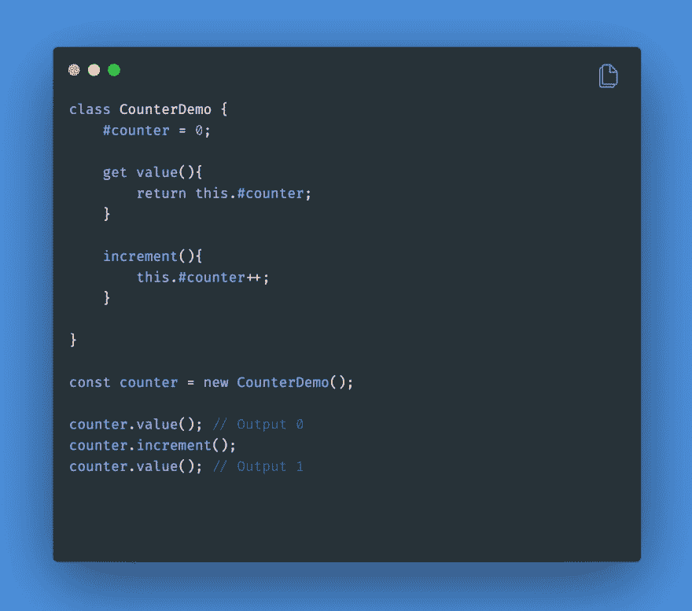
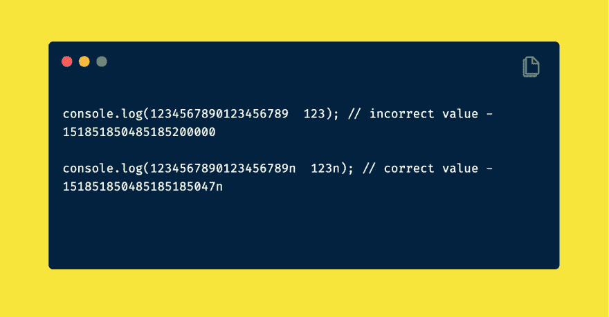
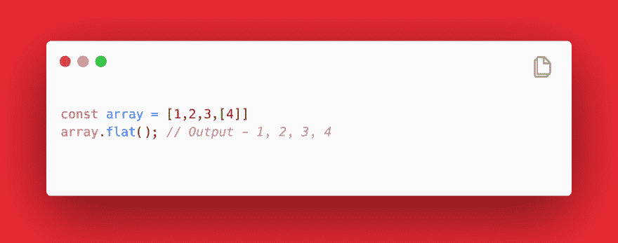
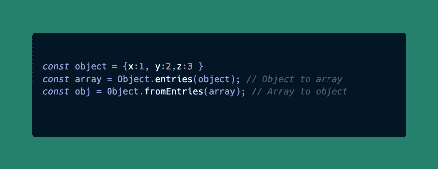

# Javascript 有什么新特性？

> 原文：<https://dev.to/pjijin/what-s-new-in-javascript-3lgj>

一些新功能仍然是建议性的，并不兼容所有的浏览器。所以如果你是玩代码的，尽量用谷歌 Chrome。其中一些可能

## 私有字段

 
来自 counterDemo 类，其#计数器值是 private。如果我们试图访问#counter，就会显示语法错误。

## 大整数乘法

我们可以用 1234567890123456789n * 123n 相乘，如果用 BigInt 就可以得到正确的值。

## 阵平

 
Array.flat 将嵌套的数组项转换为平面列表。默认情况下，它将转换 1 级深度。你可以用

const array = [ 1，[2，[3，4，[5，6]]]
array . flat(无穷大)；
输出将是 1 2 3 4 5 6。如果我们使用 Infinity，它将递归地转换成一个平面列表。

## [T1】object . from entries](#objectfromentries)

我们在很多情况下都使用 Object.entries。它将从一个对象返回一个数组。类似地，我们可以使用 Object.fromEntries 从数组中返回对象。