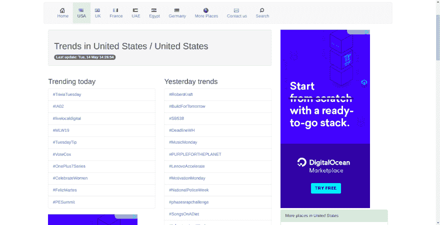
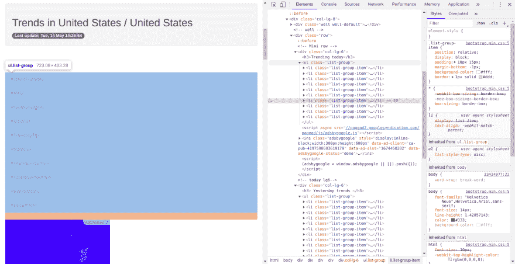

# 使用 Python 进行 Web 抓取

> 原文：<https://dev.to/aveeksaha/web-scraping-with-python-57dm>

这是一个关于如何使用 Urllib 和 BeautifulSoup 抓取网页的指南。

本教程的代码可以在 [`Github`](https://gist.github.com/Aveek-Saha/860464a7b52c5bab781f870dcb73ed57) 上找到

# 简介

网络抓取是从网站提取数据的有用工具，尤其是那些不提供 API 的网站。在这篇文章中，我将向您展示如何使用 web 抓取从网页中生成数据集。

在这个例子中，我们将使用一个名为 [trendogate](https://trendogate.com/place/23424977) 的网站，该网站根据地区显示给定日期的趋势 twitter 标签。我们的目标是检索目前在美国流行的标签。

为此，我们将主要使用两个库:

## 1。Urllib

> Urllib 是一个 Python 模块，可用于打开 URL。它定义了帮助 URL 操作的函数和类。使用 Python，你还可以访问和检索来自互联网的数据，如 XML、HTML、JSON 等。

Urllib 将帮助我们检索我们想要抓取的网页。

安装 Urllib-

```
pip install urllib 
```

Enter fullscreen mode Exit fullscreen mode

## 2。美味的汤

> Beautiful Soup 是一个用于解析 HTML 和 XML 文档的 Python 包。它为解析过的页面创建了一个解析树，可以用来从 HTML 中提取数据，这对 web 抓取很有用

一旦我们从 Urllib 获得了需要的页面，我们将使用 Beautiful Soup 创建一个解析树，并从页面中提取我们需要的信息。

装美汤

```
pip install BeautifulSoup4 
```

Enter fullscreen mode Exit fullscreen mode

# 解析网页

要抓取网页，你需要熟悉网页中 HTML 标签的结构。所以右击你想刮的页面，选择 Inspect。

[trendogate](https://trendogate.com/place/23424977) 网页看起来是这样的:

[](https://res.cloudinary.com/practicaldev/image/fetch/s--387uum-J--/c_limit%2Cf_auto%2Cfl_progressive%2Cq_auto%2Cw_880/https://home.aveek.io/blog/scraping/scraping_site.png)

我们对今日趋势部分感兴趣。如果我们检查它，我们可以看到 HTML 结构。

[](https://res.cloudinary.com/practicaldev/image/fetch/s--qsVU4-Oa--/c_limit%2Cf_auto%2Cfl_progressive%2Cq_auto%2Cw_880/https://home.aveek.io/blog/scraping/scrape_html_tag.png)

今天的热门标签在一个无序的列表中，类似于

```
<ul class="list-group">
    <li class="list-group-item"><a href="/trend/79334795"> #TriviaTuesday</a></li>
    <li class="list-group-item"><a href="/trend/79334794"> #IA02</a></li>
    <li class="list-group-item"><a href="/trend/79334793"> #livelocaldigital</a></li>
    <li class="list-group-item"><a href="/trend/79334792"> #MLW19</a></li>
    <li class="list-group-item"><a href="/trend/79334791"> #TuesdayTip</a></li>
    <li class="list-group-item"><a href="/trend/79334790"> #VoteCox</a></li>
    <li class="list-group-item"><a href="/trend/79334789"> #OnePlus7Series</a></li>
    <li class="list-group-item"><a href="/trend/79334788"> #CelebrateWomen</a></li>
    <li class="list-group-item"><a href="/trend/79334787"> #FelizMartes</a></li>
    <li class="list-group-item"><a href="/trend/79334786"> #PESummit</a></li>
</ul> 
```

Enter fullscreen mode Exit fullscreen mode

首先我们导入我们需要的库

```
from bs4 import BeautifulSoup
import urllib 
```

Enter fullscreen mode Exit fullscreen mode

然后我们用`urllib`来获取网页。阅读更多关于[urllib](https://docs.python.org/3/library/urllib.html)T3】

```
URL = "https://trendogate.com/place/23424977"
# Open the URL page = urllib.request.Request(URL)
result = urllib.request.urlopen(page)
# Store the HTML page in a variable resulttext = result.read() 
```

Enter fullscreen mode Exit fullscreen mode

现在我们将从刚刚检索的 HTML 页面创建一个`BeautifulSoup`对象。阅读更多关于[beautiful soup](https://www.crummy.com/software/BeautifulSoup/bs4/doc/)T3】

```
# Creates a nested data structure soup = BeautifulSoup(resulttext, 'html.parser')

# Since we are interested only in an element with class "list-group"
# We will search for all elements with that class in the soup 
soup = soup.find_all(class_= "list-group")

# Soup now contains an array of all elements with the class "list-group"
# Since the Trending today list is the first on the page, it's index is 0 
trending_list = soup[0]
# Now we will iterate through the elements of the <ul> 
# <ul> has <li> tags nested inside 
trending_tags = []
for li in trending_list.contents:
    # There is an <a> tag nested in each <li>
    a = li.contents[0]
    # The contents of 'a' is just the text inside the tag
    tag = a.contents[0].strip()
    trending_tags.append(tag)

print(trending_tags) 
```

Enter fullscreen mode Exit fullscreen mode

现在我们已经从网站上搜集了今天所有的热门话题。

# 结论

这只是你从网站上搜集信息的方法之一。另一种方法是使用类似于 [Selenium](https://www.selenium.dev/) 的东西，它允许你模拟一个浏览器实例，并用代码自动完成任务。

这里有一篇文章可以参考，如果你想入门硒:[https://www.toptal.com/python/web-scraping-with-python](https://www.toptal.com/python/web-scraping-with-python)