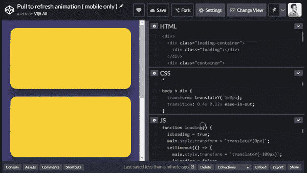
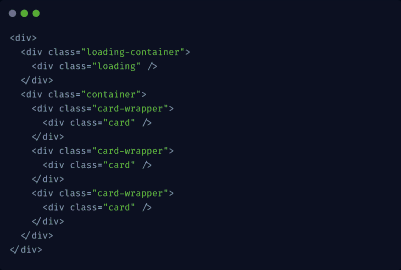
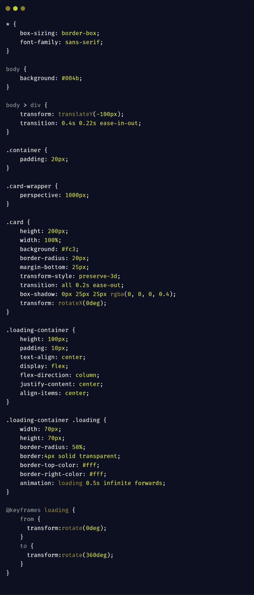
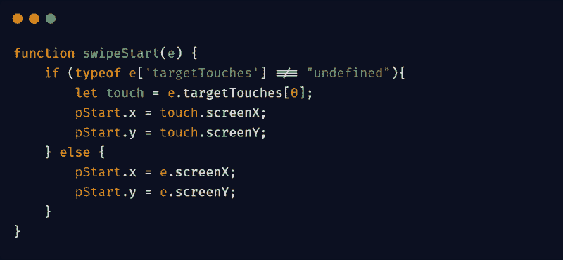
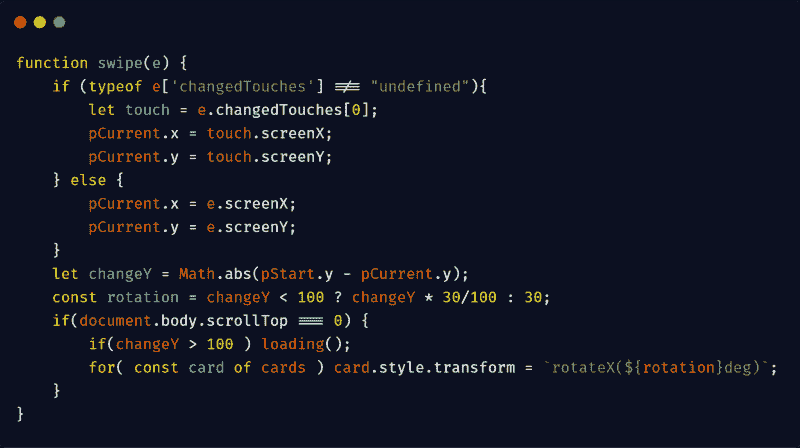
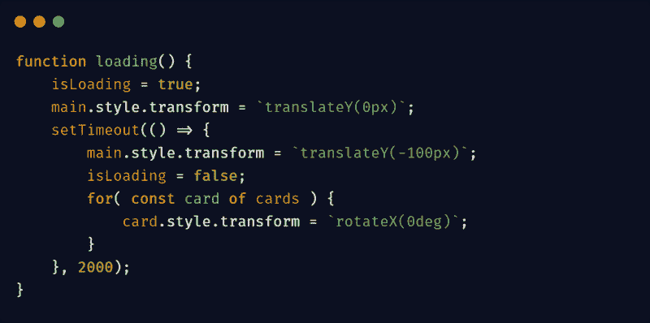

# 用普通的 JavaScript 拉动以刷新动画

> 原文：<https://dev.to/vijitail/pull-to-refresh-animation-with-vanilla-javascript-17oc>

拉至刷新是智能手机上非常流行的滑动手势，允许用户在列出的数据上加载新内容。如今，它被用于所有流行的智能手机应用程序和网络应用程序中，并已成为 UX 的一个主要部分。

* * *

几天前我在 [dribbble](https://dribbble.com/shots/4963449-Pull-to-Refresh-Animation) 上看到了这种动画，所以我想为什么不拿出我的版本呢。

你猜怎么着，我设法不用库或 JQuery 插件，只用普通的 JavaScript 就完成了这个。😎

一个非常简单的标记，一个包含加载器和一堆卡片的顶部加载容器。

让我们开始有趣的事情吧😁。

这个想法是默认隐藏加载容器，当用户向下滑动时向下滑动。
**transform-style:preserve-3d**将使卡片能够被定位在 3D 空间中，并且卡片包装上的 **perspective** 属性将决定用户将如何从他们的视角观看；较低的值将产生更强烈的 3D 效果。请注意，没有在子元素上设置透视图。
[关于 CSS 3D 动画和变换的更多信息](https://3dtransforms.desandro.com/)。

这就是 CSS，现在让我们开始添加滑动手势。

JS 中的触摸事件由触摸事件监听器处理。这些事件类似于鼠标事件，只是它们允许在触摸表面上进行多次触摸。

pStart 和 pCurrent 对象将存储开始和当前触摸的触摸位置。我们需要这些来找到 Y 坐标的变化，来计算卡片的旋转。

在 swipeStart()函数中，我们将捕获触摸坐标并将其分配给 pStart 对象。

在 swipe()函数中，我们用当前触摸坐标设置 pCurrent 对象。下一步是找出开始位置和当前 Y 位置之间的差异，以计算滑动的距离，并基于距离的 30%进行旋转。只有当距离大于 100 时，装载容器才会出现。

如果触摸已经开始但没有启用加载，swipeEnd()函数将撤销旋转。

在加载时，出于演示目的，加载容器将向下滑动 2 秒钟，但在实际示例中，根据服务器的响应，这可能需要更长或更短的时间。一旦装载完成，装载容器和卡片将恢复到原始状态。

我从[这个](https://stackoverflow.com/questions/46190436/how-to-detect-pull-to-refresh) stackoverflow 问题中引用了 JavaScript。

在我的 [codepen](https://codepen.io/Vijit_Ail/pen/pmbypw) 中完成源代码。打开 devtools 查看动画效果。

* * *

我希望你今天能学到一些新东西😄。如果您有任何问题或对改进代码有任何建议，请随时写下您的回复。

干杯，快乐编码🍻 ✌

*这篇文章最初在 medium 上分享。查看我的媒体简介[@ VI JIT 2 ail](https://medium.com/@vijit2ail)T3】*