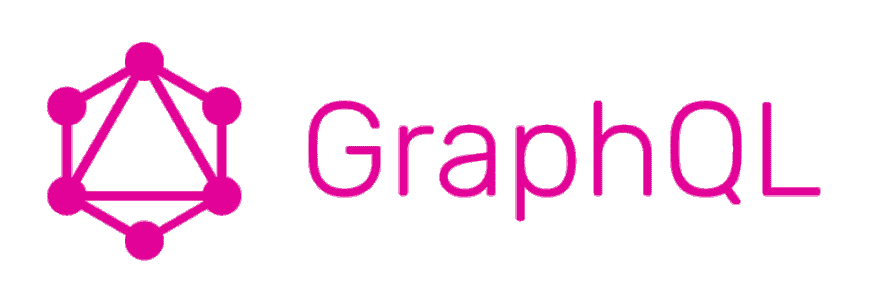

# TL；GraphQL 博士

> 原文：<https://dev.to/khaled_garbaya/tl-dr-graphql-37dh>

[](https://res.cloudinary.com/practicaldev/image/fetch/s--FM6D7VQ0--/c_limit%2Cf_auto%2Cfl_progressive%2Cq_auto%2Cw_880/https://images.ctfassets.net/3bc97k4uk5q7/1v5cJZ8FEDBgMSZMBcxUBy/b40bd7f639fa9a5b86441738815d16ae/1_49DDRZhUWvVnH-QNHuSUSw.png)

## 什么是 GraphQL？

GraphQL 是 API 的查询语言，也是执行查询的服务器端运行时。它不依赖于任何特定的数据库引擎，而是由您来解决查询。要创建 GraphQL 服务，您需要定义类型及其字段，然后为每个类型上的每个字段提供函数。

## GraphQL 查询语言

GraphQL 查询如下所示:

```
[query][query name]{
     typeName {
        fieldName
    }
} 
```

Enter fullscreen mode Exit fullscreen mode

方括号、`[`和`]`中的所有内容都是可选的。

示例查询:

```
query getUserName{
    person {
       name 
   }
} 
```

Enter fullscreen mode Exit fullscreen mode

返回的结果将是这样的

```
{
  data: {
    person: {
       name: 'Jhon Snow' 
    }
} 
```

Enter fullscreen mode Exit fullscreen mode

## 字段

GraphQL 是向您的服务请求来自特定对象的特定字段。例如:从用户处获取名称字段。GraphQL 的好处是您获得的数据与查询完全一致。

将此更改为并排表格

```
{
     person {
        name 
    }
}

{
  data: {
    person: {
       name: 'Jhon Snow' 
    }
} 
```

Enter fullscreen mode Exit fullscreen mode

字段还可以引用一个对象或对象集合，例如数据库中的每个人都可以有一只宠物。查询将如下所示:将它改为 table side by side

```
{
     person {
        name 
        pet {
          name
       }
    }
}

{
  data: {
    person: {
       name: 'Jhon Snow',
       path: {
          name: 'Doge'
       }
    }
} 
```

Enter fullscreen mode Exit fullscreen mode

## 论据

在 GraphQL 中，每个字段和嵌套的对象都可以获得自己的一组参数，这是非常强大的，并且将 GraphQL 与 REST 区分开来。

因此，让我们稍微改进一下我们之前的查询

```
{
  person(id:'kdlhh123hf3tzf') {
    name
    height (unit: METER)
    pet{
      name
      age(format: DOG_YEARS)
    }
  }
}

{
  data: {
    person: {
       name: 'Jhon Snow',
       # 183 cm
       height: 183
       pet: {
          name: 'Doge',
          age: 7
       }
    }
} 
```

Enter fullscreen mode Exit fullscreen mode

让我解释一下前面的查询。我告诉我的服务获取 id 为`kdlhh123hf3tzf`的用户，该用户具有字段名称和以米为单位的高度。使用参数，您可以指定字段的格式等内容。

## 别名

让我们以这个例子查询

```
query getUsers {
  users(role: admin) {
    id
    firstName
    lastName
    phone
    username
  }
  users(role: accountant) {
    id
    firstName
    lastName
      phone
    username
  }
} 
```

Enter fullscreen mode Exit fullscreen mode

Graphql 会给我们一个错误

```
{
  "errors": [
    {
      "message": "Fields \"users\" conflict because they have differing arguments. Use different aliases on the fields to fetch both if this was intentional.",
      "locations": [
        {
          "line": 2,
          "column": 3
        },
        {
          "line": 9,
          "column": 3
        }
      ]
    }
  ]
} 
```

Enter fullscreen mode Exit fullscreen mode

那是因为我们不能像 json 一样两次使用同一个节点名。为了解决这个问题，我们可以使用 GraphQL 别名。

```
query getUsers {
  admins: users(role: admin) {
    id
    firstName
    lastName
    phone
    username
  }
  accountants: users(role: accountant) {
    id
    firstName
    lastName
    phone
    username
  }
} 
```

Enter fullscreen mode Exit fullscreen mode

该查询的结果将是

```
{
  data: {
    admins: [
      {
        id
        firstName: 'Will'
        lastName: 'Smith'
        phone: '+0912323132'
        username: 'willy'
      }
    ],
    accountants: [
      {
        id
        firstName: 'Hannah'
        lastName: 'Smith'
        phone: '+0912323132'
        username: 'hannah'
      }
    ],

  }
} 
```

Enter fullscreen mode Exit fullscreen mode

## 片段

graphql 查询可能会变得非常冗长，主要是因为您需要提供想要从 graphql 端点获取的每个字段。使用 Graphql 片段，您可以在多个查询中重用查询逻辑片段。我们可以使用这样的片段来改进我们之前的查询

```
fragment UserInfo on User {
   id
   firstName
   lastName
   phone
   username
}

query getUsers {
  admins: users(role: admin) {
    ...UserInfo
  }
  accountants: users(role: accountant) {
    ...UserInfo
  }
} 
```

Enter fullscreen mode Exit fullscreen mode

这里发生的事情是，我们将用户对象上的公共字段分组到一个片段中，并且我们每次查询用户时都使用它，而不是一遍又一遍地编写字段名称。

## 何去何从

*   GraphQL 简介 [graphql.org](https://graphql.org/learn/)
*   WTF 是 GraphQL [egghead.io](https://egghead.io/lessons/graphql-wtf-is-graphql)