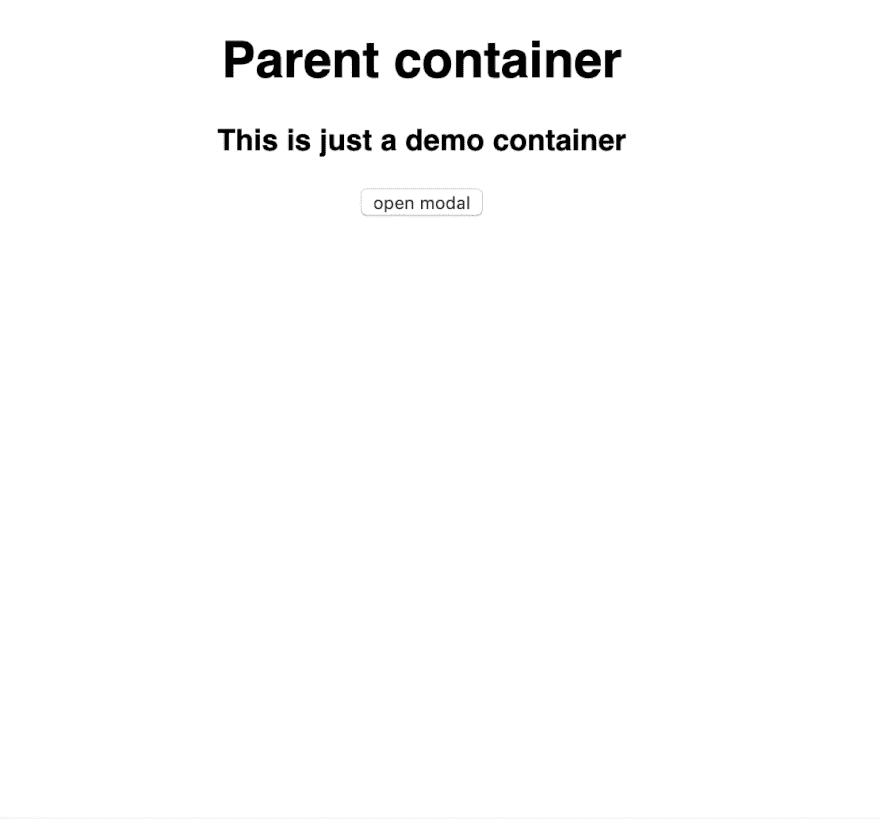
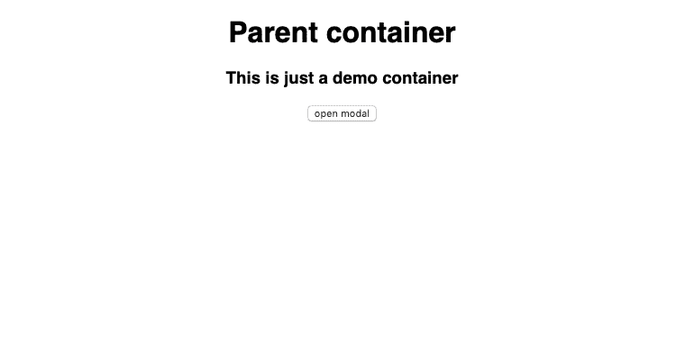
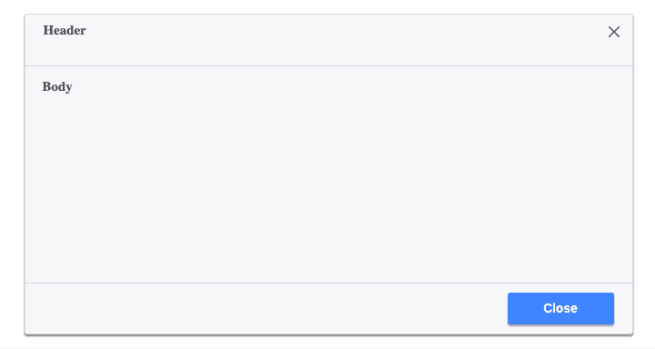
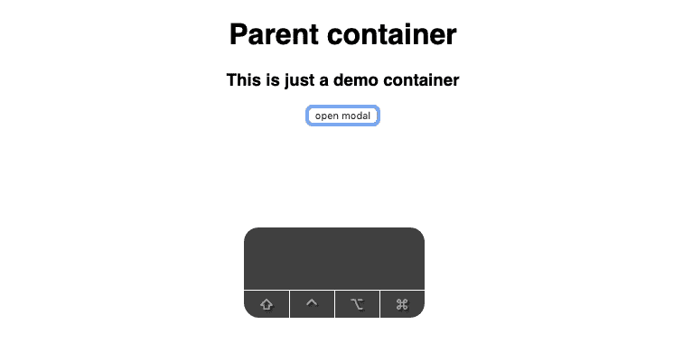
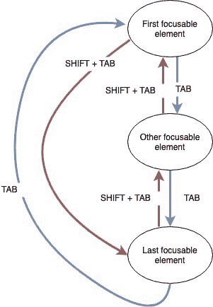

# 生产反应应用的原因？🤔(第三部分)

> 原文：<https://dev.to/seif_ghezala/reasonml-for-production-react-apps-part-3-3368>

不久前，我发表了这篇关于在 React 中构建一个可访问和可重用的模态/对话框组件的文章。

[](https://res.cloudinary.com/practicaldev/image/fetch/s--OXMjfhPY--/c_limit%2Cf_auto%2Cfl_progressive%2Cq_66%2Cw_880/https://thepracticaldev.s3.amazonaws.com/i/ja0duaz4tejuxqr3yadt.gif) 

<figure>

<figcaption>反应模态</figcaption>

</figure>

该组件满足以下要求:

*   一个可重用的组件 API:我们应该能够在任何地方轻松地使用我们的可访问模型，并用内容填充它。
*   **可访问标记。**
*   我们应该可以使用键盘打开&关闭模态。
*   **在模态中捕获焦点:**因为模态是一个惰性组件，所以一旦它打开，键盘导航应该被捕获在其中。

该组件利用了 React 特性，如上下文、门户和引用。为了评估 ReasonReact 是否可以投入生产，我将在 Reason 中构建相同的模型，并报告我喜欢/不喜欢的内容。

我将在迭代中再次这样做。你可以在这里找到最终的源代码[。每个迭代都有一个单独的分支。](https://github.com/siffogh/reason-react-modal)

# 迭代#1:将模态作为一个简单的 div

[](https://res.cloudinary.com/practicaldev/image/fetch/s--wAzKTViF--/c_limit%2Cf_auto%2Cfl_progressive%2Cq_66%2Cw_880/https://thepracticaldev.s3.amazonaws.com/i/q8h622eucw20hvbu7owf.gif) 

<figure>

<figcaption>迭代#1:将模态作为简单的 div</figcaption>

</figure>

## 模态分量

首先，让我们创建模态组件:

```
/* src/Modal.re */

[%bs.raw {|require('./Modal.css')|}];

[@bs.scope "document"] [@bs.val] external body: Dom.element = "body";

[@react.component]
let make = (~children) =>
  ReactDOMRe.createPortal(
    <div className="modal-container" role="dialog" ariaModal=true>
      <div className="modal-content"> children </div>
    </div>,
    body,
  ); 
```

为了使模态可访问，它应该与主应用程序内容隔离。使用 ReactDOMRe 的`createPortal`函数，模态直接呈现在文档体中。

但首先，我们需要接近尸体...

Reason 附带了一个`Dom`模块。不幸的是，该模块只包含有用的类型，并不提供到实际 DOM 的绑定。

我们当然可以只使用原始 JavaScript 来访问`document.body`并使用 Dom 模块键入值:

```
let body: Dom.element = [%raw "document.body"]; 
```

如果我们查看编译后的`Modal.bs.js`文件，我们会看到这完全不必要的一行:

```
var body = (document.body); 
```

如果每当我们想要访问一个 JavaScript 值时就开始使用这种方法，您能想象编译后的代码会是什么样子吗？我们可以做得更好！

要访问文档的主体，我们可以使用 BuckleScript 的[外部特性](https://bucklescript.github.io/docs/en/bind-to-global-values) :

```
[@bs.scope "document"] [@bs.val] external body: Dom.element = "body"; 
```

我们只需告诉 BuckleScript 给我们出现在全局值`document`中的`Dom.element`类型的值`body`。这种语法非常聪明和高效。如果我们查看编译后的`Modal.bs.js`文件，我们会看到主体是直接从 document 对象访问的，就像我们在 JavaScript 中做的一样！

## 开启模态

```
/* src/App.re */

[%bs.raw {|require('./App.css')|}];

[@react.component]
let make = () => {
  let (isModalVisible, setIsModalVisible) = React.useState(() => false);
  <div className="App">
    <h1> {"Parent container" |> ReasonReact.string} </h1>
    <h3> {"This is just a demo container" |> ReasonReact.string} </h3>
    <button onClick={_ => setIsModalVisible(_ => true)}>
      {"open modal" |> ReasonReact.string}
    </button>
    {!isModalVisible
       ? ReasonReact.null : <Modal> {"Foo" |> ReasonReact.string} </Modal>}
  </div>;
}; 
```

为了查看/隐藏模态，基于`isModalVisible`布尔状态值有条件地在 App 组件中呈现它。

“打开模态”按钮只是将该值设置为`true`，打开模态。

## 我喜欢👍

*   使用门户非常简单。
*   BuckleSript 外部语法使得访问 DOM 元素变得简单而高效。

## 我不喜欢👎

*   缺少对 DOM 的实际绑定。它将使访问文档主体变得像在 JavaScript 中一样容易，同时受益于键入。

# 迭代#2:添加关闭按钮

[](https://res.cloudinary.com/practicaldev/image/fetch/s--A_Pr2Jfa--/c_limit%2Cf_auto%2Cfl_progressive%2Cq_auto%2Cw_880/https://thepracticaldev.s3.amazonaws.com/i/4vc4tjk7dk4bga6t4kph.png) 

<figure>

<figcaption>迭代 2:添加关闭按钮</figcaption>

</figure>

我们希望有 2 个按钮来关闭模式:

*   标题中的十字按钮。
*   页脚的“关闭”按钮。

在此之前，我们需要首先公开模式:

*   一个 header 组件，包含交叉关闭按钮和我们希望在 modal 的标题中呈现的任何元素。

*   一个主体组件，包含我们希望在模式主体中呈现的任何元素。

*   一个页脚组件，它将包含第二个关闭按钮和我们希望在模式页脚中呈现的任何元素。

```
/* src/Modal.re */

[%bs.raw {|require('./Modal.css')|}];

[@bs.scope "document"] [@bs.val] external body: Dom.element = "body";

module Cross = {
  [@bs.module "./cross.svg"] [@react.component]
  external make: unit => React.element = "default";
};

[@react.component]
let make = (~children) => {
  ReactDOMRe.createPortal(
    <div className="modal-container" role="dialog" ariaModal=true>
      <div className="modal-content"> children </div>
    </div>,
    body,
  );
};

module Header = {
  [@react.component]
  let make = (~children) => {
    <div className="modal-header">
      children
      <button className="cross-btn" title="close modal"> <Cross /> </button>
    </div>;
  };
};

module Body = {
  [@react.component]
  let make = (~children) => <div className="modal-body"> children </div>;
};

module Footer = {
  [@react.component]
  let make = (~children) => <div className="modal-footer"> children </div>;

  module CloseBtn = {
    [@react.component]
    let make = (~children) => {
      <button className="close-btn" title="close modal"> children </button>;
    };
  };
}; 
```

然后我们可以重构我们的 App.re 并使用新的模态子组件:

```
/* src/App.re */

[%bs.raw {|require('./App.css')|}];

[@react.component]
let make = () => {
  let (isModalVisible, setIsModalVisible) = React.useState(() => false);

  <div className="App">
    <h1> {"Parent container" |> ReasonReact.string} </h1>
    <h3> {"This is just a demo container" |> ReasonReact.string} </h3>
    <button onClick={_ => setIsModalVisible(_ => !isModalVisible)}>
      {"open modal" |> ReasonReact.string}
    </button>
    {!isModalVisible
       ? ReasonReact.null
       : <Modal>
           <Modal.Header> {"Header" |> ReasonReact.string} </Modal.Header>
           <Modal.Body> {"Body" |> ReasonReact.string} </Modal.Body>
           <Modal.Footer>
             <Modal.Footer.CloseBtn>
               {"Close" |> ReasonReact.string}
             </Modal.Footer.CloseBtn>
           </Modal.Footer>
         </Modal>}
  </div>;
}; 
```

## 我喜欢👍

*   Reason 的模块语法非常简单，创建子模块也很容易。

# 迭代#3:关闭模态

就像打开模态一样，关闭模态可以通过将 App.re 中的`isModalVisible`设置为`true`来完成。

让我们传递给模态 a 函数，`onModalClose`，它确实做了:

```
/* src/App.re*/

[%bs.raw {|require('./App.css')|}];

[@react.component]
let make = () => {
  let (isModalVisible, setIsModalVisible) = React.useState(() => false);

  <div className="App">
    <h1> {"Parent container" |> ReasonReact.string} </h1>
    <h3> {"This is just a demo container" |> ReasonReact.string} </h3>
    <button onClick={_ => setIsModalVisible(_ => !isModalVisible)}>
      {"open modal" |> ReasonReact.string}
    </button>
    {!isModalVisible
       ? ReasonReact.null
       : <Modal onModalClose={() => setIsModalVisible(_ => false)}>
           <Modal.Header> {"Header" |> ReasonReact.string} </Modal.Header>
           <Modal.Body> {"Body" |> ReasonReact.string} </Modal.Body>
           <Modal.Footer>
             <Modal.Footer.CloseBtn>
               {"Close" |> ReasonReact.string}
             </Modal.Footer.CloseBtn>
           </Modal.Footer>
         </Modal>}
  </div>;
}; 
```

到目前为止，模态组件有一个关闭模态的 prop 函数。剩下的唯一一件事就是让它对页眉和页脚关闭按钮可用。

为此，我们可以在 React 上下文提供程序中公开它。任何需要访问`onModalClose`函数的组件都可以使用`useContext`钩子来使用它。

为了创建一个模态的上下文，我们可以使用 React `createContext`函数并向它传递一个初始值。因为`onModalClose`函数属于`unit => unit`类型，所以初始值需要属于同一类型:

```
let modalContext = React.createContext(() => ()); 
```

不能从模式的上下文中直接访问提供者。使用它的一种方法是创建一个提供者模块，它公开了一个`make`和`makeProps`函数:

```
module ContextProvider = {
  let makeProps = (~value, ~children, ()) => {
    "value": value,
    "children": children,
  };

  let make = React.Context.provider(modalContext);
}; 
```

然后，我们可以将模态的子节点包装在上下文提供者中，并在页眉和页脚中使用我们的值:

```
/* src/Modal.re */

[%bs.raw {|require('./Modal.css')|}];

[@bs.scope "document"] [@bs.val] external body: Dom.element = "body";

module Cross = {
  [@bs.module "./cross.svg"] [@react.component]
  external make: unit => React.element = "default";
};

let modalContext = React.createContext(() => ());

module ContextProvider = {
  let makeProps = (~value, ~children, ()) => {
    "value": value,
    "children": children,
  };

  let make = React.Context.provider(modalContext);
};

[@react.component]
let make = (~children, ~onModalClose) => {
  ReactDOMRe.createPortal(
    <div className="modal-container" role="dialog" ariaModal=true>
      <div className="modal-content">
        <ContextProvider value=onModalClose> children </ContextProvider>
      </div>
    </div>,
    body,
  );
};

module Header = {
  [@react.component]
  let make = (~children) => {
    let onModalClose = React.useContext(modalContext);

    <div className="modal-header">
      children
      <button
        className="cross-btn"
        title="close modal"
        onClick={_ => onModalClose()}>
        <Cross />
      </button>
    </div>;
  };
};

module Body = {
  [@react.component]
  let make = (~children) => <div className="modal-body"> children </div>;
};

module Footer = {
  [@react.component]
  let make = (~children) => <div className="modal-footer"> children </div>;

  module CloseBtn = {
    [@react.component]
    let make = (~children) => {
      let onModalClose = React.useContext(modalContext);

      <button
        className="close-btn"
        title="close modal"
        onClick={_ => onModalClose()}>
        children
      </button>;
    };
  };
}; 
```

## 我喜欢👍

*   我能够使用上下文来实现该特性，即使这是一种变通方法。
*   在陷入使用上下文的困境后，我设法通过[论坛](https://reasonml.chat/t/current-state-of-react-context/1626/2)和[不和谐频道](https://discordapp.com/channels/235176658175262720/235199093155168257)很快找到了一个可行的解决方案。

## 我不喜欢👎

*   没有关于使用上下文的文档。
*   我使用的解决方案无疑是一个黑客。

# 迭代#4:通过快捷键关闭模态

[](https://res.cloudinary.com/practicaldev/image/fetch/s--ErARfEiN--/c_limit%2Cf_auto%2Cfl_progressive%2Cq_66%2Cw_880/https://thepracticaldev.s3.amazonaws.com/i/dq8ohaqee3i3mxm1jyjw.gif) 

<figure>

<figcaption>迭代#4:通过快捷键</figcaption>

</figure>

关闭模态

我们希望能够通过按下`ESCAPE`键来关闭模态。为此，我们需要使用外部语法来访问两个函数:

*   `document.addEventListener`(添加一个监听器)。
*   `document.removeEventListener`(删除一个监听器)。

我们必须明确这两个函数中使用的事件类型。`ReactEvent`模块提供了各种事件的类型。在我们的例子中，我们正在处理类型为`Keyboard`的事件。由于我们的函数只处理键盘事件，我决定给它们起一个稍微不同的名字:

```
[@bs.scope "document"] [@bs.val]
external addKeybordEventListener:
  (string, ReactEvent.Keyboard.t => unit) => unit =
  "addEventListener";

[@bs.scope "document"] [@bs.val]
external removeKeybordEventListener:
  (string, ReactEvent.Keyboard.t => unit) => unit =
  "removeEventListener"; 
```

然后我们可以使用这两个函数来创建一个对`ESCAPE`键做出反应的`keydown`监听器:

```
let keyDownListener = e =>
  if (ReactEvent.Keyboard.keyCode(e) === 27) {
     onModalClose();
  }; 
```

`useEffect`钩子可以用来创建一个函数来订阅我们的`keyDownListener`。该函数返回比另一个函数清理的效果，包装在一个选项:

```
/* src/Modal.re */

[%bs.raw {|require('./Modal.css')|}];

[@bs.scope "document"] [@bs.val] external body: Dom.element = "body";

[@bs.scope "document"] [@bs.val]
external addKeybordEventListener:
  (string, ReactEvent.Keyboard.t => unit) => unit =
  "addEventListener";

[@bs.scope "document"] [@bs.val]
external removeKeybordEventListener:
  (string, ReactEvent.Keyboard.t => unit) => unit =
  "removeEventListener";

module Cross = {
  [@bs.module "./cross.svg"] [@react.component]
  external make: unit => React.element = "default";
};

let modalContext = React.createContext(() => ());

module ContextProvider = {
  let makeProps = (~value, ~children, ()) => {
    "value": value,
    "children": children,
  };

  let make = React.Context.provider(modalContext);
};

[@react.component]
let make = (~children, ~onModalClose) => {
  let keyDownListener = e =>
    if (ReactEvent.Keyboard.keyCode(e) === 27) {
      onModalClose();
    };

  let effect = () => {
    addKeybordEventListener("keydown", keyDownListener);
    Some(() => removeKeybordEventListener("keyDown", keyDownListener));
  };

  React.useEffect(effect);

  ReactDOMRe.createPortal(
    <div className="modal-container" role="dialog" ariaModal=true>
      <div className="modal-content">
        <ContextProvider value=onModalClose> children </ContextProvider>
      </div>
    </div>,
    body,
  );
};

module Header = {
  [@react.component]
  let make = (~children) => {
    let onModalClose = React.useContext(modalContext);

    <div className="modal-header">
      children
      <button
        className="cross-btn"
        title="close modal"
        onClick={_ => onModalClose()}>
        <Cross />
      </button>
    </div>;
  };
};

module Body = {
  [@react.component]
  let make = (~children) => <div className="modal-body"> children </div>;
};

module Footer = {
  [@react.component]
  let make = (~children) => <div className="modal-footer"> children </div>;

  module CloseBtn = {
    [@react.component]
    let make = (~children) => {
      let onModalClose = React.useContext(modalContext);

      <button
        className="close-btn"
        title="close modal"
        onClick={_ => onModalClose()}>
        children
      </button>;
    };
  };
}; 
```

## 我喜欢👍

*   useEffect 被完全键入，它提醒你清理效果。你要么显式返回`None`要么返回一个清理函数。这可以避免在添加侦听器而不删除它们时出现内存泄漏。

## 我不喜欢👎

*   没有关于使用`useEffect`的文档。

# 迭代#5:在模态中捕捉焦点

为了让我们的模型可以被正确访问，还有一件事要做:它里面的焦点应该被捕获。一旦打开了模型，我们应该关注其中的第一个可聚焦的元素。从那时起，按 TAB 或 SHIFT + TAB 键将只允许用户在模式中导航。

[](https://res.cloudinary.com/practicaldev/image/fetch/s--zevNJ4WW--/c_limit%2Cf_auto%2Cfl_progressive%2Cq_auto%2Cw_880/https://thepracticaldev.s3.amazonaws.com/i/adiro5t2jje42hglxwm3.jpeg) 

<figure>

<figcaption>把焦点套在情态里面</figcaption>

</figure>

我们需要首先创建一个 Ref 来访问模态 dom 元素:

```
let modalRef = React.useRef(Js.Nullable.null); 
```

注意，我们必须通过`Js.Nullable`模块用空值初始化`useRef`。幸运的是，从`Js.Nullable`转换成期权
相当容易

```
switch(Js.Nullable.toOption(someNullable)) {
    | Some(value) => ...
    | None => ...
} 
```

为了选择 modal 中所有可聚焦的元素，我们可以在对 modal 组件的引用中使用 DOM 元素的`querySelector`函数。

由于缺少到 DOM 的正确绑定，我们要么必须编写自己的绑定，使用一些第三方库，要么只使用`ReactDOMRe.domElementToObj`将模态 ref 中的 DOM 元素转换成一个对象。

目前，我选择第三个选项。这使我们可以很容易地访问`querySelector`函数，但是会失去对所有类型的跟踪:

```
/* src/Modal.re */

[%bs.raw {|require('./Modal.css')|}];

[@bs.scope "document"] [@bs.val] external body: Dom.element = "body";

[@bs.scope "document"] [@bs.val]
external addKeybordEventListener:
  (string, ReactEvent.Keyboard.t => unit) => unit =
  "addEventListener";

[@bs.scope "document"] [@bs.val]
external removeKeybordEventListener:
  (string, ReactEvent.Keyboard.t => unit) => unit =
  "removeEventListener";

[@bs.scope "document"] [@bs.val]
external activeElement: Dom.element = "activeElement";

module Cross = {
  [@bs.module "./cross.svg"] [@react.component]
  external make: unit => React.element = "default";
};

let modalContext = React.createContext(() => ());

module ContextProvider = {
  let makeProps = (~value, ~children, ()) => {
    "value": value,
    "children": children,
  };

  let make = React.Context.provider(modalContext);
};
[@react.component]
let make = (~children, ~onModalClose) => {
  let modalRef = React.useRef(Js.Nullable.null);

  let handleTabKey = e => {
    let current = React.Ref.current(modalRef);
    switch (Js.Nullable.toOption(current)) {
    | Some(element) =>
      let elementObj = ReactDOMRe.domElementToObj(element);
      let elements =
        elementObj##querySelectorAll(
          "a[href], button, textarea, input[type='text'], input[type='radio'], input[type='checkbox'], select",
        );
      let firstElement = elements[0];
      let lastElement = elements[elements##length - 1];

      if (!ReactEvent.Keyboard.shiftKey(e) && activeElement !== firstElement) {
        firstElement##focus();
        ReactEvent.Keyboard.preventDefault(e);
      };

      if (ReactEvent.Keyboard.shiftKey(e) && activeElement !== lastElement) {
        lastElement##focus();
        ReactEvent.Keyboard.preventDefault(e);
      };

    | None => ignore()
    };
  };

  let keyListenersMap =
    Js.Dict.fromArray([|("27", _ => onModalClose()), ("9", handleTabKey)|]);

  let effect = () => {
    let keyDownListener = e => {
      let keyCodeStr = ReactEvent.Keyboard.keyCode(e) |> string_of_int;

      switch (Js.Dict.get(keyListenersMap, keyCodeStr)) {
      | Some(eventListener) => eventListener(e)
      | None => ignore()
      };
    };

    addKeybordEventListener("keydown", keyDownListener);
    Some(() => removeKeybordEventListener("keyDown", keyDownListener));
  };

  React.useEffect(effect);

  ReactDOMRe.createPortal(
    <div className="modal-container" role="dialog" ariaModal=true>
      <div className="modal-content" ref={ReactDOMRe.Ref.domRef(modalRef)}>
        <ContextProvider value=onModalClose> children </ContextProvider>
      </div>
    </div>,
    body,
  );
};

module Header = {
  [@react.component]
  let make = (~children) => {
    let onModalClose = React.useContext(modalContext);

    <div className="modal-header">
      children
      <button
        className="cross-btn"
        title="close modal"
        onClick={_ => onModalClose()}>
        <Cross />
      </button>
    </div>;
  };
};

module Body = {
  [@react.component]
  let make = (~children) => <div className="modal-body"> children </div>;
};

module Footer = {
  [@react.component]
  let make = (~children) => <div className="modal-footer"> children </div>;

  module CloseBtn = {
    [@react.component]
    let make = (~children) => {
      let onModalClose = React.useContext(modalContext);

      <button
        className="close-btn"
        title="close modal"
        onClick={_ => onModalClose()}>
        children
      </button>;
    };
  };
}; 
```

## 我喜欢👍

*   能够从`Js.Nullable`转换为选项。
*   尽管缺少对 DOM 的适当绑定，我还是能够实现这个特性。

## 我不喜欢👎

*   无法使用带有 useRef 挂钩的选项。
*   缺少对 DOM 的正确绑定。