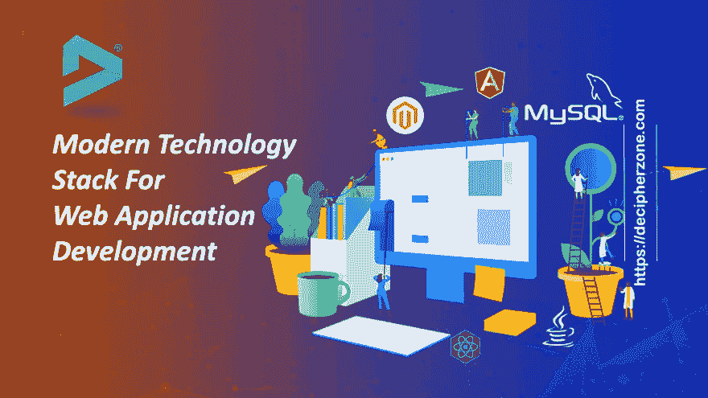

# 为 web 应用程序开发选择技术堆栈

> 原文：<https://dev.to/decipherzonesoft/choosing-a-technology-stack-for-web-application-development-582m>

当您构建一流的 web 应用程序时，如何为 web 应用程序开发选择一个技术堆栈是最重要的兴趣点。第一个问题是如何开始这个过程。找到合适的技术、编程语言和局外人的安排，为有效和熟练的 web 解决方案搭建一个合理的平台。web 应用程序开发必须使用哪种技术堆栈？

什么是技术堆栈？

技术栈是应用程序开发中使用的编程语言、工具和框架的组合。技术栈由一组非常特殊的组件组成，这些组件协同工作来创建 web 应用程序。任何 web 应用程序开发都有两个主要部分，即前端和后端。

Web 应用程序开发需要混合编程方言，工程师需要能够在不同阶段为他们提供各种功能和可靠集成的东西。

用于 web 应用程序开发的现代技术堆栈

前端或客户端

前端部分支持客户端与应用程序的通信。对于 web 应用程序，这种连接发生在程序中，可想而知要感谢伴随的部分:

HTML:描述程序中引入的数据结构的特征

CSS:决定应用程序内容、布局、风格和设计的风格

JavaScript:增强运行应用程序的网站页面的智能

大多数 web 应用程序都使用 Bootstrap 作为 HTML 和 CSS 的结构。JavaScript 细分领域是前端系统面临巨大挑战的一个领域，其先驱是 Angular 和 React。虽然这两个框架仍然统治着前端市场，但开发人员越来越经常地将 Vue.js 视为选修课程。Vue.js 收购的重点是它的轻量级结构和灵活性。

后端或服务器端

高级堆栈的后端部分包含更多的部件，这里有更多的选择。后端在后台工作，对客户来说是不可察觉的，但是它构建了驱动应用程序和实现其业务基本原理的马达。

操作系统

程序设计语言

计算机网络服务器

数据库ˌ资料库

结构

最著名的技术堆栈模型

LAMP
LAMP 代表 Linux(工作框架)、Apache (web 服务器)、MySQL(数据库)、PHP(编程语言)。Light 被认为是最流行的后端堆栈，其适应性、安全性和高度定制的选择令人耳目一新。

Python-Django 依赖于 Python 编程语言。它还利用了 Apache web 服务器和 MySQL 数据库，就像 Django 系统一样，同样是用 Python 编写的。

MEAN
MEAN，是 MongoDB，Express.js，AngularJS，Node.js 的缩写。MEAN 是“到处都是 JavaScript”思想的执行，在客户端和服务器端都使用类似的编程语言。后端依赖于 Node.js，这是在后端开发中利用 JavaScript 的主要阶段。

MERN
MERN 整合了 MongoDB、Express、React/Redux 和 Node.js。考虑到 ReactJS 在前端改进方面的名气和 NodeJS 在后端改进方面的名气，这种组合被明智地称为结构顶级单页面应用程序中使用最多的 JavaScript 堆栈。

为了获得完整的技术堆栈，编程工程师只需选择前端和后端先进的系统。

最著名的后端开发语言和框架。
JavaScript: Node.js，

C#:。网

Ruby: Ruby on Rails

PHP: Laravel，

Python: Django

**如何选择 web app 开发的最佳技术栈？**

点击此处阅读全文:[https://www . decipherzone . com/blog-detail/How-to-Choose-The-Best-Technology-Stack-for-Web-App-Development-](https://www.decipherzone.com/blog-detail/How-to-Choose-The-Best-Technology-Stack-for-Web-App-Development-)