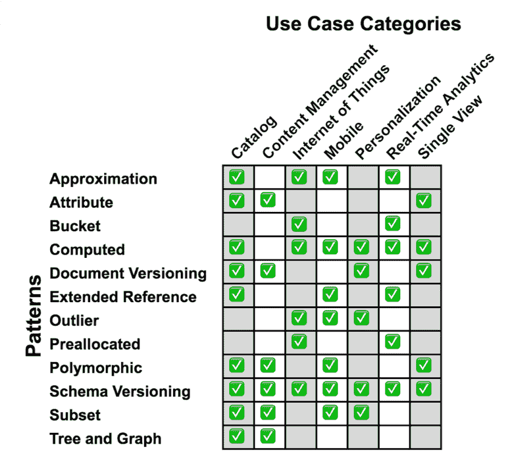

# 用模式构建:综述

> 原文：<https://dev.to/kenwalger/building-with-patterns-a-summary-2he>

当我们用模式系列结束*建筑时，这是一个很好的机会来回顾已经讨论过的模式所解决的问题，并强调每个模式的一些好处和权衡。关于模式设计模式，最常见的问题是“我正在设计一个应用程序来做 X，我如何对数据建模？”正如我们希望你在这个系列博客中所发现的，要回答这个问题，有很多事情需要考虑。然而，我们已经包含了一个*样本用例*图表，我们发现它至少有助于为通用用例提供一些数据建模模式的初步指导。*

## 示例用例

下面的图表是我们在多年与客户合作的经验中发现的一个指南，说明了在各种应用程序中使用什么样的模式设计模式。对于哪种设计模式可以用于特定类型的应用程序，这并不是一套“一成不变”的规则。确保您查看了在您的用例中经常使用的那些。但是，不要丢弃其他的，它们可能仍然适用。如何设计应用程序的数据模式很大程度上取决于数据访问模式。

## 设计模式总结

### 近似值

当频繁进行昂贵的计算并且这些计算的精度不是最高优先级时，[近似模式](https://dev.to/mongodb/building-with-patterns-the-approximation-pattern-2l99-temp-slug-3479488)非常有用。

###### 优点

*   对数据库的写入更少。
*   保持统计上有效的数字。

###### 弊

*   确切的数字还没有公布。
*   实现必须在应用程序中完成。

### 属性

[属性模式](https://dev.to/mongodb/building-with-patterns-the-attribute-pattern-299m-temp-slug-2892504)对于有许多相似字段的大文档的问题很有用，但是有一个具有共同特征的字段子集，我们希望对该字段子集进行排序或查询。当我们需要排序的字段只在一小部分文档中找到时。或者当文档中同时满足这两个条件时。

###### 优点

*   需要更少的索引。
*   查询变得更容易编写，并且通常更快。

### 斗

[桶模式](https://dev.to/mongodb/building-with-patterns-the-bucket-pattern-3l0m-temp-slug-1282717)是需要管理流数据时的绝佳解决方案，例如时间序列、实时分析或物联网(IoT)应用。

###### 优点

*   减少集合中的文档总数。
*   提高索引性能。
*   可以通过利用预聚合来简化数据访问。

### 计算出来的

当存在读取非常密集的数据访问模式，并且应用程序需要重复计算这些数据时，[计算模式](https://dev.to/mongodb/building-with-patterns-the-computed-pattern-p4b-temp-slug-2359673)是一个很好的选择。

###### 优点

*   减少频繁计算的 CPU 工作量。
*   查询变得更容易编写，并且通常更快。

###### 弊

*   可能很难确定是否需要这种模式。
*   除非需要，否则应该避免应用或过度使用该模式。

### 文档版本化

当您需要在 MongoDB 中维护以前版本的文档时，[文档版本控制](https://dev.to/mongodb/building-with-patterns-the-document-versioning-pattern-1j4b-temp-slug-5303334)模式是一个可能的解决方案。

###### 优点

*   即使在现有系统上也易于实施。
*   对最新版本的查询没有性能影响。

###### 弊

*   写入次数加倍。
*   查询需要以正确的集合为目标。

### 延伸引用

您会发现，当您的应用程序正在经历大量连接操作以将频繁访问的数据聚集在一起时，[扩展引用](https://dev.to/mongodb/building-with-patterns-the-extended-reference-pattern-4805-temp-slug-2172020)模式非常有用。

###### 优点

*   提高了大量连接操作时的性能。
*   更快的读取速度和连接总数的减少。

###### 弊

*   数据重复。

### 离群值

您是否发现有一些查询或文档不适合您的其他典型数据模式？这些例外是驱动您的应用程序解决方案的原因吗？如果是这样的话，[异常模式](https://dev.to/mongodb/building-with-patterns-the-outlier-pattern-1pf-temp-slug-9285800)是这种情况的一个极好的解决方案。

###### 优点

*   防止少数文档或查询决定应用程序的解决方案。
*   查询是为“典型”用例定制的，但是离群值仍然被处理。

###### 弊

*   通常是为特定查询定制的，因此即席查询的性能可能不好。
*   这种模式的大部分是由应用程序代码完成的。

### 预分配

当您知道您的文档结构并且您的应用程序只需要用数据填充它时，[预分配模式](https://dev.to/mongodb/building-with-patterns-the-preallocation-pattern-2bpc-temp-slug-1006043)是正确的选择。

###### 优点

*   预先知道文档结构时的设计简化。

###### 弊

*   简单性与性能。

### 多态

[多态模式](https://dev.to/mongodb/building-with-patterns-the-polymorphic-pattern-3n9e-temp-slug-3527759)是当存在多种相似性多于差异性的文档，并且这些文档需要保存在一个集合中时的解决方案。

###### 优点

*   容易实现。
*   查询可以在单个集合中运行。

### 模式版本化

几乎每个应用程序都可以从[模式版本化模式](https://dev.to/mongodb/building-with-patterns-the-schema-versioning-pattern-f5n-temp-slug-6006259)中受益，因为在应用程序的生命周期中，数据模式经常发生变化。这种模式允许文档的以前版本和当前版本在一个集合中并存。

###### 优点

*   不需要停机。
*   模式迁移的控制。
*   减少未来技术债务。

###### 弊

*   在迁移过程中，同一个字段可能需要两个索引。

### 子集

[子集模式](https://dev.to/mongodb/building-with-patterns-the-subset-pattern-367c-temp-slug-8336902)解决了由于大型文档中有大量数据未被应用程序使用而导致工作集超过 RAM 容量的问题。

###### 优点

*   [工作集](https://docs.mongodb.com/manual/reference/glossary/#term-working-set)整体尺寸缩小。
*   最常用数据的磁盘访问时间更短。

###### 弊

*   我们必须管理子集。
*   拉入额外的数据需要对数据库进行额外的访问。

### 树

当数据具有层次结构并且被频繁查询时，[树模式](https://dev.to/mongodb/building-with-patterns-the-tree-pattern-5c3l-temp-slug-7078689)是要实现的设计模式。

###### 优点

*   通过避免多次连接操作提高了性能。

###### 弊

*   需要在应用程序中管理对图表的更新。

## 结论

正如我们希望您在本系列中所看到的，MongoDB 文档模型在数据建模方面提供了很大的灵活性。这种灵活性非常强大，但是需要根据应用程序的数据访问模式来利用这种能力。请记住，MongoDB 中的模式设计对应用程序的性能有着巨大的影响。我们发现性能问题经常可以追溯到糟糕的模式设计。

请记住，为了进一步增强文档模型的功能，这些模式设计模式可以在有意义的时候一起使用。例如，随着应用程序的发展，模式版本化可以与任何其他模式结合使用。有了前面介绍的 12 种模式设计模式，您就拥有了利用文档模型的灵活性所需的工具和知识。

帖子[用模式建造:摘要](https://www.kenwalger.com/blog/nosql/mongodb/building-with-patterns-a-summary/)最先出现在肯·w·阿尔杰的[博客上。](https://www.kenwalger.com/blog)