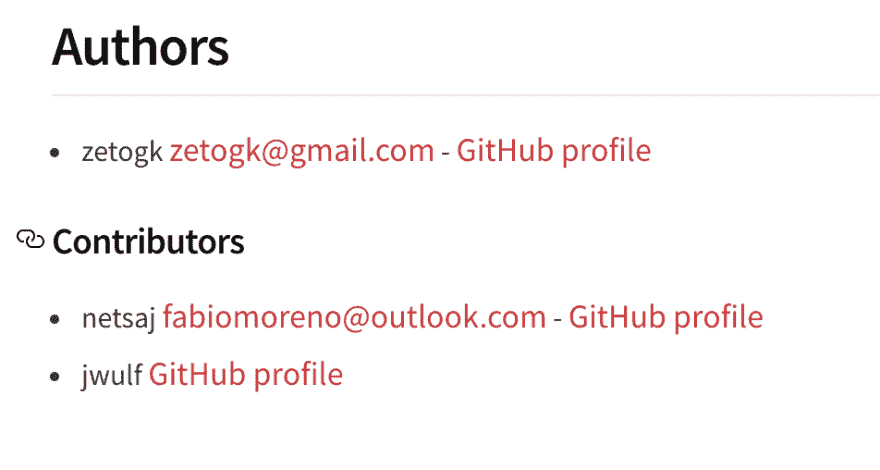

# 如何通过做开源找到工作

> 原文：<https://dev.to/jwulf/how-to-get-a-job-through-doing-open-source-1a17>

*2017 年，作为一名招聘人员，我写了一篇关于被 GitHub contributions 录用的文章。黑客新闻[对它恨之入骨](https://news.ycombinator.com/item?id=13705055)，以至于我辞去了招聘人员的工作，找了一份开发人员的工作，花了 14 个月的时间为 GitHub 做贡献，并被它雇佣来开发 [Zeebe.io](https://zeebe.io) 。结果证明它确实有效！*

我 16 岁的儿子普拉拉德刚刚走进我们的公寓。

他说了什么？？？”我问。

他说‘是’。

低调，冷静，就像许多青少年对他们的父母一样。但我知道他非常兴奋，可能还有点害怕。

他刚刚得到了一份工作，在我们澳大利亚布里斯班公寓楼旁边的一家桌面和角色扮演商店工作。

我教他如何得到它。我看到他对那里卖的游戏很感兴趣。他和他的朋友们在那里玩魔术——聚会 (MTG)，几周前，我回家时看到二十个青少年(是的——二十个！)在我们的公寓里玩游戏。他去了最近的 MTG 预发行，玩了一整天。

你为什么不问问肖恩你能不能在店里做些兼职？”我建议道。肖恩是这家商店的老板。

普拉拉德问肖恩，肖恩说他没有任何工作需要在那里完成。

“回去告诉他你想获得工作经验，”我告诉他。*告诉他你会免费做这件事。这样你可以向他学习。他经营着一家成功的企业，你可以了解到这一点。可以学习如何 DM，如何办活动，如何做客服。你可能会找到拓展业务的方法。如果它不能变成一份有报酬的工作，到时候你可以根据你的经验在另一家商店找到工作。*

所以他进行了那次谈话，他明天开始。

## GitHub 现在对你的软件职业生涯有什么影响...

2017 年，我写了我的(迄今为止)有史以来最受欢迎的文章:[GitHub 正在对你的软件职业产生的影响，就在此刻……](https://medium.com/@sitapati/the-impact-github-is-having-on-your-software-career-right-now-6ce536ec0b50)。

在那篇文章中，我展望了如何通过开源贡献来发展自己的事业。

这显然触动了神经——它在黑客新闻上获得了 382 分和 237 条评论。

许多评论不同意我的主要前提，但我觉得他们没有抓住要点。

他们说:

*   我在红帽的经历并不典型。没有其他这样的机会了。
*   我不知道我在说什么，因为我是一名招聘人员(他们肯定跳过了我在红帽公司的十年工程部分)
*   对于在 BitBucket 公司工作的开发人员来说，这是不现实的建议。
*   对于在监管和安全要求很高的金融行业工作的开发人员来说，这是不可能的。
*   如果你不愿意牺牲工作之外的生活，这是不可能的。
*   这是不可能的。

没有什么比挑战更让我喜欢的了，所以我去了“深度卧底”。

我辞掉了招聘人员的工作，在一家纯闭源公司找了一份软件工程师的工作，这家公司使用 BitBucket，有 PCI 兼容的安全性。

14 个月后，我被 Camunda 聘用，担任 Zeebe 的开发人员，这是一个编排微服务的工作流引擎，完全基于我在工作时对开源的贡献。我只是做了我在[我的原创媒体文章](https://medium.com/@sitapati/the-impact-github-is-having-on-your-software-career-right-now-6ce536ec0b50)的评论中建议读者做的一切。

当我这么做的时候，我没有牺牲我的爱好或我的家庭，事实上:

*   我一直在建造我的侧推魔法飞船
*   我为《我的世界》的 1 型糖尿病做了一个发布活动，这个活动是为 Mojang 的 YouTube 频道拍摄的。
*   我和妻子一起训练并参加了三次体格比赛——赢得比基尼模特大赛是她的遗愿。她赢得了她的比赛，我最终在州级比赛中获得了第二名。
*   我接受过领导个人发展课程的培训。
*   我和我儿子一起上了三个月的课程。

我这么说并不是为了吹牛——只是为了表明这不是一个零和游戏，正如一些人所描绘的那样:“*哦，说起来容易，但它赋予了那些愿意无偿工作并牺牲时间陪伴家人的人特权。*

**假的。**

当然，对于那些以“*不可能*”的结论开始的人来说，再多的证据都是不够的——我要对那些人说:“*你现在想看什么？*

不是因为它会改变他们的想法，而是因为它是我灵感的丰富来源。

## 误解和稻草人的争论

在我概述如何做到这一点之前，我想明确地陈述几个没有抓住要点的反对意见:

*   你不能从一个开发者在 GitHub 上的贡献图中看出他的任何事情。
*   我雇佣了很多开发人员，但我从未看过他们的 GitHub 简介。

让我这么说:*你不会因为你的开源贡献而被这些人雇佣*。这些事情就是这么说的。关于这一点，我还可以说得更多，但我不打算进一步谈论它们。

我也想说清楚:我不是说你一定要这么做。只是你可以。

## 我是怎么做到的

正如我在[原始媒体文章](https://medium.com/@sitapati/the-impact-github-is-having-on-your-software-career-right-now-6ce536ec0b50)上向评论者指出的，在你的日常工作中，你要么使用开源库，要么可以在你的新项目中引入一些。

如果你没有日常工作，那么你可以很容易地把他们介绍给你的堆栈。

在日常工作中为一个新项目做研究时，我尝试了许多不同的项目——包括 TypeScript gRPC 服务器。我在里面发现了一个 bug，开了[一期](https://github.com/xuezier/grpc-server-ts/issues/7)。然后我为它写了一个补丁，让[合并到](https://github.com/xuezier/grpc-server-ts/pull/8)中。

我们没有使用那个项目，但它只是成为全球社区成员的一部分——就像在我们公寓大楼的走廊或街上捡起一张纸。

我们最终使用了 gRPC 库，并且我们需要它来支持 gRPC 流。所以我为此写了一个补丁，[它被合并了](https://github.com/zetogk/node-grpc-client/pull/7)。这一贡献足以让我在 npm 的[贡献者中被提及。](https://www.npmjs.com/package/node-grpc-client)

我打开问题并向网飞指挥提交补丁([示例](https://github.com/Netflix/conductor/pull/888))。没什么惊天动地的事，只是为我生活的环境做点贡献。

我向管理层解释的一件事是，采用哪种技术的一个关键决策因素是问题解决的速度，以及如果我们为自己的生产用例修补一些东西，维护人员接受我们对主流的拉取请求的顺从程度。

没有一个参与在 Camunda 雇用我的人看这些(*回电给那些说他们从来不看 GitHub 上人们的贡献的人- X-Factor 评委也不看你在镜子前练习-只是说'*)。

然而，我要说的是，谷歌和脸书聪明的招聘人员会通过观察我的活动找到我。这还不足以获得一份工作，但确实会有人来找你——尤其是当你积累了一份工作经历的时候。

## 大破

当我们决定使用 Zeebe 作为我们新的微服务项目的编排引擎时，重大突破就来了。

我欣喜若狂，因为 Zeebe 有一个官方支持的 Go 客户端，这是我让我们的团队在 Go 中编码的机会。我在里面做了一些概念验证和附带项目，但是我们用 JavaScript 编码。

然而，六人团队中没有其他人热衷于这样做，所以我们需要一个 JavaScript 客户端。

我设法在新项目中使用 TypeScript，因此我创建了一个 TypeScript 客户端库。

作为公民责任/评估的一部分，我记录了一些问题，并给 Zeebe 贡献了一些小补丁。现在，我向管理层提出让客户端库开源。

我的论点有两部分:

1.  这意味着我们的库有机会成为最广泛使用的库，这意味着它会吸引更多的眼球，并有可能从更广泛的社区获得补丁。也就是说，我们不会最终在内部维护某个东西，然后发现有一个更广泛使用/支持的东西，我们必须基于它。
2.  这是一个很好的开发商营销工具，可以提升我们的形象，建立我们的工程品牌，并在招聘时使我们在市场中脱颖而出。

我对准了。然而，该公司没有 GitHub 的存在。我是通过解释我们需要一个 GitHub 组织来与 Camunda 的工程师合作而得到这个答案的。

这是一家没有开源经验的公司。我的优势是我在这方面工作了十年，所以我既知道它的工作原理，也知道它是如何工作的。回过头来看，如果我有一丁点的怀疑，如果我在评论中“听了那些反对者的话”，我可能就不会这样支持它了。

一旦准备就绪，我们就将库推送到现场，并将其发布给 [NPM](https://www.npmjs.com/package/zeebe-node) 。

作为一名公民成员，随着时间的推移，你可以发展出一种对机会的第六感。我可以看到，这是一项令人兴奋的技术，即将登陆一个上升的浪潮——我们也即将驾驭这个浪潮。而且没有 JS 客户端。

这些因素花了一年多的时间来调整，但如果我坐在办公桌前提交 BitBucket(是的，我也提交代码给私有 bit bucket repos)*only*，那么我在十年内不会看到这样的机会。

我写了一篇关于 Medium.com 宣布图书馆的文章。我为此惹上了麻烦。我操之过急，在发表前没有得到批准。吸取教训。

然而，图书馆、文章以及我参与的问题、补丁和 Slack 频道让我受到了 Camunda 的人们的注意。

以至于当我在寻找另一个角色时，他们行动迅速，雇佣了他们在澳大利亚的第一名员工——比当地公司行动更快，即使是在他们的时区和既定的基础设施优势下。

在与 be rd rücker(Camunda 的联合创始人之一)的通话中，我分享了为什么我认为这是一个很好的匹配:在 Red Hat，我们经常从社区雇用或收购(acqui-hire)员工( **acqui-hire 意味着你带来了整个项目，人员和技术——这是“收购”和“雇用”的组合*)。

我们会“*找到已经在做这件事的人，付钱让他们为我们做这件事*。通常，当你招聘时，你会找到一个人，付给他们报酬，并希望他们会喜欢自己的工作，并擅长于此。雇佣开源贡献者降低了风险。他们可能仍然很难共事，但是你已经知道你们是如何共事的，你知道他们的工作是什么样的。

## 这是一个普遍的原则

所以对我儿子来说也是一样。他有机会在游戏商店展示价值、建立信任并获得技能。一旦时机成熟，他就会开始得到报酬——要么在那里，要么在其他地方。

在 2004 年红帽的招聘会上，我带来了一篇 20 页的论文，我在论文中预测了科技的未来:开源正在吞噬世界；缩小成手持设备的设备；突发网络效应。我是在 ISP 帮助台工作的间歇写的，在我花 20 美元买的旧电脑上安装 Linux 的间隙。

在最近的一次非正式讨论中，有人说:“*开源贡献的问题在于它给那些有时间做的人特权*”

首先，那是开源的*机会*，而不是问题。第二，每个人都有时间——如果你有时间的话，我会说是公民义务——为*做点贡献。*

最后:是的，没错。就像那些每周五晚上都有时间去俱乐部和酒吧玩，在卧室里练练身手的人一样，他们也有特权被 A&R 星探发现，并获得唱片合约。

甲壳虫乐队在汉堡连续演奏了两年以磨练他们的技能。作为一名专业的软件开发人员，如果你无论如何都要磨练你的技术，你最好以一种有助于更好的公民福利和你自己的可移植性和公众声誉的方式来做。

或者不是。随便啦。

我只是说它*是*可能的。