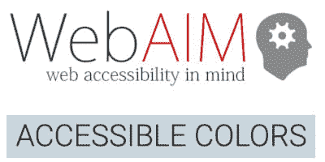
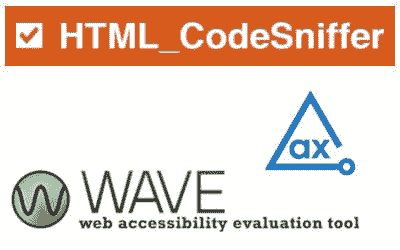
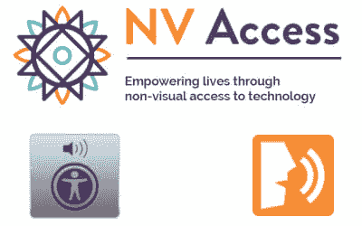

# 免费的网络辅助工具

> 原文：<https://dev.to/alvaromontoro/free-web-accessibility-tools-4kfd>

这个网页可访问性工具的列表会有点不寻常。其中一些甚至不能被认为是可访问性工具，尤其是第一部分中的那些。但是，可用性和可访问性是密切相关的，一些可用性测试将有助于改善和提高网站的可访问性。

考虑到这几点，我挑选了 12 种工具，并将它们分成四个不同的类别:

1.  **通用验证工具**:不一定与可访问性有关，而是与 web 验证有关。
2.  **色彩对比检查器**:检测对比度问题的专用工具。
3.  **通用可访问性验证工具**:扫描技术可访问性问题。
4.  **屏幕阅读器**:将遍历屏幕以读取其内容的程序。

上面的列表顺序也不是随机的。一些工具的范围是重叠的，但是在我看来，这种顺序对于使用不同的程序和执行可访问性测试是理想的。如果出于某种原因，你没有运行任何测试，或者如果你想开始但不知道如何开始，从 #1 开始，一直到 #4 。

## 通用验证工具

这是一组通常不被认为与辅助功能相关的工具，但是它们会发现辅助功能工具通常检测不到的潜在辅助功能问题(例如，格式不正确的 HTML、图像大小建议等。).

修复这些工具报告的问题不仅仅是提高可访问性:性能、搜索引擎优化、安全性...从这个意义上来说，它们是确保你的网站不仅构建合理，而且易于访问的第一步。

### [W3C HTML 验证器](https://validator.w3.org/)

W3C HTML 验证服务将检查你的文档的标记有效性。它不会关注可访问性，但它将发现的许多问题可能会改善当前的可访问性状态(例如，缺少像`alt`这样的属性)和其他一些有助于为更好的可访问性站点铺平道路的问题(例如，格式不正确/嵌套的 HTML 元素)。

### [GTMetrix](https://gtmetrix.com/)

这是我最喜欢的测试 HTML 兼容性和性能的工具之一。它不仅提供了非常有用的信息和链接，而且在某些情况下还提供了解决方案。例如，如果图像的大小或格式不正确，它会对其进行处理并生成更适合您下载的新图像，从而简化纠正过程。

### [灯塔](https://developers.google.com/web/tools/lighthouse/)

Lighthouse 集成在 Chrome 中(可以在开发者工具的审计选项卡中找到)，在运行时，它还提供对性能、最佳实践、SEO 和可访问性的分析。它提供了关于如何改进 HTML、CSS、JavaScript 甚至服务器配置的有价值的信息，以使您的网站更有用和更具交互性。

## 颜色对比方格

在[web aim Million](https://webaim.org/projects/million/)分析中发现，文本/图像与其背景之间的颜色对比度不足是最常见的问题。因此，将对比度检查器作为一个独立的部分也就不足为奇了(即使下一节中的工具包含了它们自己的颜色对比度检查器)。

有许多工具可以帮助检测对比度不足，所有这些工具都有其优点和缺点。更重要的是找到一个符合你需求的[或轻松开发你自己的](https://codepen.io/alvaromontoro/full/YgpWZG)。

### [WebAIM 色彩对比检查器](https://webaim.org/resources/contrastchecker/)

这个 WebAIM 工具并不是特别特别。它类似于大多数其他在线颜色对比检查工具，因为它易于使用，并包含有关指导方针的详细信息。

### [无障碍颜色](http://accessible-colors.com/)

这个网站允许定制一些颜色对比测试(字体大小，颜色，可访问性级别等)。)，但有趣的是，它比只计算颜色对比度更进了一步。如果颜色不匹配并且没有通过验证，可访问的颜色将建议实际上通过测试的新组合。

### [Chrome 开发者工具](https://developers.google.com/web/updates/2018/01/devtools#contrast)

谷歌 Chrome 包括一个有趣的颜色对比检查器和开发者工具。它是我见过的少数几个允许多种颜色格式的，它有一个很棒的图形界面，你可以看到哪些值是可访问的，哪些是不可访问的。我发现的唯一缺点是，只有在元素定义了颜色和背景属性的情况下，它才有效。(并没有从祖先推断出他们。)

## 通用辅助功能验证工具

你一定在说，“*终于！*“这些是大多数人与可访问性(以及屏幕阅读器)联系在一起的工具，也是您可能期望的工具。(我一开始就说这是个不寻常的名单。)

有了这些工具，你将能够扫描一个站点，通常一次扫描一个页面，查找可访问性问题:颜色问题、内容杂乱、空链接、缺少`alt`属性等。但是，对结果要有所保留。尽管它们对于检测技术问题非常有用，但是有些指南并不总是技术性的，可能会从这些工具的缝隙中溜走。

### [韦伯波](https://wave.webaim.org/)

这个工具可能是我最喜欢的辅助功能应用程序，部分原因是因为它是我用来开始和学习基础知识的工具。我会用它的在线模式(后来又用它方便的 [Chrome 插件](https://chrome.google.com/webstore/detail/wave-evaluation-tool/jbbplnpkjmmeebjpijfedlgcdilocofh)和 [Firefox 插件](https://addons.mozilla.org/en-US/firefox/addon/wave-accessibility-tool/))来检查我的网页，阅读错误、错误描述以及修复错误的建议。我喜欢这个工具的另一点是它的颜色对比检查器，与其他工具相比，它可以更准确地推断祖先的背景。

### [轴](https://chrome.google.com/webstore/detail/axe/lhdoppojpmngadmnindnejefpokejbdd)

Axe 是另一个可以在 Chrome 和 Firefox 上运行的插件。它功能强大，易于在您的日常编程中采用(尽管您必须打开开发人员工具才能使用它)，并且由于其全面的导航和问题分类，分析组织得很好。

### [HTML_CodeSniffer](http://squizlabs.github.io/HTML_CodeSniffer/)

这个工具的工作方式有两种:(1)通过解析工具网站上的 HTML 代码直接在线；以及(2)作为书签，你可以在任何页面上激活它，而不依赖于所使用的浏览器。结果是合理的，但有时 HTML_CodeSniffer 报告的误报数量(特别是与颜色对比度相关的)有点高。您可以这样记录误报，该工具不会再次检测到它们。

## 屏幕阅读器

您已经用上面的可访问性检查器运行了测试，结果都是肯定的。这是否意味着你的网站是完全可访问和兼容的？不幸的是，没有。所有以前的工具都很棒，但是它们主要检查技术需求，或者“理论”但可能还是需要一些真正的“实用性”。

这就是屏幕阅读器有用的地方。熟练地使用它们并以与残疾用户相似的方式浏览你的网站需要时间，但是达到一个舒适的熟练水平并不需要太多时间，特别是当许多屏幕阅读器有共同的命令或共享指令时。

### [NVDA](https://www.nvaccess.org/)

NVDA 是一个神奇的工具。它简单明了，易于使用，可靠，而且非常强大。它是我在 Windows 下工作时的首选屏幕阅读器...哪一个是它的主要问题:它只适用于 Windows 机器([这里作者解释了为什么](https://www.nvaccess.org/post/in-process-18th-april/))。但是，它的可用性和性能使它成为一个令人难以置信的工具，能够与其他价格数百美元的屏幕阅读器竞争。

### [配音](https://help.apple.com/voiceover/mac/10.14/)

Mac 用户在 Mac OS 系统中集成了一个很好的屏幕阅读器。VoiceOver 可以通过按`Command` + `F5`来激活，并以类似的方式停用。与 NVDA 一样，这是一个全屏阅读器，它将超越浏览器的范围，阅读每个程序(如果你只想测试一个网站，这可能有点烦人)。

### [ChromeVox](https://chrome.google.com/webstore/detail/chromevox/kgejglhpjiefppelpmljglcjbhoiplfn)

如果你使用 Chrome，这个插件对于可访问性是必须的。当激活时，它将作为一个屏幕阅读器，并提供其他屏幕阅读器包含的大部分功能。(关键词:“最。”)它的核心功能真的很好，是快速测试东西的好方法。ChromeVox 的通过不一定意味着 NVDA 或 VoiceOver 的通过，但 ChromeVox 的失败肯定是其他屏幕阅读器的失败。

## 结论

这个列表包括我每天都在使用的工具，用来测试和确保应用程序的网页可访问性。所有的工具都有其优点和缺点(这是我多次并行使用它们的原因，即使有些工具运行相同的测试)，但是这些工具总体上是利大于弊的。

许多伟大的工具，如 [Sortsite](https://www.powermapper.com/products/sortsite/) 、 [Total Validator](https://www.totalvalidator.com/) 、 [JAWS](http://www.freedomscientific.com/products/software/jaws/) 或 [ZoomText](http://www.freedomscientific.com/products/software/zoomtext/) 都不见了，但你必须为它们付费(尽管前两个有一些不错的试用版)，我想将列表限制为免费工具。

你用什么工具来测试可访问性？你会推荐或添加哪一个到这个列表中？

<small>注意:所有工具标识都有版权/商标，归开发它们的不同公司/组织所有。</small>