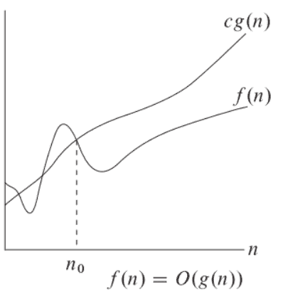
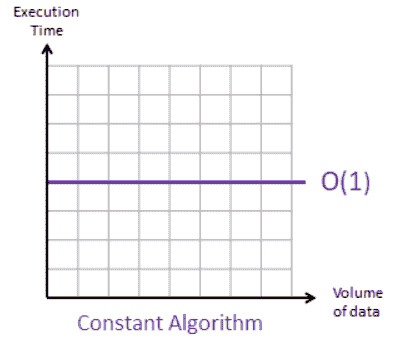
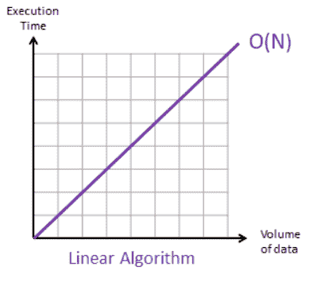
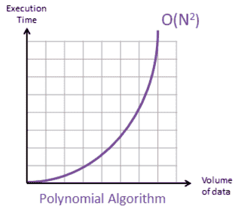
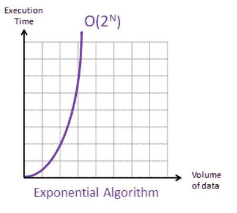
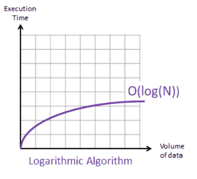
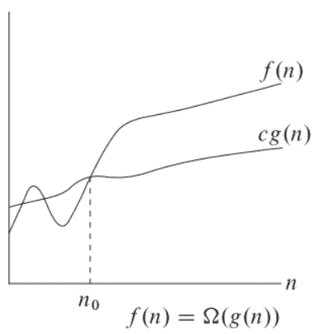
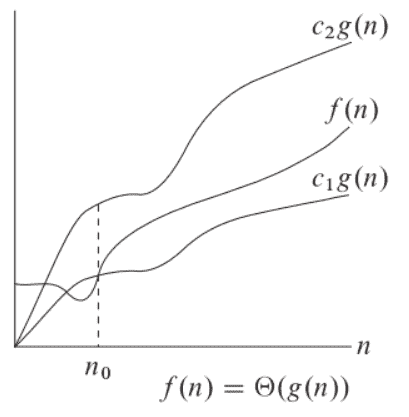

# 渐近符号 B(OOT):大 O，大ω，大θ

> 原文：<https://dev.to/sherryummen/asymptotic-notations-b-oot-big-o-big-omega-big-theta-49e7>

当你写一个算法或者解决一些计算问题的时候，你经常希望有一个有效的工作代码。在普通语言中，我们会说它快或慢或足够快。这个术语可以引用，但是为了定量，我们有符号，可以用在这里。这些符号被称为渐近符号。为了简单起见，这些符号用来分析一个算法，当给定一个特定的输入时，它是如何执行的。

# 符号的种类

1.  **Big-O(大 O)** 【大气或上限】
2.  **大ω(大ω)**【至少或下限】
3.  **大-θ(大θ)**【范围或紧界】

1.**大 O(大 O)**

这种符号用于定义算法的上限或定义算法的最坏情况。

**数学符号:** f(n) = O(g(n))。其中正常数 c 和 n0 使得 0 ≤ f(n) ≤ c*g(n)对于所有 n ≥ n0

**图形表示:**

[](https://res.cloudinary.com/practicaldev/image/fetch/s--a6V8ZLwu--/c_limit%2Cf_auto%2Cfl_progressive%2Cq_auto%2Cw_880/https://i.imgur.com/1pJRdVx.png)

现在，Big-O 符号是最流行的一种，当我们谈论时间复杂性时，通常都与 Big-O 有关。

Big-O 有几个符号。让我们一个一个来看。

*   **常数- O(1)**

这意味着无论输入大小如何，执行时间总是相同的。

**举例:**

```
 item = items[0] 
```

**图形表示:**

[](https://res.cloudinary.com/practicaldev/image/fetch/s--YgbJ2wkR--/c_limit%2Cf_auto%2Cfl_progressive%2Cq_auto%2Cw_880/https://i.imgur.com/dMFdtwG.png)

*   **线性- O(n)**

这意味着执行时间与输入成正比，即如果输入大小增加或减少，执行时间也会增加或减少。

**举例:**

```
 element_found = [x for i,x in enumerate([2,3,5]) if x==5] 
```

在上面的例子中，以线性搜索方式搜索元素。

**图形表示**

[](https://res.cloudinary.com/practicaldev/image/fetch/s--1YnYNm5b--/c_limit%2Cf_auto%2Cfl_progressive%2Cq_auto%2Cw_880/https://i.imgur.com/I0P7TQl.png)

*   **二次- O(n <sup>2</sup> )**

这意味着算法的执行时间与输入大小的平方成正比。

**举例:**

```
 for i in [2,3,4,5]:
            for z in [5,4,3,2]:
                print(f"Match {z}") if i == z else '' 
```

上面的例子有嵌套循环，这使它成为一个二次运算。

**图形表示**

[](https://res.cloudinary.com/practicaldev/image/fetch/s--TvuprQWj--/c_limit%2Cf_auto%2Cfl_progressive%2Cq_auto%2Cw_880/https://i.imgur.com/399gEs2.png)

*   **指数- O(2 <sup>n</sup> )**

这意味着输入集中每增加一个元素，执行时间就会加倍。

**举例:**

```
 def fibonacci(n):
        if n <= 1:
            return n
        else:
            return((fibonacci(n-1) + fibonacci(n-2))) 
```

**图形表示**

[](https://res.cloudinary.com/practicaldev/image/fetch/s--LLNQxEaG--/c_limit%2Cf_auto%2Cfl_progressive%2Cq_auto%2Cw_880/https://i.imgur.com/KDHF4j1.png)

*   **对数- O(log(n))**

如果一个算法每次把问题分成两半来解决，那么它就是 O(log n)。一个很好的例子是二分搜索法算法。

**图形表示**

[](https://res.cloudinary.com/practicaldev/image/fetch/s--kObyo95Z--/c_limit%2Cf_auto%2Cfl_progressive%2Cq_auto%2Cw_880/https://i.imgur.com/Fg01005.png)

从图中可以看出，在初始输入时，它趋于增长，但随着输入大小的增加，它逐渐停止增长或以线性速率增长。它非常适合较大的输入集。

*   **阶乘- O(！n)**

是一种尝试给定输入数组的所有排列的算法。这是性能最差的算法之一，因此你不希望你的算法达到这个水平。

**举例:**

最常谈论的阶乘复杂度算法是旅行商问题，当使用蛮力方法时，所有可能的路径组合被评估。另一个例子是得到一个数的阶乘。

```
 def factorial(n):
            for i in range(n):
                factorial(n-1) 
```

外部循环是 O(n)，内部函数用(n-1)递归调用，你得到 n * (n-1)* (n-2)*...*1 = n！所以函数是 O(n！).

2.**大ω(大ω)**

这种符号用于定义算法的下限。所以我们可以说一个给定的算法至少需要*一定的时间。*

**数学符号:**f(n)=ω(g(n))。其中正常数 c 和 n0 使得 0 ≤ c*g(n) ≤ f(n)对于所有 n ≥ n0

**图形表示:**

[](https://res.cloudinary.com/practicaldev/image/fetch/s--WG3pFNJL--/c_limit%2Cf_auto%2Cfl_progressive%2Cq_auto%2Cw_880/https://i.imgur.com/WP1QO6y.png)

**举例:**

在二进制搜索算法的情况下，我们可以说它的最佳情况是ω(1)，如果你正在寻找的数字正好落在中间。

3.**大-θ(Big-Theta)**

这种符号定义了算法执行时间的严格界限。因此，有一个上限和一个下限，算法执行时间将落在这个范围内。

**数学符号:** f(n) = θ(g(n))。其中正常数 n <sub>0</sub> ，c <sub>1</sub> ，c <sub>2</sub> 使得在 n <sub>0</sub> 的右边，f(n)的值总是位于 c <sub>1</sub> g(n)和 c <sub>2</sub> g(n)之间，即 0≤c<sub>1</sub>g(n)≤f(n)≤c<sub>2</sub>g(n)

**图形表示:**

[](https://res.cloudinary.com/practicaldev/image/fetch/s--m23tI3-l--/c_limit%2Cf_auto%2Cfl_progressive%2Cq_auto%2Cw_880/https://i.imgur.com/Ly9Ct2u.png)

**举例:**

```
 def search_index(num):
            for i, x in enumerate(list):
                if num == x:
                    return i 
```

在上面的例子中，下限(最好的情况)将是 O(1)，其中在 0 索引处找到该项目。并且上限(最坏情况)将是 O(n ),其中在最后一个索引处找到该项目。

**阅读和参考:**

*[https://www . khanacademy . org/computing/computer-science/algorithms/渐近符号/a/渐近符号](https://www.khanacademy.org/computing/computer-science/algorithms/asymptotic-notation/a/asymptotic-notation)*

*http://web.mit.edu/16.070/www/lecture/big_o.pdf*

*[https://i.stack.imgur.com/nLm8w.png](https://i.stack.imgur.com/nLm8w.png)*

*[https://guide . freecodecamp . org/computer-science/notation/big-o-notation/](https://guide.freecodecamp.org/computer-science/notation/big-o-notation/)*

*[https://stack abuse . com/big-o-notation-and-algorithm-analysis-with-python-examples/](https://stackabuse.com/big-o-notation-and-algorithm-analysis-with-python-examples/)*

*[https://www . daveperrett . com/articles/2010/12/07/comp-sci-101-big-o-notation/](https://www.daveperrett.com/articles/2010/12/07/comp-sci-101-big-o-notation/)*

*https://www.101computing.net/big-o-notation/*