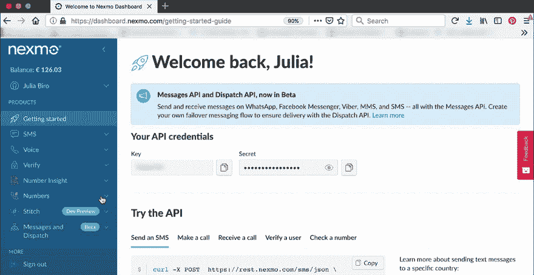
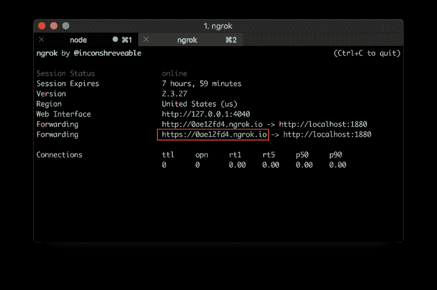
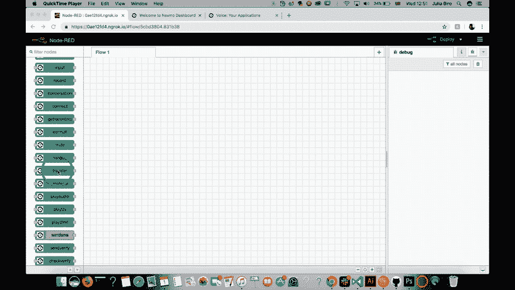
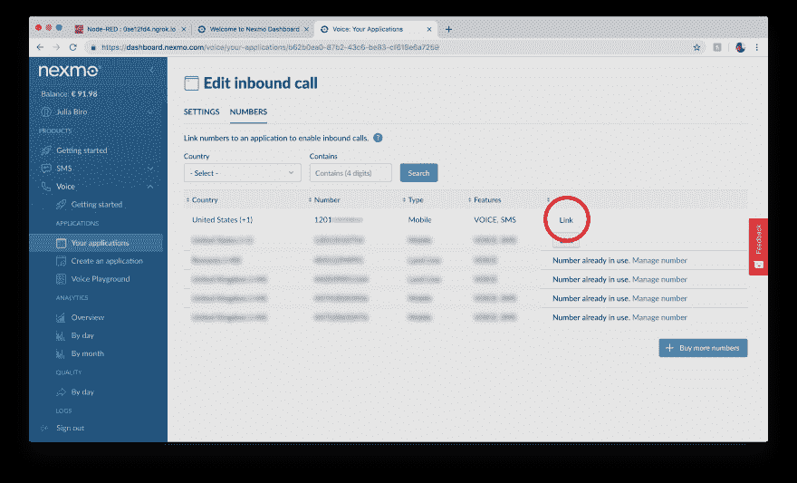
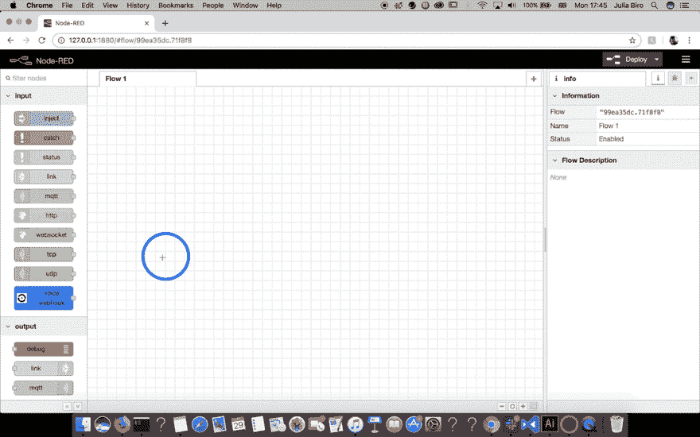
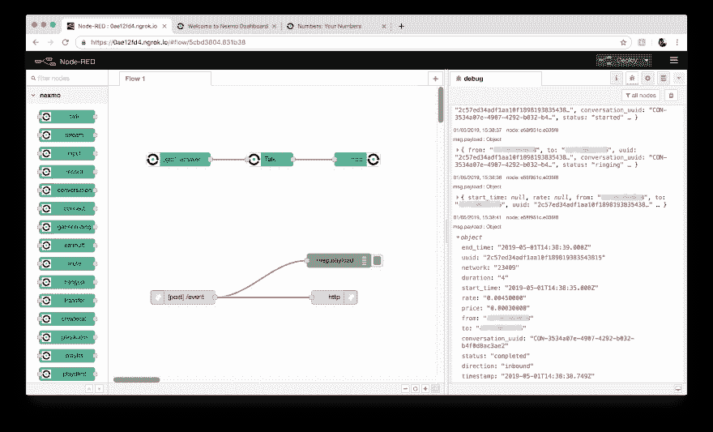

# 如何用 Node-RED 接听电话

> 原文：<https://dev.to/vonagedev/how-to-receive-phone-calls-with-node-red-3ihc>

*这是“Nexmo 和 Node-RED 入门”系列教程的第三篇文章。*

在[之前的教程](https://www.nexmo.com/blog/tag/node-red/)中，您已经学习了如何使用 Nexmo SMS API 以编程方式发送和接收 SMS 消息，以及如何处理交付收据。

接下来，您将进入下一章，探索 Nexmo 语音 API。

到本文结束时，您已经用 Node-RED 处理了第一个入站呼叫。

## 先决条件

开始之前，您需要一些东西:

*   安装在您机器上的 [Node.js](https://nodejs.org/en/) 和 [Node-RED](https://nodered.org/docs/getting-started/installation)
*   Nexmo 帐户— [如果您还没有，请免费创建一个](https://dashboard.nexmo.com/sign-up)
*   可选:[ngrok](https://ngrok.com/download)—了解[亚伦的博客文章](https://www.nexmo.com/blog/2017/07/04/local-development-nexmo-ngrok-tunnel-dr/)

### 领取证件

为了与语音 API 进行交互，您需要注意一些事情。一旦你创建了一个 Nexmo 账户，进入[仪表盘](https://dashboard.nexmo.com)找到你的 API 密匙和密码。

接下来，你需要一个支持语音的虚拟号码。前往 Numbers > [购买 numbers](https://dashboard.nexmo.com/buy-numbers) 获得一个。

[](https://res.cloudinary.com/practicaldev/image/fetch/s--WZszTx09--/c_limit%2Cf_auto%2Cfl_progressive%2Cq_66%2Cw_880/https://www.nexmo.com/wp-content/uploads/2019/04/buy-number-nexmo-dashboard.gif)

### 设置你的节点-红色编辑器

首先，你需要[安装](https://nodered.org/docs/getting-started/installation)运行时和编辑器。这可以在您的本地机器、单板计算机(例如 Raspberry Pi)上完成，也可以在许多云托管选项上完成。这个示例将使用您的本地机器，所以一旦您已经全局安装了 Node-RED，只需在您的终端中键入以下命令即可开始。

```
$ node-red 
```

然后，您可以通过将浏览器指向 [http://localhost:1880](http://localhost:1880) 来访问 Node-RED 编辑器。

打开编辑器后，您需要安装 Nexmo 节点。你可以在*管理调色板*菜单下搜索`node-red-contrib-nexmo`包并点击安装。

[](https://res.cloudinary.com/practicaldev/image/fetch/s--wm0553i1--/c_limit%2Cf_auto%2Cfl_progressive%2Cq_66%2Cw_880/https://www.nexmo.com/wp-content/uploads/2019/05/install-nexmo-nodered.gif)

现在，您应该看到所有的 Nexmo 节点出现在屏幕的左侧，在其他默认节点中。

## 用 Node-RED 处理来电

### 将您的本地服务器暴露在互联网上

首先，您必须将您的本地服务器暴露在互联网上，以便 Nexmo 可以访问它。如果你在一个公共的网络服务器上运行 Node-RED，而不是在你的本地机器上，你可以跳过这个阶段。

否则，一种方便的方法是使用隧道服务，如 [ngrok](https://ngrok.com) 。

[下载](https://ngrok.com/download)并安装 **ngrok** ，然后在终端运行它，在端口`1880`上启动隧道。

```
$ ./ngrok http 1880 
```

导航到显示的 URL 以找到您的节点红色编辑器。

[](https://res.cloudinary.com/practicaldev/image/fetch/s--CqlDdkeh--/c_limit%2Cf_auto%2Cfl_progressive%2Cq_auto%2Cw_880/https://www.nexmo.com/wp-content/uploads/2019/05/ngrok-inbound-call.png)

### 创建 Nexmo 应用程序

在之前的 SMS 教程中，您能够直接使用端点配置电话号码；然而，情况并非总是如此。

包括语音 API 在内的一些 Nexmo API 使用 Nexmo 应用程序来保存连接到 NEX mo 端点所需的安全和配置信息。

在 Nexmo Node-RED 调色板中，有几个节点能够创建这些应用程序:`getrecording`、`earmuff`、`mute`、`hangup`、`transfer`、`createcall`、`playaudio`、`playtts`和`playdtmf`。

将这些节点中的任何一个拖到您的工作区中，然后双击它以打开节点编辑器。

在`Nexmo Credentials`旁边，从下拉菜单中选择“添加新 nexmovoiceapp…”并点击编辑按钮。填写下面的详细信息，然后点击`Create New Application`。

| 键 | 描述 |
| --- | --- |
| `Name` | 为您的语音应用程序选择一个名称，例如`inbound call`。 |
| `API Key` | 您的 Nexmo API 密钥，显示在您的[账户概述](https://dashboard.nexmo.com/getting-started-guide)中。 |
| `API Secret` | 您的 Nexmo API 秘密，显示在您的[账户概述](https://dashboard.nexmo.com/getting-started-guide)中。 |
| `Answer URL` | 您的 _URL/answer，您将在此托管一个 Nexmo 呼叫控制对象(NCCO)。稍后会有更多相关内容。 |
| `Event URL` | YOUR_URL/event，您需要在设置事件处理程序时引用它。 |

Node-RED 将在您的帐户上创建一个新的 Nexmo 应用程序，并填写应用程序 ID 和私钥字段供您保存。在这个步骤之后，可以随意删除您使用的 Nexmo 节点，因为已经创建了一个`nexmovoiceapp` config 节点，它包含了这个流需要的所有 Nexmo 凭证。

[](https://res.cloudinary.com/practicaldev/image/fetch/s--5eBq9X4---/c_limit%2Cf_auto%2Cfl_progressive%2Cq_66%2Cw_880/https://www.nexmo.com/wp-content/uploads/2019/05/create-voiceapp.gif)

接下来，您必须将您的虚拟号码与该应用程序关联。

导航至*语音* > *[您的应用](https://dashboard.nexmo.com/voice/your-applications)* ，在 Nexmo 仪表盘中找到您刚刚创建的语音应用。

点击这个应用程序的名称，然后在*号码*标签下点击你之前租用的虚拟号码旁边的**链接**按钮。

或者，如果您想要使用的号码已经链接到另一个应用程序，请点击**管理号码**并将其配置为将来电转移到您的应用程序。

[](https://res.cloudinary.com/practicaldev/image/fetch/s--Hap19NJx--/c_limit%2Cf_auto%2Cfl_progressive%2Cq_auto%2Cw_880/https://www.nexmo.com/wp-content/uploads/2019/05/link-number-voiceapp.png)

### 构建 Nexmo 呼叫控制对象(NCCO)

Nexmo 调用使用 *Nexmo 调用控制对象*进行控制，也称为 NCCOs。NCCO 定义了处理呼叫时要遵循的操作列表。有许多不同的动作可用，在你的 Node-RED 编辑器中的 Nexmo 调色板下找到相应的节点，或者查看 [NCCO 参考](https://developer.nexmo.com/api/voice/ncco)以找到更多关于它们的信息。

在本教程中，您将使用`talk`动作。

将 **`talk`** 节点拖放到您的工作区，然后将其连接到一个 **`voice webhook`** 输入节点和一个 **`return NCCO`** 输出节点。

接下来，在 **`voice webhook`** 节点中，选择`GET`作为方法，并在答案 URL 字段中键入类似`/answer`的内容。

最后，转到 **`talk`** 节点属性，并将`Text{}`字段设置为您希望在呼叫被应答时读出的消息。注意`Text`标签旁边的`{}`符号，表示这个值可以使用 [Mustache 模板](https://mustache.github.io/)动态设置。您也可以选择一个`Voice Name`，有关选项的完整列表，请参见[文本到语音转换指南](https://developer.nexmo.com/voice/voice-api/guides/text-to-speech#voice-names)。

[](https://res.cloudinary.com/practicaldev/image/fetch/s--a4h2NjdP--/c_limit%2Cf_auto%2Cfl_progressive%2Cq_66%2Cw_880/https://www.nexmo.com/wp-content/uploads/2019/05/create-tts-ncco.gif)

### 为事件 URL 设置处理程序

将一个`http`输入节点连接到一个`http response`节点，以及一个`debug`节点，这样您就可以在调试区域查看您的交货收据。

在 **`http`** 输入节点中，选择`POST`作为`Method`，在`URL`字段中填入类似`/event`的内容。

**`http response`** 节点应该将`200`设置为`Status code`，但不用担心，这也是默认值。

现在点击 **Deploy** ，呼叫您的虚拟号码，并在调试侧边栏中跟踪您的呼叫流程。

[](https://res.cloudinary.com/practicaldev/image/fetch/s--8wjLrWDm--/c_limit%2Cf_auto%2Cfl_progressive%2Cq_auto%2Cw_880/https://www.nexmo.com/wp-content/uploads/2019/05/inbound-call-debug.png)

## 下一步

在本教程中，您已经学习了如何向来电者播放文本到语音的消息。以非常相似的方式，你也可以向他们播放音频文件，或者将呼叫转移到一个电话号码。如果你想更进一步，为什么不录下对话或设置你的自定义语音邮件呢？请继续关注，了解如何做到这一点！

## 资源

*   关于[语音 API](https://developer.nexmo.com/voice/voice-api/overview) 的更多信息
*   查看 [NCCO 参考资料](https://developer.nexmo.com/voice/voice-api/ncco-reference)，了解控制通话的多种方式。

## - [文字转语音向导](https://developer.nexmo.com/voice/voice-api/guides/text-to-speech#voice-names)

[宣布 Nexmo Node-RED 包](https://www.nexmo.com/blog/2019/02/21/nexmo-node-red-package-dr/)

*   [如何用 Node-RED 发送短信](https://dev.to/nexmo/how-to-send-sms-messages-with-node-red-2l2o)
*   [如何用 Node-RED 接收短信](https://dev.to/nexmo/how-to-receive-sms-messages-with-node-red-55ll)
*   仔细看看[节点——红色](https://nodered.org/docs/)