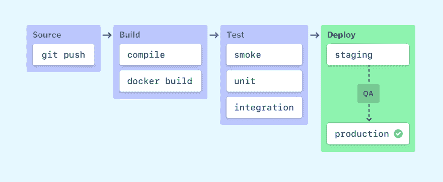
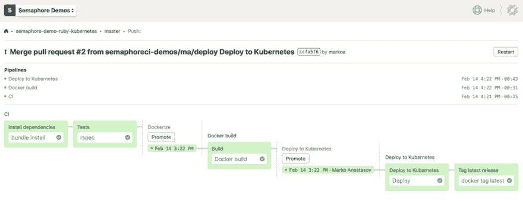

# CI/CD 管道:温和的介绍

> 原文：<https://dev.to/markoa/ci-cd-pipeline-a-gentle-introduction-2n8k>

你想以高速度发布无 bug 代码吗？随着时间的推移，快速可靠的 CI/CD 渠道对于可持续发展至关重要。

## 什么是 CI/CD 管道？

CI/CD 管道帮助您自动化软件交付过程中的步骤，例如启动代码构建、运行自动化测试，以及部署到阶段化或生产环境。自动化管道消除了人工错误，提供了标准化的开发反馈循环，并实现了快速的产品迭代。

## CI 和 CD 是什么意思？

CI 是持续集成的缩写，是一种软件开发实践，在这种实践中，所有开发人员每天多次将代码变更合并到一个中央存储库中。CD 代表持续交付，它在持续集成的基础上增加了自动化整个软件发布过程的实践。

 [## 解释了持续集成

### 马尔科·阿纳斯塔索夫 7 月 3 日 1915 分钟阅读

#cicd #productivity #beginners #devops](/markoa/continuous-integration-explained-59f9)

使用 CI，代码中的每一个变更都会触发给定项目的自动构建和测试序列，从而向做出变更的开发人员提供反馈。整个 CI 反馈循环应该在 10 分钟内完成。

 [## 什么是适当的持续集成？

### 马尔科·阿纳斯塔索夫 10 月 4 日 183 分钟阅读

#ci #cicd #devops #productivity](/markoa/what-is-proper-continuous-integration-585c)

连续交付包括基础架构配置和部署，这可能是手动的，并且包含多个阶段。重要的是，所有这些过程都是完全自动化的，每次运行都被完整地记录下来，并对整个团队可见。

## CI/CD 管道的元素

CI/CD 管道听起来像是开销，但实际上不是。它本质上是为了交付软件产品的新版本而需要执行的步骤的可运行的规范。在没有自动化流水线的情况下，工程师仍然需要手动执行这些步骤，因此效率低得多。

大多数软件版本都会经历几个典型的阶段:

每个阶段的失败通常会触发一个通知—通过电子邮件、Slack 等。—让负责任的开发人员了解原因。否则，通知通常被配置为在每次成功部署到生产环境后发送给整个团队。

### 源阶段

在大多数情况下，管道运行由源代码库触发。代码中的变化触发对 CI/CD 工具的通知，CI/CD 工具运行相应的管道。其他常见的触发器包括自动计划的或用户启动的工作流，以及其他管道的结果。

### 建造阶段

我们将源代码和它的依赖项结合起来，构建我们产品的一个可运行的实例，我们有可能将它交付给我们的最终用户。用 Java、C/C++或 Go 等语言编写的程序需要编译，而 Ruby、Python 和 JavaScript 程序则不需要这一步。

不管使用何种语言，云原生软件通常与 Docker 一起部署，在这种情况下，CI/CD 管道的这一阶段构建 Docker 容器。

未能通过构建阶段是我们项目配置中一个基本问题的指示器，最好立即解决它。

### 测试阶段

在这个阶段，我们运行自动化测试来验证代码的正确性和产品的行为。测试阶段就像一个安全网，防止容易重现的错误到达最终用户。

编写测试的责任落在开发人员身上，最好是在我们编写新代码的过程中完成[测试驱动或行为驱动开发](https://semaphoreci.com/community/tutorials/behavior-driven-development)。

根据项目的规模和复杂程度，这个阶段可能会持续几秒到几小时。许多大型项目在多个阶段运行测试，从执行快速健全检查的[冒烟测试](https://semaphoreci.com/community/tutorials/smoke-testing)开始，到从用户角度测试整个系统的端到端集成测试。大型测试套件通常被并行化以减少运行时间。

测试阶段的失败暴露了开发人员在编写代码时没有预见到的问题。在这个阶段，当问题空间在开发人员的脑海中仍然清晰，并且他们可以保持流动状态时，快速向开发人员提供反馈是非常重要的。

 [## 利用 TDD 和持续交付创建流程

### 马尔科·阿纳斯塔索夫 12 月 20 日 185 分钟阅读

#productivity #cicd #testing #programming](/markoa/creating-flow-with-tdd-and-continuous-delivery-jf5)

### 部署阶段

一旦我们构建了代码的可运行实例，并且通过了所有预定义的测试，我们就可以部署它了。通常有多个部署环境，例如由产品团队内部使用的“beta”或“staging”环境，以及面向最终用户的“production”环境。

采用敏捷开发模型的团队——由测试和实时监控指导——通常将正在进行的工作手动部署到阶段环境中，以进行额外的手动测试和审查，并自动将批准的变更从主分支部署到生产环境中。

## CI/CD 管道示例

管道可以非常简单地开始。下面是一个 Go 项目的管道示例，它编译代码，检查代码风格，并在两个并行任务中运行自动化测试:

管道是用基于云的 CI/CD 服务[信号量](https://semaphoreci.com)实现的。

下面是一个更复杂的管道示例，它为 Kubernetes 集群构建、测试和部署微服务:

下面是如何构建它:

 [## 数字海洋 Kubernetes 上微服务的 CI/CD

### 马尔科·阿纳斯塔索夫 3 月 13 日 19 时 12 分阅读

#kubernetes #tutorial #devops #cicd](/markoa/cicd-for-microservices-on-digitalocean-kubernetes-1dg1)

信号量文档提供了更多 CI/CD 管道的例子。

## 管道的附加好处

拥有一个 CI/CD 渠道比简单地使以前做的事情更有效率有更多的积极影响:

*   开发人员可以专注于编写代码和监控系统在生产中的行为。
*   QA 和产品利益相关者可以轻松访问系统的最新或任何版本。
*   产品更新压力不大。
*   所有代码变更、测试和部署的日志可随时查阅。
*   出现问题时回滚到以前的版本是一个常规的按钮操作。
*   快速的反馈循环有助于建立一种学习和责任的组织文化。

 [## 持续交付有助于建立学习文化的 7 种方式

### 马尔科·阿纳斯塔索夫 9 月 19 日 183 分钟阅读

#continuousdelivery #devops #productivity #agile](/markoa/7-ways-continuous-delivery-helps-build-a-culture-of-learning-11o5)

快乐大厦！