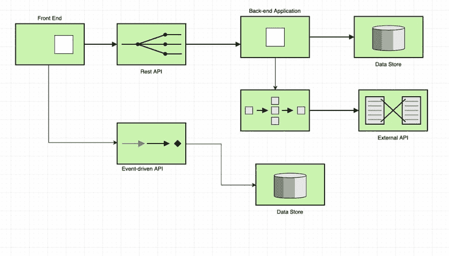
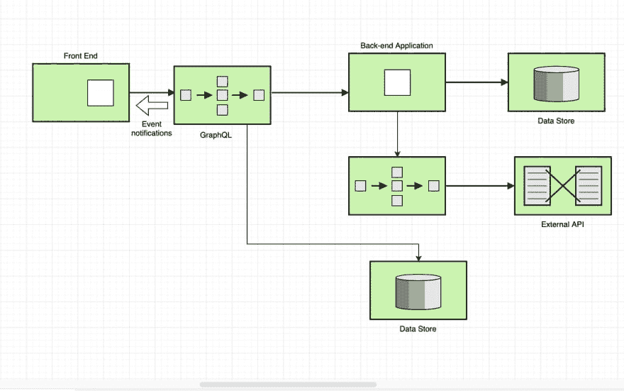
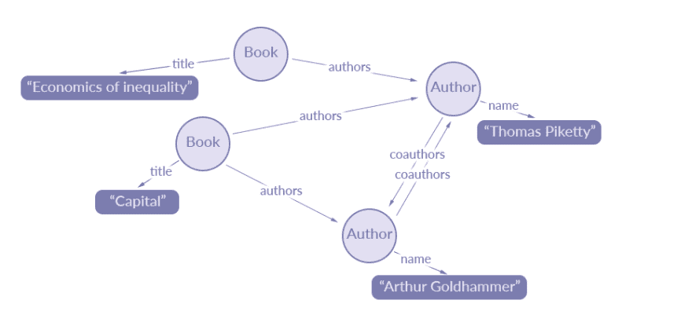

# GraphQL 第 0 部分:等待，什么是 GraphQL？

> [https://dev . to/heroku/graph QL-part-0-wait-what is-graph QL-8cj](https://dev.to/heroku/graphql-part-0-wait-what-is-graphql-8cj)

在我让朋友们在 Heroku 上阅读了[GraphQL 入门，并意识到许多人对 graph QL 的“是什么”和“为什么”有更基本的疑问之后，我写了这篇文章。希望这有帮助！](https://dev.to/tobyfee/getting-started-with-graphql-on-heroku-243b)

## graph QL 是干什么用的？

GraphQL 是您当前数据的 REST API 接口的潜在替代或增强。与使用传统的 REST API 相比，它可以减少获取所需数据的往返次数。

## 所以它取代了 REST API 的？

是啊！通常情况下。它取代了 _your _internal REST API。对于外部或合作伙伴 API，您可以配置您的 GraphQL 服务器向该合作伙伴 API 发出请求，然后从单个 GraphQL 端点提供所有数据，包括内部和外部数据。

问“GraphQL 在这样的图中处于什么位置？”最有意义

[](https://res.cloudinary.com/practicaldev/image/fetch/s--okB8Fbun--/c_limit%2Cf_auto%2Cfl_progressive%2Cq_auto%2Cw_880/https://pbs.twimg.com/media/D56VZ_pU0AICgXn%3Fformat%3Dpng%26name%3Dmedium)

好吧，让我们在深入探讨之前先退一步...

## 部署 GraphQL 的目标应该是什么？

*   用只需要一个请求/响应来构建整个页面的东西来替换您的 API
*   将所有请求统一到一个“数据图”中，其中 GraphQL 处理所有数据，包括多个内部 API、数据源、*和*外部 API

GraphQL 的一些实现可能不做后者，尽管前者应该是使用 GraphQL 的一个目标。

## 回到我的问题，它取代了你的 REST API？

除此之外，让我们更新一下我们的服务地图:

[](https://res.cloudinary.com/practicaldev/image/fetch/s--CLOKyzEc--/c_limit%2Cf_auto%2Cfl_progressive%2Cq_auto%2Cw_880/https://pbs.twimg.com/media/D56WUh2VUAATWVM%3Fformat%3Dpng%26name%3Dmedium)

*我不仅替换了我的 REST API，还移除了我的事件驱动 API，因为 [GraphQL 有了“订阅”](https://graphql.org/blog/subscriptions-in-graphql-and-relay/)来通知我的前端数据变化。*

GraphQL 可以在数据更新时发送通知，这应该是您需要事件驱动 API 的唯一原因。当然，您可能正在更新基于 webhooks 的 UI，该 web hooks 宣布了爱荷华州的雷击，在这种情况下，您仍然需要某处的事件 API！

## 那么，GraphQL 是数据库吗？

不，你的数据库结构不会改变，GraphQL 所做的是将你的数据统一到一个单一的“数据图”中，在那里你的所有数据都应该是可用的。

GraphQL 有数百个组件可用于添加新的[【数据源】](https://www.apollographql.com/docs/apollo-server/features/data-sources)，让您的数据图包含公共 API、私有数据库、内部 API 等。

[](https://res.cloudinary.com/practicaldev/image/fetch/s--i2aI6HYf--/c_limit%2Cf_auto%2Cfl_progressive%2Cq_auto%2Cw_880/https://cdn-images-1.medium.com/max/1600/1%2AEmhOknzZEu9Q6U3q5NmT9Q.png)

*这来自[达瓦·潘迪亚](https://blog.apollographql.com/@dpandya)关于 GraphQL 概念可视化’的精彩演讲T5】*

GraphQL 如此致力于图的概念，以至于图论语言悄悄进入了文档:“节点”是任何单个记录，“边”是这些记录之间的连接。

## 等等，我以前见过这个。一个对象关系映射(ORM)工具？

没有。GraphQL 不是一个映射数据库的工具，它不知道数据是如何进入它的“数据图”的，它的数据源需要单独配置。它还做一些在 ORM 空间中没有很好的类似物的事情，比如订阅。

此外，ORM 的一个基本部分是他们的请求是一种自然语言，比如:

## 作者为“史蒂夫·迪特科”的书籍

虽然这是一个合理的 ORM 请求，但是您得到的响应仍然是单一的，可能没有您需要的所有数据。GraphQL 的整个思想是，您请求您希望它呈现您的页面的“形状”的数据。

我不打算写太多关于这个的东西，因为你可能从来就不是一个 Rails 或 [bookshelf.js](http://bookshelfjs.org/) 的人，所以 ORM 是没有意义的——我只想说，GraphQL 是不同的！如果你想了解更多关于这个话题的内容，这里有一个很棒的 [StackOverflow 问题](https://stackoverflow.com/questions/46280014/is-graphql-an-orm)。

## graph QL 支持哪些格式的请求和响应？

GraphQL 请求看起来像一个发送的字符串，类似于 JSON

```
{

  hero {

    name

    height

    age

  }

} 
```

Enter fullscreen mode Exit fullscreen mode

*这个例子中缺少一些框架，这是本节的重要部分*

没有逗号，没有引号，没有方括号。这到底是怎么回事？我们是否在努力改进 JSON 标准？

不完全是，理解逻辑的最佳方式是*‘请求是最小的，并且以响应的形式’*

```
{

  "data": {

    "hero": {

      "name": "R2-D2",

      "age": 52,

      "name": 50,

    }

  }

} 
```

Enter fullscreen mode Exit fullscreen mode

响应将在 JSON 中返回，花括号将出现在类似的位置。从技术上来说，根据 GraphQL 规范，并没有特别要求响应以 JSON [的形式返回，但是我所知道的所有实现都是这样的。](https://graphql.github.io/graphql-spec/June2018/#sec-Serialization-Format)

## 我的 GraphQL 服务器会有 URL 吗，不同的数据会有不同的‘路由’吗？

在大多数标准实现中，您的 GraphQL 服务器将作为单个 URL 服务器，没有路由，因为查询字符串应该包含您想要的实际数据。

这些实现细节都不是 GraphQL 规范的一部分，尽管拥有多条路径会使一些常见的 GraphQL 工具如[graph QL](https://electronjs.org/apps/graphiql)表现奇怪。

## 等待...GraphQL 只是一个规范吗？

*叹息*

听着，我-

*叹息*

是的，从技术上来说，GraphQL 实际上只是 GraphQL [规范，它指定了应该如何请求数据](https://graphql.github.io/graphql-spec/June2018/#sec-Overview)。但实际上，当人们谈论 GraphQL 时，他们不仅仅是在谈论规范文档。

我觉得这种说法出现在大多数手册的早期，JavaScript 只是一种规范，SQL 只是一种规范，你使用的所有软件都不是真正的 JSON，真正的 JSON 只是这一个长文档。

一般来说，当谈到 GraphQL 时，我们只谈论服务器。原型例子是一个名为 GraphQL-JS 的 JavaScript 版本，但是[许多其他实现也是可用的](https://graphql.org/code/#javascript)。

虽然作为 GraphQL“客户端”的库并没有太大意义，但是 GraphQL 查询应该是一个非常简单的结构，并且与服务器的通信非常简单。

# 进一步阅读

同样， [Dhaivat Pandya](https://blog.apollographql.com/@dpandya) 关于“ [GraphQL 概念可视化”](https://blog.apollographql.com/the-concepts-of-graphql-bc68bd819be3)的精彩演讲绝对值得一看。所有关于 [Apollo GraphQL 项目](https://www.apollographql.com/)的例子和文档都是非常有价值的。

如果您觉得自己更了解 GraphQL 的基础知识，请查看我的 GraphQL 和 Heroku 系列的第 1 部分。

如果你对这一切感兴趣，你的下一步应该是从 GraphQL 团队的的[学习页面](https://graphql.org/learn/)上获得关于 [GraphQL 查询的完整系列。](https://graphql.org/learn/queries/)

如果你真的想学习 GraphQL，我怎么推荐[亚历克斯·班克斯](http://www.oreilly.com/pub/au/6913)和[伊夫·波尔切洛](http://www.oreilly.com/pub/au/6914)的[《学习 graph QL》](http://shop.oreilly.com/product/0636920137269.do)都不为过。