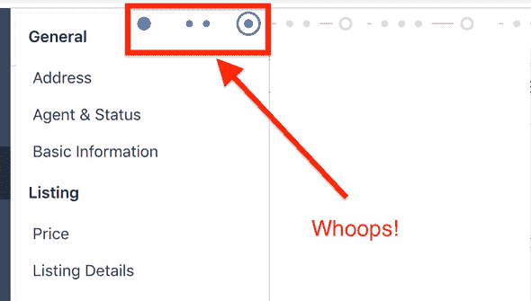
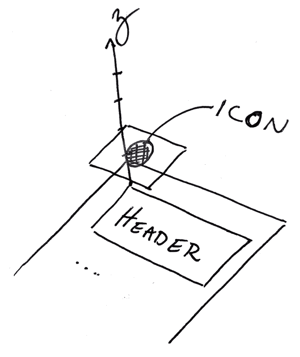

# z 指数:几何，不是魔术

> 原文：<https://dev.to/stephencweiss/z-index-geometry-not-magic-49hk>

这是事情最终明朗的时刻之一。我的同事正在描述如何使用 Z 索引来确保我的元素不会渗出，突然，我意识到该索引指的是第三个维度。

在 DOM 上组织元素一直让我感到困惑——不同的元素如何被推到一边、拉伸、发送到下一行等等。而且，每个问题都有多种不同的策略——所以没有一种*方法可以达到你想要的效果。*

在我的例子中，我正在开发一个菜单，当点击它时，会创建一个弹出菜单。

问题是菜单后面的元素(或者我认为会在菜单后面的元素)渗出来了(看到蓝点了吗？是啊，你不应该看到他们)。

问题是，弹出菜单完全位于窗口内(这样当它出现时不会移动其他东西)，但它的 Z 索引与构成蓝点的 SVG 相同(或更低)。这意味着就浏览器而言，它应该向他们展示！

提示灯泡时刻。

我们所谈论的是以一种*可预测的*方式堆叠不同的元素。由于其中至少有一个是绝对定位的，所以不会互相影响，互相推来推去。这意味着它们就像纸片一样，可以堆叠。如果它们有相同的 Z-index，那么哪个在上面是不可预测的。

这是因为 Z-index 指的是 Z 轴！

我在 Z-index 上查看了许多不同的页面，但不管出于什么原因，这两个概念从未走到一起。

1.  绝对位置该元素不受其他元素的影响(也不会影响其他元素的位置)
2.  Z-Index 是指元素的“高度”。索引越高，离屏幕越近(也就是我们看 DOM 的窗口)

一旦我将 Z-index 视为三维坐标系中的一个轴，可视化元素的位置就变得更加直观了。

突然间，Z 指数不再神奇了。是几何学。揭开它的神秘面纱使它成为我可以放心使用的工具。

# 资源

z-index - CSS:层叠样式表| MDN