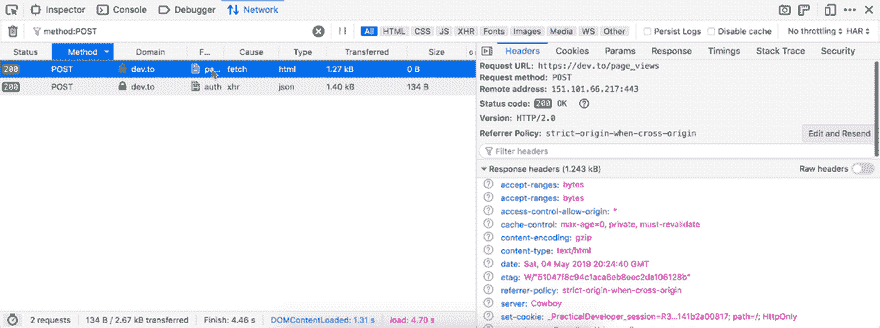
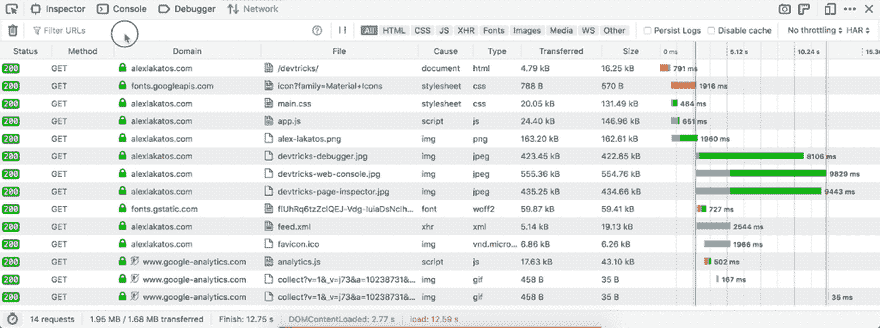
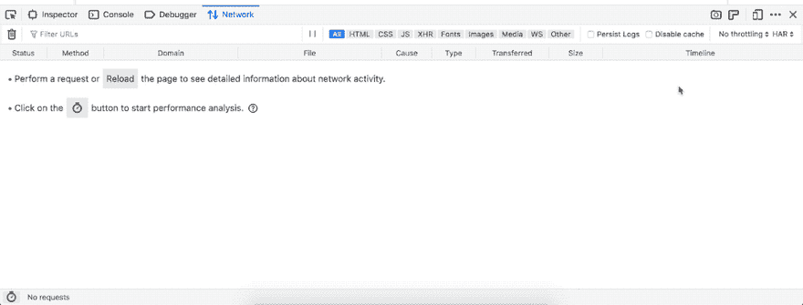
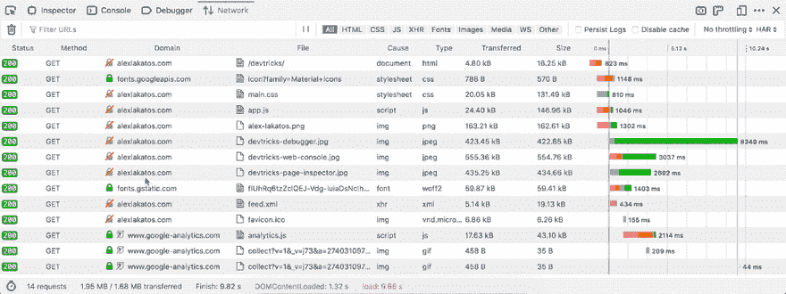
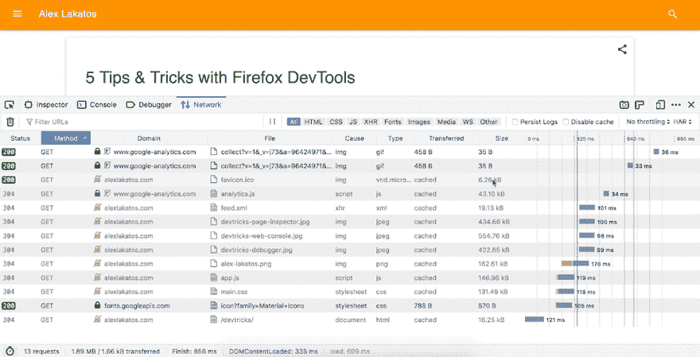

# Firefox DevTools -网络监视器的 5 个技巧和窍门

> 原文：<https://dev.to/lakatos88/5-tips-and-tricks-for-firefox-devtools-network-monitor-55dl>

*这是[系列](http://alexlakatos.com/devtricks/)中的第四篇文章，这是一系列帮助你用 Firefox Devtools 调试 web 应用程序的技巧和诀窍。它向你展示了在 Firefox 开发工具中使用网络监视器的 5 个技巧&。*

当我在网站上进行性能调试和优化时，我会使用网络监视器工具，所以这篇文章中的大部分技巧都集中在这一点上。这是我在性能调试时使用的第一个工具，因为无论 JavaScript 运行得多快，如果它只有 20 MB，它仍然会影响性能。

## 编辑并重新发送 HTTP 请求

您可以在网络监视器中编辑和重新发送 HTTP 请求。有时我用它来调试发送到我的服务器的 POST 请求或获取网站数据的 GET 请求，我很少用这个技巧来重新发送只获取 HTML、CSS 和 JavaScript 文件或图像的 HTTP 请求。使用它真的很方便，特别是当您在一个复杂流程的末尾向服务器发送数据，并且您的请求中有一个 bug 时。它允许您快速测试一个可能的修复，而不必做所有的工作和重新测试流程。

## 过滤不包含查询字符串的请求

在 Mac 上按`CMD` + `F`(在 Windows 和 Linux 上按`CTRL` + `F`，可以在网络监视器中按域过滤 HTTP 请求。如果您想搜索所有在域 URL 中不包含字符串的请求，您可以用破折号(`-`)开始查询，这样只过滤不匹配查询字符串的域。在性能审计期间找到所有的外部请求非常有用，因此您可以在以后将这些资源移动到同一个域中。

## 速度节流

您可以调节网络请求的速度，并查看您的网站在不同连接上的负载情况。Firefox 有很多对移动设备有用的预置，有一个直观的名字，而不是我必须猜测一个糟糕的 3G 连接会有多快。

## 热/冷成型

您可以对网站发出的 HTTP 请求进行可视化性能分析。如果您刚刚打开网络监视器，主面板上有一个秒表图标，否则，您可以在网络监视器的左下角找到它。点击图标后，网络监视器会加载网站两次:一次是空的浏览器缓存或“冷”，另一次是已启动的浏览器缓存或“热”。模拟用户第一次加载你的站点以及随后的访问是非常有用的。

## [保存/导入具有](#saveimport-har)

您可以在网络监视器中保存网络请求的快照。它将它们保存为 HAR 或 HTTP 存档格式。您也可以导入 HAR 文件，并让它们显示在网络监视器中，以便调试它们。这一点在与分布式团队合作时特别有用，世界的不同地方会给你不同的时间线。这样，您可以在相同的基线上工作，或者调试您的映像中令人讨厌的 10 秒延迟，这种延迟只会发生在带有备份 CDN 的模糊防火墙之后。你明白了。

## 这是每周的事

这是每周一次的事情，这些年来我已经收集了很多技巧。如果你喜欢这个或者想看更多，我是推特上的[@ Lakatos 88](https://twitter.com/lakatos88)，跟我去吧，那里是[魔法发生的地方](https://twitter.com/lakatos88/status/1125773298707652608)。