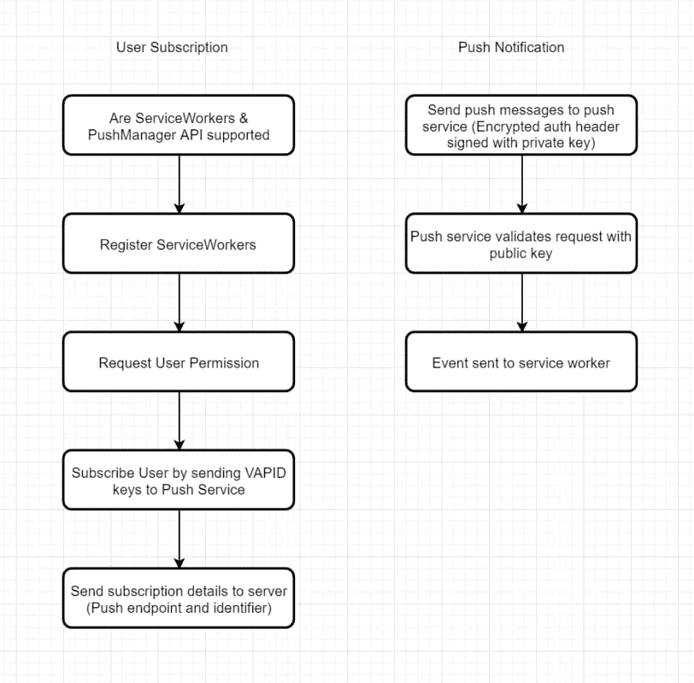
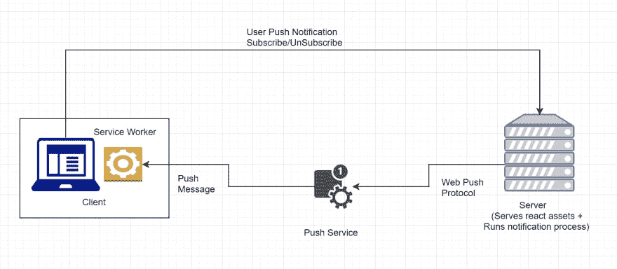
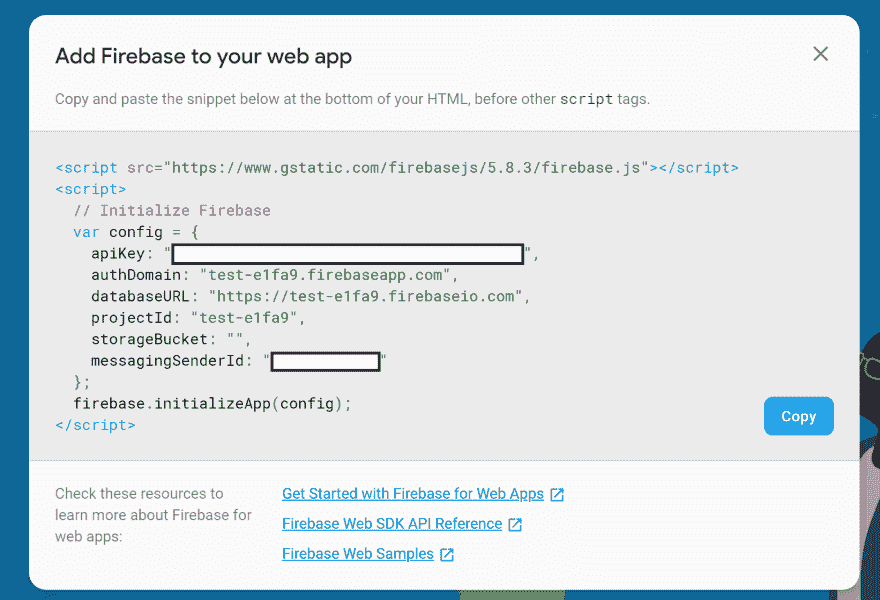
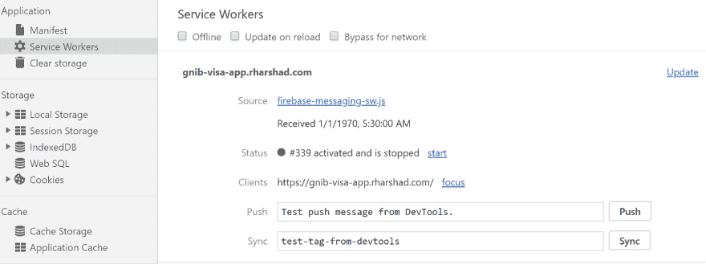
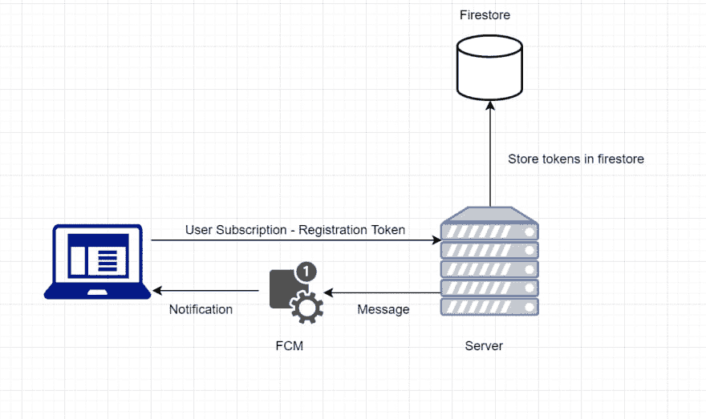
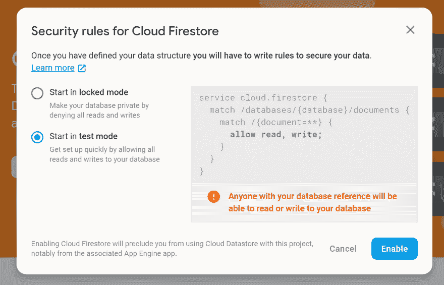

# 使用 Firebase 的 React 应用程序的 Web 推送通知

> 原文：<https://dev.to/harshadranganathan/web-push-notifications-for-your-react-app-using-firebase-iab>

## 推送通知

推送通知允许用户获取更新并关注您的内容。您可以通过支持推送通知 API 的浏览器(桌面/移动)发送推送通知。

以下浏览器支持推送和通知 API:

*   Chrome 桌面版和移动版(版本 50 以上)
*   Firefox 桌面版和移动版(版本 44 以上)
*   手机版 Opera(版本 37 以上)

## 概述

让我们来看看为一个站点设置推送通知服务需要做些什么。

[](https://rharshad.com/assets/img/2019/03/push-notification-flow.png)

### 服务人员

推送是基于服务人员的，因为服务人员是在后台操作的。服务人员是一个“特殊的”JavaScript 文件。

浏览器可以在不打开页面的情况下执行这个 JavaScript。这意味着只有当用户通过单击或关闭通知来与通知交互时，才会为推送通知运行代码(换句话说，只有在使用电池时)。

在服务人员的“推送”事件中，您可以执行任何后台任务。你可以进行分析调用，离线缓存页面和显示通知。

您必须检查浏览器是否支持服务人员。

### 推送管理器

Push API 的 PushManager 接口提供了从第三方服务器接收通知以及请求推送通知的 URL 的方法。

您必须检查浏览器是否支持推送管理器。

### 服务人员登记

一旦我们知道浏览器支持服务工作者和推送管理器，我们就注册我们的服务工作者 javascript 文件。

然后，浏览器将在服务人员环境中运行该文件。

### 用户权限

一旦我们注册了服务人员，我们需要获得用户的许可来发送推送通知。

如果用户阻止了权限请求，那么他们必须在浏览器设置面板中手动取消阻止该站点。

### 用户订阅

注册服务人员并获得用户权限后，我们需要为用户订阅。

我们需要生成乏味的密钥，并提交给推送服务。推送服务使用这些密钥来识别订阅用户的应用程序，并确保向用户发送消息的是同一个应用程序。

一旦您订阅，您将收到一个端点，与应用程序的公钥和标识符相关联(推送订阅)。

稍后，当您想要发送 push 消息时，您将需要创建一个 Authorization 头，它将包含用应用服务器的私钥签名的信息，并提交给该端点。

### 订阅存储

我们需要通过将推送订阅的详细信息发送到我们的服务器来存储它，以便我们可以使用它向用户发送消息。

### 推送通知

要发送 push 消息，我们需要通过发送一个有效载荷来进行 web 推送，这个有效载荷带有一个用私钥签名的授权头。

推送服务将使用公钥来解密授权报头，并验证它是否是为试图发送消息的用户订阅的同一应用程序。

然后，当浏览器激活时，它会将推送消息发送到用户的设备。

## Firebase 云消息

Firebase 云消息传递(FCM)是一个跨平台的消息传递解决方案，让您可以可靠地免费传递消息。

我们将看到如何使用 FCM 向客户机发送通知消息。

下面是我们的应用程序将如何工作。我们不会深入讨论如何构建和部署 react 应用程序的细节，因为这超出了本指南的范围。

应用程序的源代码可以在这里找到-

## /[gnib-visa-app](https://github.com/HarshadRanganathan/gnib-visa-app)

### 毫不费力地找到 GNIB(爱尔兰居留证)和再入境签证的预约时间

<article class="markdown-body entry-content p-5" itemprop="text">

[](https://travis-ci.com/HarshadRanganathan/gnib-visa-app)

# gnib-visa-app

毫不费力地找到 GNIB(爱尔兰居留证)的预约时间。

App 托管在[https://gnib-visa-app.rharshad.com/](https://gnib-visa-app.rharshad.com/)

该应用程序利用:

*   [反应](https://reactjs.org/)
    *   [axios](https://www.npmjs.com/package/axios) 用于基于承诺的 http 请求
*   [还原](https://redux.js.org/)
    *   [中间件的 redux-thunk](https://www.npmjs.com/package/redux-thunk)
*   [Express](https://www.npmjs.com/package/express) 极简网络框架
*   [用于捆绑的网络包](https://webpack.github.io/)
*   用于运输的巴别塔

## 在本地运行应用程序

您需要在本地开发机器上安装节点和 NPM。

通过运行以下命令安装项目依赖项。

```
# install react project dependencies
npm install
# install notification project dependencies
cd notifications/
npm install 
```

### 发展模式

#### `npm run dev`

在开发模式下使用 webpack 重新编译运行应用程序，并在任何文件发生更改时重新运行测试。

打开 [http://localhost:8080](http://localhost:8080) (默认端口 8080)在浏览器中查看 app。

如果您对代码进行了更改，页面将自动重新加载。

### 生产模式

#### `npm run build`

将生产应用程序构建到`public`文件夹中。

它捆绑了生产模式中的反应，缩小了文件和…

</article>

[View on GitHub](https://github.com/HarshadRanganathan/gnib-visa-app)

[](https://rharshad.com/assets/img/2019/03/push-notification-how-it-works.png)

通知页面示例:

[](https://rharshad.com/assets/img/2019/03/sample-push-notification-page.png)

## 客户端

Push API 依赖于一些不同的技术，包括 Web 应用清单和服务工作者。

让我们看看为 react 应用程序启用推送 API 所涉及的步骤。我们将使用`Firebase SDK`来促进即时消息。

### 将 Firebase 添加到您的应用程序中

要将 Firebase 添加到您的应用程序中，您需要一个 Firebase 项目。

*   在 [firebase 控制台](https://console.firebase.google.com/)中创建一个 Firebase 项目。
*   获取您的应用程序配置，我们将使用它在您的 react 应用程序中初始化 firebase。

[](https://rharshad.com/assets/img/2019/03/firebase-app-config.png)

*   安装 firebase npm 模块。

```
npm install --save firebase 
```

创建一个`firebase.js`文件，我们将使用从 firebase 项目中获得的配置细节初始化我们的应用程序，并导出`messaging`组件。

稍后我们将使用`messaging`引用来注册我们的服务人员并处理传入的推送通知。

```
import firebase from 'firebase/app';
import '@firebase/messaging';

const config = {
    messagingSenderId: '<your-app-messaging-sender-id>'
};

firebase.initializeApp(config);

let messaging;

// we need to check if messaging is supported by the browser
if(firebase.messaging.isSupported()) {
    messaging = firebase.messaging();
}

export {
    messaging
}; 
```

### 订阅页面

接下来，我们将创建一个`notifications.js` react 组件页面，它将检查浏览器是否支持`Service Worker`和`Push API`。基于此，我们将显示一条消息，说明不支持推送通知或我们的订阅选项。

这里，我们使用了`material-ui`来设计页面的样式。此外，我们导入之前创建的`firebase.js`文件。

我们在这里采用的是被动方法，即在页面上的某个位置使用一个按钮或拨动开关来启用/禁用推送消息，这个位置在整个站点中都是一致的。好的 UX 设计应该为用户提供一条摆脱推送消息的途径，并且不要在用户访问页面时就要求推送许可。

```
import React, { Fragment, Component } from 'react';
import PropTypes from 'prop-types';
import { withStyles, Card, CardContent, Typography, Switch, FormControlLabel } from '@material-ui/core';
import { messaging } from '../component/firebase';

const styles = theme => ({
    card: {
        marginTop: theme.spacing.unit * 2,
        marginBottom: theme.spacing.unit * 2,
        marginLeft: theme.spacing.unit * 2,
        marginRight: theme.spacing.unit * 2
    },
    noteTextPos: {
        marginTop: theme.spacing.unit * 2
    }
});

class Notifications extends Component {
    constructor(props) {
        super(props);
    }

    renderSubscriptionOptions(classes) {
        if(!('serviceWorker' in navigator) && !('PushManager' in window)) {
            return(
                <Typography className={classes.noteTextPos}>
                    Notification feature is supported only in:<br/>
                    Chrome Desktop and Mobile (version 50+)<br/>
                    Firefox Desktop and Mobile (version 44+)<br/>
                    Opera on Mobile (version 37+)
                </Typography>
            );
        } else {
            return (
                <Fragment>
                    <FormControlLabel 
                        control={<Switch />}
                        label="Enable/Disable GNIB(IRP) Appointment Notifications"
                        onChange={this.gnibApptSubscriptionToggle}
                        checked={this.state.gnibApptSubscriptionToggleSwitch}
                    />
                </Fragment>
            );
        }
    }

    render() {
        const { classes } = this.props;
        return (
            <Fragment>
                <Card className={classes.card}>
                    <CardContent>
                        {this.renderSubscriptionOptions(classes)}
                    </CardContent>
                </Card>
            </Fragment>
        );
    }
}

Notifications.propTypes = {
    classes: PropTypes.object.isRequired
};

export default withStyles(styles)(Notifications); 
```

### 服务人员

接下来，我们需要创建一个服务工作者文件并注册它。

在`pwa`目录下创建一个包含以下内容的新文件`firebase-messaging-sw.js`。

```
// import firebase scripts inside service worker js script
importScripts('https://www.gstatic.com/firebasejs/5.7.2/firebase-app.js');
importScripts('https://www.gstatic.com/firebasejs/5.7.2/firebase-messaging.js');

firebase.initializeApp({
    'messagingSenderId': '<your-app-messaging-sender-id>'
});

const messaging = firebase.messaging(); 
```

然后，我们通过更新`firebase.js`文件来注册服务工作者文件。

```
// register service worker
if ('serviceWorker' in navigator) {
    window.addEventListener('load', async () => {
        const registration = await navigator.serviceWorker.register('/firebase-messaging-sw.js', {
            updateViaCache: 'none'
        });
        messaging.useServiceWorker(registration);
    });
} 
```

[](https://rharshad.com/assets/img/2019/03/service-worker.png)

几点:

1.  我们提到工人文件的路径为`/firebase-messaging-sw.js`，但是我们将文件放在了`pwa`目录中。这是因为，稍后，我们将更新 webpack 配置，以将文件复制到`public`文件夹，静态资产将从该文件夹提供服务。根据您的应用程序设计和 bundler 使用，您可能需要相应地更新路径。

2.  我们已经将`updateViaCache`设置为`none`，以便在请求顶级/service-worker.js 或任何导入的脚本时不会查询 HTTP 缓存。在 Chrome 68 之前，对/service-worker.js 的更新请求是通过 HTTP 缓存发出的。从 68 开始，在请求更新服务工作者脚本时，HTTP 缓存将被忽略，因此现有的 web 应用程序可能会看到对其服务工作者脚本的请求频率增加。对 importScripts 的请求仍将通过 HTTP 缓存。

3.  每次我们的页面加载时，浏览器都会下载最新的 service worker 副本，并进行逐字节比较，以查看是否有任何更改。如果是这样，它将激活新的副本，否则它不会执行更新。

4.  此外，如果它注意到与最新副本的任何差异，它不会立即激活新的服务人员。浏览器将一直等待，直到当前服务人员控制零个客户端。但是，您可以强制进行更新。

### 通知消息

根据页面是在前台(有焦点)、在后台、隐藏在其他选项卡后面还是完全关闭，通知消息的处理方式会有所不同。

#### 后台消息处理

我们之前定义了`firebase-messaging-sw.js`文件，该文件导入了 firebase 脚本并初始化了消息传递组件。这将负责后台消息处理。

每当发送推送事件时，服务工作者将被激活。然后运行 JS 脚本，消息传递组件将利用通知 API 以标准格式显示消息。

在我们的服务器端部分，我们将研究如何用内容和动作链接构造消息。

#### 前台消息处理

当你的页面成为焦点时，你需要明确处理你的信息是如何显示的。例如，我们需要利用`onMessage`函数来处理传入的消息，并使用服务工作者显示通知。

我们用`onMessage`处理程序更新`firebase.js`文件。

```
// register service worker & handle push events
if ('serviceWorker' in navigator) {
    window.addEventListener('load', async () => {
        const registration = await navigator.serviceWorker.register('/firebase-messaging-sw.js', {
            updateViaCache: 'none'
        });
        messaging.useServiceWorker(registration);
        messaging.onMessage((payload) => {
            const title = payload.notification.title;
            const options = {
                body: payload.notification.body,
                icon: payload.notification.icon,
                actions: [
                    {
                        action: payload.fcmOptions.link,
                        title: 'Book Appointment'
                    }
                ]
            };
            registration.showNotification(title, options);           
        });
    });
} 
```

在这里，我们获得消息、图标、链接，并使用服务人员来显示通知。我们还创建了一个通知动作来处理点击事件。

参考:

[1] [FCM 报文结构](https://firebase.google.com/docs/reference/fcm/rest/v1/projects.messages)

用`notificationclick`监听器:
更新`firebase-messaging-sw.js`

```
importScripts('https://www.gstatic.com/firebasejs/5.7.2/firebase-app.js');
importScripts('https://www.gstatic.com/firebasejs/5.7.2/firebase-messaging.js');

firebase.initializeApp({
    'messagingSenderId': '<your-app-messaging-sender-id>'
});

const messaging = firebase.messaging();

self.addEventListener('notificationclick', (event) => {
    if (event.action) {
        clients.openWindow(event.action);
    }
    event.notification.close();
}); 
```

每当单击通知时，它将在新窗口中打开链接并关闭通知。

参考:

[1] [通知点击监听器](https://notifications.spec.whatwg.org/#dom-notification-onclick)

### 用户权限

到目前为止，我们已经看到了如何注册服务人员、显示通知等。为了显示推送通知，用户必须接受它。如果用户拒绝或屏蔽该网站，我们将无法发送任何通知，直到用户手动撤销它。

让我们用处理用户权限的逻辑来更新`notifications.js`文件。

```
/**
 * Check if user has already given permission for sending notifications
 * If not, request permission from user, generate instance token and store it in firestore
 */
async notificationPermission() {
    let permissionGranted = false;
    try {
        /* request permission if not granted */
        if (Notification.permission !== 'granted') {
            await messaging.requestPermission();
        }
        /* get instance token if not available */
        if (localStorage.getItem(INSTANCE_TOKEN) !== null) {
            permissionGranted = true;
        } else {
            const token = await messaging.getToken(); // returns the same token on every invocation until refreshed by browser
            await this.sendTokenToDb(token);
            localStorage.setItem(INSTANCE_TOKEN, token);
            permissionGranted = true;
        }
    } catch (err) {
        console.log(err);
        if (err.hasOwnProperty('code') && err.code === 'messaging/permission-default') console.log('You need to allow the site to send notifications');
        else if (err.hasOwnProperty('code') && err.code === 'messaging/permission-blocked') console.log('Currently, the site is blocked from sending notifications. Please unblock the same in your browser settings');
        else console.log('Unable to subscribe you to notifications');
    } finally {
        return permissionGranted;
    }
} 
```

我们在这里做几件事:

1.  检查用户是否已经被授予发送推送通知的权限。如果没有，我们请求它。
2.  我们还检查令牌在本地存储中是否可用(我们稍后将存储它)。
3.  最后，如果上述条件不满足，我们请求一个令牌。如果您多次请求它，您将只能得到相同的实例令牌。然后，我们将这个令牌发送到我们的服务器，将它存储在 firestore(或任何文件/数据库)中，因为我们需要它来发送推送通知。此外，我们将令牌存储在 localStorage 中，以快速识别用户是否订阅了通知，并显示适当的切换开关。
4.  如果用户拒绝了许可，那么我们可以向用户显示所需的消息，可能是一个 toast/snackbar。
5.  注册令牌可能会在以下情况下更改:
    *   应用程序删除实例 ID
    *   该应用程序会在新设备上恢复
    *   用户卸载/重新安装应用程序
    *   用户清除应用/站点数据

您需要调用“onTokenRefresh”将刷新的令牌发送到您的服务器。

### 订阅/退订

我们需要根据用户是否已经订阅，为他提供订阅选项。

例如，在我们的`notifications.js`中，我们可以做如下的事情:

```
import axios from 'axios';

const ROOT_URL = ''; // define your server subscription url (sample express server setup for handling subscriptions described at the end)

class Notifications extends Component {

    constructor(props) {
        super(props);
        this.state = { gnibApptSubscriptionToggleSwitch: false }; // we set the toggle switch to false on component load
        this.gnibApptSubscriptionToggle = this.gnibApptSubscriptionToggle.bind(this);
        this.subscribeGnibApptNotifications = this.subscribeGnibApptNotifications.bind(this);
        this.unsubscribeGnibApptNotifications = this.unsubscribeGnibApptNotifications.bind(this);
        this.notificationPermission = this.notificationPermission.bind(this);
    }

    /**
     * If registration token is available in localStorage we enable the subscription option to indicate that the user has 
     * already subscribed
     */
    componentDidMount() {
        localStorage.getItem(GNIB_APPT_NOTIFICATION_SUBSCRIBED) === "TRUE" ? this.setState({ gnibApptSubscriptionToggleSwitch: true }) : this.setState({ gnibApptSubscriptionToggleSwitch: false });
    }

    /**
    * Send the subscription details (token and topic) to the server endpoint 
    */
    async subscriptionActions(mode, token, topic) {
        try {
            return await axios.post(`${ROOT_URL}/${mode}`, { token, topic });
        } catch(error) {
            if (error.response) {
                console.log(error.response.status);
                console.log(error.response.data);
            } else if (error.request) {
                console.log(error.request);
            } else {
                console.log('Error: ', error.message);
            }
            return null;
        }
    }

    /**
     * Subscribe app instance to notification topic if user permissions given
     */
    async subscribeGnibApptNotifications() {
        const notificationPermission = await this.notificationPermission();
        if(notificationPermission) {
            const isSubscribed = await this.subscriptionActions(SUBSCRIBE, localStorage.getItem(INSTANCE_TOKEN), GNIB_APPT_NOTIFICATIONS_TOPIC);
            if(isSubscribed) {
                localStorage.setItem(GNIB_APPT_NOTIFICATION_SUBSCRIBED, "TRUE");
                this.setState({ gnibApptSubscriptionToggleSwitch: true });
                this.displayMessage(<span>GNIB(IRP) appointment notifications have been enabled for your device</span>);
            } else {
                this.displayMessage(<span>Unable to subscribe you to notifications</span>);
            }
        }
    }

    /**
     * Unsubscribe app instance from notification topic
     */
    async unsubscribeGnibApptNotifications() {
        const isUnSubscribed = await this.subscriptionActions(UNSUBSCRIBE, localStorage.getItem(INSTANCE_TOKEN), GNIB_APPT_NOTIFICATIONS_TOPIC);
        if(isUnSubscribed) {
            localStorage.removeItem(GNIB_APPT_NOTIFICATION_SUBSCRIBED);
            await this.deleteTokenFromDb();
            this.setState({ gnibApptSubscriptionToggleSwitch: false });
            this.displayMessage(<span>You have been unsubscribed from notifications</span>);
        } else {
            this.displayMessage(<span>Unsubscribe failed</span>);   
        }
    }

    /**
     * Subscribe/UnSubscribe appointment notifications
     */
    gnibApptSubscriptionToggle(event ,checked) {
        if(checked) this.subscribeGnibApptNotifications();
        else this.unsubscribeGnibApptNotifications();
    }
} 
```

最初，我们将订阅切换开关状态设置为`false`。在前面的函数中，`notificationPermission`我们已经在 localStorage 中设置了令牌。

当组件挂载时，我们检查该令牌是否可用，如果可用，我们启用切换开关来指示用户他已经订阅了。

如果这是一个新的订阅，我们首先从用户那里获得权限并生成注册令牌。在我们的`notificationPermission`函数中，我们将注册令牌存储在数据库和 localStorage 中。

我们还在函数调用`subscriptionActions`中为用户订阅了一个主题。

您可以使用用户的注册令牌向一组用户发送通知，或者为他们订阅一个主题，然后向该主题发布一条消息。如果是发布-订阅模式，消息将被发送给主题的所有订阅者。

我们稍后将更详细地研究它们。

### 清单文件

在`src`文件夹中创建一个`pwa`目录，该目录将包含`manifest.json`文件。

```
{  "gcm_sender_id":  "103953800507"  } 
```

这表明 FCM 有权向此应用程序发送消息。

在索引文件中链接清单。

```
<link rel="manifest" href="manifest.json"> 
```

如果您使用 webpack 生成构建文件，那么您可以使用`copy-webpack-plugin`将清单文件复制到构建目录。

```
npm install --save copy-webpack-plugin 
```

```
const path = require('path');
const CopyPlugin = require('copy-webpack-plugin');
const srcPath = path.join(__dirname, 'src');
const buildPath = path.join(__dirname, 'public');
module.exports = () => {
    plugins: [
        new CopyPlugin([
            { from: path.join(srcPath, 'pwa'), to: buildPath }
        ])
    ]
}; 
```

如果您使用 Nginx 来服务您的静态资产，那么您可以指定 gzip 清单文件并指定内容到期时间。

```
// virtual.conf
map $sent_http_content_type $expires {
    default off;
    application/json 2628000;
    application/manifest+json 2628000;
}

// gzip.conf
gzip on;
gzip_static on;
gzip_comp_level 6;
gzip_types
    text/plain
    text/css
    text/js
    text/javascript
    application/javascript
    application/manifest+json 
```

## 测试

我们现在已经在客户端连接好了一切。那么，在进入服务器端之前，我们如何在客户端测试一切工作正常。

在本地运行 react 应用程序。在您的订阅页面中，提供用户权限并从 localStorage 或您的数据库中获取注册令牌。

一旦您有了注册令牌，我们就可以发布一条消息来测试当应用程序处于焦点或后台时是否会显示通知。

### 检查注册令牌状态

用 url 中的注册令牌和授权头中的`apiKey`(来自 firebase 项目配置)向 Google IID API 发送一个 curl 请求。

```
curl -X GET \
  'https://iid.googleapis.com/iid/info/<instance_token>?details=true' \
  -H 'Authorization: key=<apiKey>' 
```

您将获得如下详细信息:

```
{  "connectDate":  "2019-03-04",  "application":  "com.android.chrome",  "scope":  "*",  "rel":  {  "topics":  {  "notifications":  {  "addDate":  "2019-02-23"  }  }  },  "connectionType":  "WIFI",  "platform":  "BROWSER"  } 
```

### 样本通知消息

然后，我们发送一条消息来测试通知是否显示给用户。我们之前使用过项目`apiKey`。

但是，为了发送消息，我们将使用 FCM v1 HTTP 协议，而不是遗留协议，遗留协议将要求 JWT 访问令牌沿着请求传递。

要生成访问令牌，您可以使用 [fcm-http-oauth](https://github.com/HarshadRanganathan/fcm-http-oauth) 。按照自述文件中的步骤在 firebase 项目中生成服务帐户。

现在让我们通过提供 firebase 项目 id、jwt 和注册令牌:
将消息发送给特定的用户

```
curl -X POST \
  https://fcm.googleapis.com/v1/projects/<firebase_projectId>/messages:send \
  -H 'Authorization: Bearer <jwt_token>' \
  -H 'Content-Type: application/json' \
  -d '{
    "message":{
        "token": "<registration_token>",
        "notification": {
                "title": "New Appointments",
                "body": "14 February 2019 - 15:00\n18 February 2019 - 11:00\n18 February 2019 - 12:00"
                },
                "webpush": {
                    "headers": {
                        "TTL": "0"
                    },
                    "notification": {
                        "icon": "https://img.icons8.com/color/96/e74c3c/ireland.png"
                    },
                    "fcm_options": {
                        "link": "https://gnib-visa-app.rharshad.com"
                    }
                }
        }
    }' 
```

参考:

[1] [FCM 报文结构](https://firebase.google.com/docs/reference/fcm/rest/v1/projects.messages)

## 服务器端

到目前为止，我们已经了解了如何为用户订阅推送通知。我们现在将研究在 firestore 中存储注册令牌，并使用 firebase SDK 发送通知消息。

[](https://rharshad.com/assets/img/2019/03/registration-tokens-firestore.png)

### Firestore

Cloud Firestore 是一个灵活、可扩展的数据库，用于 Firebase 和 Google 云平台的移动、web 和服务器开发。

它通过实时监听器使您的数据在客户端应用程序之间保持同步，并为移动和 web 提供离线支持，因此您可以构建响应迅速的应用程序，无论网络延迟或互联网连接如何都可以工作。

#### 创建新数据库

在 firebase 项目中以测试模式创建一个新的 firestore 数据库。

[](https://rharshad.com/assets/img/2019/03/firestore-new-database.png)

在`Rules`标签中添加以下规则，仅允许从您的帐户中读取/写入:

```
service cloud.firestore {
  match /databases/{database}/documents {
    match /{document=**} {
      allow read, write: if request.auth.uid != null;
    }
  }
} 
```

#### 存储注册令牌

您可以创建一个节点 js 项目，它将向您的用户发送通知/使用云功能/任何其他框架。在本指南中，我们将了解如何使用 node.js 在 firestore 中存储令牌。

按照以下步骤生成服务帐户:

在 firebase 项目中，在项目设置下，选择`Service accounts`选项卡。

选择`Generate new private key`下载您的服务帐户文件。

我们将使用服务帐户访问 firestore。

将`firebase-admin` SDK 安装到 node.js 项目中。

```
npm install --save firebase-admin 
```

我们将定义执行所需操作的`firebase.js`文件。

```
const serviceAccount = require('./service-account.json');
const admin = require('firebase-admin');

/* initialise app */
admin.initializeApp({
    credential: admin.credential.cert(serviceAccount)
});

/* initialise firestore */
const firestore = admin.firestore();
firestore.settings({
    timestampsInSnapshots: true
});
const FIRESTORE_TOKEN_COLLECTION = 'instance_tokens';

async function storeAppInstanceToken(token) {
    try {
        return await firestore.collection(FIRESTORE_TOKEN_COLLECTION)
        .add({ token, createdAt: admin.firestore.FieldValue.serverTimestamp() });
    } catch(err) {
        console.log(`Error storing token [${token}] in firestore`, err);
        return null;
    }
}

async function deleteAppInstanceToken(token) {
    try {
        const deleteQuery = firestore.collection(FIRESTORE_TOKEN_COLLECTION).where('token', '==', token);
        const querySnapshot = await deleteQuery.get();
        querySnapshot.docs.forEach(async (doc) => {
            await doc.ref.delete();
        });
        return true;
    } catch(err) {
        console.log(`Error deleting token [${token}] in firestore`, err);
        return null;
    }
}

module.exports = {
    storeAppInstanceToken,
    deleteAppInstanceToken
} 
```

这个脚本导出了两个函数

[1] storeAppInstanceToken -您将传入需要存储在 firestore 集合中的令牌。此外，将服务器时间戳添加到文档中。

[2] deleteAppInstanceToken -获取与令牌匹配的文档并删除它们。

### 发送用户通知

我们更新脚本`firebase.js`来导出下面的函数，以便能够发送推送通知-

```
const messaging = admin.messaging();

function buildCommonMessage(title, body) {
    return {
        'notification': {
            'title': title,
            'body': body
        }
    };
}

/**
* Builds message with platform specific options
* Link: https://firebase.google.com/docs/reference/fcm/rest/v1/projects.messages
*/
function buildPlatformMessage(token, title, body) {
    const fcmMessage = buildCommonMessage(title, body);

    const webpush = {
        'headers': {
            'TTL': '0'
        },
        'notification': {
            'icon': 'https://img.icons8.com/color/96/e74c3c/ireland.png'
        },
        'fcm_options': {
            'link': 'https://gnib-visa-app.rharshad.com'
        }
    };

    fcmMessage['token'] = token;
    fcmMessage['webpush'] = webpush;
    return fcmMessage;
}

async function sendFcmMessage(fcmMessage) {
    try {    
        await messaging.send(fcmMessage);
    } catch(err) {
        console.log(err);
    }
}

module.exports = {
    buildPlatformMessage,
    storeAppInstanceToken,
    deleteAppInstanceToken,
    subscribeAppInstanceToTopic,
    unsubscribeAppInstanceFromTopic,
    sendFcmMessage
} 
```

我们可以使用`buildPlatformMessage`生成一条消息，然后将它传递给`sendFcmMessage`来通知用户。

### 话题订阅

还可以通过调用`subscribeToTopic` & `unsubscribeFromTopic`方法为用户订阅/取消订阅主题。

```
async function subscribeAppInstanceToTopic(token, topic) {
    try {
        return await messaging.subscribeToTopic(token, topic);
    } catch(err) {
        console.log(`Error subscribing token [${token}] to topic: `, err);
        return null;
    }
}

async function unsubscribeAppInstanceFromTopic(token, topic) {
    try {
        return await messaging.unsubscribeFromTopic(token, topic);
    } catch(err) {
        console.log(`Error unsubscribing token [${token}] from topic: `, err);
        return null;
    }
} 
```

我们使用 firebase SDK 来发送 FCM 消息。您还可以利用 webpush 或将消息发送到 FCM HTTP App 服务器端点。

### 快递服务器

到目前为止，我们已经定义了订阅、firebase 和 fcm 操作。

我们将使用 [Express](https://expressjs.com/) 将它们公开为 web 服务器中的 API，以便我们的客户端应用程序可以访问它们。

将 express 作为依赖项安装。

```
npm install --save express 
```

创建一个名为`index.js`的新文件，并定义下面的 API。

```
const { storeAppInstanceToken, deleteAppInstanceToken, subscribeAppInstanceToTopic, unsubscribeAppInstanceFromTopic } = require('./firebase');

const 
    express = require('express'),
    bodyParser = require('body-parser'),
    app = express().use(bodyParser.json());

app.post('/storetoken', async (req, res) => {
    if (!req.body) res.sendStatus(400);
    if(req.body.token) {
        result = await storeAppInstanceToken(req.body.token);
        result?res.sendStatus(200):res.sendStatus(500);
    } else {
        res.sendStatus(400);
    }
});

app.delete('/deletetoken', async(req, res) => {
    if (!req.body) res.sendStatus(400);
    if(req.body.token) {
        result = await deleteAppInstanceToken(req.body.token);
        result?res.sendStatus(204):res.sendStatus(500);
    } else {
        res.sendStatus(400);
    }
});

app.post('/subscribe', async(req, res) => {
    if (!req.body) res.sendStatus(400);
    if(req.body.token) {
        result = await subscribeAppInstanceToTopic(req.body.token, req.body.topic);
        result?res.sendStatus(200):res.sendStatus(500);
    } else {
        res.sendStatus(400);
    }
});

app.post('/unsubscribe', async(req, res) => {
    if (!req.body) res.sendStatus(400);
    if(req.body.token) {
        result = await unsubscribeAppInstanceFromTopic(req.body.token, req.body.topic);
        result?res.sendStatus(200):res.sendStatus(500);
    } else {
        res.sendStatus(400);
    }
});

app.listen(process.env.PORT || 1338, () => {
    console.log('Server is running');
}); 
```

您可以使用下面的命令运行服务器，并通过本地主机访问端点，例如，向[http://localhost:1338/subscribe](http://localhost:1338/subscribe)发送一个包含适当 JSON 正文内容的 POST 请求。

```
node index.js 
```

有各种各样的云平台可供您部署 node express 服务器。

## 参考文献

[https://developers . Google . com/web/fundamentals/push-notifications/](https://developers.google.com/web/fundamentals/push-notifications/)

[https://developers . Google . com/web/fundamentals/primers/service-workers/# update-a-service-worker](https://developers.google.com/web/fundamentals/primers/service-workers/#update-a-service-worker)

[https://developers . Google . com/web/fundamentals/primers/service-workers/life cycle](https://developers.google.com/web/fundamentals/primers/service-workers/lifecycle)

[https://developer . Mozilla . org/en-US/docs/Web/API/ServiceWorkerRegistration/update](https://developer.mozilla.org/en-US/docs/Web/API/ServiceWorkerRegistration/update)

[https://serviceworke.rs/](https://serviceworke.rs/)

[https://developers . Google . com/instance-id/reference/server # get _ information _ about _ app _ instances](https://developers.google.com/instance-id/reference/server#get_information_about_app_instances)

[https://developer . Mozilla . org/en-US/docs/Web/API/Notification](https://developer.mozilla.org/en-US/docs/Web/API/Notification)

[https://firebase . Google . com/docs/cloud-messaging/concept-options # collapsible _ and _ non-collapsible _ messages](https://firebase.google.com/docs/cloud-messaging/concept-options#collapsible_and_non-collapsible_messages)

[https://firebase . Google . com/docs/reference/FCM/rest/v1/projects . messages](https://firebase.google.com/docs/reference/fcm/rest/v1/projects.messages)

[https://firebase.google.com/docs/cloud-messaging/js/client](https://firebase.google.com/docs/cloud-messaging/js/client)