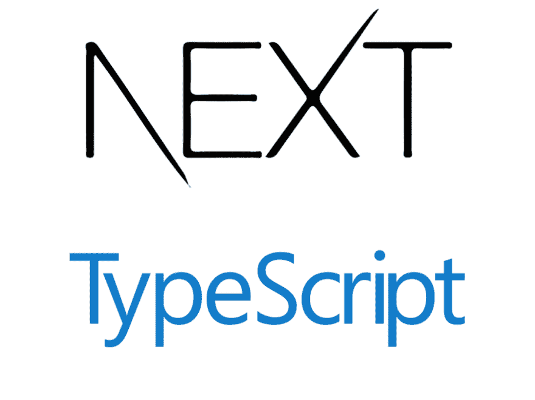

# Next.js & Typescript

> 原文：<https://dev.to/agustin107/next-js-typescript-3jan>

[](https://res.cloudinary.com/practicaldev/image/fetch/s--sHzB2n7N--/c_limit%2Cf_auto%2Cfl_progressive%2Cq_auto%2Cw_880/https://thepracticaldev.s3.amazonaws.com/i/07s4mg36kkoot4vsw452.png)

亲爱的哈瓦那同胞们，我将与你们分享如何将 Next.js 与 Typescript 集成。

我已经开始使用这个前景可观的框架，在蜂巢里已经给了我们一个相当完整的‘t0’工具反应。

*   服务器渲染
*   静态导出
*   CSS-in-JS
*   SEO 友好，y más...

于是，我决定倾向于将这个超级框架与 Typescript、Javascript 超级集一起使用，在那里我们可以处理类型、接口、类等。

亲切！

虽然在“T0”下的官方文件中我们可以找到，但我想通过这个职位节省下来。

我们首先要做的是启动一个 web 项目，创建项目文件夹并定位到该文件夹中:

```
mkdir NewProject && cd $_ 
```

然后，我们启动我们的. json 包来定义我们的依赖项(这些是任何 Next.js 项目的初始步骤)

```
yarn init 
```

*如果他们没有 yarn，也就是我使用的节点依赖处理程序，他们可以在这里下载*

在控制台中输入并运行该命令后，我们完成了 yar 要求我们创建我们的‘t0’的信息，该位置包含我们的所有项目、依赖项和脚本信息。

我们创建了 Next.js 的最小和初始结构

```
mkdir pages 
```

```
touch pages/index.tsx 
```

我们以代码编辑器`index.tsx`打开，在我的案例中使用 VS Code，并创建了我们的主索引页。

```
import React from "react"

class Index extends React.Component {
    public render() {
        return (<div>Next.js & Typescript boilerplate</div>)
    }
}

export default Index; 
```

现在我们只需告诉 Next.js 我们将与 Typescript 一起使用。

为此，我们需要在项目的**根**上创建两个文件，与`package.json`平行。

我们首先创建文件`next.config.js`:

```
touch next.config.js 
```

我们完成了以下任务:

```
// Configuramos para que Next.js pueda trabajar con Typescript

const withTypescript = require("@zeit/next-typescript");

module.exports = withTypescript(); 
```

然后我们创建了最后一个文件，即`.babelrc.js`:

```
touch .babelrc.js 
```

我们写道:

```
// Definimos los presets para que nos transpile de TS a JS.
module.exports = {
    presets: ['next/babel', '@zeit/next-typescript/babel']
} 
```

## 结论

使用 Typescript 处理这个名为 Next.js 的天才 React framework，为我们启动 web 项目提供了一个非常坚实的基础。

任何事情，我会留一个到 repo 的链接，在那里所有的项目文件我们在这篇文章中详细讨论过。

[Next.js &打字稿](https://github.com/agustin107/nextjs-typescript-boilerplate)

*你有任何查询或疑问，可以留下你的意见，我会在那里帮助你*

亲切的问候，

**快乐编码。**