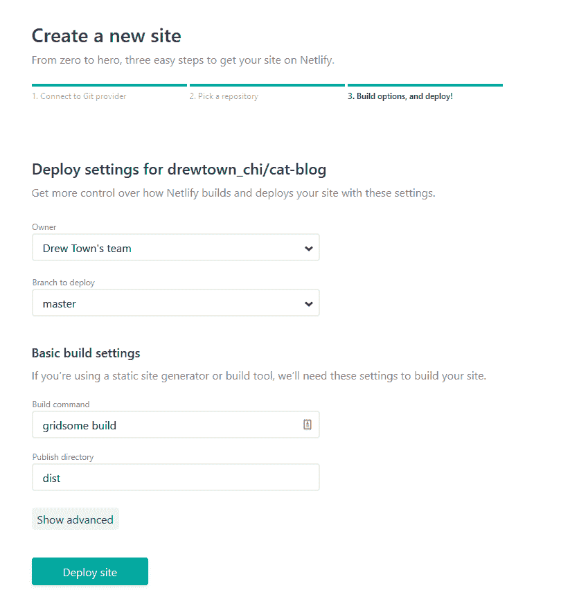

# 用 GitLab、NetlifyCMS 和 Netlify 设置 Gridsome

> 原文：<https://dev.to/drewtownchi/setting-up-gridsome-with-gitlab-netlifycms-and-netlify-405b>

真的没有比这更好的工具来建立一个快速、免费且仍能提供良好开发体验的博客了。这里有一个[链接](https://drewtownchi-cat-blog-example.netlify.com/)到我们将要创建的演示

如果你不知道 Gridsome，这是新的场景静态站点生成器，类似于 Gatsby，使用 Vue.js 而不是 React。

NetlifyCMS 是由 Netlify 的团队创建的 CMS。与 Wordpress 等产品相比，CMS 的功能相对较低。但是，CMS 的亮点在于它允许非技术用户在 git 存储库中创建 markdown 文件。将 markdown 文件提交到 Git 存储库允许您的构建系统接收关于存储库更改的通知，并触发新的静态站点构建。所有这些都不需要非技术用户知道 Git 是什么。

我们将介绍如何让这两个框架和两个服务协同工作来创建快速、可靠的静态博客。

# 先决条件

## 去吧

需要一个有效的 Git CLI，UI 会让一切变得更容易。对于 Windows，安装 [Git For Windows](https://gitforwindows.org/) 和您喜欢的 Git UI。

## Node.js

Node 和 npm 是必需的，虽然文档没有指定，但安装最新的可用的 LTS 版本可能是个好主意。

## 安装 Gridsome CLI

```
// npm
npm i -g @gridsome/cli

//yarn
yarn global add @gridsome/cli 
```

## Netlify 和 GitLab 账户

如果您还没有 Netlify 和 GitLab 帐户，您需要注册这些服务。

# 设置一个 GitLab 库

这个演示是基于 GitLab 的，但是一般来说，相同的步骤也适用于其他提供者，只需要做一些配置上的调整。

您将需要注意到用户名和**项目鼻涕虫**在这种情况下 drewtown_chi/cat-blog

## 创建一个应用程序，允许 Netlify CMS 对您的 GitLab 项目进行认证

登录 GitLab 后，点击右上角的头像打开用户设置，然后点击**设置**。在左侧找到**应用程序**。

提供一个名称、一个重定向 URL `http://localhost:8080/admin/`并授予 **api** 作用域。最后，单击 save 并记下应用程序 ID 以备后用。

# 创建 Gridsome 项目并推送到 Git

一旦 Node、npm 和 Gridsome CLI 都安装完毕，导航到新项目所在的目录并运行 Gridsome 的 create 命令。

```
grisome create catblog 
```

几秒钟后，一旦命令完成，导航到目录并运行以下命令。

> 如果您还没有设置 GitLab SSL 密钥，您可能需要访问[此页面](https://gitlab.com/profile/keys)并遵循生成密钥的文档。这篇文章没有详细介绍如何配置你的 GitLab 账户通过 SSH 访问

```
git init
git remote add origin git@gitlab.com:[Your username]/[Your project slug].git
git add .
git commit -m "Initial commit"
git push -u origin master 
```

如果你想在本地运行站点，从项目文件夹中运行`gridsome develop`，然后在浏览器中浏览到`http://localhost:8080`

# 设置从存储库中提取的 Netlify

此时，我们有了一个工作的 Gridsome 设置，它被推送到 GitLab 存储库。

登录 Netlify 并导航到仪表板的**站点**部分，在这里您可以点击 Git 按钮中的**新站点。**

在这里，从**连续部署**部分选择 GitLab，然后选择适当的存储库，在本例中为“drewtown_chi/cat-blog”。

现在我们需要输入我们的构建命令 **gridsome build** 和我们的发布目录 **dist。**最后，点击**部署地点**

[](https://res.cloudinary.com/practicaldev/image/fetch/s--Rv0rp0Tt--/c_limit%2Cf_auto%2Cfl_progressive%2Cq_auto%2Cw_880/https://thepracticaldev.s3.amazonaws.com/i/i0pqhfz4abra94y1sx3m.png)

# 向 Gridsome 项目添加 Netlify CMS

将 Netlify CMS 和所需的 Gridsome 插件安装到您的项目中

```
npm add netlify-cms gridsome-plugin-netlify-cms @gridsome/source-filesystem @gridsome/transformer-remark 
```

接下来是调整 grid some . config . js

```
module.exports = {
  siteName: "Cat Blog",
  plugins: [
    {
      use: "@gridsome/source-filesystem",
      options: {
        path: "post/**/*.md",
        typeName: "Post"
      }
    },
    {
      use: "gridsome-plugin-netlify-cms",
      options: {
        publicPath: "/admin"
      }
    }
  ],
  transformers: {
    remark: {
      externalLinksTarget: "_blank",
      externalLinksRel: ["nofollow", "noopener", "noreferrer"]
    }
  },
}; 
```

现在 Gridsome 通过插件了解了 Netlify CMS，我们需要将 CMS 添加到项目中。

在`src`文件夹中创建一个`admin`目录。

将以下文件添加到管理目录:`index.html`、`index.js`和`config.yml`。

## index.html 目录

```
<!doctype html>
<html>
<head>
  <meta charset="utf-8">
  <meta name="viewport" content="width=device-width, initial-scale=1.0">
  Netlify CMS
</head>
<body>
  <script src="index.js" type="module"></script>
</body>
</html> 
```

## index.js 目录

```
import CMS from "netlify-cms"; 
```

## 配置. yml 目录

```
backend:
  name: gitlab
  repo: [Your username]/[Your project slug]
  auth_type: implicit
  app_id: [App ID from your GitLab repository setup]

media_folder: "static/uploads"
public_folder: "/uploads"

collections:
  - name: "post"
    label: "Post"
    folder: "post"
    create: true
    slug: "{{slug}}"
    fields:
      - {label: "Title", name: "title", widget: "string"}
      - {label: "Body", name: "body", widget: "markdown"} 
```

重启 Gridsome 开发环境后，您应该能够浏览到`http://localhost:8080/admin`并通过 GitLab 进行认证。试着创建一些测试文章，我们可以用它们在主页上循环。

# 查询并显示博客文章

Gridsome 使用 GraphQL 从后端查询数据。为了显示数据，我们需要在我们的`Index.vue`上设置一个`<page-query>`来查询我们从 CMS 创建的帖子并遍历它们。你可以在这里阅读更多关于查询数据[。](https://gridsome.org/docs/querying-data)

下面是一个基本的例子，它查询所有的文章，并使用一个`v-for`来遍历这些文章，以显示它们的标题和正文内容。

```
<template>
  <Layout>

    <h1>Cat Blog!</h1>

    <div v-for="post in $page.posts.edges" :key="post.node.id" class="content">
      <h2>{{post.node.title}}</h2>
      <p v-html="post.node.content">
      </p>
    </div>

  </Layout>
</template>

<page-query>
query Posts {
  posts: allPost {
    edges {
      node {
        id
        title
        content
      }
    }
  }
}
</page-query>

<script>
export default {
  metaInfo: {
    title: 'Hello, world!'
  }
}
</script> 
```

# 包装完毕

我们已经有了一个基本的工作博客，现在由你来设计你的页面，添加[附加字段](https://www.netlifycms.org/docs/widgets/#default-widgets)和创建[模板](https://gridsome.org/docs/templates)来显示个人帖子。