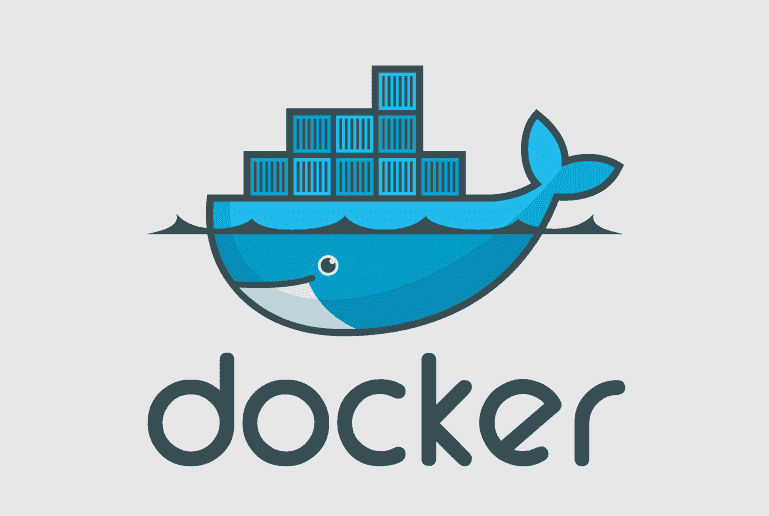
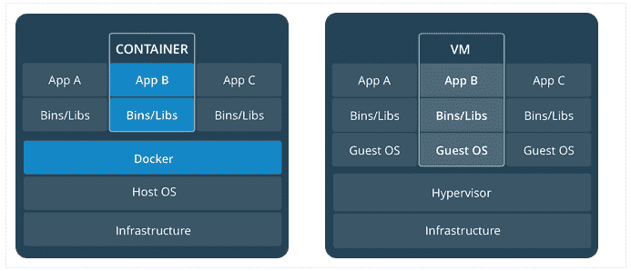
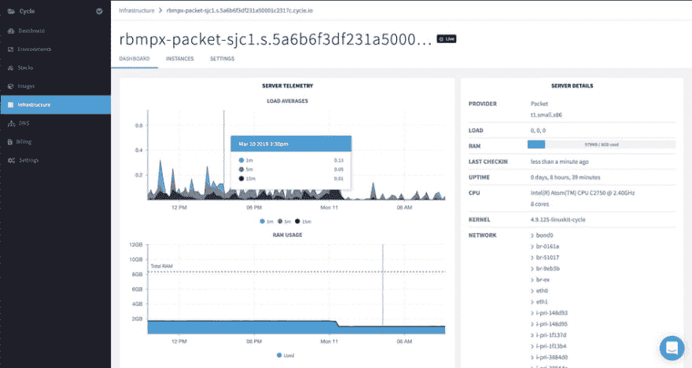

# 码头和循环介绍

> 原文：<https://dev.to/alinisarahmed/introduction-to-docker-and-cycle-5ef6>

*(这来自我的[博客文章](https://alinisarahmed.live/learn-docker)，我第一次尝试写技术文章)

Docker 已经席卷了整个世界(或者至少，接管了我的世界，世界上的其他人不久前才意识到它的重要性)。但是 Docker 到底是什么？最近有机会自学 Docker。这篇文章记录了我所学到的经验，并为那些对容器技术一无所知的人(就像我一样，当我开始时)提供了一个容器技术的鸟瞰图。这篇文章旨在让读者了解 Docker 是什么(我希望如此)，并作为进一步学习的基础。我们还将学习在服务器上管理容器的容器编排系统，并探索一个这样的系统，Cycle。

## 什么是 Docker

Docker 是一个开源软件，它通过将整个东西打包在容器中来帮助我们运行其他软件。容器是软件的自包含单元，其所有依赖关系都包含在包中。如果你看一下 Docker 的[标志](https://blog.docker.com/2013/06/announcing-new-docker-style/)，它是一只携带集装箱的鲸鱼，这完美地描绘了 Docker 的工作方式。它将您所有的项目文件、文件夹和其他东西转换成一个“运输容器”，一个自给自足的软件单元，携带着它运行所需的一切。一个应用程序可以分成多个这样的容器，它们可以在一个服务器上串联运行，由容器编排系统编排。

[](https://res.cloudinary.com/practicaldev/image/fetch/s--zcQe7YJd--/c_limit%2Cf_auto%2Cfl_progressive%2Cq_auto%2Cw_880/https://thepracticaldev.s3.amazonaws.com/i/9gy4ehr32m8mx9abh0l3.png)

因此，它有点像一个即插即用系统，我们只需下载一个“盒子”，将其插入 Docker，然后它就可以运行了，根本不用关心我们的计算机使用的是什么操作系统，或者我们的系统上是否安装了任何依赖项(或相同依赖项的变体)。类似地，我们可以将下一个应用打包到一个容器中，发送给一个朋友，我们需要担心的是我们的朋友是否能够运行该应用，就是他们的系统中是否安装了 Docker 本身。无论操作系统是 Windows、Mac 还是 Linux，Docker 容器都可以在其中运行而不会出现任何问题，即使该容器是在 Windows、Linux 或 Mac 中组装的。所有需要的是 Docker 软件本身安装在我们的系统上。

从技术上来说，Docker 并不直接从我们的项目中制作容器，它制作的是**图像**，顾名思义，图像就是 Docker **容器**的来源。你下载一个图像，用它制作一个容器，然后用这个容器运行你的应用程序。在 [Docker Hub](https://hub.docker.com/) 上有数以千计的图片，这是 Docker 图片的中央储存库。

## Docker 之前有什么？

标准是使用虚拟机(计算机中的计算机，有自己的操作系统)来运行应用程序。虚拟机为在其中运行的软件提供隔离，代价是在另一个虚拟机中运行成熟的操作系统所需的计算能力和硬件资源。在一个系统上运行几个虚拟机对该系统来说是一个巨大的资源消耗。Docker 采取了不同的方法，他们为我们的应用程序创建了虚拟隔离，并且与虚拟机不同，为应用程序提供了足够的资源来隔离运行。下图摘自官方 Docker [指南](https://docs.docker.com/get-started/)，完美地总结了这一切。

[](https://res.cloudinary.com/practicaldev/image/fetch/s--2ggxEN9B--/c_limit%2Cf_auto%2Cfl_progressive%2Cq_auto%2Cw_880/https://thepracticaldev.s3.amazonaws.com/i/r5u7h215ukse6asklz97.png)

## 如何对项目进行归档

使用 Docker 构建应用程序可以总结如下

1.  在项目的根目录下创建一个`Dockerfile`
2.  使用`docker build ...`创建图像
3.  使用`docker run ...`从这些图像运行容器
4.  在一个应用程序中组合这些容器，并通过一个`docker-compose.yml`文件一起运行它们。

让我们进一步探索这些步骤。

Docker 映像是通过在我们的项目根目录下的一个名为`Dockerfile`的文件中给 Docker 软件提供各种指令来构建的。一个示例 Docker 文件可能看起来像这样

```
FROM node:11.14 as builder
WORKDIR /app
COPY package.json /app
RUN npm install
COPY . /app
RUN npm run build

FROM node:11.14
COPY /.env ./ 
COPY --from=builder /app/dist/ ./dist
COPY --from=builder /app/server/ ./server
COPY /packageJson_server/package.json ./
RUN npm install
ENV SECRET="abcdefg"
EXPOSE 8080
CMD [ "npm", "run", "serve" ] 
```

`Dockerfile`中的命令只是 Docker 软件在项目文件夹中需要做什么的指令(事实上，它们中的许多是不言自明的)，一旦从命令行指示 Docker 开始为我们的项目构建映像，它们就会发挥作用。例如，这些构建和运行映像的命令行指令就像`docker build --tag=note-taking-app .`一样。有太多这样的命令，起初看起来令人生畏，但是一旦我们开始构建一些容器，它们就会成为第二天性。最有用和常用的命令有`docker build ...` `docker run ...`、`docker ps` `docker image ps` `docker image ls`等。

当我们命令 Docker 制作一个图像时，它会读取`Dockerfile`并开始逐个执行命令。第一次从`Dockerfile`中生成映像通常需要一些时间，但在那之后，Docker 会很聪明地缓存构建，并在后续的构建中从清单文件(`package.json`或`requirements.txt`)中读取依赖项列表，如果没有改变，就使用那些依赖项的缓存版本。

另一个特性是**多阶段构建**，其中来自第一个构建的*工件*(在生产中不会使用的文件&文件夹，如`node_modules`文件夹)在构建的下一个阶段被丢弃，从而保持构建精简和干净。所以，在上面粘贴的`Dockerfile`中，我先构建了应用程序的前端(`npm run build`)，然后在下一阶段，只复制了 build ( `dist/`)文件夹，这样就把前端`node_modules`留了下来，不会包含在最终的构建中。因此，容器变得尽可能的轻量级，只包含那些运行时需要的文件。

一旦构建了一个映像，我们就可以通过运行命令`docker run (Name/ID of Image) (params)`(我们可以提供各种参数，这些参数与本文无关)用它们制作尽可能多的容器。

使用一个`docker-compose.yml`文件可以同时运行多个容器。某些条件可以在`docker-compose.yml`文件中指定，例如哪个容器应该首先启动，容器如何相互通信以及如何与外界通信，允许这些容器访问哪些文件夹(卷)等。一个示例`docker-compose.yml`文件看起来像这样:

```
version: '3'
services: 
  db:
    image: 'alinisarahmed/note-app:my-mongo'
    ports:
      - "27017:27017"
    volumes:
      - /data/db:/data/db
  nodejs:
    build: .
    image: 'alinisarahmed/note-app:v2'
    command: npm run serve
    ports: 
      - "3000:3000"
    depends_on:
      - db
    links:
      - db
    environment: 
      - MONGO_HOSTNAME=mongodb://db:27017/test-db
      - PORT=3000 
```

## 码头工人的优势

那么，你会问，做所有这些“容器化”有什么意义？将应用程序作为容器运行有很多好处，总结如下:

*   容器化提供了对应用程序制作和运行环境的抽象。这种分离产生了一致性、标准化和奇偶校验，并允许开发人员为他们的应用程序创建可预测的环境，以便在任何地方运行。开发人员可以专注于代码，而不用担心它最终将在哪个系统上运行。
*   它帮助我们避免依赖性问题，例如依赖性之间的冲突、系统之间的依赖性变化，或者像一个程序改变了一个依赖性的版本，这使得另一个程序变得无用。
*   它将软件开发的“模块”模型提升到应用程序部署的水平，我们可以利用其他人制作的图像，并将它们无缝集成到您自己的应用程序中，而无需担心任何问题。
*   Docker 设法将部署时间缩短到几秒钟(前提是您使用一个好的容器编排器，稍后会详细介绍)。这是因为它为每个进程创建一个容器，而不是引导操作系统。
*   Docker 支持对生产版本进行简单的版本控制，使得回滚到生产版本的前一个工作映像变得容易。
*   Docker 确保应用程序可以从系统中干净地删除，因为一旦应用程序容器被删除，其所有相关的依赖关系也将从我们的系统中消失，而不会在主机操作系统上留下任何临时或配置文件。
*   Docker 还确保每个应用程序只使用已经分配给它们的资源。
*   最后，但同样重要的是，使用 Docker 的另一个好处是安全性。从安全的角度来看，Docker 确保运行在容器上的应用程序是完全隔离的。没有一个 Docker 容器可以查看另一个容器中运行的进程。

## 部署、容器编排和循环

那么，我们已经将应用程序容器化了，我们如何部署它呢？

部署容器的一种方式是将它们部署在云服务器上(运行在云上的计算机)，由容器编排系统监控。最著名的容器编排系统之一是 [Kubernetes](https://kubernetes.io/) ，另一个是[循环](https://cycle.io)。我们不会在这里比较这些系统，但是我能够轻松地设置服务器和部署我的应用程序(由两个容器组成，一个用于 MongoDB，另一个用于 Node/Express JSON API 和一个 React/TypeScript 前端),而不知道 jack 关于编排器、云、服务器和其他开发-操作工具的知识，这证明了 Cycle 的说法，即开发人员现在可以做过去需要整个开发-操作团队才能完成的事情(见鬼，我甚至还不是专业开发人员！).你必须试着去相信它，如果你真的想尝试，请继续读下去。

Cycle 声称是一个容器编排系统，它承诺交付，通过让我们只关注代码而不是基础设施，为我们简化容器管理的过程。CycleOS 利用一个运行时来实现 [**开放容器倡议**](https://www.opencontainers.org/) 规范，允许 Cycle 支持多种容器技术。Cycle 为我们提供了一个 **GUI 仪表板**，从这里可以很容易地控制容器如何分组和部署。它目前与云服务提供商 Vultr 和 Packet 合作，后者提供基础设施来托管我们的容器。pipeline 还有一个功能，用户可以将自己的基础设施连接到自行车仪表盘。如果需要更细粒度的控制，Cycle 还提供了基于 REST 的 API。

用 Vultr 注册和设置服务器轻而易举，Cycle 也是如此。这些服务不是免费的，但是，Vultr 为良性行为提供免费积分，比如在 twitter 上关注他们，Cycle 第一个月提供 25 美元积分。这足以让我们尝试这些服务，并尝试一下。

部署一个服务器，然后通过 Cycle 在那个服务器上部署一个应用程序，被证明是一件非常轻松的任务。我们从 GUI 仪表板内部工作，而不是从命令行设置一切。整个过程是这样的:

1.  选择一个云服务提供商(目前是 Vultr 和 Packet，很快 AWS 也将推出)。
2.  根据您的需求和预算选择服务器规模(称为基础架构)。
3.  从 Docker Hub 等存储库中上传 Docker 图像。
4.  用 Docker 图片制作**栈**(一个栈就是一组图片；它是一个原子单位，有点像图像本身)，由一个称为堆栈文件的`cycle.json`文件指定(下面将详细介绍)。
5.  将栈部署到一个**环境**，该环境自动构建一个私有的加密网络，容器在该网络上进行通信，并启动其他服务。

对我来说，整个过程中唯一具有挑战性的方面是创建`cycle.json`文件，然而，以前使用`docker-compse.yml`文件的经验对此很有帮助，因为`cycle.json`基本上是`docker-compose.yml`文件的 JSON 版本，并添加了一些特定于 Cycle 的选项。将来，用户将能够从一个`docker-compose.yml`文件自动生成`cycle.json`文件。

一旦创建了环境，我们就会看到完整的实时 GUI 仪表板，如下所示

[](https://res.cloudinary.com/practicaldev/image/fetch/s--TRXj_wIi--/c_limit%2Cf_auto%2Cfl_progressive%2Cq_auto%2Cw_880/https://thepracticaldev.s3.amazonaws.com/i/v64qe2pw5q2pdoqb8u1x.png)

从仪表板上，人们可以轻松地开始，停止或规模的容器，因为他们的愿望。有一个容器的更新图像吗？只需点击几下鼠标，就可以在仪表盘上轻松完成。担心更新可能会导致整个应用崩溃？在出现故障的情况下，Cycle 能够自动恢复到上次已知的工作配置。每个环境还附带了 VPN(虚拟专用网)、负载平衡器和 Discovery(DNS 服务)等服务，它们本身就是容器。在未来，用户将能够提供他们自己的“服务”容器，从而获得对其环境行为的更多控制。

总的来说，看到我简单的双容器应用程序部署得如此之快，真是一次愉快的经历。我确信，随着容器数量的增加和应用程序复杂性的增长，Cycle 是您管理整个系统所需的平台。在他们的[文档](https://docs.cycle.io/)页面上阅读更多关于这项技术的信息。

## 进一步资源

如果你想了解更多关于容器技术的知识，下面的链接对我帮助很大。

*   [最好的资源之一](https://docker-curriculum.com/)
*   [官方码头指南](https://docs.docker.com/get-started/)
*   [这篇很棒的媒体文章深入介绍了更多细节](https://medium.freecodecamp.org/docker-simplified-96639a35ff36)
*   [Docker 上的这部精彩的 2 集视频系列](https://youtu.be/pGYAg7TMmp0)
*   [如何在 Docker 容器中运行 React 应用](https://dev.to/peterj/run-a-react-app-in-a-docker-container-kjn)
*   [另一个很棒的教程，来自数字海洋](https://www.digitalocean.com/community/tutorials/how-to-build-a-node-js-application-with-docker)

* * *