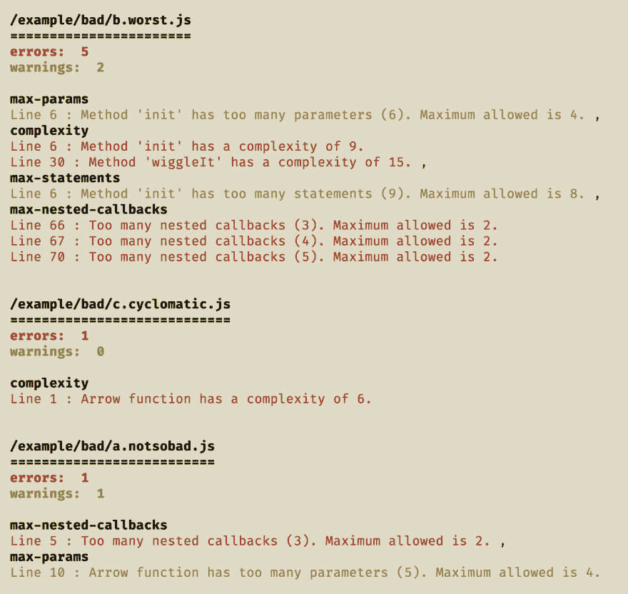

# 我的第一个 npm 包- eslint-formatter-complexity

> 原文：<https://dev.to/mlennox/my-first-npm-package-eslint-formatter-complexity-4m3i>

注意:这是我的个人博客[https://www.webpusher.ie/2019/05/04/eslint-npm-package](https://www.webpusher.ie/2019/05/04/eslint-npm-package)的交叉帖子

我刚刚发布了我的第一个 npm 包-[eslint-formatter-complexity](https://www.npmjs.com/package/eslint-formatter-complexity)。它是一个 eslint 格式化程序，使用复杂性度量(见下文)来突出显示代码库中最需要重构的文件。

该代码可在 https://github.com/mlennox/eslint-formatter-complexity 公开回购中获得，欢迎发布和请求。

这是上一篇文章“使用 eslint 找到最复杂的代码”的延续。

## 它是如何工作的？

格式化程序接收 eslint 结果，找到已被破坏的复杂性度量相关规则(见下文)，根据生成的错误和/或警告的数量对违规文件进行排序，并将列表输出到控制台。这与标准的 eslint 输出有很大的不同，标准 eslint 输出只列出了文件及其基于文件结构传递给它的不规则。

格式化程序的典型输出如下所示。

我提到的复杂性度量是通过以下 eslint 规则来衡量的

*   [复杂度(圈复杂度)](https://eslint.org/docs/rules/complexity)
*   [最大参数](https://eslint.org/docs/rules/max-params)
*   [最大报表](https://eslint.org/docs/rules/max-statements)
*   [每行最大语句数](https://eslint.org/docs/rules/max-statements-per-line)
*   [最大嵌套回调](https://eslint.org/docs/rules/max-nested-callbacks)
*   [最大深度](https://eslint.org/docs/rules/max-depth)
*   [最大行数](https://eslint.org/docs/rules/max-lines)

## 为什么？

为了好玩！

此外，我正在撰写一系列与抽象语法树相关的博客文章，还有一些关于 eslint 的文章，所以我的目标是正确地编写代码，并在编写过程中发布。

我有一个理论，代码标准在自动化时工作得最好；不得不说，这并不是一个有争议的理论。

代码标准的自动化执行有助于创建一致的代码，加速代码审查，有助于减少错误，并且还应该便于开发人员维护他们的代码库状态的心理模型。我发布了 eslint-formatter-complexity 包，主要是为了最后一点——帮助开发人员可视化他们代码库的复杂性。

按照复杂程度的降序列出文件有助于强调哪些文件需要重构。理想情况下，它应该作为一个步骤添加到您的 CI 构建中，将每个构建的结果添加到质量关中，并传达给整个团队。

## 问题

如果您有任何问题、改进建议或发现任何错误，请在 repo 中提出

[https://github . com/mlen NOx/eslint-formatter-complexity/issues](https://github.com/mlennox/eslint-formatter-complexity/issues)