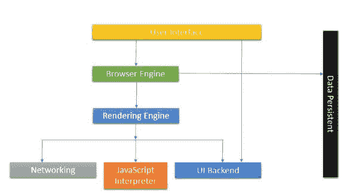
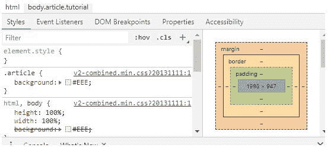

# 浏览器如何工作——一窥内幕

> 原文：<https://dev.to/lambdatest/how-browsers-work-a-peek-under-the-hood-d6d>

在过去的几年里，当 Internet Explorer 以 90%的使用份额统治市场时，开发人员习惯于将 IE 视为一个除了查看渲染代码之外无事可做的黑匣子。然而，现在是开源浏览器的时代。随着像 Firefox 和 Chrome 这样的浏览器占据了超过 50%的使用份额，开发人员可以很容易地看到幕后发生的事情。简而言之，有成千上万行 C++代码。让我们简单了解一下浏览器的工作原理。

## 浏览器的结构

浏览器的主要组件包括

1.  **用户界面—**包括前进和后退按钮、书签、地址栏等。以及显示所请求页面的窗口。
2.  **浏览器引擎–**它控制渲染引擎和用户界面之间的动作。
3.  **渲染引擎—**渲染引擎的主要功能是显示请求的内容。例如，如果请求 HTML 内容，引擎会解析 CSS 和 HTML，当内容被解析时，它会显示在屏幕上。
4.  **用户界面后端–**它可以用来绘制基本图像，如窗口或组合框。后端只公开一个通用的独立于平台的接口。在它下面，操作系统使用用户界面方法。
5.  **JS 解释器–**内置的解释器解析并执行 JavaScript 和所有其他类型的脚本。
6.  **联网—**执行 HTTP 请求和响应的实现。
7.  **数据存储—**所有类型的数据，如 cookies，都由浏览器保存在本地。浏览器还支持 WebSQL、文件系统、localStorage 等存储机制。

## 流程流程

网络层向呈现引擎提供所请求的文档内容。内容通常以每个 8kb 的块的形式传输。一旦发生这种情况，就会出现下面的流程。

*   内容树是由呈现引擎创建的，HTML 元素在这里被解析并转换成 DOM 节点。解析内部和外部 CSS 中的样式数据，并使用视觉信息和样式创建渲染树。
*   具有特定颜色和尺寸的矩形排列在渲染树的内部。它们应该按照正确的顺序呈现在屏幕上。
*   一旦构建了呈现的树，它就遵循布局过程，其中每个节点被给定精确的坐标，根据这些坐标它们应该被显示在屏幕上。
*   最后一个阶段是绘画。渲染树中的每个节点都将根据 UI 后端层中编写的代码进行设计。绘画通常是按顺序进行的

    *   首先分配背景颜色。
    *   紧随其后的是背景图像。
    *   边框已分配。
    *   孩子叠。
    *   创建页面的轮廓。

渲染行业内部的所有过程都是逐渐发生的。然而，渲染引擎的工作是尽可能快地在屏幕上显示内容，以提供更好的用户体验。这就是为什么不解析 HTML 并一次构建渲染树的全部内容，而是开始构建树的几个部分，而其他部分在后端进行解析和构建。让我们详细了解一下布局，它是页面生命周期中的一个复杂部分。

## DOM 和 CSS 对象模型构建

在渲染引擎的第一步，HTML 文档被解析，解析后的元素被转换成 DOM 树中的节点。树中的每个元素都表示为一个父节点，其中包含子元素。

当浏览器解析 HTML 时，它面对的是“link”标签，该标签引用链接到页面的外部 CSS。它预计需要链接来呈现完整的页面。立即发送解析 CSS 页面的请求。

## 布局

当渲染器在创建后添加到树中时，它没有任何大小或位置。布局是计算这些值的手段。

HTML 使用基于流程的布局模型。这意味着在大多数情况下，布局是在一次通过中完成的。布局树中稍后放置的元素不会影响较早放置的元素的几何图形。因此，布局可以全方位进行。尽管可能存在一些例外。表格中需要一个以上的通道。

所有渲染器都由一个布局方法组成，该方法通过帧层次结构中的子元素递归出现。在默认的 html 页面中，根渲染器放置在(0，0)坐标处，其尺寸作为可见的浏览器窗口的一部分，称为**视口**。

布局后的工艺流程:

1.  渲染的父对象决定宽度。
2.  它检查孩子并设置他们的水平和垂直坐标。
3.  仅在需要时调用子布局。
4.  父级使用子级的累积高度、边距和填充来计算它自己的高度，从而在层次结构中位于它之上的父级渲染器将使用它。
5.  脏渲染器的值设置为 false。
6.  如果您看一看开发人员控制台，您会发现一个类似盒子的结构，其中包含一系列矩形盒子，一个放在另一个里面。这是 CSS 盒子模型，由表示文档树中的元素的容器组成，并按照可视模型的方式进行布局。
7.  每个框包含一个内容区域，可能包含也可能不包含周围的边框、填充、边距等。

## 绘画

在绘画中，调用 paint()方法来呈现 UI 基础结构、自定义样式等。在组件上。绘制可以是全局的，即一次绘制整个渲染树，也可以是递增的，即元素按上下文顺序堆叠。

当网页的任何自定义样式改变时，浏览器执行所需的最小动作，因为任何小的改变都将导致整个元素的重画、其位置的布局改变以及整个树的重新呈现。

## 分层显示元素

元素的 z-index 属性推断出该元素在堆栈中的位置。在堆栈中，排列在后面的元素首先被绘制，具有较高 z 索引值的元素排列在前面，最后被绘制。这些堆栈通常有两种类型:

*   具有 z 索引属性的容器或盒子形成本地堆栈。
*   HTML 的视窗形成了外部堆栈。

现在使用的浏览器大多是免费软件，功能齐全，不仅可以呈现和显示网页，还可以显示 web 应用程序。其中一些提供插件，允许用户获得多媒体相关信息。在使用开发人员控制台和构建交互式 web 应用程序之前，清楚地了解浏览器的工作原理对 web 开发人员非常有益，因为每个浏览器的开发方式不同，因此呈现方式也不同。

这是一个网站在不同浏览器上看起来不一样的主要原因。所以，有必要在所有浏览器上测试任何网站。您可以使用 LambdaTest 在不同的浏览器上测试您的网站，如 Firefox、Chrome、Safari、Internet Explorer、Edge、Yandex 以及移动浏览器。

所以，了解浏览器，开发和测试！

快乐开发，快乐测试。🙂

**相关帖子**

1.  [了解跨浏览器测试的区别&响应式测试](https://www.lambdatest.com/blog/understanding-the-difference-between-cross-browser-testing-responsive-testing/?utm_source=dev&utm_medium=Blog&utm_campaign=ar-03-060519eu&utm_term=OrganicPosting)
2.  [以下是如何设置完美的跨浏览器测试环境](https://www.lambdatest.com/blog/here-is-how-you-setup-perfect-cross-browser-testing-environment/?utm_source=dev&utm_medium=Blog&utm_campaign=ar-03-060519eu&utm_term=OrganicPosting)
3.  [Selenium web driver 中的定位器及示例](https://www.lambdatest.com/blog/locators-in-selenium-webdriver-with-examples/?utm_source=dev&utm_medium=Blog&utm_campaign=ar-03-060519eu&utm_term=OrganicPosting)