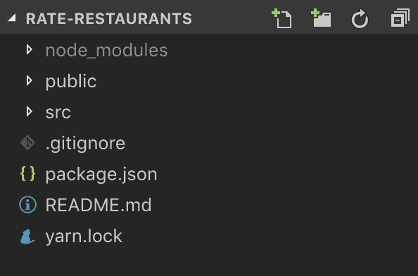
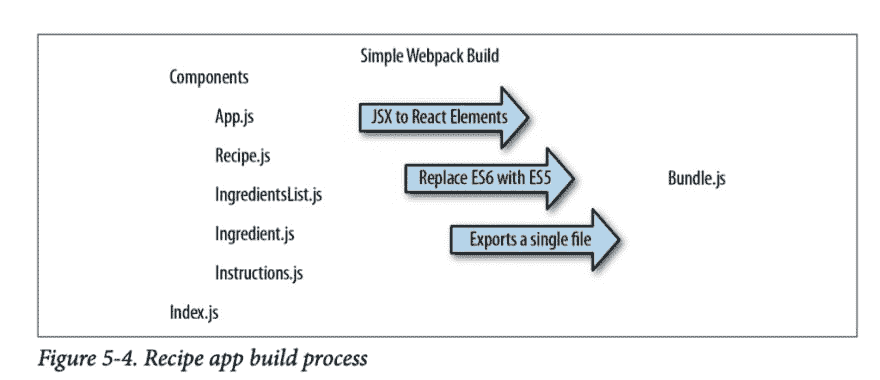
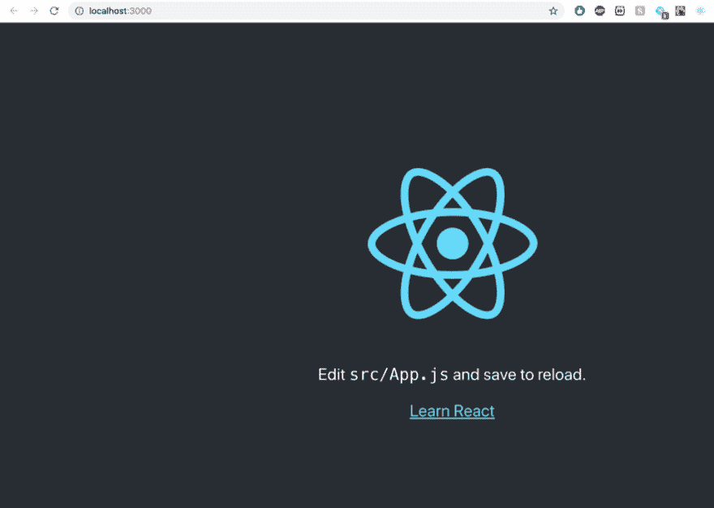
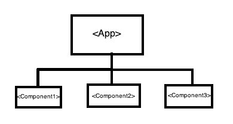
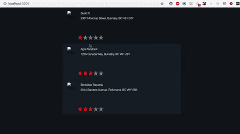

# 创建 React 应用程序入门

> 原文：<https://dev.to/bnevilleoneill/getting-started-with-create-react-app-i9a>

[](https://res.cloudinary.com/practicaldev/image/fetch/s--dZh9QbwZ--/c_limit%2Cf_auto%2Cfl_progressive%2Cq_auto%2Cw_880/https://cdn-images-1.medium.com/max/1024/1%2AMp7i6PVKU7rCGrF9KZOyfQ.jpeg)

Create React App 是一个用于构建简单应用的流行工具链。这篇文章的目的是在更深的层次上解释 Create React App 的组件，让你对开发环境有更好的控制和信心。

### 简介

在我们理解 Create React App 解决什么之前，让我们先[了解一下什么是工具链](https://elinux.org/Toolchains)。eLinux.org 将其描述为“一套不同的软件开发工具，通过特定的阶段链接在一起。”

换句话说，任何软件开发框架都是由一堆支持工具组成的，这些工具被优化来完成特定的功能。例如，在 C++开发中，如果项目相当大，我们需要一个编译器来编译代码，并且需要一个像 CMake 这样的构建系统来管理所有的依赖项。在这种情况下，编译器和 CMake 成为工具链的一部分。

在 React 开发中，不同的工具链满足产品开发的不同需求。例如，Next.js 非常适合构建服务器呈现的网站，而 GatsbyJS 针对静态的、面向内容的网站(如博客和时事通讯)进行了优化。

Create React App 也是一个工具链。React 社区特别推荐它用于构建单页应用程序(spa)和学习 React(用于构建“hello，world”应用程序)。它设置您的开发环境，以便您可以使用最新的 JavaScript 特性，提供良好的开发人员体验，并针对生产优化您的应用程序。

在撰写本文时，您需要在您的机器上安装 Node 6 . 0 . 0 和 NPM 5 . 2 . 0。

[](https://logrocket.com/signup/)

### 历史

Create React App 是由[乔·哈达德](https://github.com/timer)和[丹·阿布拉莫夫](https://github.com/gaearon)创建的。GitHub 库非常活跃，由创建者和来自世界各地的一些开源开发者维护。如果你有兴趣投稿，资源库的[投稿页面](https://github.com/facebook/create-react-app/blob/master/CONTRIBUTING.md)是一个很好的起点。

### 入门

现在我们已经有了一些关于创建 React 应用程序的相关上下文，让我们从安装它开始吧。在本教程中，我将构建一个简单的 SPA，在网页上显示餐馆，并让用户对它们进行评级。

#### 安装

在终端上运行下面的 [npx](https://www.npmjs.com/package/npx) 命令，使用 Create React App 安装并引导应用程序。让我们称我们的应用程序为“rate-restaurants”

```
~ npx create-react-app rate-restaurants 
```

在名为 rate-restaurants 的新目录下创建了一个基本的 React 应用程序后，这个命令运行了几秒钟，然后愉快地退出。现在，将 cd 放入目录。该目录最初看起来像这样:

[](https://res.cloudinary.com/practicaldev/image/fetch/s--aN3NKJ3E--/c_limit%2Cf_auto%2Cfl_progressive%2Cq_auto%2Cw_880/https://cdn-images-1.medium.com/max/594/0%2AQW77i9ziLT52SRq7) 

<figcaption>目录结构</figcaption>

让我们了解一下每个文件夹是什么:

#### 节点 _ 模块

该文件夹是 npm 系统的一部分。npm 将软件包的本地安装放入。当前包根的/node_modules。基本上，您想通过调用“import”语句使用的包在这里。

#### 公共

该文件夹包含 index.html 和 manifest.json 文件。让我们看看公共文件夹中的文件。

#### index.html

这个 index.html 充当生成 build/index.html 的模板，最终是在浏览器上提供的主文件。让我们来看看这个文件的内容:

```
<!DOCTYPE html>
<html lang="en">
  <head>
    <meta charset="utf-8" />
    <link rel="shortcut icon" href="%PUBLIC_URL%/favicon.ico" />
    <meta
      name="viewport"
      content="width=device-width, initial-scale=1, shrink-to-fit=no"
    />
    <meta name="theme-color" content="#000000" />
    <!--
      manifest.json provides metadata used when your web app is installed on a
      user's mobile device or desktop. See https://developers.google.com/web/fundamentals/web-app-manifest/
    -->
    <link rel="manifest" href="%PUBLIC_URL%/manifest.json" />
    <!--
      Notice the use of %PUBLIC_URL% in the tags above.
      It will be replaced with the URL of the `public` folder during the build.
      Only files inside the `public` folder can be referenced from the HTML.

      Unlike "/favicon.ico" or "favicon.ico", "%PUBLIC_URL%/favicon.ico" will
      work correctly both with client-side routing and a non-root public URL.
      Learn how to configure a non-root public URL by running `npm run build`.
    -->
    React App
  </head>
  <body>
    <noscript>You need to enable JavaScript to run this app.</noscript>
    <div id="root"></div>
    <!--
      This HTML file is a template.
      If you open it directly in the browser, you will see an empty page.

      You can add webfonts, meta tags, or analytics to this file.
      The build step will place the bundled scripts into the <body> tag.

      To begin the development, run `npm start` or `yarn start`.
      To create a production bundle, use `npm run build` or `yarn build`.
    -->
  </body>
</html> 
```

#### [标题和元标签](https://facebook.github.io/create-react-app/docs/title-and-meta-tags)

标签提供了关于 HTML 文档的[元数据；它们描述了页面的内容。标签通常不会显示在网页上，但它们是机器可解析的。捆绑的脚本最终被放入这个 HTML 文件的`<body>`标签中。](https://www.w3schools.com/tags/tag_meta.asp)

那么什么是“捆绑脚本”呢？

为了理解这一点，我们需要了解工具链世界中的另一个概念，那就是 [webpack](https://webpack.js.org/) 。把 webpack 想象成一个捆绑所有源文件的工具。js，。css 等。)并创建一个单个的`bundle.js`文件，该文件可以从一个`<script>`标签中的`index.html`文件提供服务。

通过这种方式，应用程序内的 HTML 请求数量显著减少，这直接提高了应用程序的网络性能。此外，当您为它提供额外的配置选项时，webpack 还有助于使代码模块化和灵活。

[](https://res.cloudinary.com/practicaldev/image/fetch/s--ATlHmwHR--/c_limit%2Cf_auto%2Cfl_progressive%2Cq_auto%2Cw_880/https://cdn-images-1.medium.com/max/1024/0%2AYQNHUnNn6IjgSwbP) 

<figcaption>来源:《学习 React:使用 React 和 Redux 的功能性 Web 开发》</figcaption>

上图显示了一个使用 React 构建并使用 webpack 捆绑的示例配方应用程序。

webpack 有一个 webpack.config.js 文件，用于指定配置设置。它通常看起来像这样:

```
const path = require('path');

module.exports = {
  entry: './src/index.js',
  output: {
    path: path.resolve(__dirname, 'dist'),
    filename: 'bundle.js'
  }
}; 
```

entry 键指定 webpack 的[入口点](https://webpack.js.org/concepts/#entry)，output 指定 bundle.js 文件在构建过程之后的存储位置。

回到 index.html，Create React App 使用 [html-webpack-plugin](https://www.npmjs.com/package/html-webpack-plugin) 进行捆绑。如果您在这里查看 webpack.config.js [，入口键指向 src/index.js，它指定了 webpack 的入口点。](https://github.com/facebook/create-react-app/blob/21fe19ab0fbae8ca403572beb55b4d11e45a75cf/packages/react-scripts/config/webpack.config.dev.js)

当 webpack 编译资产时，它会生成一个包(或者几个，如果您使用代码分割的话)。它使它们的最终路径对所有插件都可用——一个这样的插件用于将脚本注入 HTML。

html-webpack-plugin 也可以生成 html 文件。在创建 React 应用程序的`webpack.config.js`中，[指定了](https://github.com/facebookincubator/create-react-app/blob/21fe19ab0fbae8ca403572beb55b4d11e45a75cf/packages/react-scripts/config/webpack.config.prod.js#L233-L235)应该将`public/index.html`读取为模板。inject 选项也被设置为 true。有了这个选项，html-webpack-plugin 就可以用 webpack 提供的路径在最终的 html 页面中添加一个`<script>`。

这个最后的页面是您在运行 npm run build 之后在 build/index.html 中得到的页面，也是您运行 npm start 时得到的页面。

现在我们了解了 index.html，让我们继续看 manifest.json

#### [T1】manifest . JSON](#manifestjson)

这是一个描述你的应用程序的[网络应用清单](https://developer.mozilla.org/en-US/docs/Web/Manifest)，如果一个快捷方式被添加到主屏幕**上，它就会被手机使用。**让我们看看内容来进一步理解:

```
{
  "short_name": "React App",
  "name": "Create React App Sample",
  "icons": [
    {
      "src": "favicon.ico",
      "sizes": "64x64 32x32 24x24 16x16",
      "type": "image/x-icon"
    }
  ],
  "start_url": ".",
  "display": "standalone",
  "theme_color": "#000000",
  "background_color": "#ffffff"
} 
```

这个文件的内容是不言自明的。但是这些值用在哪里呢？

当用户使用 Android 上的 Chrome 或 Firefox 将 web 应用程序添加到他们的主屏幕时， [manifest.json](https://github.com/facebook/create-react-app/blob/master/packages/react-scripts/template/public/manifest.json) 中的元数据决定了显示 web 应用程序时使用什么图标、名称和品牌颜色。[web 应用清单指南](https://developers.google.com/web/fundamentals/engage-and-retain/web-app-manifest/)提供了更多关于每个字段含义的上下文，以及您的定制将如何影响您的用户体验。

基本上，从该文件中读取的信息用于填充 web 应用程序的图标、颜色、名称等。

#### favicon.ico

这只是我们的应用程序使用的图标图像文件。你可以在 index.html 和 manifest.json 中看到这个链接

在转到 src/目录之前，让我们看看根目录下的其他几个文件。

#### package.json

这个文件列出了你的项目所依赖的包以及你的项目可以使用的包的版本。它还使您的构建可重复，因此更容易与其他开发人员共享。

脚本在这里特别重要。您可以看到 start、build、test 和 eject 命令指向 react-scripts 版本的 start、build、test 和 eject。这指定了当您运行 npm start 之类的 npm 命令时，它将实际运行 react-scripts start。

react-scripts 是 create-react-app 启动包中的一组脚本。react-scripts start 设置开发环境并启动服务器，以及热模块重载。你可以在这里阅读[来看看它为你做的一切。](https://github.com/facebook/create-react-app#whats-included)

#### 锁纱

在了解 yarn.lock 的用途之前，我们先来了解一下什么是 yarn。Yarn 允许您使用代码并与世界各地的其他开发人员共享代码。Yarn 可以快速、安全、可靠地做到这一点，因此您不必担心。

它允许您使用其他开发人员针对不同问题的解决方案，使您更容易开发自己的软件。代码通过称为包的东西(有时也称为模块)共享。一个包包含所有被共享的代码以及一个描述这个包的 package.json 文件。

为了在不同的机器上获得一致的安装，Yarn 需要比您在 package.json 中配置的依赖关系更多的信息。为此，Yarn 在项目的根目录中使用了一个 yarn.lock 文件。

### 运行 app

现在让我们启动应用程序。要运行该应用程序，您可以运行 npm start 或 yarn start。运行命令后，打开 [http://localhost:3000](http://localhost:3000/) 查看应用程序。

请注意，npm run build 或 yarn build 将为生产构建应用程序，并将其存储在 build/文件夹中，可以部署到生产中。出于本教程的考虑，让我们使用 npm start，而不是为生产构建它。

[](https://res.cloudinary.com/practicaldev/image/fetch/s--Jl4jf1_I--/c_limit%2Cf_auto%2Cfl_progressive%2Cq_auto%2Cw_880/https://cdn-images-1.medium.com/max/1024/0%2AOLRAEFzqpMveM2cY)

<figcaption>app 的主屏幕。</figcaption>

运行该应用程序时，它看起来类似于上图。让我们试着了解一下这个应用的切入点是什么。当我们看 webpack 的时候，我提到 webpack 的入口是 index.js，这是 React 应用程序的入口点。

index.js 文件包含以下行:

`ReactDOM.render(<App/>, document.getElementById('root'));`

这一行调用 ReactDOM 的 render()方法，该方法将一个 React 元素呈现到所提供的容器中的 DOM 中，并返回一个对组件的[引用](https://reactjs.org/docs/more-about-refs.html)。这里的 React 元素是`<App>`组件，提供的容器是 DOM 元素根(在 index.html 中引用)。

`<App>`是这个 app 的根组件。我们再来看`App.js`，这里定义的是:

```
import React, { Component } from 'react';
import logo from './logo.svg';
import './App.css';

class App extends Component {
  render() {
    return (
      <div className="App">
        <header className="App-header">
          
          <p>
            Edit <code>src/App.js</code> and save to reload.
          </p>
          <a
            className="App-link"
            href="https://reactjs.org"
            target="_blank"
            rel="noopener noreferrer"
          >
            Learn React
          </a>
        </header>
      </div>
    );
  }
}

export default App; 
```

App 组件是一个类，它扩展了 React 的组件类，用于定义 React 组件。这是我们感兴趣的地方。我们甚至可以在 src/components/文件夹中单独构建 React 组件，并在 App.js 中导入这些组件。

[](https://res.cloudinary.com/practicaldev/image/fetch/s--NEhza-P---/c_limit%2Cf_auto%2Cfl_progressive%2Cq_auto%2Cw_880/https://cdn-images-1.medium.com/max/390/0%2AUHEz5M7gHFF1uY43)

<figcaption>React app 的结构</figcaption>

典型的 React 应用程序类似于上图。有一个根组件`<App>`，它导入其他子组件，这些子组件又导入其他子组件。数据通过 React 属性从根节点流向子节点，然后使用回调函数返回。这是任何基本的 React 应用程序使用的设计模式。

此时，我们应该能够通过调整 App.js 并添加必要的组件来开始构建任何简单的单页面应用程序。App.css 文件可用于设计应用程序的样式。

### 评价餐厅 App

我们最终的应用程序将如下所示:

[](https://res.cloudinary.com/practicaldev/image/fetch/s--4ghwAhVr--/c_limit%2Cf_auto%2Cfl_progressive%2Cq_66%2Cw_880/https://thepracticaldev.s3.amazonaws.com/i/jlh9ojiv663f3aih5nc0.gif)

第一步是编写我们的应用程序的无状态组件，我们将需要这些组件来构建包含数据和评级系统的卡片。为此，我们在 src/中创建一个名为 components/的文件夹，并添加一个名为 card.js:
的文件

```
import React from 'react';

const CardBox = (props) => {
  return(
    <div className="card-body">
      {props.children}
    </div>
  )
}

const Image = (props) => {
  return(
    
    </img>
  )
}

const Name = (props) => {
  return(
    <div className="name">
      {props.name}
    </div>
  )
}

const Details = (props) => {
  return(
    <div className="details">
      {props.details}
    </div>
  )
}

const Star = ({ selected=false, onClick=f=>f }) =>
 <div className={(selected) ? "star selected" : "star"}
      onClick={onClick}>
 </div>

const Card = (props) => {
  return(
    <CardBox>
      <div className="inner-body">
        <Image image={props.image}/>
        <div className="body">
          <div className="inner-body">
            <Name name={props.name}/>
          </div>
          <Details details={props.details}/>
          <div className="inner-body">
          {[...Array(5)].map((n, i) =>
            <Star key={i}
                  selected={i<props.starsSelected}
                  onClick={() => props.change(props.id, i+1)}
          />)}
          </div>
        </div>
      </div>
    </CardBox>
  )
}

export { Card } 
```

如您所见，我们为卡片中的每个元素创建了一个独立的无状态组件，即餐馆名称、详细信息、图像和评级部分。然后，我们将所有这些包装在一个卡组件中，并将其导出为默认值:

```
import React, { Component } from 'react';
import { Card } from './components/card.js'
import uuid from 'uuid/v1'
import './App.css';

class App extends Component {
  constructor(props) {
    super(props)
    this.state={
      restaurants:
      [ 
      ]
    }
  }

  componentWillMount() {
    this.getData()
  }

  getData() {
    this.setState({
      restaurants:[
        {
          id: uuid(),
          name: "Sushi S",
          details: "2301 Moscrop Street, Burnaby, BC V61 23Y",
          image: "null",
          starsSelected: 0,
        },
        {
          id: uuid(),
          name: "Agra Tandoori",
          details: "1255 Canada Way, Burnaby, BC V61 23Y",
          image: "null",
          starsSelected: 0,
        },
        {
          id: uuid(),
          name: "Bandidas Taqueria",
          details: "2544 Sanders Avenue, Richmond, BC V6Y 0B5",
          image: "null",
          starsSelected: 0,
        },
      ]
    });
  }

  OnChange(id, starsSelected) {
    this.setState(
      [...this.state.restaurants].map((restaurant) => {
        if(restaurant.id === id) {
          restaurant.starsSelected = starsSelected
        }
      })
    );
  }

  render() {
    return (
      <div className="main-body">
        {[...this.state.restaurants].map((restaurant, index) => {
          let name = restaurant.name
          let image = restaurant.image
          let details = restaurant.details
          let starsSelected = restaurant.starsSelected
          let id = restaurant.id
          return(
            <Card
              key={index}
              name={name}
              details={details}
              image={image}
              starsSelected={starsSelected}
              id={id}
              change={(id, starsSelected) => this.OnChange(id, starsSelected)}
             />
          )
        })}      
      </div>
    );
  }
}

export default App; 
```

在 App.js 中，我们导入卡片**。**餐厅数据被建模为该应用的状态。随着应用程序及其餐厅数据的增长，在 App.js 之外的文件中单独保存州是一个更好的设计。在 render()函数中，我们将这些数据作为属性传递给 Card 组件。

数据作为属性向下流到子组件，并通过回调向上流回，回调是用于更新星级的 OnChange 回调。

所有的样式都在 App.css 里面，如果你有兴趣分叉这个 App，可以在这里找到[。](https://github.com/kakaly/rate-restaurants)

就是这样！现在你去 [http://localhost:3000/](http://localhost:3000/) 的时候，应该会看到率餐厅 app，蓄势待发。

### 热模块更换

热模块替换(HMR)是 webpack 中的一个特性，用于将更新的模块注入活动运行时。每个模块都像是 LiveReload。HMR 是“选择加入”，所以你需要在你的应用程序的选择点输入一些代码。依赖关系由模块系统处理。

那么，如何在使用 Create React App 创建的项目中实现这一点呢？

这个挺简单的！只需在 index.js 中添加以下代码，HMR 就可以开始了。

```
// regular imports
ReactDOM.render(<App /> , document.getElementById('root'))

if (module.hot) {
  module.hot.accept('./App', () => {
    ReactDOM.render(<App />, document.getElementById('root'))
  })
} 
```

### npm 与纱线

npm 和 Yarn 都是包装经理。Yarn 是由脸书创建的，目的是解决他们在 npm 中面临的一些问题。单纯从 GitHub 存储库中 Yarn 和 npm 的星级数量来看，Yarn 的星级数量明显多于 npm。

还有，Yarn 的安装速度比 npm 快很多，Yarn 比 npm 更安全。你可以阅读更深入的分析，比较他们的速度和安全性[在这里](https://medium.com/@j.dumadag718/yarn-vs-npm-b2d58289fb9b)。这些是 Yarn 更受欢迎和推荐软件包管理器使用的一些令人信服的原因。

### 使用 Create React App 构建的应用

最后，为了获得使用 Create React App 构建应用程序的一些动机，让我们看看一些使用 Create React App 引导和构建的知名产品。

[这个](https://github.com/facebook/create-react-app/issues/2980) GitHub 评论区有一长串使用 Create React App 构建的生产就绪应用。一些想法甚至是 Y-Combinator 的一部分。

### 结论

我希望你现在能更好地理解 Create React App 的不同元素。你还在等什么？启动终端，安装 create-react-app，开始构建你的绝妙想法吧！

* * *

### Plug: [LogRocket](https://logrocket.com/signup/) ，一款适用于网络应用的 DVR

[](https://logrocket.com/signup/)

<figcaption>[https://logrocket.com/signup/](https://logrocket.com/signup/)</figcaption>

LogRocket 是一个前端日志工具，可以让你回放问题，就像它们发生在你自己的浏览器中一样。LogRocket 不需要猜测错误发生的原因，也不需要向用户询问截图和日志转储，而是让您重放会话以快速了解哪里出错了。它可以与任何应用程序完美配合，不管是什么框架，并且有插件可以记录来自 Redux、Vuex 和@ngrx/store 的额外上下文。

除了记录 Redux 操作和状态，LogRocket 还记录控制台日志、JavaScript 错误、堆栈跟踪、带有头+正文的网络请求/响应、浏览器元数据和自定义日志。它还使用 DOM 来记录页面上的 HTML 和 CSS，甚至为最复杂的单页面应用程序重新创建像素级完美视频。

[免费试用](https://logrocket.com/signup/)。

* * *

帖子[开始使用 Create React App](https://blog.logrocket.com/getting-started-with-create-react-app-d93147444a27/) 首先出现在[博客](https://blog.logrocket.com)上。