# 理解混淆矩阵(二)

> 原文：<https://dev.to/overrideveloper/understanding-the-confusion-matrix-264i>

在本文第一部分的[中，我谈到了混淆矩阵，2 类混淆矩阵，如何使用它计算准确度、精确度和其他指标，以及如何在 python 中生成混淆矩阵。](https://dev.to/overrideveloper/understanding-the-confusion-matrix-2dk8)

在这篇文章中，我们将会看到多类混淆矩阵。

### 什么是多类混淆矩阵？

顾名思义，它是一个处理多个类(即超过 2 个类)的混淆矩阵。就像 2 类混淆矩阵一样，它描述了多类分类模型的性能。

出于本文的目的，我们将假设我们的多类分类模型是将狗的图像分类成以下品种的模型:**灰狗**、**獒犬**和**萨摩耶犬**。

该分类器的混淆矩阵可以如下所示:

[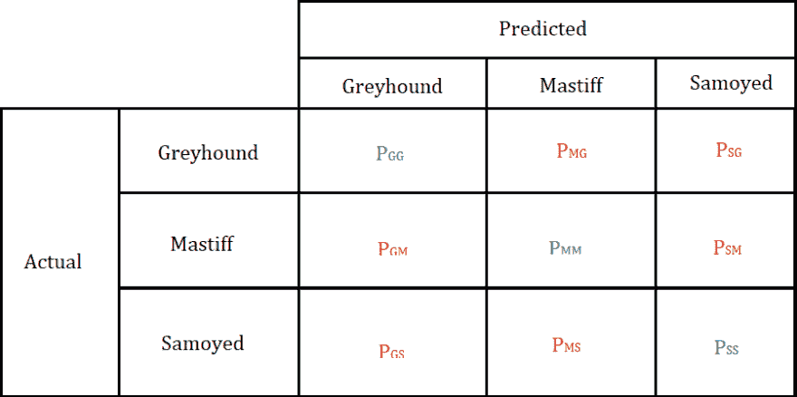](https://res.cloudinary.com/practicaldev/image/fetch/s--cRGF5_MX--/c_limit%2Cf_auto%2Cfl_progressive%2Cq_auto%2Cw_880/https://thepracticaldev.s3.amazonaws.com/i/hri4evvbu1t2v7mmmvct.png)

在这个可视化中，我们有两个已被概述的部分。我们有**预测**分类部分，其中包含我们想要分类的每个类别的三个子部分，以及**实际**分类部分，其中包含每个类别的三个子部分。

将这个混淆矩阵可视化后，我们可以使用这个可视化来计算以下指标:

*   真正的阳性。
*   真正的否定。
*   假阳性。
*   假阴性。
*   准确性。
*   精准。
*   真实阳性率也被称为**敏感度**或**回忆**。
*   真阴性率又称为**特异性**。

在我们计算这些指标之前，让我们定义可视化中的变量:

**PGG**
这个变量代表**灰狗**的图像被正确分类【为**灰狗**】的预测次数。这也是**灰狗**级的**真正**。

**PMG**
这个变量代表了**灰狗**的图像被错误归类为**獒犬**的预测次数。

**PSG**
这个变量代表**灰狗**的图像被错误归类为**萨摩耶**的预测次数。

**PGM**
这个变量代表**獒犬**的图像被错误归类为**灰狗**的预测数量。

**PMM**
这个变量代表**獒犬**的图像被正确分类【为**獒犬**】的预测数量。这也是**獒**级的**真正**。

**PSM**
这个变量代表**獒犬**的图像被错误归类为**萨摩耶犬**的预测次数。

**PGS**
这个变量代表了**萨摩耶犬**被错误归类为**灰狗**的预测次数。

**PMS**
这个变量代表一只**萨摩耶犬**的图像被错误归类为**獒犬**的预测次数。

**PSS**
这个变量代表**萨摩耶**的图像被正确分类【为**萨摩耶**】的预测次数。这也是**萨摩耶**级的**真正**。

既然我们已经定义了这些变量，现在我们可以计算前面提到的指标。

#### 真阳性

**正真值**的定义与 2 类混淆矩阵中的定义相同。然而，这里我们计算混淆矩阵中每一类的**真阳性**，不同于 2 类混淆矩阵中的一般或绝对**真阳性**。

**真阳性**是被标记为属于特定类别的数据被正确分类为所述类别的预测数。例如，萨摩耶犬的图像被正确分类为萨摩耶犬的预测数量。

根据矩阵变量的定义，我们已经确定了每个类别的**真阳性**:

> **灰狗**类的真阳性是混淆矩阵中的变量 **PGG** 。
> 
> **獒犬**类的**真阳性**是混淆矩阵中的变量 **PMM** 。
> 
> **萨摩耶**类的真阳性是混淆矩阵中的变量 **PSS** 。

#### 真正的否定

**真负值**的定义与 2 类混淆矩阵中的定义相同。这里我们计算混淆矩阵中每一类的**真否定**，不同于 2 类混淆矩阵中的一般或绝对**真否定**。

特定类的**真否定值**是通过对除了我们试图寻找其**真否定值**的类的行和列之外的每一行和列中的值求和来计算的。

例如，计算**灰狗**类的**真阴性**:

[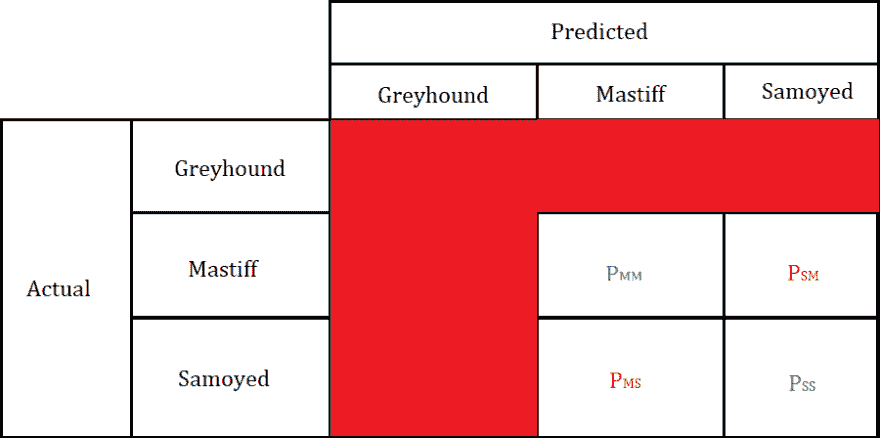](https://res.cloudinary.com/practicaldev/image/fetch/s--Ps4NK1D6--/c_limit%2Cf_auto%2Cfl_progressive%2Cq_auto%2Cw_880/https://thepracticaldev.s3.amazonaws.com/i/wn6xmsa03jt6q5uxpyhv.png)

我们省略了属于**灰狗**类的行和列，并对剩下的变量求和，这些变量是其他类的行和列(**獒犬**和**萨摩耶犬**)。

因此，**灰狗**等级的**真阴性**是:

**=**PMM**+**PSM**+**PMS**+**PSS****

 **类似地，我们可以计算其他类的**真负值**。

计算**獒类**的**真阴性**:

[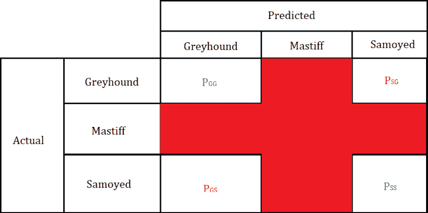](https://res.cloudinary.com/practicaldev/image/fetch/s--Gt_FzbqX--/c_limit%2Cf_auto%2Cfl_progressive%2Cq_auto%2Cw_880/https://thepracticaldev.s3.amazonaws.com/i/59757aql6m5rnv3b1cqo.png)

**獒**级的**真阴性**是:

**TN**=**PGG**+**PSG**+**PGS**+**PSS**

计算**萨摩耶**类的**真阴性**:

[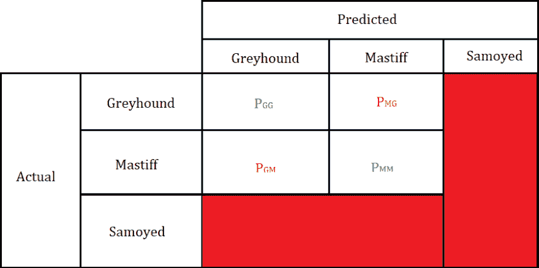](https://res.cloudinary.com/practicaldev/image/fetch/s--qlCarH7U--/c_limit%2Cf_auto%2Cfl_progressive%2Cq_auto%2Cw_880/https://thepracticaldev.s3.amazonaws.com/i/zmli0399jpwjmgrbjgh6.png)

**萨摩耶**类的**真阴性**是:

**=**PGG**+**PMG**+**PGM**+**PMM****

 **#### 误报

**假阳性**的定义与 2 类混淆矩阵中的定义相同。这里我们计算混淆矩阵中每一类的**误报**，不同于 2 类混淆矩阵中的一般或绝对**误报**。

特定类别的**假阳性**可以通过取对应于该类别的列中除了**真阳性**值之外的所有值的总和来计算。

例如，计算**灰狗**类的**误报**:

[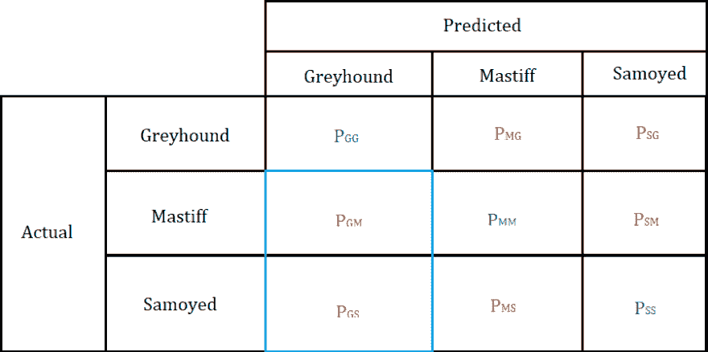](https://res.cloudinary.com/practicaldev/image/fetch/s--628wJA9p--/c_limit%2Cf_auto%2Cfl_progressive%2Cq_auto%2Cw_880/https://thepracticaldev.s3.amazonaws.com/i/mfd9j7yq5v4i797z3a0e.png)

我们对突出显示区域中的所有值求和，该区域是对应于**灰狗**类的列，但变量 **PGG** 除外，我们之前已经确定该变量是**灰狗**类的**真阳性**。

因此**灰狗**等级的**误报**为:

**FP**=**PGM**+**PGS**

类似地，我们可以计算其他类的**误报**。

计算**獒犬**类的**误报**:

[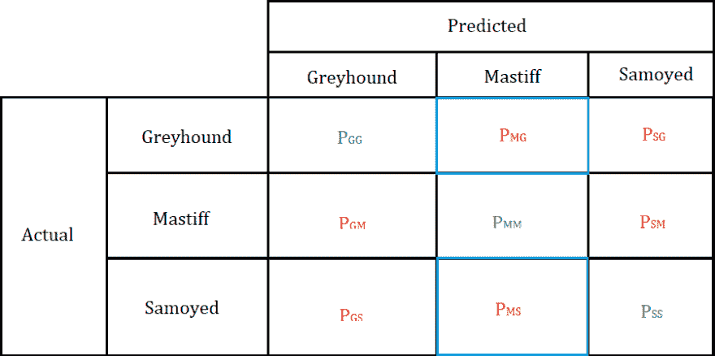](https://res.cloudinary.com/practicaldev/image/fetch/s--YUU4QJhi--/c_limit%2Cf_auto%2Cfl_progressive%2Cq_auto%2Cw_880/https://thepracticaldev.s3.amazonaws.com/i/nghrfl7wqguyhvk01kag.png)

**獒犬**类的**误报**为:

**FP**=**PMG**+**PMS**

计算**萨摩耶**类的**误报**:

[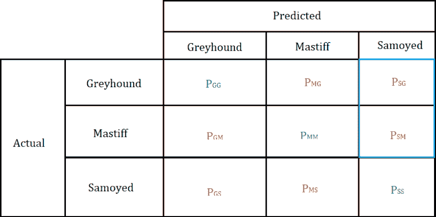](https://res.cloudinary.com/practicaldev/image/fetch/s--3QUKW-Sp--/c_limit%2Cf_auto%2Cfl_progressive%2Cq_auto%2Cw_880/https://thepracticaldev.s3.amazonaws.com/i/e6gfhvxnh3l532paoju6.png)

**萨摩耶**类的**误报**为:

**FP**=**PSG**+**PSM**

#### 漏报

**假阴性**的定义与 2 类混淆矩阵中的定义相同。这里我们计算混淆矩阵中每一类的**假阴性**，不同于 2 类混淆矩阵中的一般或绝对**假阳性**。

特定类别的**假阴性**可以通过取对应于该类别的行中除了**真阳性**值之外的所有值的总和来计算。

例如，计算**灰狗**类的**假阴性**:

[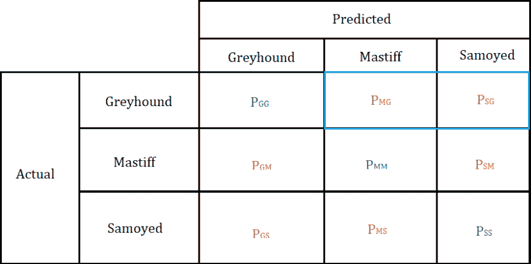](https://res.cloudinary.com/practicaldev/image/fetch/s--QpG8_xwv--/c_limit%2Cf_auto%2Cfl_progressive%2Cq_auto%2Cw_880/https://thepracticaldev.s3.amazonaws.com/i/x1ufhj99p00c3eynsw2q.png)

我们对突出显示区域中的所有值求和，该区域是对应于**灰狗**类的行，但变量 **PGG** 除外，我们之前已经确定该变量是**灰狗**类的**真阳性**。

因此**灰狗**类的**假阴性**为:

**联合国** = **PMG** + **PSG**

类似地，我们可以计算其他类的**假阴性**。

计算**獒犬**类的**假阴性**:

[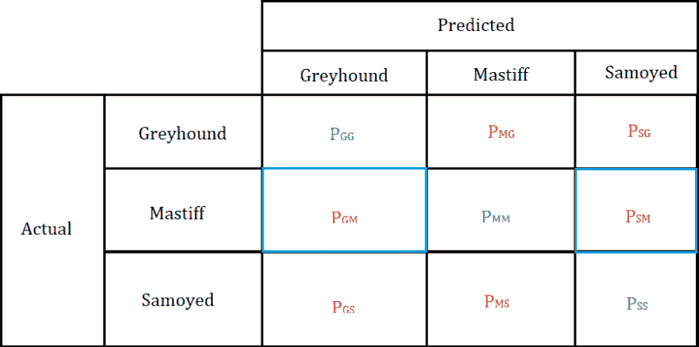](https://res.cloudinary.com/practicaldev/image/fetch/s--L_S_v5uG--/c_limit%2Cf_auto%2Cfl_progressive%2Cq_auto%2Cw_880/https://thepracticaldev.s3.amazonaws.com/i/kxb9eu9wa48v1kyknv10.png)

**獒**级的**假阴性**为:

**FN**=**PGM**+**PSM**

计算**萨摩耶**类的**假阴性**:

[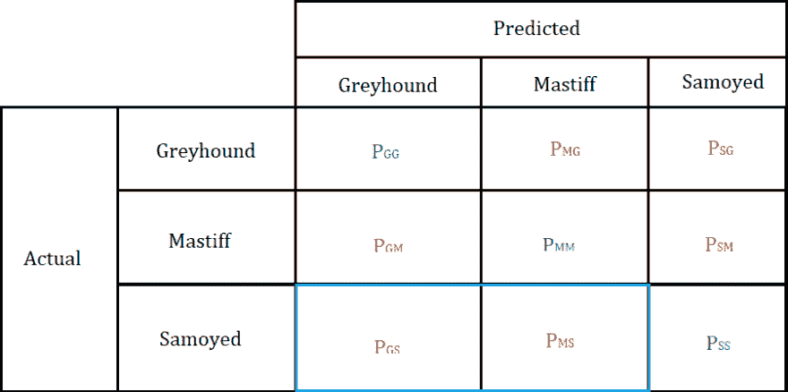](https://res.cloudinary.com/practicaldev/image/fetch/s--zBCKbcHF--/c_limit%2Cf_auto%2Cfl_progressive%2Cq_auto%2Cw_880/https://thepracticaldev.s3.amazonaws.com/i/7tr1hsadrkm6ckrax4ia.png)

**萨摩耶**类的**假阴性**为:

**FN**=**PGS**+**PMS**

#### 准确度

**准确率**计算为正确分类数与分类总数的比值。根据我们的混淆矩阵，正确的分类是每个类别的**真阳性**，分类总数是混淆矩阵中每个值的总和，包括**真阳性**。

因此，精确度为:

**交流**=(**【pgg】**+**【pmm】**+**【PSS】**/**【pgg+pmg+PSG+PGM+pmm+PSM+pgs+PSS**)

#### 精度

**精度**是多类混淆矩阵是相对于特定类的预测的精度的度量。它的计算方法是，相关类的**真阳性**与其**真阳性**和**假阳性**之和的比值。

例如，计算**灰狗**类的精度:

**精度**(**G**)=**TP**/(**TP+FP**)
=**PGG**/(**PGG**+(**PGM+PGS**))

同样，我们可以计算其他类的精度。

计算**獒类**的精度:

**精度(M)**=**TP/(TP+FP)**
=**PMM**/(**PMM**+(**PMG**+**PMS**))

计算**萨摩耶**类的精度:

**精度(S)**=**TP**/**(TP+FP)**
=**PSS**/(**PSS**+(**PSG**+**PSM**))

#### 真阳性率

**真阳性率**(也称为**召回**或**灵敏度**)计算为特定类别的**真阳性**与其**真阳性**和**假阴性**之和的比值。

例如，计算**灰狗**类的**真阳性率**:

**TPR(G)**=**TP**/(**TP+FN**)
=**PGG**/(**PGG**+(**PMG+PSG**))

同样，我们可以计算其他类的真实阳性率。

计算**獒类**的真阳性率:

**TPR(m)**=**【TP】**/**TP+fn**)
=**【pmm】**【pmm】**+【PGM+PSM】******

计算**萨摩耶**类的真实阳性率:

**【S】**=**TP**/(**TP+FN**)
=**PSS**/(**PSS**+(**PGS+PMS**))

#### 真负率

**真阴性率**(也称为**特异性**)计算为特定类别的**真阴性**与其**真阴性**和**假阳性**之和的比率。

例如，计算**灰狗**类的**真阴性率**:

**TNR(G)**=**TN**/(**TN+FP**)
=(**PMM**+**PSM**+**PMS**+**PSS**)/(**PMM**+**PSM**+**PMS**+**PSS**)+(

同样，我们可以计算其他类的真实负率。

计算**獒类**的真阴性率:

**TNR(M)**=**TN**/(**TN+FP**)
=(**PGG**+**PSG**+**PGS**+**PSS**)/(**PGG**+**PSG**+**PGS**+**PSS**)+(【T23

计算**萨摩耶**类的真阴性率:

**TNR(S)**=**TN**/(**TN+FP**)
=(**PGG**+**PMG**+**PGM**+**PMM**)/(**PGG**+**PMG**+**PGM**+**PMM**)+(【T23

唷，那可真多。😅😅

### 现在，快速举例

假设我们有下面的图像作为我们的分类器的可视化混淆矩阵，我们可以使用可视化的信息和上面定义的度量来评估它的性能。

[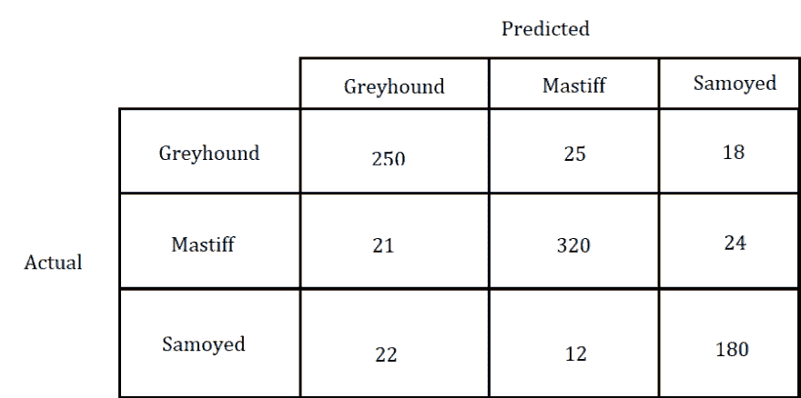](https://res.cloudinary.com/practicaldev/image/fetch/s--FZwCSGMs--/c_limit%2Cf_auto%2Cfl_progressive%2Cq_auto%2Cw_880/https://thepracticaldev.s3.amazonaws.com/i/anmc0dp239y2c895ba1x.png)

从这个混淆矩阵中，我们可以确定:

> *   The true positive of variables **PGG** and **of greyhound** is **250** .
> 
> **獒**
> 
>  **PMM** 
> 
> **真阳性**
> 
>  **320** 
> 
> **萨摩耶**
> 
>  **PSS** 
> 
> **真正**
> 
>  **180** 
> 
> **PMG**
> 
>  **25** 
> 
> *   The variable **PSG** is **18** .
> 
>  **PGM** 
> 
>  **21** 
> 
> *   The variable **PSM** is **24** .
> *   The variable **pgs** is **22** .
> *   The variable **PMS** is **12** .

使用我们“提取”的这些信息，我们可以计算前面提到的指标，从而评估分类器的性能。

##### 真正的否定

> *   **TN** ( **灰狗**)=**PMM+PSM+PMS+PSS**= 320+24+24+180 =**548**
> *   **TN** ( **獒**)=**+PSG+PGS+PSS**= 250+18+22+180 =【T18 =**PGG+PMG+PGM+PMM**= 250+25+21+320 =**616**T30

##### 误报

> *   **FP** ( **灰狗**)=**PGM+PGS**= 21+22 =**43**
> *   **FP** ( **獒**)=**PMG+PMS**= 25+12 =**37**
> *   **FP**(T24

##### 漏报

> *   **FN** ( **灰狗**)=**PMG+PSG**= 25+18 =**43**
> *   **FN** ( **獒**)=**PGM+PSM**= 21+24 =**45**
> *   **联合国**【t23

##### 真阳性率/召回率/灵敏度

> *   **TPR** ( **灰狗**)=**TP**/(**TP+FN**)= 250/(250+43)= 250/293 = 0.8532423208 =**0.85**
> *   **TPR** ( **獒**)=**TP**365 = 0.8767123288 =**0.88**
> *   **TPR** ( **萨摩耶**)=**TP**/(**TP+FN**)= 180/(180+34)= 180/214 = 0.8411214953 =**0.81**

##### 真阴性率/特异性

> *   **TNR** **灰狗】**=**TN**/(**TN+FP**)= 548/(548+43)= 548/591 = 0.9272419628 =**0.93**
> *   **TNR**T2(獒)=**TN**/(507 = 0.9270216963 =**0.93**
> *   **TNR**T2(萨摩耶)=**TN**/(**TN+FP**)= 616/(616+42)= 616/658 = 0.9361702128 =**0.94**

##### 精度

> *   **精度** ( **灰狗**)=**TP**/(**TP+FP**)= 250/(250+43)= 250/293 = 0.8532423208 =**0.85**

因此，该分类器在对灰狗图像进行分类时，精度为 **0.85** ，即 **85%** 。

> *   **精度** ( **獒**)=**TP**/(**TP+FP**)= 320+(320+37)= 320/357 = 0.8963585434 =**0.90**

因此，该分类器在对獒犬图像进行分类时，精度为 **0.90** ，即 **90%** 。

> *   **精度** ( **萨摩耶**)=**TP**/(**TP+FP**)= 180/(180+42)= 180/222 = 0.8108108108 =**0.81**

因此，该分类器在对萨摩耶犬图像进行分类时，精度为 **0.81** ，即 **81%** 。

##### 准确度

**交流**=(**【pgg】**+**【pmm】**+**【PSS】**/**【pgg+pmg+PSG+PGM+pmm+PSM+pgs+PSS**))

因此，分类器的总精度为 **0.86** ，即 **86%**

### 如何在 Python 中生成多类混淆矩阵

多类混淆矩阵以与 2 类混淆矩阵相同的方式创建。参见本文的[第一部分。](https://dev.to/overrideveloper/understanding-the-confusion-matrix-2dk8)****