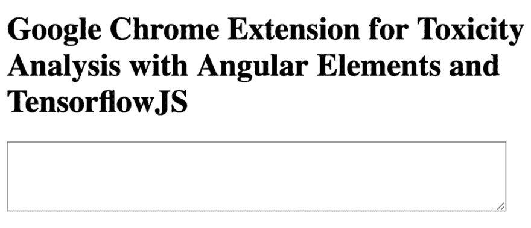
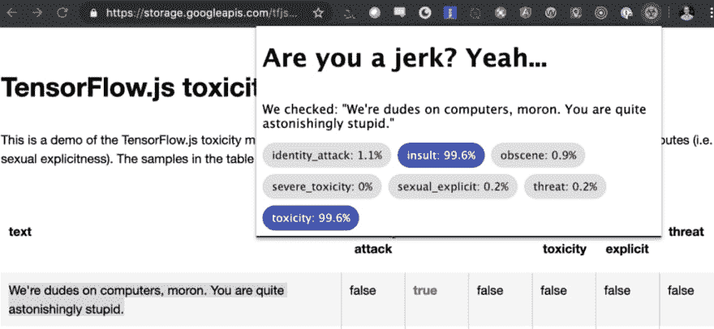

# 你是个混蛋吗？

> 原文：<https://dev.to/martzcodes/are-you-a-jerk-47oc>

#### 使用由 TensorflowJS 和 Angular 元素构建的 Chrome 扩展进行毒性分析

本周，我参加了 [ng-conf](https://medium.com/u/f8f1fde1edbd) ( [大型 Angular conference](https://ng-conf.org) )会议，受到了由 [Asim Hussain](https://medium.com/u/3b15b3b516eb) 举办的 TensorflowJS 研讨会和所有 Angular Elements 演示(主要由 [Manfred Steyer](https://medium.com/u/acb3f1945710) 进行)的启发，我决定将这两者结合起来，创建一个 POC Google Chrome 扩展，使用 Angular Elements 和 TensorflowJS 来确定你写的东西是否让你听起来像个混蛋。

<figure>

<figcaption>Chrome 扩展在行动</figcaption>

</figure>

这并不是一篇深入的文章，但是我将回顾一些基础知识:

*   在 TensorflowJS 中使用预先训练的模型
*   创建角度元素
*   创建 Google Chrome 扩展

这个故事的代码可以在这里找到:[https://github . com/martz codes/tensor flow-toxity-chrome-extension](https://github.com/martzcodes/tensorflow-toxicity-chrome-extension)

### 概述

Chrome 扩展将扫描您正在浏览的网站的 [textarea](https://www.w3schools.com/tags/tag_textarea.asp) 输入(大块文本)并用自定义的角度元素包装它们……当您在 [textarea](https://www.w3schools.com/tags/tag_textarea.asp) 中输入文本并单击 injected 按钮时，它将通过预先训练的[毒性](https://github.com/tensorflow/tfjs-models/tree/master/toxicity)模型运行文本，该模型使用自然语言处理和深度学习来分类文本是身份攻击、侮辱、淫秽、严重有毒、露骨的性行为、威胁还是总体毒性。这些都是在浏览器中完成的，没有任何东西被发送到后端进行分析。

或者，用户可以突出显示页面上的文本(在输入中或不在输入中)，并单击 chrome 扩展的“毒性”/ hazmat 图标，以在弹出窗口中获得分析。

注意:现在扩展的注入模式只寻找文本区域输入…但不是所有的站点都使用这些。例如，在 GMail 中，Google 使用了一个自定义的 div 标签，其作用是 textarea。Medium 使用完全不同的东西。参见“下一步是什么？”底部部分为可能的改进…

### 使用 TensorflowJS 中的预训练模型

[TensorFlow.js](https://www.tensorflow.org/js)

Tensorflow 是一个流行的/谷歌支持的机器学习框架。TensorflowJS 是将 Tensorflow 完全改写成 JavaScript(因此有了 JS)。这有效地允许浏览器在不与后端进行任何交互的情况下运行机器学习模型。这对于隐私相关的问题来说是非常好的，并且有许多有趣的应用。由于资源限制，这对于训练新模型并不理想，但是在这种情况下，我们不需要这样做。已经有一个模型可以用来检测文字的毒性。这意味着我所要做的就是导入它，我可以用它来分类我传递给它的文本。

代码非常简单…

[https://gist . github . com/martz codes/79 F4 f 88480721 f 75 F3 D5 f 69d 36d 59801](https://gist.github.com/martzcodes/79f4f88480721f75f3d5f69d36d59801)

这些代码片段是从作为 Angular 库的一部分创建的[服务文件](https://github.com/martzcodes/tensorflow-toxicity-chrome-extension/blob/master/projects/toxicity-lib/src/lib/toxicity-lib.service.ts)中复制的(如下所述)

#### 模型是如何工作的？

该模型使用监督学习将数据分类为是否有毒。监督学习采用一组预先标记的数据来训练模型。然后，该模型能够根据模型权重对它以前没有见过的内容进行分类。

这个特殊的模型使用一个通用的句子编码器，该编码器使用深度神经网络将句子转换成数字。关于在 TensorflowJS 中使用毒性分类器的更多信息可以在 [TensorFlow](https://medium.com/u/b1d410cb9700) 的故事中阅读:[https://medium . com/tensor flow/text-classification-using-tensor flow-js-an-example-of-detecting-offensive-language-in-browser-e2b 94 e 3565 ce](https://medium.com/tensorflow/text-classification-using-tensorflow-js-an-example-of-detecting-offensive-language-in-browser-e2b94e3565ce)

### 创建角度元素

#### 什么是角元素？

> *Angular elements* 是打包成*定制元素*的 Angular 组件，这是一种以框架无关的方式定义新 HTML 元素的 web 标准。

[角度](https://angular.io/guide/elements)

这意味着您可以导出角度组件的组合，并将它们注入非角度页面。这是扩展如何工作的关键。

[Manfred Steyer](https://medium.com/u/acb3f1945710) 在这里有一些关于如何构建棱角元素[的精彩文章。](https://www.softwarearchitekt.at/post/2019/01/27/building-angular-elements-with-the-cli.aspx)

在[代码报告](https://github.com/martzcodes/tensorflow-toxicity-chrome-extension)中有三个 angular 项目…一个包含主代码的库。一个虚拟应用程序，用于帮助将代码捆绑到 Chrome 扩展可以使用的东西中，以及一个“docs”项目，我用于调试，最终可能会变成正确的文档。

#### 库:毒性-库

该库包含创建 ShadowDOM 的主要代码，shadow DOM 包装了 textarea 输入，并添加了一个使用 TensorflowJS 分类器检查毒性的按钮。toxicity-lib.service.ts 文件具有上面讨论的 TensorflowJS 代码。

这些组件相当基本…有一个按钮组件，它应该指示分析的状态，一个结果组件，一个弹出组件，还有一个带有插槽的容器，它将文本区输入包含到其中，然后将一个函数注册到文本区的 oninput…

[https://gist . github . com/martz codes/1e3b 693372101792434501 a 85 C3 e 256 f](https://gist.github.com/martzcodes/1e3b693372101792434501a85c3e256f)

就是这样。

弹出组件的工作方式类似…它使用一个输入装饰器，chrome 扩展将选定的文本传递给它。

我无法让 zone.js 在 Chrome 扩展中工作…所以我不得不禁用它，并用 ChangeDetectionRef 手动进行更改检测。我通过在 toxity-lib . service . ts 文件中创建几个 BehaviorSubjects 并让组件订阅它们并使用它们来标记变化检测来解决这个问题。

#### 应用:毒性-输出

输出应用程序导入库组件，并实际创建供 chrome 扩展使用的元素。ngx-build-plus 进行实际的捆绑。

在 main.ts 文件中，我需要禁用 zone.js…这是这样完成的:

[https://gist . github . com/martz codes/a 827 c 12 b 0 FB 9 f1 e 53364 a 94173 e0ef 16](https://gist.github.com/martzcodes/a827c12b0fb9f1e53364a94173e0ef16)

你会在毒性输出应用程序文件夹中看到，实际上没有其他组件。它只是导入库容器和弹出组件，并将它们注册(定义)为自定义元素。

[https://gist . github . com/martz codes/face 36 ce 3b 3d 6 F8 fa 506 BF 005 c 7194 a3](https://gist.github.com/martzcodes/face36ce3b3d6f8fa506bf005c7194a3)

#### 申请:单据

我可能会把这个应用程序变成一个 github 页面，上面有关于代码的文档…但现在它只是用于调试，只有一个 textarea 元素和一个 header。

<figure> 

<figcaption>没有 Chrome 扩展运行的 Docs 应用程序</figcaption>

</figure>

### 创建谷歌 Chrome 扩展

[入门教程](https://developer.chrome.com/extensions/getstarted)

Google Chrome 扩展相当简单。它们实际上是一个 manifest.json 文件，列出了应该包含哪些 javascript 文件以及所需的一些资源(html 等)。

当 Angular 构建输出应用程序(如上所述)时，它将代码放在 chrome 扩展的 dist 文件夹中。然后，manifest.json 导入捆绑的输出应用程序(也包含自定义元素),并有一个单独的脚本来检测文本区域并用自定义元素包装它们……如下所示:

[https://gist . github . com/martz codes/d 19 DFD 33 adfdeafacd 53 ECA 555431d 10](https://gist.github.com/martzcodes/d19dfd33adfdeafacd53eca555431d10)

shouldAppend 方法确保 textarea 的父元素不是毒性容器元素，并且有一个突变观察器跟踪屏幕上加载的内容。这是相当低效的，但是完成了 POC 的工作。我为 chrome 扩展添加了一个选项页面来启用/禁用这种行为。

最后，我添加了一个额外的方法，使用户能够高亮显示屏幕上的任何文本，并单击扩展图标对任何文本进行分析。这总是通过扩展来启用。

<figure> 

<figcaption>通过高亮显示一些文本并点击“毒性”图标(危险品符号)。使用角元素进行毒性分析，结果显示在弹出窗口中。</figcaption>

</figure>

### 太好了……现在怎么办？

我没有把它包装成一个真正的 Chrome 扩展。如果我最终做了下面的改进，我可能会出版它。如果你想尝试一下，你可以克隆 repo 并加载 dist/chrome 文件夹作为解压的扩展(你需要在 chrome 中打开开发者模式)。

我真的不打算进一步扩展这个…但是如果我扩展的话，我会做一些改进:

*   让 chrome 扩展检测文本输入中的条目，只添加焦点所在的元素
*   扩展文本输入的类型(具有文本区域角色的 div、输入等)
*   充实文件

随着文本高亮分析的加入，其中一些看起来是不必要的。