# 神经网络入门

> 原文：<https://dev.to/nestedsoftware/neural-networks-primer-374i>

在本文中，我将介绍从头实现一个简单的神经网络所需的基本概念。即使这个神经网络按照现代标准来看相当原始，但它仍然可以做一些实际上非常有用和令人印象深刻的事情:它可以被训练成准确识别 0 到 9 之间的手写数字！

我最近看了一些关于这个主题的不同教程。虽然这些教程很棒，但在它结束时，我认为还有进一步澄清一些事情的空间。除了这本初级读本之外，您可能还想查看以下免费资源:

*   [神经网络](https://www.youtube.com/playlist?list=PLZHQObOWTQDNU6R1_67000Dx_ZCJB-3pi)，由 [3Blue1Brown](https://www.youtube.com/channel/UCYO_jab_esuFRV4b17AJtAw) 制作的 youtube 视频系列
*   迈克尔·尼尔森(Michael Nielsen)的[神经网络和深度学习](http://neuralnetworksanddeeplearning.com/)的第[章一](http://neuralnetworksanddeeplearning.com/chap1.html)和[两](http://neuralnetworksanddeeplearning.com/chap2.html)

## 神经网络结构

我们的神经网络的结构非常简单。网络的基本单元是*神经元*。每个神经元可以有来自任意数量的神经元的输入。一个神经元产生一个输出值，这个值被称为该神经元的*激活*。这个激活值又可以作为输入发送到任意数量的其他神经元。

神经元被组织成*层*。给定层中的每个神经元接收来自前一层中所有神经元的输入。给定神经元的激活也被发送到下一层中的所有神经元。第一层被称为*输入*层。最后一层被称为*输出*层。中间的任何层都被称为*隐藏*层，因为它们只是间接地影响网络的最终输出。我们可以把这想象成一条流水线:原材料进入输入层，最终产品从输出层的另一端出来。构建最终产品的所有中间步骤都发生在隐藏层中。下面是显示神经网络基本结构的简单图表:

[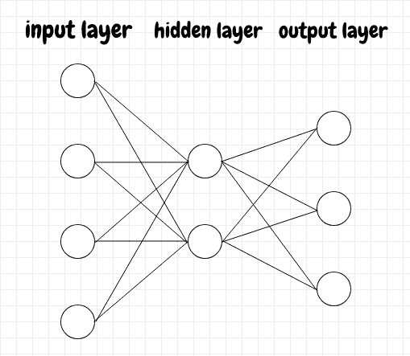](https://res.cloudinary.com/practicaldev/image/fetch/s--UIFUDDII--/c_limit%2Cf_auto%2Cfl_progressive%2Cq_auto%2Cw_880/https://thepracticaldev.s3.amazonaws.com/i/v8iwotkuib7a8cpj6r9r.png)

> 上面显示的网络只有一个隐藏层，但通常有多个隐藏层。

连接两个神经元的边有两个相关值。发送神经元的激活以及接收神经元分配给该激活的*权重*。权重越高，传入激活对接收神经元激活的影响就越大。一个给定的神经元可以接收来自许多神经元的输入，每个神经元都有自己的权重。每个神经元还有一个附加值，叫做*偏差*。偏差是衡量神经元内在活跃程度的指标。高的正偏压意味着神经元将倾向于具有更高的激活，而不管它接收什么输入。高负偏压将充当制动器，显著抑制神经元的激活。

对于这个例子，我们将给定神经元的激活限制在 0 和 1 之间的值。为此，我们将使用 *sigmoid* 函数。该函数接受任何正数或负数作为输入，并将其压缩到 0 到 1 之间的范围内。以下是 sigmoid 函数的图表和公式:

[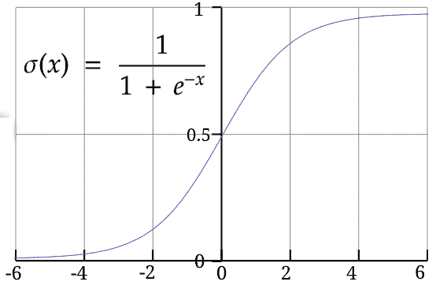](https://res.cloudinary.com/practicaldev/image/fetch/s--dnYIzRx2--/c_limit%2Cf_auto%2Cfl_progressive%2Cq_auto%2Cw_880/https://thepracticaldev.s3.amazonaws.com/i/oc3gisuu38512poxnc1p.png)

> Sigmoids 在神经网络历史的早期被使用，但是现在已经不怎么用了。如今，类似于 [ReLU](https://en.wikipedia.org/wiki/Rectifier_(neural_networks)) 函数的东西更加常见。

下面我们有一个最简单的例子，层 *L* 中的单个神经元馈入下一层 *L+1* 中的神经元。为了计算层 *L+1* 中神经元的激活，首先我们将该边的权重乘以发送神经元的激活，然后加上偏差。这成为一个*原始激活*值，在本文中我们称之为 *z* 。最后，我们将 sigmoid 函数应用于 *z* 以获得下一层神经元 *L+1* 的实际激活 *a* 。

[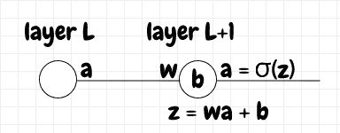](https://res.cloudinary.com/practicaldev/image/fetch/s--9J4jvMl1--/c_limit%2Cf_auto%2Cfl_progressive%2Cq_auto%2Cw_880/https://thepracticaldev.s3.amazonaws.com/i/0y9ipg29bd57jg5sict9.png)

## 输入输出

格兰特·桑德森称识别最少的数字为神经网络的“你好世界”。输入图像来自 [mnist 数据库](https://en.wikipedia.org/wiki/MNIST_database)。每张 mnist 图像都是一个由像素组成的 *28 x 28* 网格。每个像素是一个介于 0 和 1 之间的十进制数，代表一个灰度值。下面的图片是 mnist 图片的一个例子:

[](https://res.cloudinary.com/practicaldev/image/fetch/s--2mumwUAS--/c_limit%2Cf_auto%2Cfl_progressive%2Cq_auto%2Cw_880/https://thepracticaldev.s3.amazonaws.com/i/patvd4i2m5iors703i25.png)

为了将这些值作为输入提供给网络，我们只需将所有像素排成一列，并将每个像素的灰度值分配给相应的输入神经元。这意味着我们需要*28×28*，或者 *784* 个输入神经元。

为了清楚起见，请参见下图中用简单的 *6x6* 网格表示的数字 *2* 。真实的 mnist 图像具有灰度值，但是在这个例子中，单元不是黑色就是白色(0 或 1)。为了生成输入层，我们将第一行像素指定为输入神经元，然后是下一行，依此类推。最终结果是我们的输入由 36 个神经元代表:

[](https://res.cloudinary.com/practicaldev/image/fetch/s--j6FOBpiB--/c_limit%2Cf_auto%2Cfl_progressive%2Cq_auto%2Cw_880/https://thepracticaldev.s3.amazonaws.com/i/s9mpgmw0bfouu4nun68k.png)

我们用于识别手写数字的网络使用 10 个输出神经元，每个神经元的值在 0 和 1 之间。我们希望对应于正确数字的输出神经元以接近 1 的值点亮，而所有其他神经元尽可能接近 0。如果我们的图像代表数字 *4* ，这意味着我们希望我们的输出神经元指示接近*【0，0，0，0，1，0，0，0，0，0，0，0】*的东西。

> 为什么我们使用 10 个输出神经元？毕竟，我们可以压缩输出。例如，在二进制中，我们可以用 4 个神经元对从 0 到 10 的数字进行编码。这是可行的，但似乎简化了输出，使每个输出神经元只有一个意义，使网络更容易学习。从概念上讲，这意味着当我们试图增加或减少输出神经元的激活时，它只有一个意义。

下图显示了在迈克尔·尼尔森的书中用于识别 mnist 图像的神经网络的概况:

[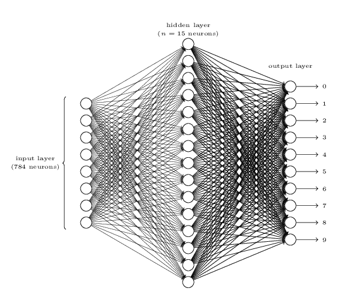](https://res.cloudinary.com/practicaldev/image/fetch/s--yX_Wod5y--/c_limit%2Cf_auto%2Cfl_progressive%2Cq_auto%2Cw_880/https://thepracticaldev.s3.amazonaws.com/i/4rwsuffvzzk7046yy1ud.png)

> *图片鸣谢:迈克尔·a·尼尔森《神经网络与深度学习》，决心出版社，2015 年*

## 渐变下降

神经网络背后的关键思想是*梯度下降*。什么是梯度下降？比方说，你正在一片郁郁葱葱的山丘和草地上散步。假设你在山顶上，你想下到山谷里。然而，你被蒙住了眼睛，所以你看不到你要去哪里。怎么才能水落石出？一个简单的方法就是在原地慢慢旋转，用脚感觉找到你当前位置的最陡的部分，然后沿着斜坡向下迈一小步。从那里，你可以再次感觉到似乎是最陡的下坡，并在那个方向上再走一小步，等等。最终你会到达一个坡度逐渐变小的平坦区域。这种方法不能保证你会找到进入山谷的最佳路径，但是它可以确保每一步都是相对于你在那个时间点的位置的最佳移动。

简单来说，这就是神经网络使用的梯度下降法！真的就这么简单。神经网络解决的每一个问题，无论是图像和语音识别，还是下围棋，或者预测股市，最终都被表示为一些具有非常大量变量的函数。我们可以直观地把它想象成一个巨大的(多维的)景观。神经网络的工作变成迭代大量数据，以调整这些变量，使其能够沿着这个非常复杂的函数的斜率向下移动*。*

## 偏导数和梯度

让我们用一些简单的数学来探索梯度下降的思想。假设我们有一个关于单变量 *x* 的函数 *f* 。当我们调整变量 *x* 时，函数 *f(x)* 的值也随之改变。

如果我们现在在某个点 *x* ，我们如何沿着这个函数向下走一步？我们可以通过对 *f* 取 *x* 的*导数*来计算函数的局部斜率。如果导数 *∂f(x)/x* 为正，这意味着函数趋势向上。如果导数是负的，这意味着函数是向下的。因此，我们可以使用下面的伪代码来计算我们在向下方向上的步长，其中`step_size`是我们提前选择的小增量值:

`step = ∂f(x)/x * step_size`

`x = x - step`

*   如果`∂f(x)/x`为正，那么`step`也将为正。因此从`x`中减去`step`会使`x`变小。更小的`x`将导致 *f(x)* 也更小。换句话说，我们正在走下坡路。
*   如果导数为负，那么`step`也将为负。减去一个负值和加上一个正值是一样的，所以在这种情况下`x`会增加。由于斜率为负，增加`x`将导致我们走下坡路。

因此`x = x - step`将帮助我们走下坡路，不管坡度是正还是负。如果斜率变成 0，那么我们就到达了一个平坦的区域。这叫做函数的*局部最小值*。

> 符号 *∂f(x)/x* 告诉我们，如果我们对 *x* 做一个小的改变，就会对 *f(x)* 产生一定的影响。如果该值非常高(正向或负向)，这意味着斜率很陡。在 *x* 方向上的一小步将使我们在功能上向上或向下迈出一大步。如果数值接近 0，说明坡度比较平缓，那么在 *x* 方向的一个台阶不会很大的改变我们的高程。
> 
> 为`step_size`选择一个好的值取决于手头的问题。把它做得太小将会减慢网络的学习，但是把它做得太大可能意味着一个单独的步骤将我们带到函数中的一个更高的点，而不是向下，这也是不希望的。由于对学习的影响，`step_size`在神经网络术语中常被称为*学习率*。这是一个 [*超参数*](https://en.wikipedia.org/wiki/Hyperparameter_(machine_learning)) 。术语超参数听起来很复杂，但它只是意味着学习率是一个必须手动调整的参数，而不是在学习时由网络本身进行调整。我们为神经网络选择的任何参数，如果没有通过网络的学习过程进行微调，就称为超参数。我们可以把超参数想象成刻度盘和旋钮，我们可以在开始学习过程之前调整它们。这些值将影响网络的学习过程，但是训练网络的反馈回路不会改变这些参数。它们保持不变，除非我们手动调整它们。

我们已经看了一个单变量的函数 *x* 。这些函数可以被视为二维图形，一个轴代表 *x* ，一个轴代表 *f(x)* ，如下图所示:

[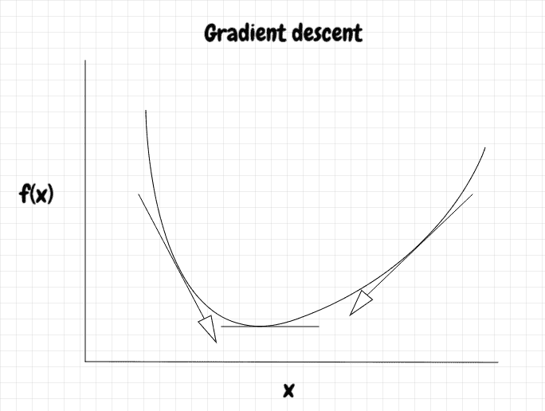](https://res.cloudinary.com/practicaldev/image/fetch/s--8qW6G2-V--/c_limit%2Cf_auto%2Cfl_progressive%2Cq_auto%2Cw_880/https://thepracticaldev.s3.amazonaws.com/i/xiajndqd37l4ilx4lrw9.png)

如果我们将函数增加到 2 个变量， *f(x，y)* ，那么我们需要用一个轴来分别代表 *x* 和 *y* 的输入，因此该函数可以被视为一个三维图形。这个函数的斜率也变成三维向量。我们可以将这个向量分解成两个分量向量，沿着 *x* 轴的斜率和沿着 *y* 轴的斜率。这两个值， *∂f(x,y)/x* 和 *∂f(x,y)/y* ，被称为函数相对于 *x* 和 *y* 的*偏导数*。换句话说， *∂f(x,y)/x* 告诉我们，如果我们对 *x* 做一个小的调整，而让 *y* 保持不变，那么 *f(x，y)* 会变化多少。相反， *∂f(x,y)/y* 告诉我们，如果我们对 *y* 做一个小的调整，而让 *x* 保持不变，那么 *f(x，y)* 会如何变化。偏导数列表*【∂f(x,y)/x，∂f(x,y)/y】*，称为函数的*梯度*。它定义了函数在*最陡下降*方向上的斜率，也就是说，将这些偏导数矢量相加产生了总梯度矢量。

这个想法也适用于具有大量参数的函数， *f(x，y，z，...)*。事实上，这正是神经网络的运作方式。我们不能直接把这样的函数形象化，但是我们可以用同样的数学工具得到梯度。为了用我们的小步长沿着这样的梯度向下移动*，我们应用同样的技巧，从每个变量中减去该变量乘以某个小步长的偏导数。每个轴的调整值将导致更小的 *f(x，y，z...)*。换句话说，这将函数*沿着相对于其当前位置的最陡下降路径向下*移动。当我们稍后研究实现这一点的数学时，我认为记住这一点是有帮助的，在高层次上，这就是正在发生的一切。*

 *## 激活

让我们来计算我们网络的输出。我们已经看到了如何计算只有一个输入的神经元的激活。当一个神经元有多个神经元馈入时，我们首先将传入神经元的加权激活相加，然后加上偏差，最后应用 sigmoid 函数。换句话说，所有传入的活动都会影响我们的神经元变得有多活跃。假设我们在层 *L+1* 中有一个神经元，有 2 个神经元馈入其中，如下图所示:

[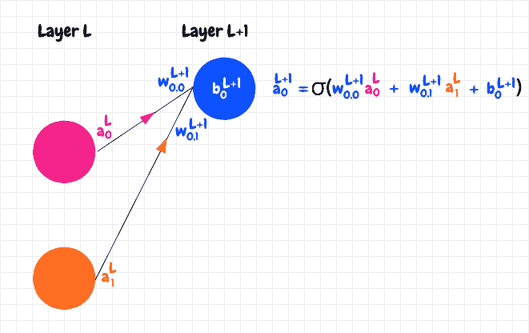](https://res.cloudinary.com/practicaldev/image/fetch/s--1xmEa_am--/c_limit%2Cf_auto%2Cfl_progressive%2Cq_auto%2Cw_880/https://thepracticaldev.s3.amazonaws.com/i/zsuwj0j4gxsnfdlvujlu.png)

> 上标 *L* 和 *L+1* 是*而不是*指数。它们只是表示该值属于网络的哪一层。请记住,(几乎)任何时候你在这篇文章中看到上标，它们都不代表指数！唯一的例外是 sigmoid 函数及其导数，以及用作二次成本函数指数的 *2* 。

我们可以看到，我们将粉色和橙色神经元的加权激活相加，并添加蓝色神经元的偏置，以产生蓝色神经元的原始激活， *z* : *z = w <sub>0，0</sub>T5】L+1a<sub>0</sub>T9】L+w<sub>0，1</sub>T13】L+1a<sub>1</sub><sup>L</sup>+b 然后我们应用 sigmoid 函数获得激活: *a = σ(z)* 。*

事实证明，我们可以使用矩阵巧妙地表达这种计算。让我们用 *j* 索引 *L+1* 层的神经元，用 *k* 索引前一层 *L* 层的神经元。 *J* 将表示层 *L+1* 中神经元的总数，而 *K* 将表示层 *L* 中神经元的总数。

> *j* 和 *k* 的这种排序可能看起来是倒退的，但是我们马上就会明白为什么我们使用这种索引方案。

让我们考虑一个简单的两层神经网络。第一层， *L* ，有 2 个神经元，第二层， *L+1* ，有 3 个神经元:

[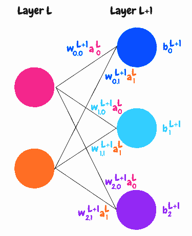](https://res.cloudinary.com/practicaldev/image/fetch/s--FBOyaSEN--/c_limit%2Cf_auto%2Cfl_progressive%2Cq_auto%2Cw_880/https://thepracticaldev.s3.amazonaws.com/i/063o18p485i8ba6v3pvm.png)

我们希望层 *L+1* 的激活是一个 *3x1* 矩阵，也就是说，一列有 3 行的矩阵。每行中的值将代表该层中相应神经元的激活。为了将我们的结果转换成适当的形式，我们可以将所需的矩阵定义如下:

*   首先，我们将进入层 *L+1* 的权重的矩阵*w<sup>L+1</sup>T3】定义为 *JxK* 矩阵。该矩阵的第一行将包含进入层 *L+1* 中的第一个神经元的每个权重；第二行将使每个权重进入层 *L+1* 中的第二个神经元，依此类推。*

*   接下来，我们将层 *L* 中的激活分组为一个 *Kx1* ，单列矩阵， *a <sup>L</sup>* 。第一行具有来自层 *L* 中的第一个神经元的激活；第二行具有来自层 *L* 中的第二个神经元的激活，等等。

*   最后我们将层 *L+1* 中神经元的偏置放入一个 *Jx1* 、单列矩阵、 *b <sup>L+1</sup>* 中。第一行具有层 *L+1* 中第一个神经元的偏置；第二行具有层 *L+1* 中第二个神经元的偏置，依此类推。

我们可以看到，取*w<sup>l+1</sup>⋅a<sup>l</sup>t5】的点积产生一个 *Jx1* 矩阵。我们可以将该矩阵添加到 *b <sup>L+1</sup>* 以及 *Jx1* 中，从而生成一个 *Jx1* 矩阵 *z <sup>L+1</sup>* ，其中包含层 *L+1* 的所有原始激活值。最后，我们可以将*z<sup>L+1</sup>T25】中的每个值传递给σ，以获得层 *L+1* 的激活矩阵*a<sup>L+1</sup>T29】。***

我们可以看到，我们需要为给定层 *L+1* 安排权重矩阵 *w* ，使得每行对应于进入层 *L+1* 中给定神经元的边。这具有直观的意义，因为 *L+1* 中神经元的激活依赖于来自前一层的所有输入。这就是为什么我们用 *j* 索引下一层的神经元，用 *k* 索引上一层的神经元，因为我们希望权重矩阵是一个 *JxK* 矩阵。这样，点积将计算出产生正确形状的 *z* 和 *a* 矩阵。如果我们反过来做索引，我们的权重矩阵将是一个 *KxJ* 矩阵。这也很好，因为行和列的含义不会改变，只是术语会改变。下面是计算*z<sup>L+1</sup>T23】和*a<sup>L+1</sup>T27】所需的矩阵计算:**

[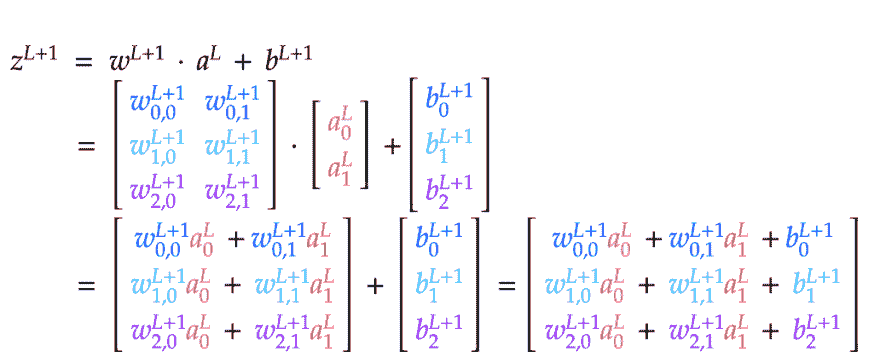](https://res.cloudinary.com/practicaldev/image/fetch/s--L5Fmqw0u--/c_limit%2Cf_auto%2Cfl_progressive%2Cq_auto%2Cw_880/https://thepracticaldev.s3.amazonaws.com/i/gvenjrz3x2dve0x165p8.png)

[](https://res.cloudinary.com/practicaldev/image/fetch/s--TBcEwmrO--/c_limit%2Cf_auto%2Cfl_progressive%2Cq_auto%2Cw_880/https://thepracticaldev.s3.amazonaws.com/i/53750bhjin7i1ot0j254.png)

> 计算两个矩阵的[点积](https://www.mathsisfun.com/algebra/matrix-multiplying.html)相当简单。这两个矩阵必须具有形式 *I x J* 和 *J x K* ，使得结果成为一个 *I x K* 矩阵。换句话说，左边矩阵的列数必须与右边矩阵的行数相匹配。点积变成一个矩阵，其行数与左边的矩阵相同，列数与右边的矩阵相同。

## 成本函数

为了让网络学习，我们需要提供反馈，说明对于给定的训练输入，当前网络是否表现良好。这是通过使用*成本函数*来完成的。成本函数将网络的实际输出与正确值进行比较。我们可能在输出层有多个神经元。在这种情况下，我们需要将每个输出神经元的正确值与每个实际输出进行比较。对于这个例子，我们将使用一个简单的函数，称为*二次成本函数*:

[](https://res.cloudinary.com/practicaldev/image/fetch/s--YA-UGZ9P--/c_limit%2Cf_auto%2Cfl_progressive%2Cq_auto%2Cw_880/https://thepracticaldev.s3.amazonaws.com/i/p2vnx25v2bztb3vaxns7.png)

> 据我所知，额外除以 2 主要是为了抵消我们对这个函数求导时得到的因子 2。在任何情况下，这个常数因素都不会显著影响网络的学习方式。

如果我们的网络只有一个输出神经元，那么成本可以通过从输出值中减去正确的值，然后将结果平方来计算。如果我们有多个输出神经元，就像我们的 mnist 数字识别网络中的 10 个神经元，那么我们可以将实际输出*a<sup>L</sup>T3】和正确值 *y* 视为单列矩阵。在这种情况下，我们减去这两个矩阵。这相当于对结果矩阵的每一行执行相同的减法。我们从相应的实际输出中减去每个给定神经元的期望值，然后对结果求平方。*

对于给定的 *a* 和 *y* 的值，如果我们将这些映射为一条线上的点，我们可以看到 *a - y* 是两点之间的距离，那么代价函数就是这个距离的平方。还有其他的[成本函数](https://stats.stackexchange.com/questions/154879/a-list-of-cost-functions-used-in-neural-networks-alongside-applications)也用于机器学习。

## 反向传播

我们希望调整网络中的权重和偏差，这样，随着时间的推移，训练数据将产生越来越低的成本。为此，我们需要计算出成本函数相对于这些权重和偏差的斜率。然后，我们可以使用梯度下降法，针对网络的每个反馈环路，以较小的步长沿着这个斜率向下移动。

让我们考虑一个极简的场景，其中我们有一个输出神经元，一个隐藏层的单个神经元向它提供信息。事实证明，我们为这种平凡情况导出的方程很容易适用于每层多个神经元的更一般情况。

在下图中，我们可以看到输出的成本 *C* 直接取决于激活*a<sup>L</sup>T5】以及该输入的期望值 *y* 。反过来，*a<sup>L</sup>T11】依赖于 raw 激活，*z<sup>L</sup>T15】。最后， *z <sup>L</sup>****

[](https://res.cloudinary.com/practicaldev/image/fetch/s--JrWi8QNv--/c_limit%2Cf_auto%2Cfl_progressive%2Cq_auto%2Cw_880/https://thepracticaldev.s3.amazonaws.com/i/enp0kqgtxreujcq11ett.png)

我们将使用这些信息来计算成本函数相对于权重和偏差的导数。我们还将确定成本相对于前一层中神经元激活的导数。你可能想知道为什么我们需要确定相对于前一层激活的成本函数。毕竟不能直接调。的确如此，我们不能直接改变神经元的活动。然而，我们将能够使用相对于前一层中的激活的梯度来计算该前一层的权重和偏差所需的改变，等等，通过网络向后移动。这就是为什么我们称这个步骤为调整所有的权重和偏差*反向传播*。

让我们首先计算成本函数相对于输出神经元激活的导数。这很简单。导数只是一个线性函数:

[](https://res.cloudinary.com/practicaldev/image/fetch/s--WsE7sS-4--/c_limit%2Cf_auto%2Cfl_progressive%2Cq_auto%2Cw_880/https://thepracticaldev.s3.amazonaws.com/i/8qu5iih2ieehp02orwv8.png)

既然*a<sup>L</sup>T3】依赖于*z<sup>L</sup>T7】，那我们也算出 *a* 相对于 *z* 的斜率:**

[](https://res.cloudinary.com/practicaldev/image/fetch/s--eXFXZqzs--/c_limit%2Cf_auto%2Cfl_progressive%2Cq_auto%2Cw_880/https://thepracticaldev.s3.amazonaws.com/i/tl3iq2ufcdpsfi0fkmke.png)

> sigmoid 函数的导数是: [](https://res.cloudinary.com/practicaldev/image/fetch/s--i_LO4tQV--/c_limit%2Cf_auto%2Cfl_progressive%2Cq_auto%2Cw_880/https://thepracticaldev.s3.amazonaws.com/i/8d6obz9u9hgvt9zuyi22.png)

*z<sup>L</sup>T3】取决于来自前一层的输入激活、 *a <sup>L-1</sup>* 、该激活的权重、 *w <sup>L</sup>* 以及电流偏置、 *b <sup>L</sup>* 。让我们计算 *z* 相对于每个输入的偏导数:*

[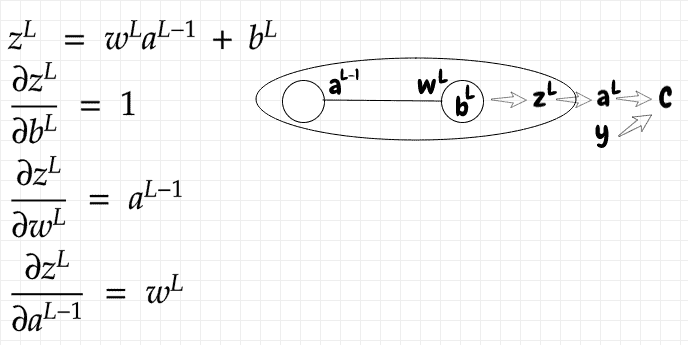](https://res.cloudinary.com/practicaldev/image/fetch/s--h6zQ9lsn--/c_limit%2Cf_auto%2Cfl_progressive%2Cq_auto%2Cw_880/https://thepracticaldev.s3.amazonaws.com/i/ffar3pkbjxorxseebb6w.png)

现在我们已经有了所有需要的偏导数，我们可以使用[链规则](https://en.wikipedia.org/wiki/Chain_rule)来计算我们需要为我们的网络进行反向传播的 3 个方程:成本函数相对于权重、偏差和前一层激活的偏导数:

[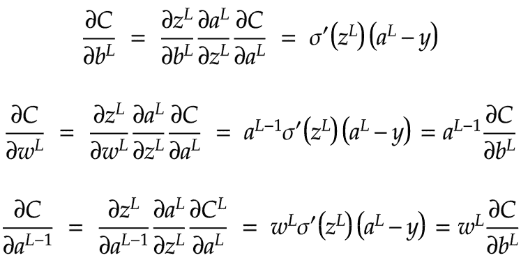](https://res.cloudinary.com/practicaldev/image/fetch/s--v49o38lw--/c_limit%2Cf_auto%2Cfl_progressive%2Cq_auto%2Cw_880/https://thepracticaldev.s3.amazonaws.com/i/vb4l5jo23rgxtirhga54.png)

这个想法是我们可以使用*w<sup>l</sup>T7】和*∂c/db<sup>l</sup>t11】的值来计算*∂c/∂a<sup>l-1</sup>T3】。一旦我们有了 *∂C/∂a <sup>L-1</sup>* ，我们就可以用它来计算*∂c/db<sup>l-1</sup>t19】和 *∂C/dw <sup>L-1</sup>* 。从那里，我们不断重复同样的步骤，通过我们的网络层，直到我们到达输入层，因此术语*反向传播*。****

## 示例计算

让我们为具有单个输入神经元、一个中间神经元和单个输出神经元的小型网络计算单个学习迭代。我们将输入设置为 *0.8* 。对于该输入，期望输出 *y* 为 1。权重和偏差如下图所示:

[](https://res.cloudinary.com/practicaldev/image/fetch/s--Rv98-LPx--/c_limit%2Cf_auto%2Cfl_progressive%2Cq_auto%2Cw_880/https://thepracticaldev.s3.amazonaws.com/i/7xbmlv7qpot4zvrioaxf.png)

首先，我们需要计算网络的原始激活 *z* 以及激活 *a* 。我们对`z`、`a`和`sigmoid`使用以下(python)函数:

```
import numpy as np

def sigmoid(z):
    return 1.0/(1.0+np.exp(-z))

def z(w, a, b):
    return w * a + b

def a(z):
    return sigmoid(z) 
```

对于层 *L1* ，我们可以计算出`z`和`a`的值如下:

```
>>> a_l0 = 0.8
>>> w_l1 = 1.58
>>> b_l1 = -0.14
>>> z_l1 = z(w_l1, a_l0, b_l1)
>>> a_l1 = sigmoid(z_l1)
>>> z_l1
1.124
>>> a_l1
0.7547299213576082 
```

现在我们已经激活了层 *L1* ，我们可以用它来计算层 *L2* :
的`z`和`a`

```
>>> b_l2 = -0.11
>>> w_l2 = 2.45
>>> z_l2 = z(w_l2, a_l1, b_l2)
>>> a_l2 = sigmoid(z_l2)
>>> z_l2
1.73908830732614
>>> a_l2
0.850571226530534 
```

太好了，现在我们已经激活了 *L2* 。我们现在需要计算关于三个变量的成本函数的斜率，偏差、权重和来自前一层的激活。`sigmoid_prime`的偏导数以及 sigmoid 函数的导数的方程如下:

```
def sigmoid_prime(z):
    return sigmoid(z)*(1-sigmoid(z))

def dc_db(z, dc_da):
    return sigmoid_prime(z) * dc_da

def dc_dw(a_prev, dc_db):
    return a_prev * dc_db

def dc_da_prev(w, dc_db):
    return w * dc_db 
```

我们计算这些偏导数如下:

```
>>> dc_da_l2 = a_l2-1
>>> dc_db_l2 = dc_db(z_l2, dc_da_l2)
>>> dc_dw_l2 = dc_dw(a_l1, dc_db_l2)
>>> dc_da_l1 = dc_da_prev(w_l2, dc_db_l2)
>>> dc_db_l2
-0.018992369482903983
>>> dc_dw_l2
-0.014334109526226761
>>> dc_da_l1
-0.04653130523311476 
```

现在我们有了成本函数相对于偏差`b_l2`和权重`w_l2`的斜率，我们可以更新这些偏差和权重:

```
>>> step_size = 0.1
>>> updated_b_l2 = b_l2 - dc_db_l2 * step_size
>>> updated_w_l2 = w_l2 - dc_dw_l2 * step_size
>>> updated_b_l2
-0.1081007630517096
>>> updated_w_l2
2.451433410952623 
```

调整了 L2 层的权重和偏移后，我们可以对 L1 层做同样的事情。我们已经计算了`dc_da_l1`，它是成本函数相对于来自前一层的激活的斜率。为了获得 *L1* 层的偏移和权重的梯度，我们只是像以前一样继续使用链式法则。在 *L2* 层中，`dc_da_l2`就是`a_l2-y`。对于 *L1* 层，我们刚刚计算了`dc_da_l1`，因此我们现在可以使用它来获得相对于 *L1* 、`dc_db_l1`处的偏差的成本函数的斜率。然后我们像以前一样继续，使用`dc_db_l1`来计算`dc_dw_l1`。

```
>>> dc_db_l1 = dc_db(z_l1, dc_da_l1)
>>> dc_dw_l1 = dc_dw(a_l0, dc_db_l1)
>>> dc_db_l1
-0.008613534018377424
>>> dc_dw_l1
-0.006890827214701939 
```

同样，我们使用这些偏导数来调整 L1 的权重和偏差:

```
>>> updated_b_l1 = b_l1 - dc_db_l1 * step_size
>>> updated_w_l1 = w_l1 - dc_dw_l1 * step_size
>>> updated_b_l1
-0.13913864659816227
>>> updated_w_l1
1.5806890827214704 
```

我们不需要更进一步，因为层 *L0* 是输入层，我们不能调整。让我们使用更新的权重和偏差来计算新的激活:

```
>>> updated_z_l1 = z(updated_w_l1, a_l0, updated_b_l1)
>>> updated_a_l1 = sigmoid(updated_z_l1)
>>> updated_z_l1
1.125412619579014
>>> updated_a_l1
0.7549913210309638
>>> updated_z_l2 = z(updated_w_l2, updated_a_l1, updated_b_l2)
>>> updated_a_l2 = sigmoid(updated_z_l2)
>>> updated_z_l2
1.7427101863028525
>>> updated_a_l2
0.8510309824120517 
```

最后，让我们比较原始激活的成本函数和使用新激活获得的成本函数。我们将使用以下作为我们的成本函数:

```
def cost(a, y):
    return 0.5 * (a - y)**2 
```

原始成本和更新成本为:

```
>>> original_cost = cost(a_l2, 1)
>>> updated_cost = cost(updated_a_l2, 1)
>>> original_cost
0.011164479170294499
>>> updated_cost
0.011095884100559231 
```

我们可以看到`updated_cost`确实比`original_cost`略低！

## 每层多个神经元

当我们有一个每层有多个神经元的网络时，我们的量像 *w* 、 *b* 、 *z* 和 *a* 成为矩阵而不是标量值。为了适应这种情况，我们需要对偏导数的方程做一些调整。好的一面是新形式的方程非常直观。我们可以通过想象我们想要的矩阵的形状来计算出方程的形式。

让我们考虑一个简单的多层网络，如下图所示。您可以看到每一层的各种感兴趣矩阵的形状:

[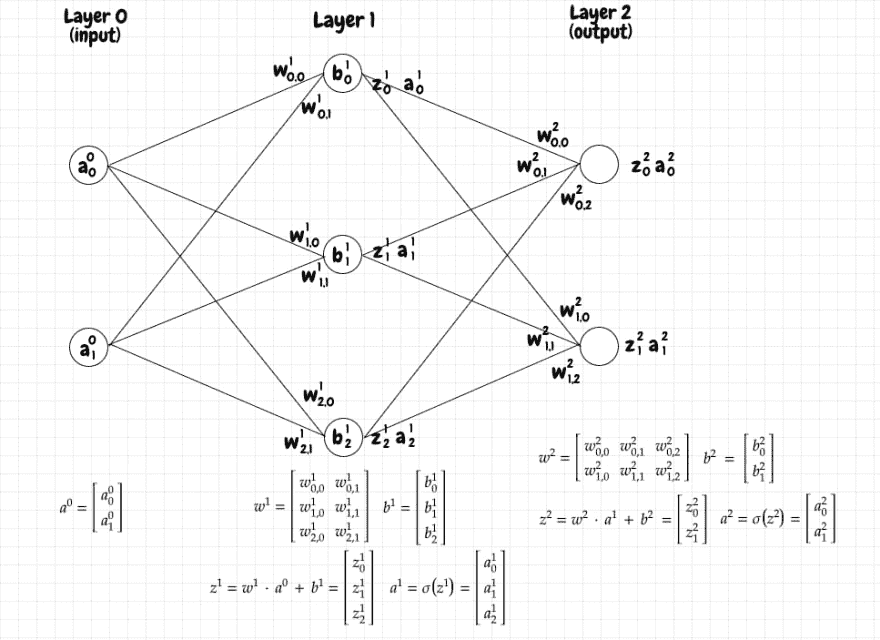](https://res.cloudinary.com/practicaldev/image/fetch/s--bnN12Oty--/c_limit%2Cf_auto%2Cfl_progressive%2Cq_auto%2Cw_880/https://thepracticaldev.s3.amazonaws.com/i/d8p5h3x9703tl570f4us.png)

> 请记住，上标都表示当前层。他们是*而不是*指数。

因为我们知道每个偏差都将使用偏导数来更新，所以我们需要一个偏导数值来对应每个偏差。因此，成本相对于当前层中的偏差的偏导数 *∂C/∂b* ，应该具有与该层的偏差矩阵相同的形状。

在我们的例子中，输出层有 2 个神经元，因此该层的偏差矩阵 *b* 是一个 *2x1* 矩阵。因此，该层的 *∂C/∂b* 也应该是 2×1 矩阵。从我们之前推导的等式中，我们知道 *∂C/∂b* 要求我们将 *(a-y)* 和 *σ'(z)* 的值相乘。这两个矩阵都是 *2x1* 矩阵，所以我们需要做的就是将每个神经元的 *σ'(z)* 的值乘以该神经元的差值 *(a-y)* 。直观地说，这是有意义的:在 *(a-y)* 中的每个值都与其对应的*【σ’(z)*值匹配。当一个给定值与一组传入或传出的值相关时，我们使用点积，但这里是简单的 1:1 关系。这种两个相同矩阵的简单乘积称为 [*哈达玛乘积*](https://en.wikipedia.org/wiki/Hadamard_product_(matrices)) 。我们把它表示为一个被圆圈包围的点。下面是 *∂C/∂b* 方程的矩阵形式:

[](https://res.cloudinary.com/practicaldev/image/fetch/s--Iddf6u8M--/c_limit%2Cf_auto%2Cfl_progressive%2Cq_auto%2Cw_880/https://thepracticaldev.s3.amazonaws.com/i/tng28gku5fyv9dw2xpfp.png)

现在让我们把注意力转向∂C/∂w。在我们的输出层中，权重矩阵 *w* 是一个*2×3*矩阵。因此，我们希望 *∂C/∂w* 也是一个 2×3 的矩阵。当前层的 *∂C/∂w* 是当前层的 *∂C/∂b* 和前一层的激活矩阵 *a* 的乘积。对于我们的输出层， *∂C/∂b* 是一个 *2x1* 矩阵。*前一层的一个*是一个 *3x1* 矩阵。我们不能把一个 *2x1* 和一个 *3x1* 矩阵直接相乘在一起。不过我们可以转置*一个*转换成一个 *1x3* 矩阵！现在乘法，使用点积，产生一个 *2x3* 矩阵。这与该层的 *w* 矩阵的形状相匹配，因此它是有效的。下面是数学符号，显示我们如何以矩阵形式获得 *∂C/∂w* :

[](https://res.cloudinary.com/practicaldev/image/fetch/s--65b5NPR7--/c_limit%2Cf_auto%2Cfl_progressive%2Cq_auto%2Cw_880/https://thepracticaldev.s3.amazonaws.com/i/3vyplo1hhbs7r721jgbf.png)

最后，我们需要计算*∂c/∂a<sup>l-1</sup>T3。 *a <sup>L-1</sup>* 是一个 *3x1* 矩阵，所以我们希望 *∂C/∂a <sup>L-1</sup>* 也是一个 *3x1* 矩阵。我们知道我们需要以某种方式将当前层的权重矩阵 *∂C/∂b* 乘以 *w* 。 *∂C/∂b* 是一个 *2x1* 矩阵，而 *w* 是一个 *2x3* 矩阵。怎样才能把这些排列成一个乘积，得到一个 *3x1* 矩阵？我们可以先转置 *w* 得到一个 *3x2* 矩阵。现在我们可以取*w<sup>t</sup>t37】的点积，一个 *3x2* 矩阵，和 *∂C/∂b* 一个 *2x1* 矩阵，这就给了我们想要的 *3x1* 矩阵。方程式如下图所示:**

[](https://res.cloudinary.com/practicaldev/image/fetch/s--ULLbeA_c--/c_limit%2Cf_auto%2Cfl_progressive%2Cq_auto%2Cw_880/https://thepracticaldev.s3.amazonaws.com/i/8e218lhhqvj86d6zh2cv.png)

这个最后的矩阵表示成本函数相对于前一层中的激活的斜率。这非常有帮助，因为我们可以使用这个值来计算相对于前一层中的偏差、 *∂C/∂b* 和权重、 *∂C/∂w* 的斜率。这些值又可以用来计算 *∂C/∂a <sup>L-2</sup>* 等等。我们继续一层一层地执行相同的操作，直到到达输入层。回想一下，我们不计算输入层的任何偏导数，因为这不是网络调整的内容

> 如果你想围绕我们为什么转置 *w* 然后做点积建立直觉，我发现这样想很有帮助:当我们计算给定层的激活矩阵时，我们计算该层的权重矩阵和前一层的激活矩阵的点积。这是有意义的，因为对于下一个层的*中的每个神经元，它需要将前一层的*所有*神经元的加权激活集合在一起。我们可以把∂C/∂a 看作是硬币的另一面。当我们对当前层中的一个神经元的激活进行小的调整时，它将沿着多条路径影响代价函数。假设我们调整单个神经元的激活，该神经元连接到下一层的 3 个神经元。我们需要将发送神经元对第一个接收神经元、第二个接收神经元和第三个接收神经元的成本函数的影响相加。这将是我们得到的矩阵的第一行(对于发送层中的每个其他神经元也是如此)。因此，我们需要一个矩阵，其中每一行代表前一层中的一个神经元对下一层中的每个*神经元的激活变化的累积效应。**

这种方法允许我们计算网络每一层的权重和偏差的调整，从输出层向后传播。一旦对给定的输入完成了这个过程，我们就可以说我们的网络已经完成了一个训练步骤。通过对大量输入进行这种训练，我们可以稳定地调整我们网络的参数，直到它可以做一些很酷的事情，比如识别 mnist 图像！

下图显示了输出层和中间层偏导数的示例网络:

[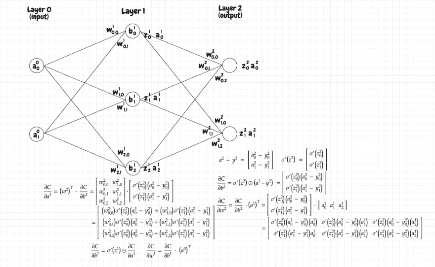](https://res.cloudinary.com/practicaldev/image/fetch/s--Q2dGsP8t--/c_limit%2Cf_auto%2Cfl_progressive%2Cq_auto%2Cw_880/https://thepracticaldev.s3.amazonaws.com/i/mozlq1exx8hjjbwewkb3.png)

> 请记住，上标都表示当前层。他们是*而不是*指数。

我用 python 编写了自己的这个神经网络的非常简单的实现。我试图删除所有无关的细节，只显示前馈激活所需的代码，然后调整权重和偏差，一次一个训练输入:

```
import numpy as np

placeholder = np.array([[]])

class Network:
    def __init__(self, layers, **kw):
        self.num_layers = len(layers)
        self.b = [placeholder]
        self.w = [placeholder]

        if "b" in kw:
            b = kw.get("b")
            self.b += b

        if "w" in kw:
            w = kw.get("w")
            self.w += w

        num_neurons_prev_layer = layers[0]
        for num_neurons_current_layer in layers[1:]:
            if not "b" in kw:
                b = np.random.randn(num_neurons_current_layer, 1)
                self.b.append(b)

            if not "w" in kw:
                w = np.random.randn(num_neurons_current_layer, num_neurons_prev_layer)
                self.w.append(w)

            num_neurons_prev_layer = num_neurons_current_layer

    def feed_forward(self, inputs):
        self.z = [placeholder]
        self.a = [np.asarray([inputs]).transpose()]

        for l in xrange(1, self.num_layers):
            b = self.b[l]
            w = self.w[l]
            a_prev = self.a[l-1]

            z = raw_activation(w, a_prev, b)
            a = sigmoid(z)

            self.z.append(z)
            self.a.append(a)

    def propagate_backward(self, y, step_size):
        y = np.asarray([y]).transpose()

        output_layer = self.num_layers-1
        z = self.z[output_layer]
        a = self.a[output_layer]

        activations_gradient = a - y
        biases_gradient = dc_db(z, activations_gradient)

        a_prev = self.a[output_layer-1]
        weights_gradient = dc_dw(a_prev, biases_gradient)

        w = self.w[output_layer]
        activations_gradient = dc_da_prev(w, biases_gradient)

        self.b[output_layer] -= biases_gradient * step_size
        self.w[output_layer] -= weights_gradient * step_size

        for l in xrange(self.num_layers-2, 0, -1):
            z = self.z[l]
            biases_gradient = dc_db(z, activations_gradient)

            a_prev = self.a[l-1]
            weights_gradient = dc_dw(a_prev, biases_gradient)

            w = self.w[l]
            activations_gradient = dc_da_prev(w, biases_gradient)

            self.b[l] -= biases_gradient * step_size
            self.w[l] -= weights_gradient * step_size

def sigmoid(z):
    return 1.0/(1.0+np.exp(-z))

def sigmoid_prime(z):
    return sigmoid(z)*(1-sigmoid(z))

def raw_activation(w, a, b):
    return np.dot(w,a) + b

def dc_db(z, dc_da):
    return sigmoid_prime(z) * dc_da

def dc_dw(a_prev, dc_db):
    return np.dot(dc_db, a_prev.transpose())

def dc_da_prev(w, dc_db):
    return np.dot(w.transpose(), dc_db)

# demo: b = [np.array([[0.54001045],
               [0.75958375],
               [0.01870296]]),
     np.array([[-0.32783478],
               [ 0.06061246]])]

w = [np.array([[-0.11499179,  0.454649  ],
               [-0.65801895,  0.56618695],
               [-0.15686814, -0.87499479]]),
     np.array([[ 0.01071228, -0.49139708, -0.81775586],
               [-0.87455946, -0.08351883, -0.77534763]])]

n = Network([2,3,2], b=b, w=w)

inputs = [0.8,0.2]
n.feed_forward(inputs)

y = [0, 1]
n.propagate_backward(y, 0.1) 
```

> 注意，我们通常随机化权重和偏差的初始值。这是创建一个相当混乱的初始成本函数的简单方法，具有足够的梯度下降空间。我们不想冒险以某种可预测的方式设置这些变量，这可能从一开始就将成本函数置于一个平面上！

考虑到这个代码基本上足以识别 mnist 数字的手写图像，成功率在 95%左右！这是相当了不起的。想象一下，开发一个自定义算法来做同样的事情，需要付出多大的努力。我认为这种方式很难达到同样的精度，但我们可以通过上面非常简单的实现获得相当好的结果:我们所拥有的是以完全通用的方式连接在一起的神经元层，用大约 100 行代码来执行向前和向后传播！

## 随机梯度下降

如上面的代码所示，调整每个输入的所有权重和偏差可能会很慢。一种常见的加速技术是通过网络运行一批输入，并将其视为单个训练步骤。换句话说，首先我们计算一组随机选择的训练输入的偏导数。我们不断把最近的偏导数加到每个梯度矩阵上。一旦我们完成了，我们就用这些累积偏导数除以一批中的样本数。然后，我们根据这个平均斜率只更新一次权重和偏差。然后我们可以用另一批输入继续做同样的事情。这叫做*随机梯度下降*。直觉上，这意味着我们在斜坡上的运动比其他情况下更不平稳。如果我们在每次输入后调整所有的参数，我们向下的路径将会是一条更平滑的曲线，但是计算时间会更长。

## MNIST 图像识别

迈克尔·尼尔森(Michael Nielsen)用于识别 mnist 图像的 [python 代码](https://raw.githubusercontent.com/mnielsen/neural-networks-and-deep-learning/master/src/network.py) ( [github](https://github.com/mnielsen/neural-networks-and-deep-learning) )在商用 PC 上训练几分钟后，就可以轻松达到大约 95%的识别率。下面的脚本运行一个有 30 个神经元的隐藏层的网络(run.py):

```
import mnist_loader
import network

training_data, validation_data, test_data = mnist_loader.load_data_wrapper()

net = network.Network([784, 30, 10])
net.SGD(training_data, 30, 10, 3.0, test_data=test_data) 
```

下面的结果表明，网络达到了接近 95%的准确度:

```
C:\Dev\python\neural-networks-and-deep-learning\src>python run.py
Epoch 0: 9032 / 10000
...
Epoch 29: 9458 / 10000 
```

如果我们将网络改为两个隐藏层，每层 16 个神经元，就像格兰特·桑德森的视频一样

```
import mnist_loader
import network

training_data, validation_data, test_data = mnist_loader.load_data_wrapper()

net = network.Network([784, 16, 16, 10])
net.SGD(training_data, 30, 10, 3.0, test_data=test_data) 
```

结果好像都差不多:

```
C:\Dev\python\neural-networks-and-deep-learning\src>python run2.py
Epoch 0: 8957 / 10000
...
Epoch 29: 9385 / 10000 
```

如果我们完全忽略隐藏层，只将输入层直接发送到输出层，准确性会下降很多，下降到 75%。

在他的视频中，Grant Sanderson 推测了一下不同层在概念上可能意味着什么。他抛弃了第一个隐藏层可能识别手写数字的基本单元的想法。例如，它可能将一个“o”循环分解成几个部分。第二个隐藏层可能会把这些单独的部分放在一起，例如一个 *9* 可能是一个“o”形环和一条伸出来的线或弯曲的尾巴。

然而，格兰特发现，检查隐藏层并没有揭示任何如此清晰的东西，只是相当嘈杂的数据，只能显示模式的线索。这表明，这个神经网络不必找到对我们人类有意义的最小值。它似乎能找到足够好的局部极小值来很好地解决问题，但是这些极小值并不能完全概括数字的含义。也就是说，正如格兰特所说的，在难以理解的巨大的 13000 维权重和偏见空间中，我们的网络发现自己是一个快乐的局部最小值，尽管成功地对大多数图像进行了分类，但并没有准确地找到我们可能希望的模式...即使这个网络能够很好地识别数字，它也不知道如何绘制它们。这个事实的一个结果是，我们的特定网络会像对真实的 mnist 图像一样自信地对随机像素的图像进行分类！

我们简单的网络显然有局限性。例如，隐藏的图层似乎没有任何清晰的模式或意义。此外，由于每层都有大量的神经元，将一层中的每个神经元连接到下一层中的所有神经元会成为一个性能问题。毕竟这也有点奇怪，不是吗，我们所有的输入神经元都被同等对待，不管它们是靠得很近还是在图像的相反两侧！

随着时间的推移，神经网络的一些更复杂的方法处理了这些问题。如果你想更深入，请查看进一步的发展，如[深度学习](https://en.wikipedia.org/wiki/Deep_learning)、[卷积神经网络](https://en.wikipedia.org/wiki/Convolutional_neural_network)、[递归神经网络](https://en.wikipedia.org/wiki/Recurrent_neural_network)和 [LSTM 网络](https://en.wikipedia.org/wiki/Long_short-term_memory)。综上所述，我们在本文中所研究的简单网络的一个优点是它已经可以做一些有用的事情，而且非常容易理解！*