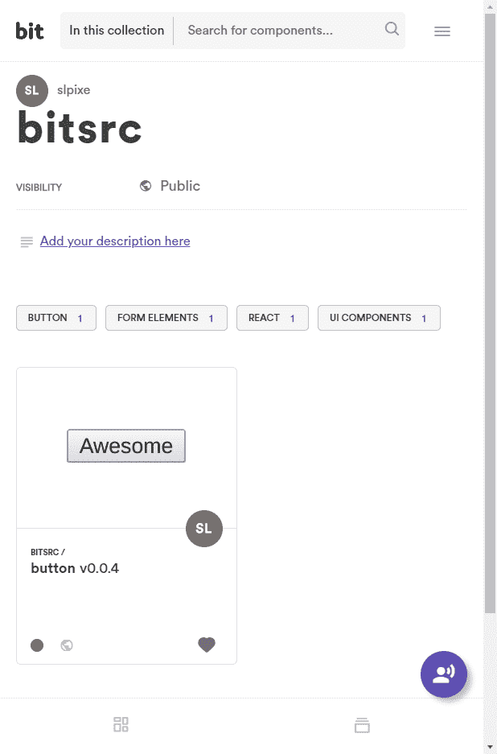
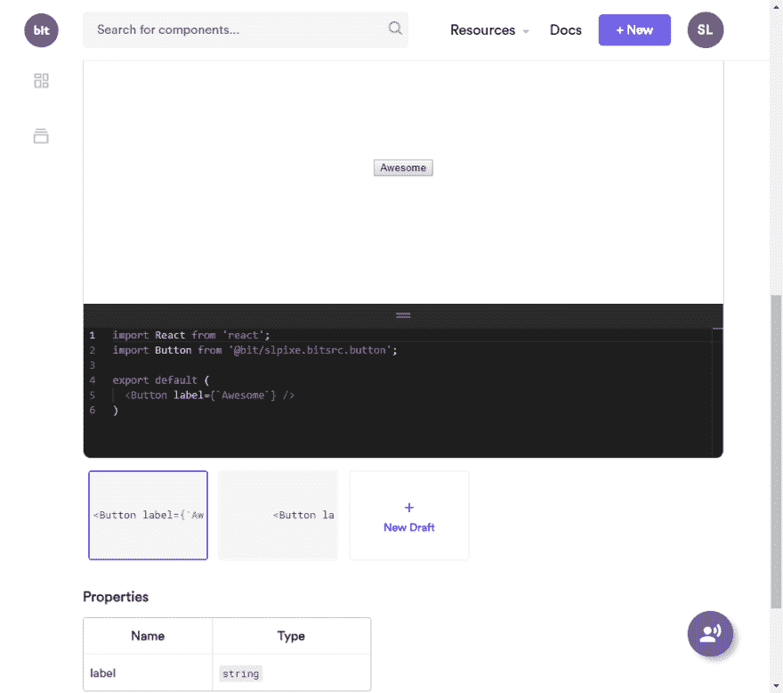

# 使用 Bit 的经验(Bit.dev 以前的 Bit-Src)

> 原文：<https://dev.to/slpixe/experience-with-bit-bit-dev-previously-bit-src-oji>

# 为什么看成了[的钻头](//bit.dev)

[Bit](//bit.dev) 已经在 HackerNews & Reddit 社区上展示了多次，作为一种解决方案，它使团队能够轻松地共享和重用组件，已经实现了一些有见解的想法，并且经过了实战检验(例如，减少团队成员必须辩论和尝试[故事书](https://storybook.js.org/) vs [Styleguidist](https://react-styleguidist.js.org/) ，Mono-repo ( [Lerna](https://lerna.js.org/) 或 [Bolt](http://boltpkg.com/) ) vs Multi-repo)。或者必须学习许多不同的技术，如果有一个易于阅读的文档框架可以帮助入门和易于使用。

# 安装&设置

该网站易于导航，具有所有预期的区域(功能列表、包含指南和 CLI 参考的文档、搜索以前问题和常见问题的 Github 链接、大量文章(详细说明如何进行某些操作的页面和博客帖子)

有一些段落与代码块或截屏不匹配的情况，但是这不是主要的障碍。

文档可以进行预演和更新，以帮助人们更好地理解 Bit 的功能，或者突出人们可能遇到的问题(例如，在导出(发布)时，您必须已经在网站上创建了集合，并且必须包括远程回购(例如`<username>.<collection>`)，并且这必须在每次未来导出时进行(与`git push`不完全相同)

设置指南假定您将为现有项目添加组件(如果不是，您可以快速设置一个`npx create-react-app testing-bit`,只需添加一些组件来遵循 Bit 指南。

## 环境&构建/编译/传输

我建议在添加和发布之前选择(称之为导入)一个编译器，否则你的组件最初不会在网站上工作。

Bit 为常见的构建/编译提供开箱即用的支持，包括:`React, Babel, Webpack, Flow, Typescript, Jest, Mocha, Vue, and a few others`(【https://bit.dev/bit/envs】)对于我的原型，我简单地使用了 React-env ( `bit import bit.envs/compilers/react -c`)

一旦完成，调用`bit build`应该会编译你的组件，类似于典型的 babel/webpack 构建，将你的组件输出到一个包含你的 es5 组件的`/dist`文件夹中(如果将这些组件导入到另一个应用程序中，你会收到相同的编译组件，例如`import Button from '@bit/slpixe.bitsrc.button';`)

## 添加&发布(导出)

添加和检查要发布的组件/变更的状态很好，与 git 类似:

添加:`bit add src/components/*`(对不同的文件/文件夹结构有很好的支持)
状态:`bit status`

一旦你准备好发布你的组件，你需要用一个版本来标记它们，默认情况下，标记看起来会碰撞 SemVer 补丁版本(所以从`0.0.1`开始，默认情况下这将碰撞所有组件，参见标记特定组件的 API(【https://docs.bit.dev/docs/cli-tag.html】T3)
T1】

现在发布(`bit export <user>.<collection>`)会将您的组件发送到 Bit repo，并允许您在 Bit.dev 网站上查看您的组件

# 组件预览&文档

该网站允许用户能够预览、交互和编写自己的组件实现，允许用户快速了解是否是他们需要的组件，以及如何使用它的示例。以及对附加信息的支持，例如组件期望的属性。

 
这确实允许人们向开发者快速提供实现示例，然而它并不提供定制体验的灵活性，以达到诸如[故事书](https://storybook.js.org/)或 [Styleguidist](https://react-styleguidist.js.org/) 在容易显示和操纵状态/道具方面提供的水平。

你的选择是在内置的代码编辑器/预览中设置一些例子，以及一些书面的[文档](https://docs.bit.dev/docs/documenting-components.html)

# 与团队合作

现在，您的组件已经托管在 Bit registry 中，团队成员可以很容易地访问这个库来查看所有组件以及包路径。

如果只是利用组件，建议只使用`npm i @bit/<user>.<collection>.<component>` [，确保`@bit`的作用域是位注册表](https://docs.bit.dev/docs/installing-components.html)

如果团队成员要进行任何更新/更改，他们只需要`bit import <user>.<collection>/<component>`(注意集合&组件之间的斜线)将组件下载到他们的应用程序中，进行任何更改，然后标记&将更新导出回回购

# 结论

Bit 确实提供了一种开始共享组件的简单方法，有一些好的文档和内置特性。我在他们的实现中从未遇到过任何棘手的问题，而且他们似乎确实在不断地改进产品。

对于某些团队来说，有许多限制可能会成为交易的破坏者，例如:

*   当前无法自托管/内部部署
*   可能很难调试问题，因为不断更新的代码库，而不是非常大的用户群(与 Git 和 Lerna 相比)
*   对图书馆界面的控制不多(与[故事书](https://storybook.js.org/)等相比)

如果这些对你来说都不是问题，并且你想要一个非常快速和容易设置的平台，并且能够在你的团队中使用， [Bit](//bit.dev) 提供了一个非常完整的包，并且社区看起来非常愿意&提供帮助