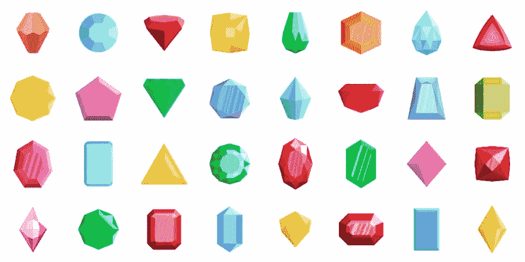

# 如何从零开始打造宝石？

> 原文：<https://dev.to/nisevi/how-to-create-a-gem-from-scratch-4ej3>

我们将介绍创建和发布 gem 所需的基本步骤。

## 简介

> RubyGems 从 Ruby 1.9 开始就包含在 Ruby 本身中，是 Ruby 代码分发的核心。它允许 Ruby 开发者将他们的代码打包成一个压缩文件，称为“gem”。gem 的文件名以。gem 扩展，它们包含了构成库的 Ruby 代码和关于库的元数据，包括作者和版本信息。
> 
> 哈尔·富尔顿。

我们将创建一个 gem 来为 Ruby 语言中的[字符串](https://ruby-doc.org/core-2.6.3/String.html)类[打补丁](https://en.wikipedia.org/wiki/Monkey_patch)。它将引入两种新方法。

这些方法将允许我们通过随机删除字符串中的一半字符来修改字符串。我们将把我们的宝石命名为[thanocase](https://rubygems.org/gems/thanoscase)。

gem 的名称在 RubyGems 生态系统中必须是唯一的。因此，如果你想按照步骤创建宝石，记得改变它的名字。

对你的唯一要求是在你的系统中安装 Ruby 1.9 或更高版本。一点点 [GitHub](https://medium.com/@nisevi/how-to-create-a-github-repository-3990a467661e) 也无妨。

## 制作宝石

第一件事是创建一个我们需要的结构，在 RubyGems 中发布一个 gem。你可以在下面的要点中看到: