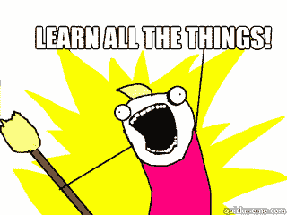

# 说服我尝试数据科学的三个个人特质

> 原文：<https://dev.to/lberlin/three-personal-traits-that-convinced-me-to-try-data-science-19nf>

我并不是轻率地决定立即进入沉浸式数据科学训练营的。当然，人们现在进入数据科学领域有很多原因——与数据相关的能力和技能是美国雇主最抢手的[之一——但这并不意味着数据科学对我来说是正确的选择。这些结果值得投入大量的金钱和时间吗？](https://www.pwc.com/us/en/library/data-science-and-analytics.html)

有许多促成因素和考虑因素导致我回答“是”并进行这次冒险，但其中三个最相关的因素是个人特质，我希望这些因素最终将使我成为一名成功而有效的数据科学家。

* * *

### 质疑一切

任何曾经和我一起工作过的人都会告诉你，我很快就会对几乎所有事情提出质疑。我做这些的目的是什么？我正在做的事情如何改进？我所做的有影响吗？等等，等等，直到我不小心把周围的人都逼疯了。

我发现，在很多就业领域，这不是一个有用的特质。很多时候，雇主不喜欢被问及他们为什么以这种方式做事。尤其是对于一个刚开始工作的人来说，她很难在不问那么多烦人的问题的情况下保持低着头学习工作。

但这就是数据科学的全部意义！雇主雇佣数据科学家来改进流程和程序，探索新的或更好的机会，并且，[最重要的是，](https://medium.com/p/45989be6300e#543b)，[提出问题](https://medium.com/p/ca3e166b7c67#bf26)。找到一份鼓励和培养我的自然倾向和怪癖的工作，而不是试图压制它们，是我目前寻找另一条职业道路的巨大驱动力。

* * *

### 沟通复杂的想法

你有没有忘记一个人的名字或概念(或电影、专辑、应用程序、课程等等)，然后花几分钟解释你是谁或对你说话的人意味着什么？对此我最内疚。不管出于什么原因，我的大脑很容易将信息联系起来，但经常忘记正确的标签——我几乎记不住任何人或任何东西的名字！

令人欣慰的是，我已经变得非常擅长解释概念、联系和背景，以便被理解。幸运的是，这也体现在比我对名字的糟糕记忆更让我感到荣幸的方面。在传达适当的联系和背景的同时，交流复杂的想法是数据科学家最重要的技能之一。虽然沟通技巧[总是可以提高的](https://mode.com/blog/how-to-develop-the-five-soft-skills-that-will-make-you-a-great-analyst)，但我认为自己是一个相对优秀的想法沟通者，这是让我认为数据科学是一个有前途的选择的原因之一。

* * *

### 热爱学习新事物

我喜欢学习新事物。我知道，这是一个很老套的说法——不是每个人都喜欢学习新事物吗？但是我喜欢开始学习的过程——发现，兴奋，当新的概念出现并改变你看待世界的方式时的那种感觉。

另一方面，学习新事物是令人疲惫的——尤其是当新鲜感消失，真正的学习工作开始时。在我真正掌握之前所学的东西之前，我就开始学习另一种新的东西，这是绝对有罪的(我们不都是这样吗？).我发现，捷径是不断从事新项目或新任务，这些项目或任务要求你要么学习新的东西，要么以新的方式应用你的知识。

事实是，我[永远不会知道](https://medium.com/p/45989be6300e#8a90)作为一名数据科学家，我可以使用的所有可能的语言或工具。很有可能，五年或十年后我将使用的日常工具还没有被发明或编写出来。虽然这是一个令人望而生畏的前景，但它也令人兴奋，因为这意味着我已经将自己置于一个我将永远面临学习新事物的挑战的位置。

* * *

虽然这些考虑只是促使我投入熨斗学院沉浸式数据科学项目的一部分，但它们是我的基本组成部分，我希望能很好地转化为数据科学角色。当然，我不认为这些是数据科学家需要的唯一特征，或者所有的数据科学家都需要这三个特征！我暂时还不知道这些特质是否真的让我在数据科学岗位上获得了成功——敬请关注。

你有哪些特质可以很好地转化为以数据科学为重点的职位？很想听听新手和成熟的数据科学家的想法！

###### *封面图片来源于 [SimpliLearn](https://www.simplilearn.com/data-science-vs-big-data-vs-data-analytics-article) 。Monty python gif 来源于 [GifGlobe](https://montypython.gifglobe.com/scene/?id=23jwvs9njyOv) 。学习来源于 [Quick Meme](http://www.quickmeme.com/img/87/876e1b8c8f540c2382df9e56b3fd11fe809b8f9d63cd04e9e3b02d9b7c701a5a.jpg) 的所有东西，形象归功于[夸张和半](http://hyperboleandahalf.blogspot.com/2010/06/this-is-why-ill-never-be-adult.html)T11】。*