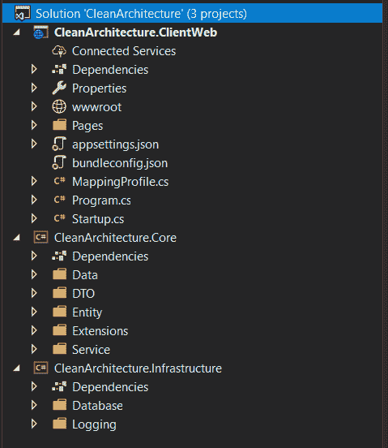

# 干净的架构|创建可维护的软件。网络核心

> 原文：<https://dev.to/tillman32/clean-architecture-creating-maintainable-software-using-net-core-5al6>

### T2】

### [T1】简介](#intro)

这是我最近最喜欢的话题之一——干净的架构，该做的和不该做的，以及如何编写令人敬畏的软件。在你的软件开发生涯中的某个时刻，你会想要开始把事情带到下一个层次。一艘班轮可能不再那么神奇了；或者，您可能因为维护生产应用程序而感到困惑，因为它的源代码都在一个文件中。

不管怎样，你已经看过 1000 本关于如何编写 MVC 应用程序、Web API 等等的教程；但是他们中的大多数人都专注于教授框架/工具，而不是全局。你想知道它是如何干净地组合在一起的，以某种方式，你真的想把它带回工作场所并与你的同事分享。如果这听起来像你，那么你来对地方了。

### 鲍勃·罗斯

除了鲍勃·罗斯，谁能更好地展示干净的软件架构呢？这都是关于画线，并努力不犯错误…但如果你犯了错误，充分利用它们！

> *我们不犯错，只是开心的小意外*—**鲍勃·罗斯**

### 项目

介绍我最新的开源示例项目，Clean Architecture！你可以在 GitHub 上找到它，它也在这里为你提供现场[测试。](https://cleanarchitecture.brandontillman.com)

Clean Architecture 是一个示例项目，展示了如何将小型、中型甚至大型应用程序中的不同层拼凑在一起。它试图遵循推荐的软件架构原则，例如[固体](https://en.wikipedia.org/wiki/SOLID_(object-oriented_design))和 [DDD](https://en.wikipedia.org/wiki/Domain-driven_design) 。你会注意到应用程序被分成一个经典的 3 层，[多层应用程序](https://en.wikipedia.org/wiki/Multitier_architecture)，它在应用程序的每个主要组件之间画出了线。

我用了一个简单的博客例子，而不是任务列表或待办事项应用程序。在应用程序中，你可以查看文章摘录列表，阅读全文，甚至创建新的文章…带有图片和类别。

### 建筑

该应用程序分为三层——**client web**,一个 Razor Pages web 应用程序，**核心**包含业务逻辑、所有模型和接口。最后，* *基础设施** 是我们的 [ORM](https://en.wikipedia.org/wiki/Object-relational_mapping) 和日志实现。

下面是应用程序的整体结构:

[](https://res.cloudinary.com/practicaldev/image/fetch/s--MPnaV5tj--/c_limit%2Cf_auto%2Cfl_progressive%2Cq_auto%2Cw_880/https://www.brandontillman.com/wp-content/uploads/2018/05/FileStructure.png)

### 数据流

像您在网上看到的大多数例子一样，数据库实现和类与业务逻辑的其余部分混合在一起。这违反了[单一责任原则](https://en.wikipedia.org/wiki/Single_responsibility_principle)，应该移入自己的项目。

示例风格方法的另一个问题是，在 UI 和服务中使用了数据库模型——当您想要更改数据库模式甚至 UI 时，这可能会导致问题。相反，利用视图模型、DTO 和实体对象。这样，UI 和数据层都可以彼此独立地更改，它们不再是紧密耦合的。

我发现这部分最初给人的感觉是有很多额外的工作，他们不希望一个对象有多个类，等等。我明白了，但是它带来的好处是值得考虑的。从长远来看，将模型划分到它们各自的用例中会简化代码并允许更大的灵活性。

### 映射

为了使我们不同模型之间的映射变得轻而易举，应用程序中添加了 [AutoMapper](https://automapper.org/) 。AutoMapper 使用反射将值从一个对象映射到另一个对象，而不必事先知道每个属性。这省去了我写大量样板代码，将我们的实体映射到我们的 DTO。

### 依赖注入和 IoC

每一个依赖都是通过构造函数注入来注入的。这意味着，每一个独立的依赖项都有其由框架管理的生命周期，并且可以与测试/模拟版本交换。该应用程序现在已经解耦，本质上更加灵活。

结合接口的使用，我可以定义应用程序的输入和输出。有了这样的控制，我就能够在不影响代码库其余部分的情况下，交换出整个实现。应用程序的可维护性现在增加了两倍。

我正在使用由`Microsoft.Extensions.DependencyInjection`提供的内置依赖注入容器。依赖项及其生命周期由框架管理，并在 Startup.cs 类中定义:

```
public void ConfigureServices(IServiceCollection services)
{

    // Repositories
    services.AddScoped<IGenericRepository<ArticleEntity>, GenericRepository<ArticleEntity>>();
    services.AddScoped<IGenericRepository<ArticleCategoryEntity>, GenericRepository<ArticleCategoryEntity>>();

    // Services
    services.AddScoped<IArticleService, ArticleService>();
    services.AddScoped<IArticleCategoryService, ArticleCategoryService>();

    // Code omitted for brevity 
} 
```

IServiceCollection。AddScoped()方法调用创建一个具有“作用域”生命周期的依赖项。这意味着为该会话中的每个请求创建一个重用的对象。定义接口后，具体的实现会执行实际的繁重工作。关于这个特定主题的更多信息可以在[这里](https://docs.microsoft.com/en-us/aspnet/core/fundamentals/dependency-injection?view=aspnetcore-2.2)找到。

### 构造函数注入

消费者然后简单地利用构造器注入；依赖项通过参数传递，并映射到私有只读变量。

```
public class ArticleService : IArticleService
{
    private readonly IHostingEnvironment _hostingEnvironment;
    private readonly IGenericRepository<ArticleEntity> _repo;
    private readonly IMapper _mapper;
    private readonly ILogger<ArticleService> _logger;

    public ArticleService(
        IHostingEnvironment hostingEnvironment,
        IGenericRepository<ArticleEntity> repo,
        IMapper mapper,
        ILogger<ArticleService> logger)
    {
        _hostingEnvironment = hostingEnvironment;
        _repo = repo;
        _mapper = mapper;
        _logger = logger;
    }
} 
```

### 通用知识库

存储库意味着划清界限，将数据库实现(EF 核心)与应用程序业务逻辑分离。通过这样做，我可以自由地“交换”数据存储机制。事实上，如果我愿意，我可以在没有数据库的情况下构建整个应用程序并使用平面文件存储——它现在完全是“可插拔的”。关键是应用程序不应该关心如何检索或存储数据。通过混合数据库实现细节，我将创建所谓的[“泄漏抽象”](https://en.wikipedia.org/wiki/Leaky_abstraction)——再次将应用程序与数据库紧密耦合。现实生活中的一个很好的例子，就是允许您在安装时选择自己的数据库实现的软件。

该存储库还有一个通用接口，带有一个通用实现。通过这样做，我不再需要为每个实体创建一个存储库。通过对数据集进行一组 CRUD 操作，还可以避免重复代码。让我向您展示我的意思——首先让我们仔细看看我是如何实现数据库的。

`IGenericRepository`位于`CleanArchitecture.Core`项目中，它是不依赖于解决方案中任何其他项目的中心业务逻辑。该接口定义了数据如何流入/流出应用程序核心层的输入和输出。我在`CleanArchitecture.Infrastructure`项目的`GenericRepository`类中实现了这个接口。概述如下:

```
public class GenericRepository<TEntity> : IGenericRepository<TEntity>, IDisposable
    where TEntity : class, IEntity
{
    private readonly ApplicationDbContext _dbContext;

    public GenericRepository(ApplicationDbContext dbContext)
    {
        _dbContext = dbContext;
    }

    // Returns Queryable interface for retrieving all entities.
    public IQueryable<TEntity> GetAll()
    {
        return _dbContext.Set<TEntity>()
            .AsNoTracking();
    }

    // Returns a single entity by Id.
    public async Task<TEntity> GetById(int id)
    {
        return await _dbContext.Set<TEntity>()
            .AsNoTracking()
            .FirstOrDefaultAsync(e => e.Id == id);
    }

    // Inserts an entity.
    public async Task Create(TEntity entity)
    {
        await _dbContext.Set<TEntity>().AddAsync(entity);
        await _dbContext.SaveChangesAsync();
    }

    // Updates an entity.
    public async Task Update(int id, TEntity entity)
    {
        _dbContext.Set<TEntity>().Update(entity);
        await _dbContext.SaveChangesAsync();
    }

    // Deletes an entity.
    public async Task Delete(int id)
    {
        var entity = await GetById(id);
        _dbContext.Set<TEntity>().Remove(entity);
        await _dbContext.SaveChangesAsync();
    }

    public void Dispose()
    {
        if (_dbContext != null)
        {
            _dbContext.Dispose();
        }
    }
} 
```

这个类现在处理对数据集的所有创建、读取、更新、删除(CRUD)操作。如果没有这一点，我将需要为我打算利用的每个实体/表建立一个存储库——这就是好处！这是非常强大的东西。

[](https://res.cloudinary.com/practicaldev/image/fetch/s--OXcDFu15--/c_limit%2Cf_auto%2Cfl_progressive%2Cq_auto%2Cw_880/https://www.brandontillman.com/wp-content/uploads/2019/04/unlimited-power.jpg)

### 测井

出于同样的原因，日志记录甚至与应用程序分离，并且是可插拔的。现在它使用 [NLog](https://nlog-project.org/) 来实现，但是我可以很容易地添加另一个专门的记录器或开关。

### 结论

我在这个项目上花了很大力气，并且已经把它作为其他新项目的基础。没有理由每次都从“文件->新建”开始，我鼓励你帮自己一个忙——构建你的基本工具集。我也希望你能学到一些关于干净建筑的新东西，我知道我在做这个的时候学到了。我将继续在必要时添加属于基础项目的功能，所以**请确保在 github 上观看/启动[项目以获取更新。](https://github.com/Tillman32/CleanArchitecture)**您甚至可以随意提出自己的建议！

> 天赋是一种追求的兴趣。任何你愿意练习的事情，你都可以做—**鲍勃·罗斯**

感谢您的阅读！如有任何问题，请随时联系我们，或者只是打个招呼！[](https://res.cloudinary.com/practicaldev/image/fetch/s--i5n0Ut5W--/c_limit%2Cf_auto%2Cfl_progressive%2Cq_auto%2Cw_880/https://s.w.oimg/core/emoji/11.2.0/72x72/1f642.png)

清洁的架构|创建可维护的软件。网芯最早出现在[布兰登·蒂尔曼](https://www.brandontillman.com)上。