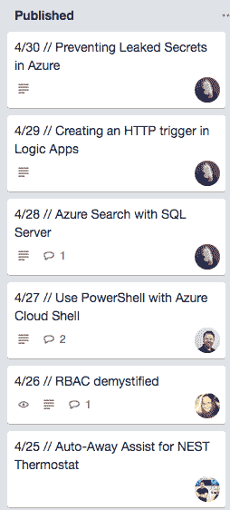

# 结束蔚蓝的四月！

> 原文：<https://dev.to/azure/wrapping-up-the-month-of-azure-april-25o8>

感谢您加入我们这个蔚蓝四月的冒险之旅！分享如此广泛的话题令人兴奋，从[用逻辑应用发新的博客帖子](https://dev.to/azure/tweeting-new-blog-posts-with-logic-apps-524p)到[防止泄密](https://dev.to/azure/preventing-leaked-secrets-in-azure-8kp)。

如果你错过了任何帖子，在这里按时间倒序找到整个月份。

在这个项目上与这么多人合作既有趣又有挑战性。dev.to 网站是一个分享技术内容的好地方，但它在协作方面确实存在挑战。这篇文章描述了我们遇到的一些挑战，以及我们所做的(或计划在明年解决的)。

## 汇总外卖

*   使用项目板来可视化正在进行的工作。
*   建立管道，工作进展如何。
*   适应变化！
*   鼓励心理安全，这样当问题发生时，人们就可以大声说出来。
*   使用多种形式的沟通来促进团队内部的协调和可见性(例如 Slack 和 Trello！).
*   用适当的[知名标签](https://dev.to/tags)标记帖子，以提高可见性。
*   确保帖子是具有多个管理员的组织的一部分，以支持按计划发布。
*   为发布设置一个时区内的特定时间，而不仅仅是项目有国际合作者的特定日期。

## 挖掘细节

“每日发布”日历的合作挑战之一是预先规划主题，并通过管道分阶段开展工作。我们最终使用 Slack 和 Trello 进行协调。

我们为每个潜在的主题创建了一张卡片，用栏目来建立从潜在的想法到发表的工作流程。

```
| Potential Ideas | Assigned Articles | Reworking + Rewriting | Drafted + In Review | Edited + Ready for Publication | Published |
|-----------------|-------------------|-----------------------|---------------------|--------------------------------|-----------| 
```

Enter fullscreen mode Exit fullscreen mode

用卡片来表示帖子，并且可以移动到特定的状态，这让我们可以看到什么需要优先处理。其他信息在卡本身中被跟踪。预定的作者被分配了卡片。

[](https://res.cloudinary.com/practicaldev/image/fetch/s--4S7TY7w_--/c_limit%2Cf_auto%2Cfl_progressive%2Cq_auto%2Cw_880/https://thepracticaldev.s3.amazonaws.com/i/z5s6hrkppunp4fk5655e.png)

一旦指定了日期，我们就把它加到特雷罗卡片的标题上。这使得在一个专栏中组织编辑和写作需要优先处理的工作变得容易。

[](https://res.cloudinary.com/practicaldev/image/fetch/s--fVByovuO--/c_limit%2Cf_auto%2Cfl_progressive%2Cq_auto%2Cw_880/https://thepracticaldev.s3.amazonaws.com/i/6jq0c68vz7nybt2b1197.png)

每个作者都有不同的偏好反馈方法，这是一个挑战。有些人更喜欢组织在特雷罗卡片里的一切；其他人更喜欢 Slack 中的直接消息。

使用看板进行协调让我们能够处理出现在人们面前的问题。他们可以大声说出延迟，帖子可以重新排序。这一步的关键在于，个人必须感觉到被授权说出并说“我不会去约会的。”生活就是这样，在任何问题上保持透明有助于人们执行整体计划，而不管任何个别的部分。让备份内容可用也非常有帮助。

使用看板可以让我们在整个月吸引新人来贡献。我们在月初有一个计划，随着越来越多的人加入到这个项目中来，这个计划也发生了变化。可视化有助于保持项目的正常进行，同时也支持变更。

随着人们的加入和话题的重新安排，我们增加了一个更新 Slack 频道的流程，每周更新一个话题列表，让人们关注他们即将发布的文章。这对不使用 Trello 的人来说有一个增加可见性的副作用。

每个作者都会给他们的文章贴上合适的标签[众所周知的标签](https://dev.to/tags)。这有助于文章的可见性，将内容放在有助于人们寻找该主题信息的地方。在 dev.to 平台上，我们总共只限于 4 个标签。

通过[系列功能](https://dev.to/ben/changelog-create-series-of-posts-4o63),我们可以将帖子标记为“Azure April”系列的一部分。系列被标记为一个人，所以如果多人有相同的系列标题，对他们每个人来说都是一个单独的系列。为了有一个单一的指向，我们需要创建 [azureapril](https://dev.to/t/azureapril/latest) 标签，这也意味着将我们的帖子标签限制在[知名标签](https://dev.to/tags)的 1 个。

随着[Microsoft Azure dev . to Organization](https://dev.to/azure)，不止一个人拥有编辑和发布个人作者内容的管理权限。有了准备好并排队等待发布的内容，即使作者忘记发布一天，有人也可以发布该帖子。

具有挑战性的一点是时区。随着世界各地的人们的参与，日子重叠了。拥有一个允许我们安排特定时间发布的特性将会缓解这种情况，尽管我们也可以从 dev.to 中找出一些外部过程来允许我们按照特定的时间表发布。

我们期待着与 dev.to 团队合作，改善这样一个项目的协作和协调。

### 谢谢！

感谢 [Michael Crump](https://twitter.com/mbcrump) 启发和创造了我们选择在 Azure 四月通过他的 [Azure Tips and Tricks 网站](http://azuredev.tips)重点介绍的许多技巧和诀窍。如果你发现这些建议

非常感谢合作的策展人艾米丽·弗里曼和 T2·伯克·霍兰德。

感谢为 Azure April 贡献原创内容的其他作者:

*   [亚伦·鲍威尔](https://dev.to/aaronpowell)
*   阿里·博恩施泰因
*   克里斯·诺林
*   [杰伊·戈登](https://dev.to/jaydestro)
*   詹妮弗·戴维斯
*   迈克尔·本德
*   保罗·迪卡洛

感谢[蒂尔尼·塞伦](https://dev.to/bnb)和[约翰·帕帕](https://dev.to/john_papa)对开发者的支持！

### 进行讨论

我希望看到更多的人尝试这些“一天一贴”的合作项目。如果你管理过或者参与过，你有什么建议和窍门？

有没有任何 Azure 主题是你想了解的，而我们没有涉及到的，或者是我们应该深入研究的？你有想要分享的 Azure 提示和技巧吗？