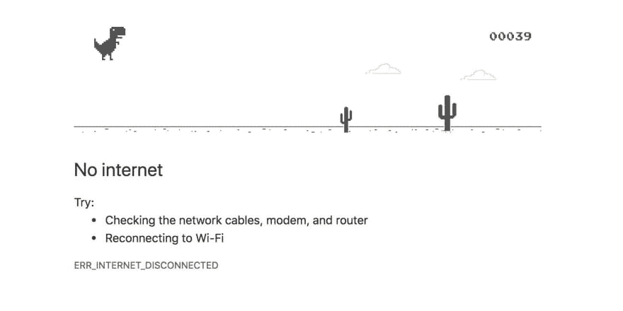
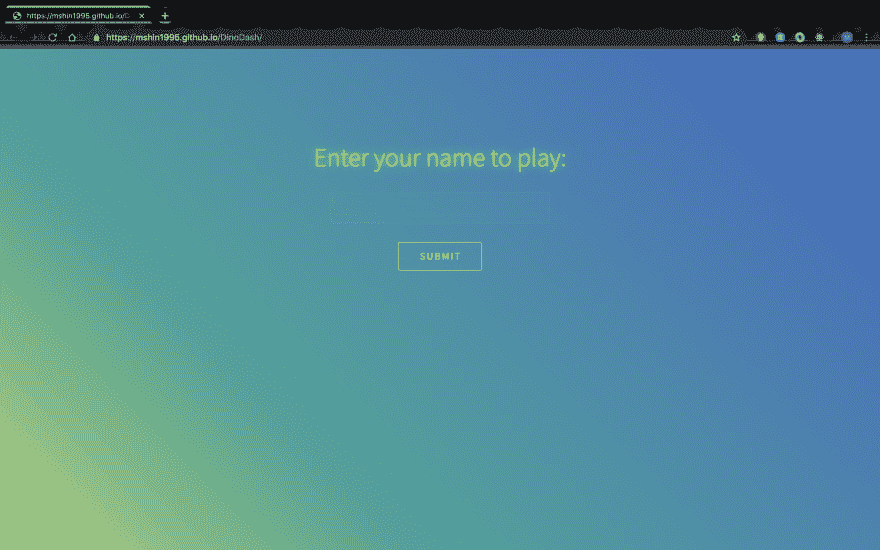
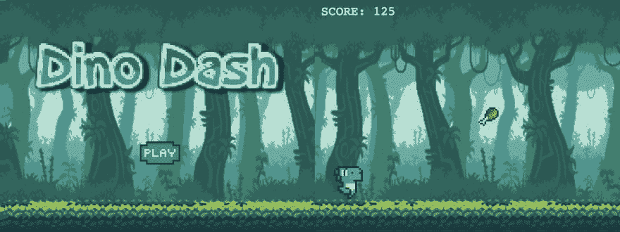

# 使用 Phaser 制作视频游戏

> 原文：<https://dev.to/mshin1995/making-a-video-game-using-phaser-44m5>

上周，我接到一个任务，用 Javascript 前端和 Rails 后端为一个班级项目创建一个单页面应用程序。经过一番头脑风暴后，我决定尝试创建一个视频游戏。从我记事起，我就在玩视频游戏，无论是网站上的简单 flash 游戏，还是特定游戏机上的大型游戏。我一直想了解这些游戏是如何制作的，但很长一段时间都没有这方面的知识。现在我已经有了几个月的编程经验，我认为这是探索视频游戏开发表面的好时机。

## **什么是相位器？**

在研究如何使用 Javascript 创建一个视频游戏时，我发现有多种方法可以做到这一点。更流行的方法之一是使用 Javascript 提供的画布作为游戏本身的窗口。我还了解到，编写代码来处理游戏的物理方面的整个过程是乏味的，而且很难做到，尤其是在一周内。这是当我的一个同学建议在整个过程中使用一种叫做相位器的东西来减轻我的负担。Phaser 是一个免费的开源框架，使用 Javascript，专门用于视频游戏开发。它是面向数据的，为用户提供全身物理系统，这样他们就不用自己编写那个部分的代码了。它还带有创建功能游戏所需的基本元素，如输入控制和动画图像(无论是静态还是动态)的机制。

## **概念化**

为了开始这个项目，我首先必须想出一个游戏实际上应该是什么以及它应该如何运行的想法。你们中的一些人可能知道，当没有连接到互联网时，谷歌 Chrome 上有一个隐藏的游戏。这是一个无限的滚动条，用户控制一只恐龙，并试图避免障碍，同时赚取积分，他们活得越久。我决定采用这个概念，制作我自己的版本，名为 Dino Dash。作为一个单页面应用程序，我希望用户能够在第一次访问网站时输入他们的名字，然后过渡到实际的游戏，最后在完成后将他们的分数保存到一个表格中。

[](https://res.cloudinary.com/practicaldev/image/fetch/s--CHhnwdlq--/c_limit%2Cf_auto%2Cfl_progressive%2Cq_auto%2Cw_880/https://thepracticaldev.s3.amazonaws.com/i/fhwewnql7panblxh42ln.jpg)

## **前端**

包括在前端是一个 index.html 文件，用于渲染用户看到输入他们的名字的初始页面。它还有整个游戏的所有 Javascript 文件。我决定将游戏组织成三个关键文件 title.js、game.js 和 main.js。

[](https://res.cloudinary.com/practicaldev/image/fetch/s--P9qBp6BE--/c_limit%2Cf_auto%2Cfl_progressive%2Cq_auto%2Cw_880/https://thepracticaldev.s3.amazonaws.com/i/kpw591na4nmh7ouq3s1j.png)

#### **title.js**

从 title.js 开始，正如名字所说，这个文件负责游戏的开场场景。它呈现一个 play 按钮，一旦按下该按钮就会移动到 game.js 中的下一个场景。

#### [T1**game . js**](#gamejs)

在 game.js 中是让游戏真正发挥作用的基本代码所在的位置。Phaser 将这个文件中的代码分成三个部分。这些组件是预加载、创建和更新，它们在初始化时按照正确的顺序运行。这个文件的预加载部分负责加载游戏将使用的所有资源。这些包括来自图像、图片和声音的任何东西。

<figure>

[](https://res.cloudinary.com/practicaldev/image/fetch/s--9Dar1kcB--/c_limit%2Cf_auto%2Cfl_progressive%2Cq_auto%2Cw_880/https://thepracticaldev.s3.amazonaws.com/i/zru4gk246k1yk3g60ulk.png)

<figcaption>Spritesheet for character</figcaption>

</figure>

创建组件是加载的资产被实际渲染和显示的地方。这也是游戏背后的逻辑被编程的地方，例如玩家应该从什么位置开始，什么对象应该能够相互碰撞，或者在某些对象碰撞时触发什么事件。继续，更新组件包括游戏的功能。玩家引起的动作将触发与该动作和更新相关联的事件。这种功能最常见的例子是，如果玩家按下右箭头键，该动作将触发一个事件，将角色的位置更新到右边。包括该事件的动画将使位置更新更加无缝。

<figure>

```
#Preload
this.load.spritesheet('doux', 'assets/sprites/doux.png', {frameWidth: 23.8, frameHeight: 17})
#Create
this.player = this.physics.add.sprite(100, 450, 'doux')
#Update
let cursors = this.input.keyboard.createCursorKeys()
    this.player.anims.play('run', true)
      if (cursors.right.isDown) {
        this.player.setVelocityX(200)
        this.player.flipX = false
      } 
```

<figcaption>Preload, create, and update for character</figcaption>

</figure>

#### **main.js**

最后一个文件 main.js 将所有的东西结合在一起。这是使用上面两个文件在 html 画布中初始化整个游戏的地方。title.js 和 game.js 都作为两个单独的场景导入，然后合并。这也是我决定写取请求的地方。其中一个从后端的数据库中获取现有的用户名和他们的分数，并对前十名的分数进行排序，以显示在表格上。另一个 fetch 在新用户最初在主页上输入他们的名字时，向数据库发送一个得分为 0 的新用户。在 game.js 中有另一个 fetch 请求，一旦用户在死亡时重启游戏，该请求会将用户的新分数发送到数据库中。

<figure>

[](https://res.cloudinary.com/practicaldev/image/fetch/s--fe5XpYO_--/c_limit%2Cf_auto%2Cfl_progressive%2Cq_auto%2Cw_880/https://thepracticaldev.s3.amazonaws.com/i/n4249ysnccbzu39ky3gw.png)

<figcaption>[Left] Title Scene, [Right] Game Scene</figcaption>

</figure>

## **后端**

在后端工作比在前端工作简单直接得多。它是使用 Rails 创建的，唯一的目的是创建用户并将他们和他们的分数保存到数据库中。后端使用 Heroku 部署，前端使用提供的 url 获取数据。

## **最后的想法**

总的来说，我很高兴完成了这个项目，并学到了更多关于游戏开发的知识。虽然我用 Phaser 做了很多繁重的工作，但我仍然觉得我的 Javascript 知识有所提高。本周早些时候我开始学习 React，我惊喜地发现我使用 Phaser 的经验在某种程度上是适用的，尤其是在导入和导出文件方面。Phaser 提供的预加载、创建和更新功能也类似于生命周期方法在 React 中的工作方式。展望未来，我肯定想尝试用 Javascript 制作不同类型的视频游戏。

查看我的代码:
[https://github.com/mshin1995/DinoDash](https://github.com/mshin1995/DinoDash)

玩游戏:
[https://mshin1995.github.io/DinoDash/](https://mshin1995.github.io/DinoDash/)

怎么玩:
-用方向键移动/跳跃
-吃肉加分
-躲避炸弹
-活命