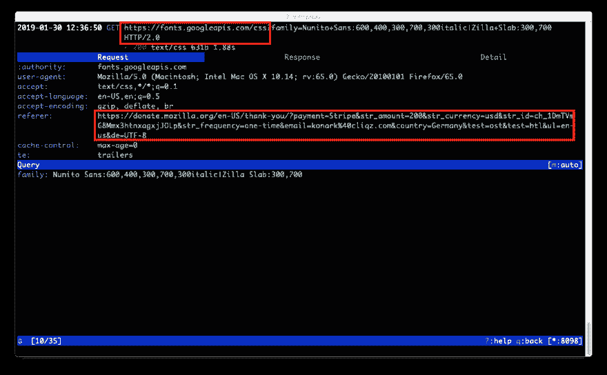
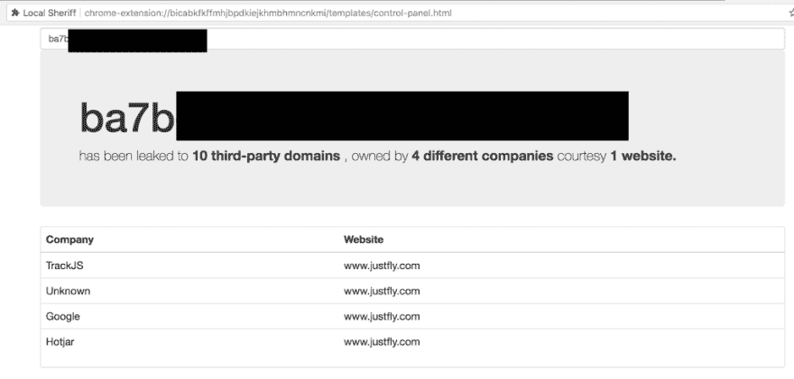
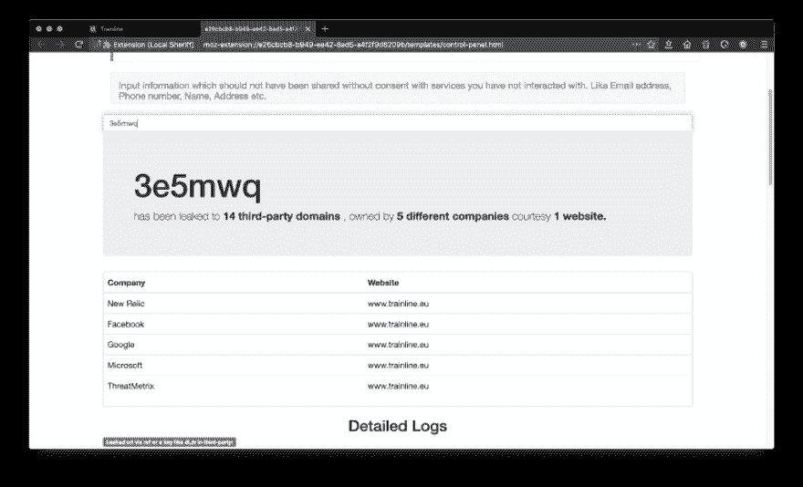
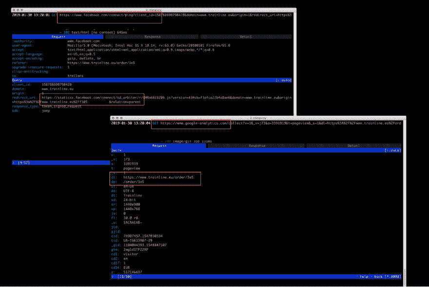
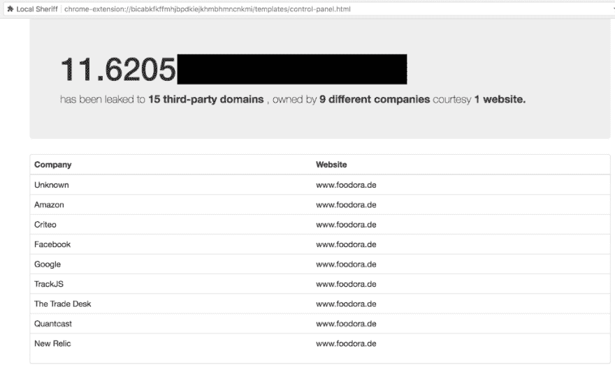
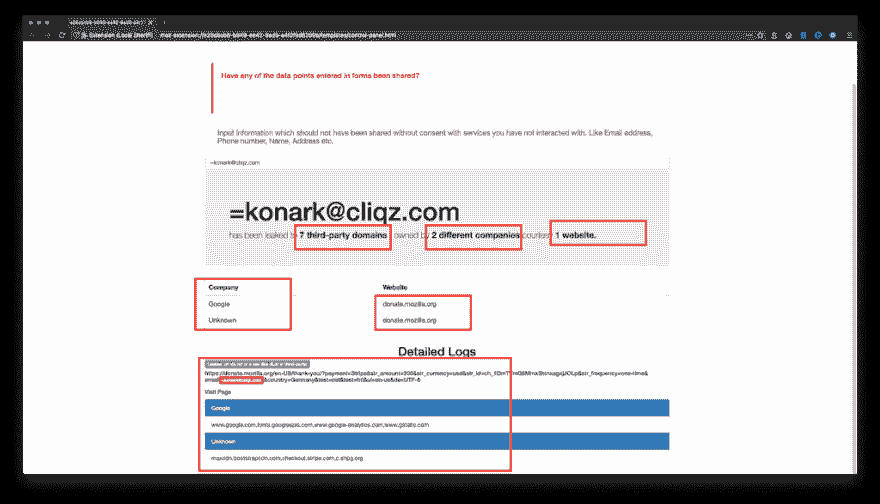

# 看着他们看着我们-网站如何泄露敏感数据给第三方。

> 原文：<https://dev.to/konarkmodi/watching-them-watching-us-how-websites-are-leaking-sensitive-data-to-third-parties-1nn3>

### **什么是泄密的网址？**

URL 是最常被跟踪的信息，根据页面内容构建 URL 的天真选择可以更容易地了解用户的浏览历史、地址、健康信息或更敏感的细节。它们包含敏感信息或可能导致包含敏感信息的页面。

我们称这样的 URL 为 TellTaleURLs。

让我们来看一些这样的 URL 的例子。

### **例一:**

**网站**:donate.mozilla.org*(固定)*

在*donate.mozilla.org*上完成支付流程后，您将被重定向至“感谢”页面。如果你仔细看下面截图中显示的网址，它包含一些私人信息，如*电子邮件，国家，金额，支付方式。*

<figure>

<figcaption>donate.mozilla.org 网址上的 PII</figcaption>

</figure>

现在，由于该页面从第三方加载了一些资源，并且 URL 没有被净化，所以相同的信息也通过 referrer 与这些第三方共享，并作为有效负载内的值发送给第三方。

<figure> 

<figcaption>从 Google Apis 加载字体时，URL 与 PII 共享。</figcaption>

</figure>

在这一特定案例中，有 7 个第三方分享了这一信息。

Mozilla 被提示修复这些问题，更多细节可以在这里找到:

 *### 例二:

**网址** : trainline.eu，【JustFly.com T2】(上次检查时间:2018 年 8 月)

一旦你完成购买，如火车票/飞机票，你会收到一封电子邮件，其中有一个链接来管理你的预订。大多数情况下，当你点击链接时，你会看到预订的详细信息，而不必输入更多的细节，如预订代码、用户名/密码。

这意味着 URL 本身包含一些对用户来说唯一的令牌，并提供对用户预订的访问。

碰巧的是，这些网址也与第三方共享，让这些第三方[高度敏感的数据](https://medium.freecodecamp.org/how-airlines-dont-care-about-your-privacy-case-study-emirates-com-6271b3b8474b)和[访问你的预订](https://cliqz.com/en/magazine/lufthansa-data-leak-what-a-single-url-can-reveal-about-you)。

<figure>

<figcaption>【JustFly.com】泄露 bookingID 给 10 个第三方域名</figcaption>

</figure>

<figure>

<figcaption>train line . eu 与 17 个第三方域共享订票令牌。</figcaption>

</figure>

<figure> 

<figcaption>URL，令牌通过 Ref 和有效负载共享。</figcaption>

</figure>

### 例 3:

**网站**:【grubhub.com T2】foodora . de(最近检查时间:2018 年 8 月)

网上订餐的先决条件之一是输入你希望食物送达的地址。

一些流行的食品配送网站，将地址转换为精细的经纬度值，并添加到 URL 中。

该 URL 还与第三方共享，可能会泄露用户的居住地。

<figure> 

<figcaption>Foodora 向 15 个第三方域名泄露地址详情。</figcaption>

</figure>

> 需要明确的是，遭受此类泄露的不仅仅是这些网站。这个问题到处都存在——这是一种默认情况，并不罕见。我们已经在汉莎航空、Spotify、Flixbus、阿联酋航空，甚至医疗服务提供商身上看到了这一点。

### 泄密网址的风险:

*   网站不小心将敏感信息泄露给过多的第三方。
*   最常见的是未经用户同意。
*   更危险的是:大部分网站在实现第三方服务时并没有意识到这些泄露。

### 这些问题很难修复吗？

作为一名为一些最大的电子商务公司工作的软件工程师，我理解使用第三方服务来优化和增强数字产品以及用户与产品交互方式的必要性。

在这种情况下，关注的不是第三方服务的使用，而是这些服务的实现。所有者应该始终控制他们的网站以及网站与第三方服务共享的内容。

需要行使这种控制来限制用户信息的泄露。

这不是一项艰巨的任务，只是一个维护基本隐私权的承诺问题。

例如:

1.  私人页面应该有 [noindex meta 标签](https://developer.mozilla.org/en-US/docs/Web/HTML/Element/meta)。
2.  限制第三方服务在个人页面上的出现。
3.  [包含敏感数据的页面上的 Referrer-Policy](https://developer.mozilla.org/en-US/docs/Web/HTTP/Headers/Referrer-Policy) 。
4.  实施 CSP 和 SRI。即使有大量的第三方服务 [CSP](https://developer.mozilla.org/en-US/docs/Web/HTTP/CSP) 、 [SRI](https://developer.mozilla.org/en-US/docs/Web/Security/Subresource_Integrity) 在大多数网站上都没有启用。

### 介绍当地警长:

鉴于这种信息泄露对用户和组织都是危险的，那么为什么它是一个广泛存在的问题呢？

这些问题存在的一个重要原因是缺乏意识。

对于网站来说，一个很好的起点是查看哪些信息正在被泄露，或者检测泄密者的存在。

但是，为了发现您维护或访问的网站是否也发生了同样的情况，您需要学习一些工具来检查网络流量，了解第一方-第三方关系，然后确保您在交易过程中打开这些工具。

为了帮助弥合这一差距，我们希望构建一个具有以下指导原则的工具:

*   易于安装。
*   监控和存储网站和第三方之间交换的所有数据—本地存储在用户计算机上。
*   帮助识别哪些公司在互联网上跟踪他们的用户。
*   接口来搜索泄露给第三方的信息。

根据上面的指导方针，浏览器扩展似乎是一个合理的选择。安装 Local-Sheriff 后，在后台:

1.  它使用 WebRequest API 来监控第一方和第三方之间的交互。
2.  对第一方和第三方 URL 进行分类。
3.  随附一份来自 [WhoTracksMe](https://whotracks.me/) 的数据库副本。来映射哪个域属于哪个公司。

4.  提供了一个界面，你可以搜索你认为是私人的价值，并查看哪些网站泄露给了哪些第三方。例如:姓名，电子邮件，地址，出生日期，饼干等。

### 重温例 1

**网址:**【donate.mozilla.org T2】

*   用户安装了本地警长，并捐赠给 mozilla.org。

<figure>

<figcaption>donate.mozilla.org 网址上的 PII</figcaption>

</figure>

*   点击图标打开搜索界面。

<figure> 

<figcaption>当地警长图标。</figcaption>

</figure>

*   输入 donate.mozilla.org 网站上使用的电子邮件 ID。

<figure> 

<figcaption>搜索界面</figcaption>

</figure>

可见捐赠时使用的邮箱地址是与 **~7 个第三方域名共享的。**

您可以通过安装来亲自尝试一下:

**火狐:**【https://addons.mozilla.org/de/firefox/addon/local-sheriff/】T2

**Chrome:**[https://Chrome . Google . com/web store/detail/local-sheriff/ckmkiloofgalfdhcfdllaaacpjjejeg](https://chrome.google.com/webstore/detail/local-sheriff/ckmkiloofgfalfdhcfdllaaacpjjejeg)

**更多详情**:[*https://www . ghacks . net/2018/08/12/local-sheriff-reveals-if-sites-leak-personal-information-with-third-party/*](https://www.ghacks.net/2018/08/12/local-sheriff-reveals-if-sites-leak-personal-information-with-third-parties/)

**源代码**:[T3【https://github.com/cliqz-oss/local-sheriff】T5】](https://github.com/cliqz-oss/local-sheriff)

**会议:** [*Defcon 26 演示实验室*](https://www.defcon.org/html/defcon-26/dc-26-demolabs.html) _，_ [*FOSDEM 2019*](https://fosdem.org/2019/schedule/event/web_extensions_exposing_privacy_leaks/)

**代号:**【https://github.com/cliqz-oss/local-sheriff】T2

**Chrome 商店:**[https://Chrome . Google . com/web store/detail/local-sheriff/ckmkiloofgalfdhcfdllaaacpjjejeg](https://chrome.google.com/webstore/detail/local-sheriff/ckmkiloofgfalfdhcfdllaaacpjjejeg)

感谢阅读和分享！:)

如果你喜欢这个故事，请随意👏👏👏几次(最多 50 次。说真的)。

黑客快乐！

[- Konark Modi](https://twitter.com/konarkmodi)

***演员表:***

*   *特别感谢* [*雷米*](https://twitter.com/Pythux) _，_ [*帕拉维*](https://twitter.com/Pi_Modi) *审阅此贴:*
*   *标题“看着他们看着我们”来自 FOSDEM 2019 上当地警长与* [*Trackula*](https://trackula.org/en/) *的一次联合谈话。**