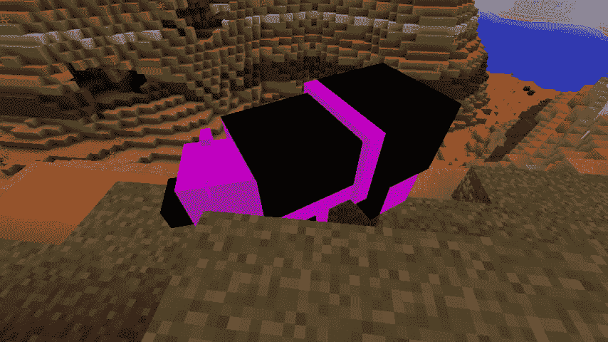
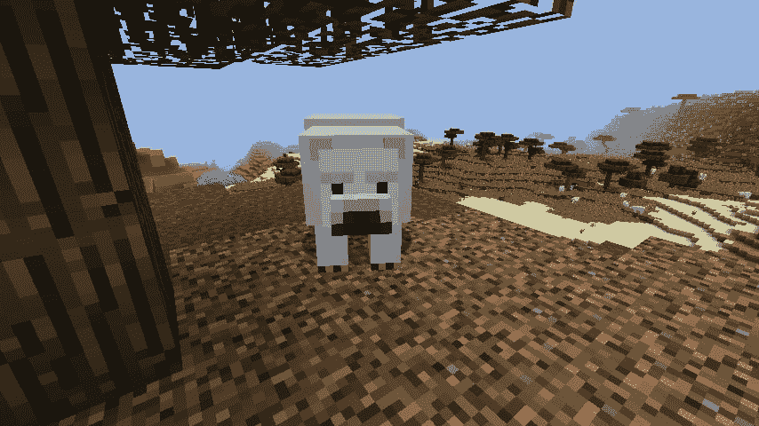

# 在《我的世界》锻造熊猫(北极熊)实体 1.12.x

> 原文：<https://dev.to/drazisil/making-a-panda-polar-bear-entity-in-minecraft-forge-1-12-x-2m5p>

工作标题:给一个雪立方体赋予形式

*本教程写于 1.12.2 左右，事情可能/已经在 1.13 发生了变化。在这里我要说清楚这个版本，因为我不能忍受发现没有用的信息，你也不知道为什么，结果事情发生了巨大的变化。咳咳。我没事，我们继续*

我喜欢这颗种子`-8968754462810568592`

我想从一开始就明确表示，我计划复制《我的世界》的原生类，并修改我所需要的。这样更理智。

现在我们有一个认为是北极熊的白色大方块。进步！

当我知道我做了什么后，我会记录我睡觉后做了什么。:D

*插入太阳升起、公鸡打鸣、编程打哈欠和眨眼等 gif 图片*

早上好！好吧，我们说到哪了？哦是的。认为自己是北极熊的白色大方块。没错。我知道你想要一张图片，但是让我们从一些代码开始！

昨晚我忘记的一件事是记录我是如何添加实体的。因为(目前)熊猫是北极熊的克隆，所以实体类是相同的。重要的是你如何注册这门课。代码可能会改变(在 1.3.x 中已经没有了)，所以这里是代码，带有注释和链接

```
@Mod.EventBusSubscriber
public class MyForgeEventHandler {

    /**
     * Register the EntityPanda class using the EntityEntryBuilder
     * Some details are here: https://github.com/MinecraftForge/MinecraftForge/pull/4408
     * The class is here: https://github.com/MinecraftForge/MinecraftForge/blob/1.12.x/src/main/java/net/minecraftforge/fml/common/registry/EntityEntryBuilder.java
     * It's already gone in 1.13.x
     * @param event
     */
    @SubscribeEvent
    public static void entityRegistration(RegistryEvent.Register<EntityEntry> event) {
        event.getRegistry().register(EntityEntryBuilder.create().entity(EntityPanda.class)
                .id(new ResourceLocation("pandas", "panda"), 33).name("Panda").tracker(160, 2, false)
                .egg(0x4c3e30, 0xf0f0f)
                .spawn(EnumCreatureType.AMBIENT, 10, 8, 8, ForgeRegistries.BIOMES.getValuesCollection()).build());
        System.out.println("Entries registered");
    }

} 
```

[](https://res.cloudinary.com/practicaldev/image/fetch/s--ZdKQ6u8f--/c_limit%2Cf_auto%2Cfl_progressive%2Cq_auto%2Cw_880/https://github.com/drazisil/pandas/blob/mastimg/2019-05-01_09.58.57.png)

总之。看来我们需要一个模型。

这将是`src/main/java/com/drazisil/pandas/model/ModelPanda.java`类。

同样，这是目前来自《我的世界》的 ModelPolarBear 类的克隆，所以让我们把重点放在注册部分。

这段代码放在您的`preInit`事件处理程序中(至少在 1.12 中是这样)。如果你使用代理模式(客户机/服务器/公共(没有理由你不应该))它将在客户端进行，因为服务器不渲染任何东西，不知道如何渲染，并且通常会在被要求时抛出。因为我还没有到那里，所以我正在检查以确保它只在客户端运行。

```
 if (event.getSide() == Side.CLIENT) {
            System.out.println("preInit: Client");
            RenderingRegistry.registerEntityRenderingHandler(EntityPanda.class, RenderPanda::new);
        } 
```

[](https://res.cloudinary.com/practicaldev/image/fetch/s--p8e7GaWK--/c_limit%2Cf_auto%2Cfl_progressive%2Cq_auto%2Cw_880/https://raw.githubusercontent.com/drazisil/pandas/mastimg/2019-05-01_10.11.42.png)

如此接近。让我们复制北极熊的纹理，称之为熊猫。

`src/main/resources/assets/pandas/textures/entity/panda.png`

[](https://res.cloudinary.com/practicaldev/image/fetch/s--GnpmrcRf--/c_limit%2Cf_auto%2Cfl_progressive%2Cq_auto%2Cw_880/https://raw.githubusercontent.com/drazisil/pandas/mastimg/2019-05-01_10.14.53.png)

对我来说，这看起来像版本 0.2.0。如果有人想知道我是如何产卵的，我会用非常高科技的方法，在我破土的时候给自己一个卵。我本来打算跳过它，但是花了一些时间才弄明白，所以我简单地介绍一下

这段代码放在我的事件处理程序类中

```
 /**
     * Create an instance of a spawn egg, use
     * ItemMonsterPlacer.applyEntityIdToItemStack to appy the metadata of the
     * EntityPanda to it, and give it to the player on the EntityItemPickup event.
     * Make sure this only happens server-side
     *
     * @param event
     */
    @SubscribeEvent
    public static void pickupItem(EntityItemPickupEvent event) {

        EntityPlayer player = event.getEntityPlayer();
        if (!event.getEntityPlayer().getEntityWorld().isRemote) {
            ItemStack pandaEggStack = new ItemStack(Items.SPAWN_EGG);
            ResourceLocation pandaResource = new ResourceLocation("pandas", "panda");
            System.out.println(pandaResource);
            ItemMonsterPlacer.applyEntityIdToItemStack(pandaEggStack, pandaResource);
            player.inventory.addItemStackToInventory(pandaEggStack);
        }
        System.out.println(event.getItem().getName() + " picked up by " + event.getEntityPlayer().getName());
    } 
```

我在这里做一个检查，以确保它只处理服务器端，因为你不想在客户端给玩家物品，否则服务器永远不会知道。这里的`ItemMonsterPlacer.applyEntityIdToItemStack()`是有趣的部分，这是应用熊猫作为产卵的“内容”。

接下来的步骤是给熊猫一个本地化的名字，看看纹理和行为。[熊猫和竹子将在 1.14](https://minecraft.gamepedia.com/Panda) 到来，但我拿起熊猫作为[《我的世界》中国神话系列 14 迷你数字盲盒](https://www.minecraftshop.com/p/minecraft_mini_figure_chinese_mythology_series_blind_box.html)的一部分，真的想用它作为再次改装的借口。我想这是一个反向端口吧？

*这篇文章是我的[熊猫车](https://github.com/drazisil/pandas#readme)的自述文件的一部分。[第 1 部分](https://dev.to/drazisil/setting-up-a-minecraft-mod-enviroment-in-vscode-it-s-easier-than-you-think-5bfc)讨论了在 VSCode 中建立一个开发环境。欢迎您的想法和反馈。*