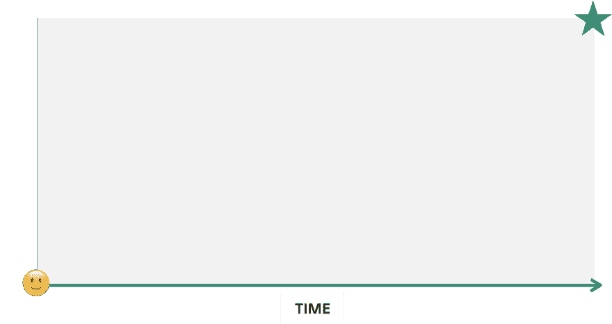
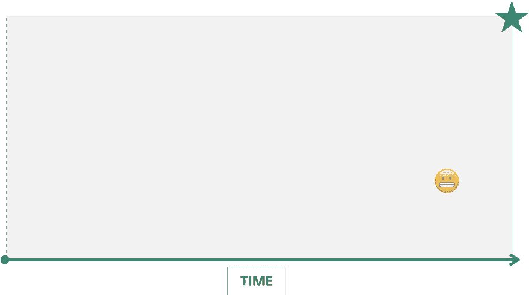
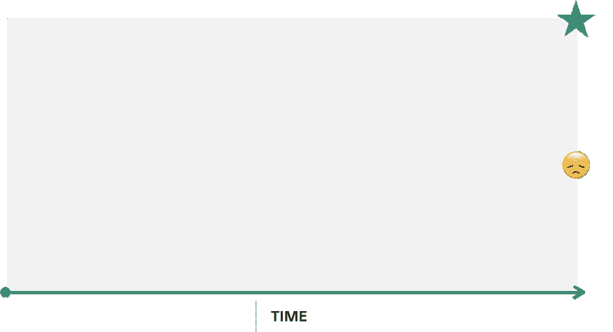
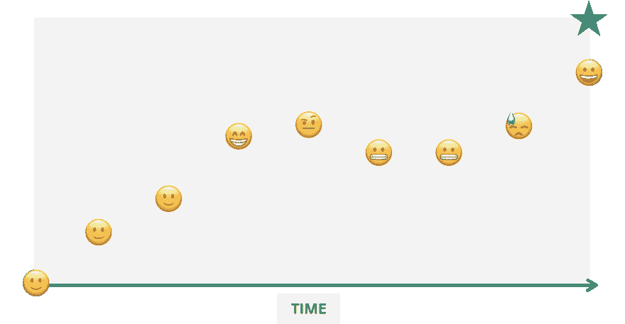
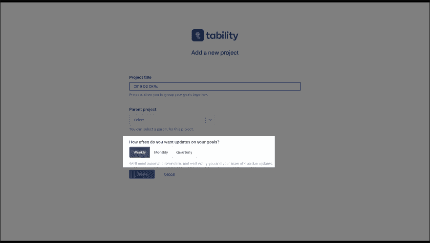
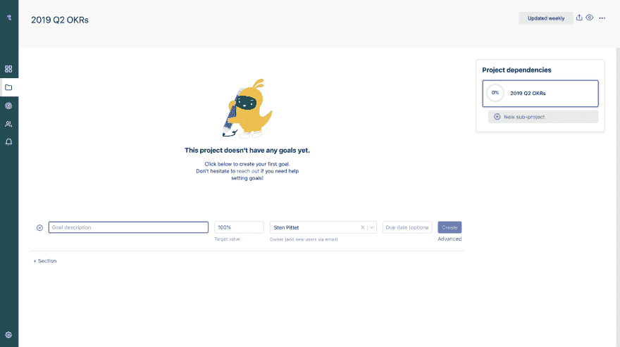
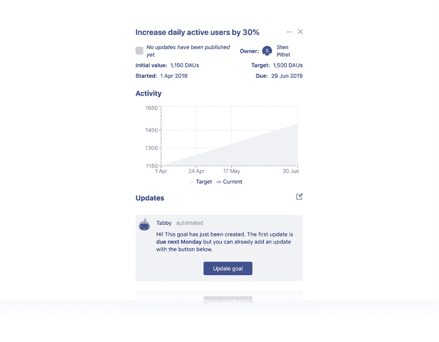
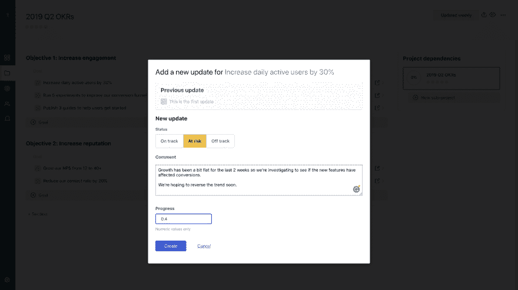
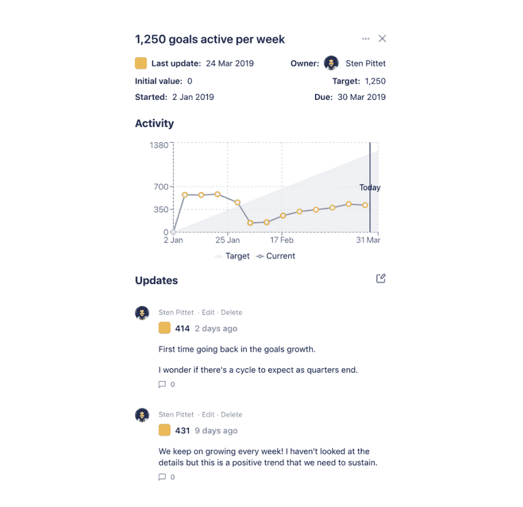

# 使用持续交付原则自动聚焦

> 原文：<https://dev.to/stenpittet/automating-focus-using-continuous-delivery-principles-5fj3>

作为一个小团队意味着我们必须身兼数职。前一个小时，我还在审视我们的收购漏斗，下一个小时，我又在审视我们的政策。当天晚些时候，我可能会找些时间编写一些功能代码。它日复一日地进行着，我几乎无法预测接下来我将不得不扮演哪些角色。

然而，我们运输。[很多](https://trello.com/b/jFtwfQIG/tability-roadmap)。

我们通过接受一个简单的事实做到了这一点:**我们不擅长专注，我们需要帮助**。

## 为什么专注很难

通常情况是这样的。这是一个季度的开始。你和你的团队见面，开一些研讨会，设立一些目标。每个人都同意北起点是什么，团队有动力到达那里。激动人心！

然后你回到你的办公桌。会议、电子邮件、电话、bug、任务、新想法、支持...杂念开始出现，你无法消除这些杂念，因为这个*是*工作。这是合作需要发生的事情，虽然你可以减少噪音，但认为你可以让这一切消失是愚蠢的。

因此，临近季度末，您收到了经理的电子邮件。

> "不要忘记为下周的复习更新你的目标."

你终于回头看了看那份文件，意识到(1)你忘记了清单上一半的事情，以及(2)你离目标还很远。

你尽了最大努力去改善事情，但为时已晚，你能做的只是改变现状。你的周期结束了，但几天后你会重新开始。

## 利用持续交付原则获得更好的结果

不要担心，这不会是关于连续交付(CD)的完整课程。然而，有一些有趣的摘录来自马丁·福勒的定义。

> 持续交付的主要优势是:
> 
> *   降低部署风险:因为您正在部署较小的变更，所以出错的可能性更小，并且一旦出现问题，修复起来也更容易。
> *   可信的进度:许多人通过跟踪已完成的工作来跟踪进度。如果“完成”意味着“开发人员宣布它已经完成”，那么这比部署到生产(或类似生产)环境中要不可信得多。
> *   用户反馈:任何软件工作的最大风险是你最终会构建出无用的东西。你越早、越频繁地将工作软件呈现在真实用户面前，**你就能越快得到反馈，发现它到底有多有价值**...].

和

> 在以下情况下，您可以进行连续交付:
> 
> *   您的软件在其整个生命周期中都是可部署的
> *   **你的团队优先考虑**保持软件的可部署性，而不是开发新功能
> *   任何人都可以在任何时候对他们的系统进行更改时获得快速的自动的 T2 反馈
> *   您可以按需将任何版本的软件部署到任何环境中

从好处来看，持续交付帮助我们取得真正的进步，并确保我们在做有价值的事情。要完成 CD，你很大程度上依赖于无情的优先排序和快速的反馈循环。

我确实抛出了一些只与软件开发相关的东西，但是如果我们可以在业务结果而不是特性开发上创建快速反馈循环会怎么样呢？

当然，这将有助于我们朝着北极星取得可信的进展，并且我们将能够检查我们每周所做的战术性工作是否对我们的目标有意义。

持续交付帮助团队对他们的*产出*充满信心。我们希望建立一个平台，帮助组织对他们的*成果*充满信心。

因此，我们创建了一个简单的目标跟踪平台，其核心是快速反馈循环。我们将通过自动化的关注和责任来解决我们的问题。

## 构建持续交付成果

### 1。从循环开始

当你创建一个关于稳定性的新项目时，首先要问的一个问题是“你希望多久更新一次？”。这就是我们如何知道何时发送提醒。在我们的案例中，我们做到了:

*   季度目标的每周更新。
*   我们年度计划的每月更新。
*   我们大胆的大目标的季度更新。

没有每日提醒，因为我们想帮助长期的结果，而不是任务。

### 2。添加目标

下一步是添加目标。我们只需要描述，目标，所有者和截止日期。目标是智能字段，可以根据您所跟踪的内容采用不同的值。

在 Tability，我们几乎总是使用显式值，并让平台为我们做数学运算来计算进度。也有很难为目标设定一个标准的时候——对于大规模的计划来说，很难判断我们是完成了 30%还是 45%。在这些情况下，我们忽略目标。相反，我们将依靠情绪(在轨、有风险、脱轨)。

一旦一个目标被创建，你可以看到一个进度图，它显示了一段时间内的预期进度。很容易看出我们一周又一周做得有多好。这相当于我们连续交付类比中的构建状态。

### 3。获取提醒

稳定性将在目标创建后接管。它会自动向所有者发送通知，提醒他们自己负责的结果，并要求他们提供进展的更新。

实际上，这意味着我完全可以在周末退房，和家人一起享受美好时光。每周一早上 8 点，我们的机器人 Tabby 会给我发一个提醒，上面列有我这一季度的目标。这样，当我完成一周的任务时，我总是把我们的优先事项放在脑后。

这是整合过程的一部分，团队在这个过程中尽早并经常检查他们目标的健康状况。

### 4。共享更新

我们取得了进展更新轻而易举。

*   进展:你今天怎么样？
*   状态:你的感悟是什么？在轨、在险、脱轨？
*   评论:你认为我们为什么会在这里？(我们需要做些什么吗？)

我们通过稳定性实现了很多自动化，但是与典型的 CD 管道相反，更新必须是手动的。这是因为价值不是来自于衡量标准，而是来自于我们如何解读它。思考我们领先或落后于目标的原因有助于我们完善战略和调整执行。如果我们将报告外包给一台机器，它将在捕捉数据方面表现出色，但它不知道如何解释更大的画面。

如果你仍然不相信人工报告。想想你有多经常做出正确的预测。为特定结果选择正确的指标和正确的目标非常困难。衡量用户幸福感的最好方法是什么？满足感呢？入职？你可能有一些想法，但我肯定我能找到你的选择行不通的场景。

所以我们尽最大努力保持更新简单明了。我们希望通过团队的真实反馈创建快速循环，允许其他人在必要时插话并提供帮助。随着时间的推移，进度更新为我们如何跟踪创建了一个清晰的视图，并且我们很容易通过查看过去来了解背景。

## 目标跟踪让我们自信地更快前进

持续交付已经对软件团队的生产力产生了显著的影响。它有助于降低开发风险，通过获得用户的早期反馈来提高产品/市场的适应性，并使组织更加敏捷——允许他们从一个 sprint 到另一个 sprint 调整工作范围，以确保他们总是为客户提供价值。

对于稳定性，我们看到类似的好处适用于结果。通过每周回顾我们在长期目标上的进展，我们能够专注于最重要的事情。我们越来越少被次要项目、糟糕的会议、低优先级项目分心。如果我们目前的努力没有产生正确的结果，我们可以在几周后调整我们的策略。

但更重要的是，作为一个远程团队，我们能够快速前进，因为我们清楚地知道我们想要达到的目标，以及我们离目标有多远。

* * *

*这篇文章最初发表在[我们的博客](https://blog.tability.io/automating-focus-using-continuous-delivery-principles/)上，你今天就可以注册[稳定性](https://tability.io)。不要犹豫，在评论中添加反馈和问题——你可以在 Twitter 上找到我，地址是 [@stenpittet](https://twitter.com/stenpittet)* 。