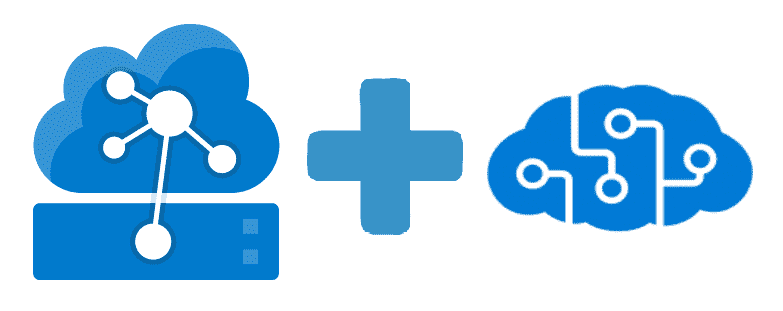
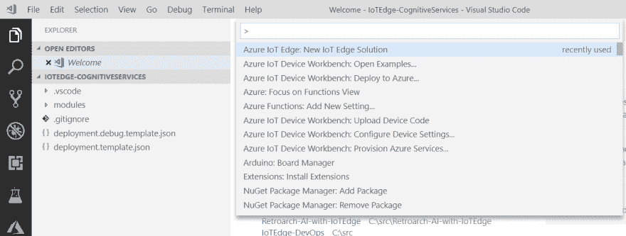
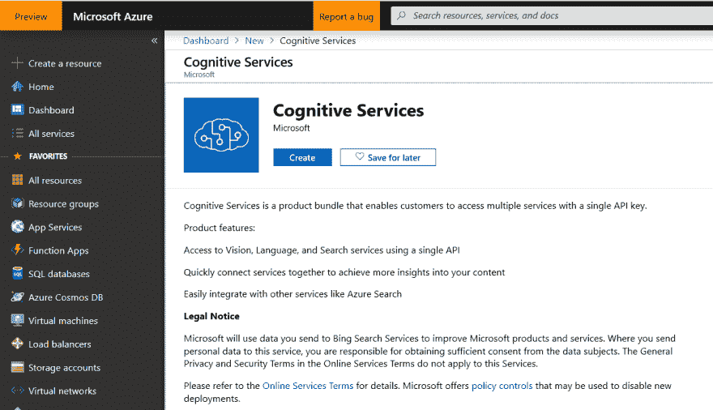
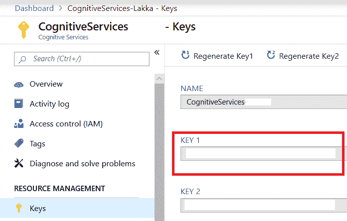

# 通过 Azure IoT Edge 使用认知服务容器

> 原文：<https://dev.to/azure/using-cognitive-services-containers-with-azure-iot-edge-1e5a>

[](https://res.cloudinary.com/practicaldev/image/fetch/s--r3kHkiHc--/c_limit%2Cf_auto%2Cfl_progressive%2Cq_auto%2Cw_880/https://thepracticaldev.s3.amazonaws.com/i/thbskhbtf81cxan4hg4x.png)

在本帖中，我们将介绍如何在 Azure IoT Edge 部署中使用认知服务容器。

# 简介

物联网解决方案通常涉及许多与设备最终部署环境相关的挑战。这些挑战包括间歇性的互联网访问、与设备代码远程更新相关的挑战以及设备本身的安全性。在软件方面， [Azure IoT Edge](https://docs.microsoft.com/en-us/azure/iot-edge/about-iot-edge?WT.mc_id=devto-blog-pdecarlo) 通过专为物联网场景设计的各种功能来应对这些挑战。

以下是物联网边缘如何应对这些挑战的一些简要说明:

*   通过在设备上本地[缓冲出站设备遥测数据](https://docs.microsoft.com/en-us/azure/iot-edge/offline-capabilities?WT.mc_id=devto-blog-pdecarlo)来解决间歇性访问互联网的问题，直到互联网访问恢复，然后将数据与数据在本地生成时的原始时间戳一起发送。
*   远程更新能够使用[目标部署配置](https://docs.microsoft.com/en-us/azure/iot-edge/module-deployment-monitoring?WT.mc_id=devto-blog-pdecarlo)进行配置，目标部署配置指定要在给定设备上运行的模块(容器化应用)列表
*   除了在设备本身上运行的本地[硬件安全管理器](https://docs.microsoft.com/en-us/azure/iot-edge/iot-edge-security-manager?WT.mc_id=devto-blog-pdecarlo)之外，通过仅允许已经注册到 Azure IoT Hub 实例的设备能够向其各自的 Azure 托管端点提交遥测数据来实现安全性，以支持从底层硬件信任根硬件(如果可用)转移信任，从而安全地引导 IoT Edge 运行时并监控其操作的完整性。

值得注意的是，物联网边缘通过使用容器化模块来实现代码的安全部署。容器允许通过熟悉的`docker pull`命令轻松分发，并在关键任务物联网部署中通过容器重启实现模块的运行时恢复。这使得容器成为操作系统环境可用的物联网解决方案的理想候选。物联网边缘运行时可以在 [Linux X64](https://docs.microsoft.com/en-us/azure/iot-edge/how-to-install-iot-edge-linux?WT.mc_id=devto-blog-pdecarlo) 、 [Linux ARM32](https://docs.microsoft.com/en-us/azure/iot-edge/how-to-install-iot-edge-linux-arm?WT.mc_id=devto-blog-pdecarlo) 和 [Windows X64](https://docs.microsoft.com/en-us/azure/iot-edge/how-to-install-iot-edge-windows<br>%0A?WT.mc_id=devto-blog-pdecarlo) 环境下运行。一旦启用，除了支持定制物联网边缘模块的[设备软件开发套件](https://docs.microsoft.com/en-us/azure/iot-hub/iot-hub-devguide-sdks)中的一些便利功能外，您还可以利用上述所有优势。

[Azure Cognitive Services](https://docs.microsoft.com/en-us/azure/cognitive-services/?WT.mc_id=devto-blog-pdecarlo) 允许开发人员将智能算法应用到应用程序、网站和机器人中，以便他们通过软件即服务产品实现常见的人工智能功能来看、听、说和理解。微软最近[宣布支持其认知服务系列的子集以容器的形式在本地运行](https://docs.microsoft.com/en-us/azure/cognitive-services/cognitive-services-container-support?WT.mc_id=devto-blog-pdecarlo)。这些服务包括计算机视觉、人脸、路易斯和各种形式的文本分析。值得注意的是，计算机视觉和人脸容器目前正在预览中，但如果您有兴趣试用它们，可以通过填写[认知服务视觉容器申请表](https://forms.office.com/Pages/ResponsePage.aspx?id=v4j5cvGGr0GRqy180BHbR0XnG25zkIBLkA6GR39U7fRUQVE2MUVDVVJBVlU2Qk5TQTI1MVRSRExUMS4u)来请求访问。请注意，认知服务容器目前仅支持 Linux X64，并要求每十分钟重新建立一次互联网连接，否则当查询其 API 端点时，容器将停止产生结果。

利用 Azure 物联网边缘和认知服务容器，我们可以构建物联网解决方案，允许在互联网连接可能断断续续的环境中进行本地人工智能处理。我们不再需要依赖外部服务来从我们的数据中获得洞察力，一切都可以在本地处理，并从云中部署/配置，从而以安全设计的方式大规模部署更新。

# 步骤

要开始开发，您需要确保您的开发机器上最近安装了 [VSCode](https://code.visualstudio.com/Download?WT.mc_id=devto-blog-pdecarl) ，您还需要为 VSCode 安装[物联网边缘扩展。](https://marketplace.visualstudio.com/items?itemName=vsciot-vscode.azure-iot-edge&WT.mc_id=devto-blog-pdecarlo)

先用`F1`=>“Azure 物联网边缘:新物联网边缘解决方案”创建一个新的物联网边缘解决方案

[](https://res.cloudinary.com/practicaldev/image/fetch/s--zZrGhyaa--/c_limit%2Cf_auto%2Cfl_progressive%2Cq_auto%2Cw_880/https://thepracticaldev.s3.amazonaws.com/i/zejh1ml46o51rzhoj3ej.PNG)

当要求创建一个模块时，保留默认值并为模块模板选择“C# module”。

接下来，打开解决方案目录中包含的 deployment.template.json 文件。如果您使用预览中的容器图像，您将被提供一个用户名和密码来连接到私有容器存储库。如果是这种情况，请更新 registryCredentials 部分，如下所示，以便能够从私有存储库中提取图像。

`"registryCredentials": {
"containerpreview": {
"username": "{YourUsername}",
"password": "{YourPassword}",
"address": "containerpreview.azurecr.io"
}`

接下来我们需要在 Azure 中创建一个认知服务资源:
[](https://res.cloudinary.com/practicaldev/image/fetch/s--LQIbqH-L--/c_limit%2Cf_auto%2Cfl_progressive%2Cq_auto%2Cw_880/https://thepracticaldev.s3.amazonaws.com/i/0iqrewwn26gu19bm7uim.PNG)

创建认知服务资源后，获取服务的 API 密钥，该密钥将成为稍后用于{YourCogServicesApiKey}的值:

[](https://res.cloudinary.com/practicaldev/image/fetch/s--pP3dXvyt--/c_limit%2Cf_auto%2Cfl_progressive%2Cq_auto%2Cw_880/https://thepracticaldev.s3.amazonaws.com/i/e05eigxc9sgm1os0ih29.png)

现在我们可以开始添加模块配置来指定认知服务容器的部署。我们将开始使用“认知服务识别文本”容器。请记住，这个过程对于其他认知服务容器来说是相似的。您将需要查看 deployment.template.json 的“模块”部分，并使用以下附加条目对其进行更新(确保用适当的值替换{ YourCogServicesLocale }和{YourCogServicesApiKey}):

```
 "cognitive-services-recognize-text": {
        "version": "1.0",
        "type": "docker",
        "status": "running",
        "restartPolicy": "always",
        "settings": {
          "image": "containerpreview.azurecr.io/microsoft/cognitive-services-recognize-text:latest",
          "createOptions": 
          {                       
            "Cmd": [
                "Eula=accept",
              "Billing=https://{YourCogServicesLocale}.api.cognitive.microsoft.com/vision/v2.0",
                "ApiKey={YourCogServicesApiKey}"
            ],
            "HostConfig": {
              "PortBindings": {
              "5000/tcp": [
              {
                "HostPort": "5000"
              }
              ] 
              }
              }
            }
        }
      }, 
```

createOptions 是通过查看[文档来推断的，以便在 IoT Edge 之外的本地](https://docs.microsoft.com/en-us/azure/cognitive-services/computer-vision/computer-vision-how-to-install-containers#run-the-container-with-docker-run?WT.mc_id=devto-blog-pdecarlo)运行容器，即:

`docker run --rm -it -p 5000:5000 --memory 4g --cpus 1 \
containerpreview.azurecr.io/microsoft/cognitive-services-recognize-text \
Eula=accept \
Billing={BILLING_ENDPOINT_URI} \
ApiKey={BILLING_KEY}`

这指定了一个容器，该容器将主机上的端口 5000 映射到容器内部运行的端口 5000，以及用于设置 Eula、Billing 和 ApiKey 值的 Cmd。

如果您想知道 deployement.template.json 模块条目的正确语法是如何获得的，我执行了上面的命令并在容器上运行了`docker inspect`,这将提供如何为“Cmd”部分制定正确结构的线索。有关可用容器创建选项的完整列表，请参见 [Docker 引擎 API 文档](https://docs.docker.com/engine/api/v1.30/#operation/ContainerCreate)。

现在，要从我们的 C#模块调用 API，请将以下全局变量添加到 SampleModule.cs 中:

`// ApiKey is not needed on client side talking to a container
private const string ApiKey = "000000000000000000000000000000";
//Note: Endpoint value matches the module name used in deployment.template.json to allow internal resolution from custom modules
private const string Endpoint = "http://cognitive-services-recognize-text:5000";
private static HttpClient client = new HttpClient { BaseAddress = new Uri(Endpoint) };`

接下来，添加以下方法:

```
 private static async Task ExtractText(Stream image)
            {

                String responseString = string.Empty;
                using (var imageContent = new StreamContent(image))
                {
                    imageContent.Headers.ContentType = new MediaTypeHeaderValue("application/octet-stream");

                    var requestAddress = "/vision/v2.0/recognizetextDirect";

                    using (var response = await client.PostAsync(requestAddress, imageContent))
                    {
                        var resultAsString = await response.Content.ReadAsStringAsync();
                        var resultAsJson = JsonConvert.DeserializeObject<JObject>(resultAsString);

                        if (resultAsJson["lines"] == null)
                        {
                            responseString = resultAsString;
                        }
                        else
                        {
                            foreach (var line in resultAsJson["lines"])
                            {
                                responseString += line["text"] + "\n";
                            }
                        }

                        Console.WriteLine(responseString);
                    }
                }
            } 
```

调用适当的容器端点的过程是通过仔细阅读[cognitive-services-containers-samples/Recognize-Text 示例](https://github.com/Azure-Samples/cognitive-services-containers-samples/tree/master/dotnet/Recognize-Text)的源代码确定的

要触发 ExtractText 方法，生成一个适当的机制，为该方法提供一个合适的图像文件流，并使用`docker logs -f <container_id>`监控结果

这是一个使用 NES 经典作品“亚当斯一家”的截屏提供的示例图像和响应

[](https://res.cloudinary.com/practicaldev/image/fetch/s--fJ7gnNnc--/c_limit%2Cf_auto%2Cfl_progressive%2Cq_auto%2Cw_880/https://thepracticaldev.s3.amazonaws.com/i/9wdkxcaaxlplyxegkrku.png)

如果你认为这种事情很酷(翻译复古视频游戏)，我有一个完全开源的项目，它利用物联网边缘和认知服务来做到这一点@[https://github.com/toolboc/RetroArch-AI-with-IoTEdge](https://github.com/toolboc/RetroArch-AI-with-IoTEdge)。

当您的代码准备好部署到设备时，请遵循[如何从 VSCode](https://docs.microsoft.com/en-us/azure/iot-edge/how-to-deploy-modules-vscode?WT.mc_id=devto-blog-pdecarlo) 部署模块的说明。

# 总结

虽然我只是明确地展示了使用认知服务识别文本容器的过程，但是整个过程可以应用于其他的[认知服务容器](https://docs.microsoft.com/en-us/azure/cognitive-services/cognitive-services-container-support)。

以下是您需要遵循的一般流程:

1.  在 deployment.template.json 中为认知服务容器创建一个适当的模块条目(如果使用预览图像或存储在私有 docker 注册表中的图像，还需要提供 docker 注册表凭证)。如果使用多个认知服务容器作为模块，请确保将外部主机端口从唯一的外部端口号映射到所有条目的内部端口 5000。
2.  仔细阅读[认知-服务-容器-样本报告](https://github.com/Azure-Samples/cognitive-services-containers-samples)中关于如何与相关服务交互的例子。
3.  使用步骤 2 中获得的信息实现一个方法，该方法在您的自定义模块代码中调用适当的 API 端点，并使用日志记录到 stdout 来跟踪运行时的模块输出和状态
4.  通过查看有问题的模块的`docker logs`来部署和测试代码

# 结论

随着认知服务容器的发布，我们现在可以将人工智能服务应用到物联网边缘部署配置中，以允许物联网边缘解决方案中的人工智能场景，而无需依赖外部云服务。这提供了极其强大的 AI 能力，而不需要外部服务的延迟和开销。可能性是无穷无尽的:想象一下在门禁系统中使用本地化的人脸识别，将视频游戏文本从一种语言实时翻译成另一种语言，或者使用附加的摄像头处理车辆上的牌照文本。这些正是将处于下一波物联网解决方案顶峰的场景类型，即在离线环境中采用本地化人工智能功能来现场做出智能决策的场景。在接下来的五年里，看看人工智能处理与物联网解决方案相结合将创造出什么样的系统，这将是有趣和令人兴奋的。在这些概念的基础上，你有什么很酷的想法吗？请在评论中留言，让我们知道你认为哪些东西将成为下一波人工智能增强的物联网解决方案的一部分！

直到下一次，

黑客快乐！