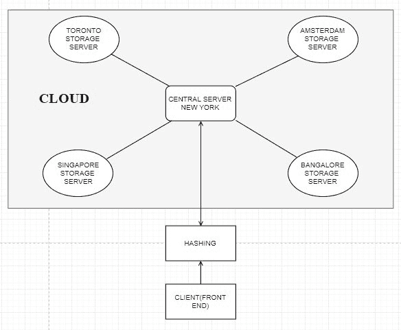

# 分布式文件系统和存储虚拟化实践！

> 原文：<https://dev.to/presto412/hands-on-with-distributed-file-systems-and-storage-virtualization-322g>

我们今年春天有一门课程，虚拟化，其中有一个项目的组成部分。你一定听说过虚拟化，从一端看起来很统一，但在另一端却是多个服务的协调。我们有多种类型的虚拟化—从虚拟化整个操作系统(双引导/ Oracle VirtualBox)到虚拟化桌面。我必须为这个项目选择一个主题，在一些研究中，我发现存储虚拟化很有趣。

这里是这个项目的源代码。

存储虚拟化实际上是在存储设备集群上提供一个统一的视图，通过这种方式进行管理，我们可以实现数据安全和大小/性能优化。

拥有存储解决方案的一个重要问题是重复数据删除，这意味着尝试删除占用您资源的不必要的文件副本。我打算用我的项目(分布式文件系统)来解决这个问题，同时获得管理多台服务器和在其中实现管理系统的实践经验。

## 堆栈

我最喜欢使用的 web 框架是 Express(Node.js ),因此我选择了与前端视图的 EJS 模板相同的框架。我还决定将 docker 用于容器化服务，并使用 docker swarm 来编排它们。

## 开发方法论

我用 multer 用 express 写了一些通用的上传代码来管理它们，然后把它打包成一个 docker 镜像。基本图像是 LTS Node.js 图像，我使用 docker-compose 以一种有组织的方式来完成它。
Docker swarm 用来管理集群，通过有副本什么的来提供容错。我在这里想要的是为我的存储服务器轻松执行主机名映射。
我用来构建图像的 docker 文件

```
FROM node:10

# Create app directory
WORKDIR /usr/src/app

# Install app dependencies
# A wildcard is used to ensure both package.json AND package-lock.json are copied
# where available (npm@5+)
COPY package*.json ./

RUN npm install
# If you are building your code for production
# RUN npm install --only=production

# Bundle app source
COPY . . 
```

我们看到我将工作目录设置为`/usr/src/app`。在开发过程中，我将当前文件夹挂载为一个卷，因此`nodemon`会自动检测所有的更改并立即反映出来。开发 docker-合成文件-

```
version: "3.2"

networks:
  testnet:
    external:
      name: testnet

services:
  server1_server:
    deploy:
      replicas: 1
      restart_policy:
        condition: on-failure
        delay: 5s
        max_attempts: 3
      # placement:
      #   constraints:
      #     - node.hostname == your-hostname-2-here
    image: presto412/storev1
    hostname: server1.example.com
    command: ./node_modules/.bin/nodemon
    volumes:
      - "/tmp/uploads:/tmp/uploads"
      - ".:/usr/src/app/"
    environment:
      - SELF_HOSTNAME=server1.example.com
    ports:
      - "3000:3000"
    networks:
      testnet:
        aliases:
          - server1.example.com 
```

## 第一次尝试

由于我去年在区块链平台上开发，我最初的逻辑不是利用块链本身，而是利用它下面的技术，分布式账本技术。

一般工艺流程-

*   文件通过表单上传
*   上传时，后端通过使用 [sha1](#) 库对文件内容进行哈希处理。我也考虑过使用 [xxHash](#) 但是没有实现，因为对于一个小型独立项目来说速度不是问题。
*   它维护一个如下结构的映射 JSON

```
{  "0347f8b35b22104339b5f9d9d1c8d3f0251b6bdc":  {  "details":  {  "name":  "JKSUCI_AuthorAgreement (2).pdf",  "mimetype":  "application/pdf",  "date":  "Sun, 07 Apr 2019 23:55:04 GMT",  "size":  27087  },  "backups":  [  {  "hostname":  "bangalore.storage.com",  "path":  "/tmp/uploads/528518c7e306e2f04e34117a5b245e6f"  },  {  "hostname":  "amsterdam.storage.com",  "path":  "/tmp/uploads/600405f52831535e54aaf590f2b14052"  }  ]  }  } 
```

*   因此，在这里您可以看到，密钥是文件的哈希，值是它的存储位置和一些元数据。
*   现在用上面的 JSON 检查这个新文件的散列，如果它存在，系统拒绝上传并且不保存文件。
*   否则，它会随机选择两个服务器来存储它，并更新映射。然后，这种映射会针对每台其他服务器进行更新，从而使其成为分布式分类帐实现。

此时，项目已经准备好，并显示了第一次评审的实现。教授建议包含一些有意义的改变，我最喜欢的一个是通过地理上接近服务器来传送文件。

## 改进

这次我搬到了云端。在 [digitalocean](digitalocean.com) 上创建了 5 个微滴，每个微滴都有一个独立的数据中心——纽约、多伦多、新加坡、班加罗尔、阿姆斯特丹。
这次我稍微改变了一下架构——有一个中央服务器作为前端，维护每个存储文件的元数据(我知道这是一个瓶颈，但对于一个班级项目来说已经足够了)

[](https://res.cloudinary.com/practicaldev/image/fetch/s--hTovnOb_--/c_limit%2Cf_auto%2Cfl_progressive%2Cq_auto%2Cw_880/https://thepracticaldev.s3.amazonaws.com/i/o75n0l8a6fuydllsya0k.jpg)

我还做了什么，在客户端散列文件，通过使用与 Forge 库耦合的 FileReader API。这里有一些代码。

```
 <script type="text/javascript">
    function submitFile() {
      var form = document.getElementById("uploadFileForm");
      var reader = new FileReader();
      reader.onload = function() {
        var fileContent = reader.result;
        var md = forge.md.sha1.create();
        md.update(fileContent);
        var fileContentHash = md.digest().toHex();
        document.getElementById("fileHash").value = fileContentHash;
        $.ajax({
          type: "POST",
          url: "/checkHash",
          contentType: "application/json;charset=utf-8",
          data: JSON.stringify({
            fileHash: fileContentHash
          }),
          success: function(response) {
            console.log(response);
            console.log("sresponse", response.success);
            if (!response.success) {
              form.submit();
            } else {
              console.log("not submtting form");
              alert("File already exists");
            }
          },
          error: function(response) {
            console.log("fresponse", response);
          }
        });
      };
      const file = document.getElementById("fileItem").files[0];
      reader.readAsText(file);
    }
  </script> 
```

所以现在，只有文件散列作为 ajax 被发送到服务器，如果散列不存在，文件是新上传的。

当中央服务器接收到文件时，它选择两个存储服务器来存储它，然后更新它的元数据文件。

所以这一次，当一个新的文件请求进来时，我使用像 [ipstack](http://api.ipstack.com/) 和 [distance24](https://www.distance24.org/) 这样的 API 来确定 IP 来自哪个位置(最好是城市),以及这个城市离每个存储服务器有多远。然后根据距离对服务器进行排序，为最近的服务器生成一个 URL 并返回。当用户点击链接时，文件被下载。

Docker 和 Docker Swarm 在这种情况下非常有用，因为我可以简单地指定部署约束、拉取和分发图像等等。

你的第一个分布式系统项目是什么？请在下面的评论中告诉我。[这是这个项目的来源。](https://github.com/Presto412/StoreV)

## 感谢阅读！

priyansh Jain[github](http://github.com/Presto412)|[LinkedIn](http://linkedin.com/in/priyanshjain412)