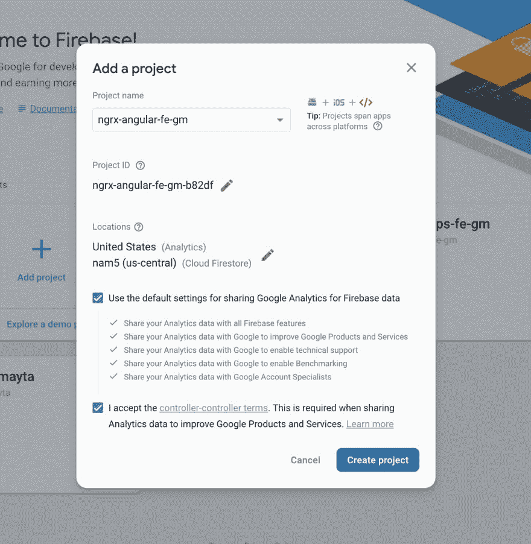
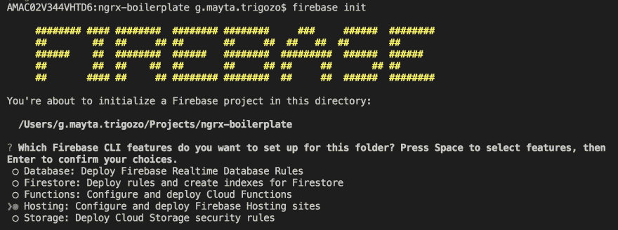
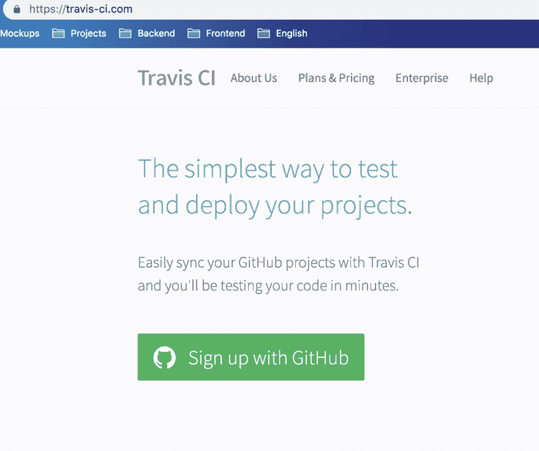
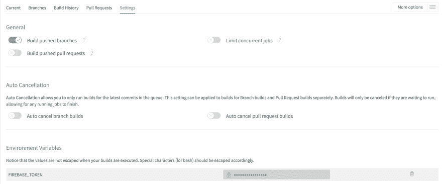
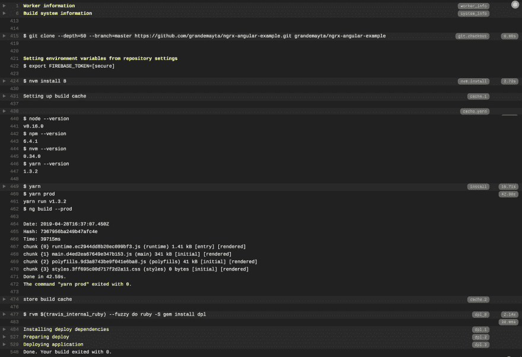
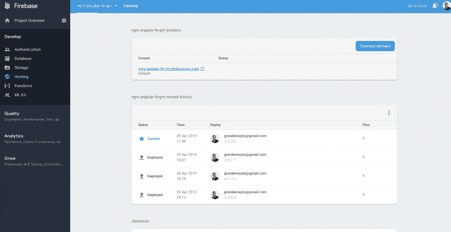

# 使用 Travis 和 Firebase 部署前端应用程序

> 原文：<https://dev.to/grandemayta/usare-travis-con-firebase-per-deployare-applicazioni-frontend-21bj>

我写这篇帖子是因为这几天我遇到了一个非常反复出现的问题。我在 Github 上有几个项目大部分都是我自己做的实验。我的目标是找到一个免费的托管平台，支持单页应用程序，并与 Travis 和 Https 进行集成。

## 珀西特拉维斯？

尽管这是一个个人项目，但我不想浪费时间手动部署(将文件夹移动到 Filezilla)，因为我们有一些系统使我能够自动化应用程序的整个发布流。对于想了解 travis 的人来说，这里有一个“T1”链接。

我在网上搜索，发现了一份潜在候选人名单:

*   Heroku
*   亚马逊 S3
*   github pages-github 页面
*   Surge.sh
*   重火力点

让我们从我已经用于 NodeJS 应用程序的 Heroku 开始，问题是我必须创建一个服务器应用程序来服务我的静态文件，此外，免费版本在不使用时会关闭。

亚马逊 S3 我发现它很机械化，不容易配置。

Github Pages 是理想的然后我发现它不支持 SPA。所以，如果你需要开发一个演示，其中只有一个页面，你可以去。

Surge.sh 看起来很理想，很容易配置，但问题是站点速度很慢。

Firebase 通常让我吃惊的是，它用于创建 REST Api，配置非常简单。

## 火库配置

首先要做的是从[fire base 控制台](https://console.firebase.google.com)创建一个项目:

[](https://res.cloudinary.com/practicaldev/image/fetch/s--hdNvQKX2--/c_limit%2Cf_auto%2Cfl_progressive%2Cq_auto%2Cw_880/https://thepracticaldev.s3.amazonaws.com/i/ldgdgm9bga4ocit3l1bz.png)

然后需要安装 cli，可以使用 npm:
从命令行安装

```
npm i -g firebase-cli 
```

安装后，您必须启动命令才能登录，浏览器中将打开一个页面，您必须确认权限。

```
firebase login 
```

对于此示例，我使用了 github[ngx-angular-example](https://github.com/grandemayta/ngrx-angular-example)上的以下项目，在发出下一个命令之前，您必须导航到要使用的项目的根目录。

```
firebase init 
```

Firebase 控制台将显示一个选项列表，您必须选择“hosting:configure and deploy fire base hosting sites”:

[](https://res.cloudinary.com/practicaldev/image/fetch/s--Wvv7lKXx--/c_limit%2Cf_auto%2Cfl_progressive%2Cq_auto%2Cw_880/https://thepracticaldev.s3.amazonaws.com/i/amfw8stsljjymxjzb360.png)

然后，系统会询问您要使用哪一个资料夹来部署应用程式，以及是否要支援 SPA。
在我的案例中，由于我使用 angular CLI 产生专案，资料夹将为 dist/ngx-angular-example。

在您的项目中，firebase 会在配置结束时包含 2 个文件:

*   。消防基地
*   firebase.json

在 **firebase.json** 内找到以下配置，您可以随时更改它们:

```
{  "hosting":  {  "public":  "dist/ngrx-angular-example",  "ignore":  [  "firebase.json",  "**/.*",  "**/node_modules/**"  ],  "rewrites":  [  {  "source":  "**",  "destination":  "/index.html"  }  ]  }  } 
```

## Travis 配置

既然配置了 Firebase，我们就必须创建. travis.yml 文件，在其中插入用于处理生成和部署的规则:

```
language: node_js
node_js: 
  - '8'
cache: 
  - yarn
branches:
  only:
  - master
before-script: 
  - yarn
script: 
  - yarn prod
deploy:
  provider: firebase
  skip_cleanup: true
  token:
    secure: $FIREBASE_TOKEN
  project: ngrx-angular-fe-gm 
```

规则非常简单，就我而言，我希望构建只在主分支上激活。构建我的项目的命令是“yarn prod”。

在部署规则中，必须添加“firebase”作为提供程序，并指定先前在“firebase 控制台”中创建的项目的名称。要创建令牌，可以发出以下命令，然后将其保存到某个位置:

```
firebase login:ci 
```

如果您前往 travis 的网站，您可以使用 Github 用户创建帐户，请接受以下要求:

[](https://res.cloudinary.com/practicaldev/image/fetch/s--WAjw6x-_--/c_limit%2Cf_auto%2Cfl_progressive%2Cq_auto%2Cw_880/https://thepracticaldev.s3.amazonaws.com/i/qgfvh7oxgkl4sj0pxfjo.png)

选取您的 repo，右下方应该会显示「更多选项」，请前往「设定」并输入下列设定:

[](https://res.cloudinary.com/practicaldev/image/fetch/s--NHw4ZzQ2--/c_limit%2Cf_auto%2Cfl_progressive%2Cq_auto%2Cw_880/https://thepracticaldev.s3.amazonaws.com/i/z0y4shlp19s84j5sx4os.png)

请记住，您以前生成的令牌，将其复制到“环境变量”中。

现在，我们已经配置好了所有的东西，我将把所有的东西都放在 development 上，然后在 master 上提出一个拉请求，接受 PR 应该开始自动构建，转到 branches 部分的 Travis，您应该会看到这样一个屏幕:

[](https://res.cloudinary.com/practicaldev/image/fetch/s--QvqNZz7b--/c_limit%2Cf_auto%2Cfl_progressive%2Cq_auto%2Cw_880/https://thepracticaldev.s3.amazonaws.com/i/mhgbxjbxnjvhtcesrn6z.png)

如果一切顺利，最后画面应该是:

[](https://res.cloudinary.com/practicaldev/image/fetch/s--ZvAqP1F0--/c_limit%2Cf_auto%2Cfl_progressive%2Cq_auto%2Cw_880/https://thepracticaldev.s3.amazonaws.com/i/li4e9rstar46uw5rldvw.png)

现在，部署完成后，请返回 Firebase 控制台并打开您的项目，然后单击“Hosting”菜单项，该菜单项将发送到您的站点 url 所在的页面。

[](https://res.cloudinary.com/practicaldev/image/fetch/s--2nh9Jx6Q--/c_limit%2Cf_auto%2Cfl_progressive%2Cq_auto%2Cw_880/https://thepracticaldev.s3.amazonaws.com/i/lqkyucw0x94bfnrtyhl1.png)

现在，您可以在每次启动 Github 上的项目时复制此过程，并且不要放弃您的项目。这样，您还可以与朋友和同事共享它们，而且为什么不共享它们，它还可以作为将来项目的电缆。

保持冷静，编码！